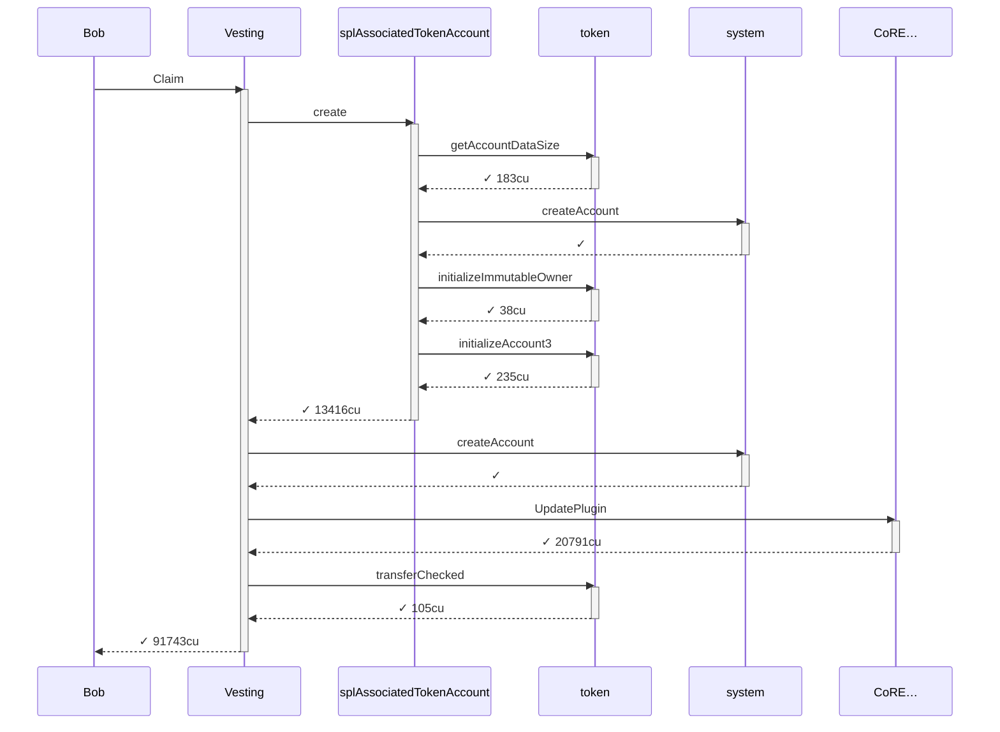
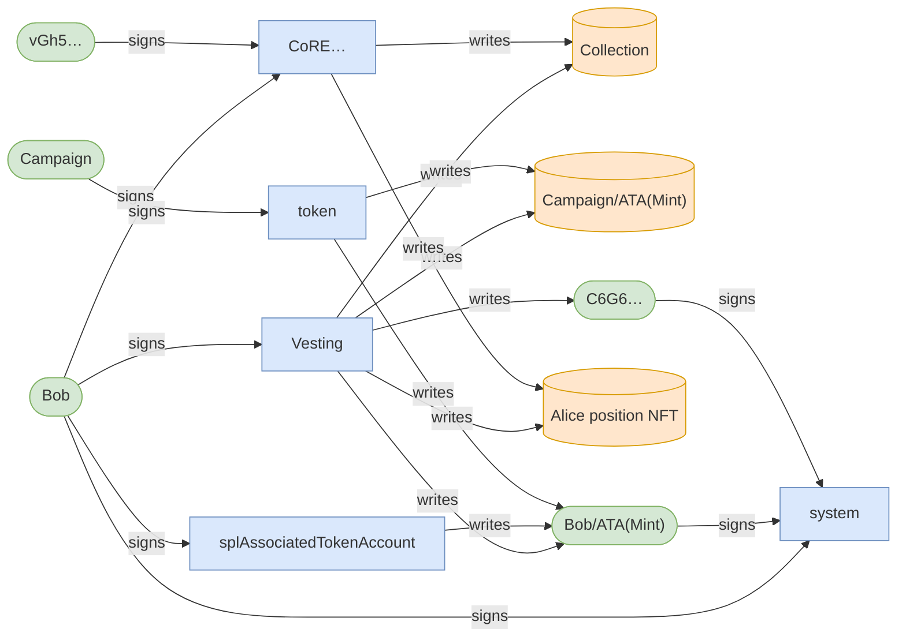
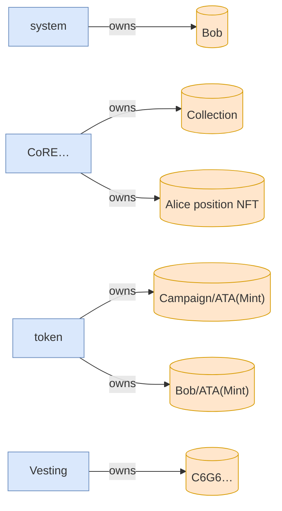

# Bob claims via Alice's transferred position NFT

**Source:** [`tests/full_lifecycle.rs` L302](https://github.com/cds-turbin3/vesting-position/blob/29fc5f85fb86a1fc9a02a50d51b4735e9dc2de1c/babelfish-tests/tests/full_lifecycle.rs#L302)

- Given: a live campaign; Alice and Charlie whitelisted, Bob not
- Given: Bob, never whitelisted, now holds Alice's position NFT

Result: ✓ success — 91743 CU



## Authority



## Ownership



## Accounts

| Account | Signer | Writable | Owner |
| --- | --- | --- | --- |
| Bob | ✓ | ✓ | system |
| Collection | · | ✓ | CoRE… |
| vGh5… | · | · | system |
| Mint | · | · | token |
| Campaign/ATA(Mint) | · | ✓ | token |
| Bob/ATA(Mint) | · | ✓ | token |
| Campaign | · | · | Vesting |
| Alice position NFT | · | ✓ | CoRE… |
| C6G6… | · | ✓ | Vesting |
| system | · | · | Nati… |
| token | · | · | BPFL… |
| splAssociatedTokenAccount | · | · | BPFL… |
| CoRE… | · | · | BPFL… |

<details>
<summary>Call tree and logs</summary>

```
Bob claims via Alice's transferred position NFT
Bob (91743cu)
└─ Vesting::Claim ✓ 91743cu
   ├─ splAssociatedTokenAccount::create ✓ 13416cu
   │  ├─ token::getAccountDataSize ✓ 183cu
   │  ├─ system::createAccount ✓
   │  ├─ token::initializeImmutableOwner ✓ 38cu
   │  └─ token::initializeAccount3 ✓ 235cu
   ├─ system::createAccount ✓
   ├─ CoRE…::UpdatePlugin ✓ 20791cu
   └─ token::transferChecked ✓ 105cu
```

```text
Program 7DkU9TQhcN87f2djZDd2MjjPZoXLfnZZj8HhybeZswX1 invoke [1]
Program log: Instruction: Claim
Program ATokenGPvbdGVxr1b2hvZbsiqW5xWH25efTNsLJA8knL invoke [2]
Program log: Create
Program TokenkegQfeZyiNwAJbNbGKPFXCWuBvf9Ss623VQ5DA invoke [3]
Program TokenkegQfeZyiNwAJbNbGKPFXCWuBvf9Ss623VQ5DA consumed 183 of 185055 compute units
Program return: TokenkegQfeZyiNwAJbNbGKPFXCWuBvf9Ss623VQ5DA pQAAAAAAAAA=
Program TokenkegQfeZyiNwAJbNbGKPFXCWuBvf9Ss623VQ5DA success
Program 11111111111111111111111111111111 invoke [3]
Program 11111111111111111111111111111111 success
Program log: Initialize the associated token account
Program TokenkegQfeZyiNwAJbNbGKPFXCWuBvf9Ss623VQ5DA invoke [3]
Program TokenkegQfeZyiNwAJbNbGKPFXCWuBvf9Ss623VQ5DA consumed 38 of 179962 compute units
Program TokenkegQfeZyiNwAJbNbGKPFXCWuBvf9Ss623VQ5DA success
Program TokenkegQfeZyiNwAJbNbGKPFXCWuBvf9Ss623VQ5DA invoke [3]
Program TokenkegQfeZyiNwAJbNbGKPFXCWuBvf9Ss623VQ5DA consumed 235 of 177500 compute units
Program TokenkegQfeZyiNwAJbNbGKPFXCWuBvf9Ss623VQ5DA success
Program ATokenGPvbdGVxr1b2hvZbsiqW5xWH25efTNsLJA8knL consumed 13416 of 190398 compute units
Program ATokenGPvbdGVxr1b2hvZbsiqW5xWH25efTNsLJA8knL success
Program 11111111111111111111111111111111 invoke [2]
Program 11111111111111111111111111111111 success
Program CoREENxT6tW1HoK8ypY1SxRMZTcVPm7R94rH4PZNhX7d invoke [2]
Program log: Instruction: UpdatePlugin
Program log: programs/mpl-core/src/plugins/lifecycle.rs:348:Base:Approved
Program log: programs/mpl-core/src/plugins/lifecycle.rs:741:Approve
Program CoREENxT6tW1HoK8ypY1SxRMZTcVPm7R94rH4PZNhX7d consumed 20791 of 132896 compute units
Program CoREENxT6tW1HoK8ypY1SxRMZTcVPm7R94rH4PZNhX7d success
Program TokenkegQfeZyiNwAJbNbGKPFXCWuBvf9Ss623VQ5DA invoke [2]
Program TokenkegQfeZyiNwAJbNbGKPFXCWuBvf9Ss623VQ5DA consumed 105 of 109683 compute units
Program TokenkegQfeZyiNwAJbNbGKPFXCWuBvf9Ss623VQ5DA success
Program data: XQ9GqjCM1Nsbj9rxkNx6BsE7KZFxFkI1/cY0dGcqUEcemDlVNIqYVTKYElYssupGpCP43Yuvemqw+VhRCiwfNG1WXbNCQrvezdUlyJO4dhhomKZmQOnCRYLmIyG79WT+YXRr/0NHGrU6guKGhzh1ZBudeZHoEPZvbJwCnmLNTBDyJpeMV5SfCgCKC2M0AAAAAIaZcbQAAACgQHNlAAAAAA==
Program 7DkU9TQhcN87f2djZDd2MjjPZoXLfnZZj8HhybeZswX1 consumed 91743 of 200000 compute units
Program 7DkU9TQhcN87f2djZDd2MjjPZoXLfnZZj8HhybeZswX1 success
```

</details>
