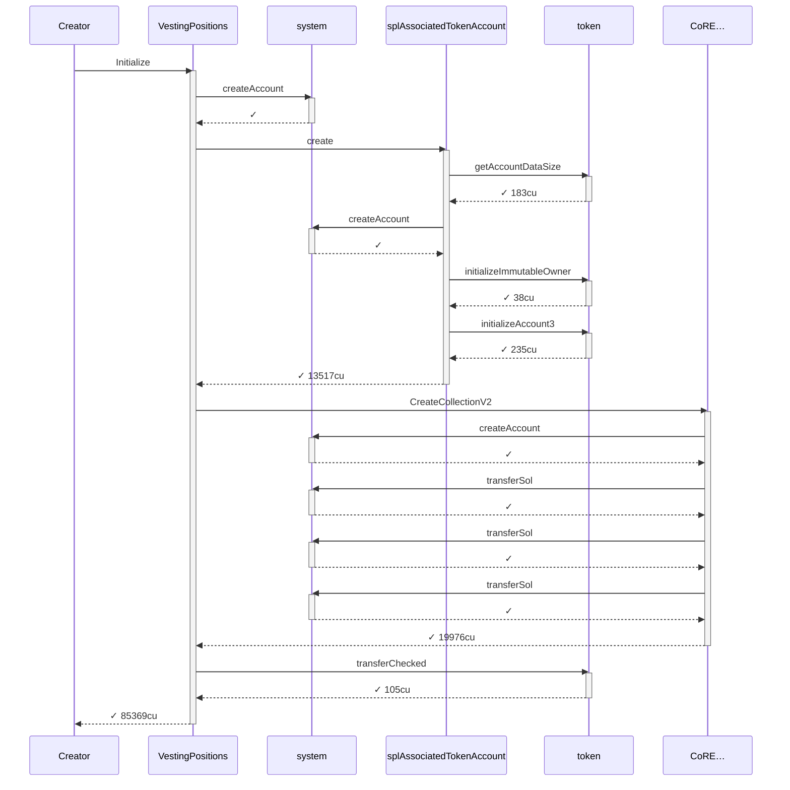
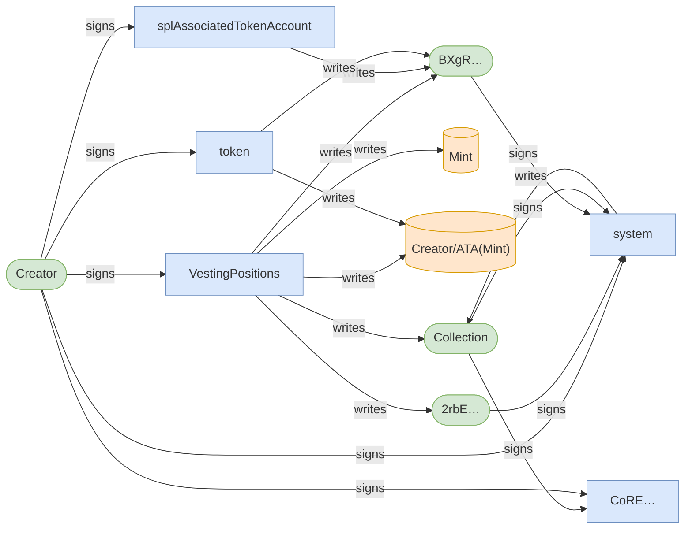
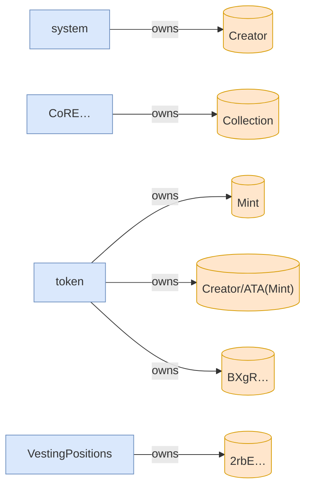
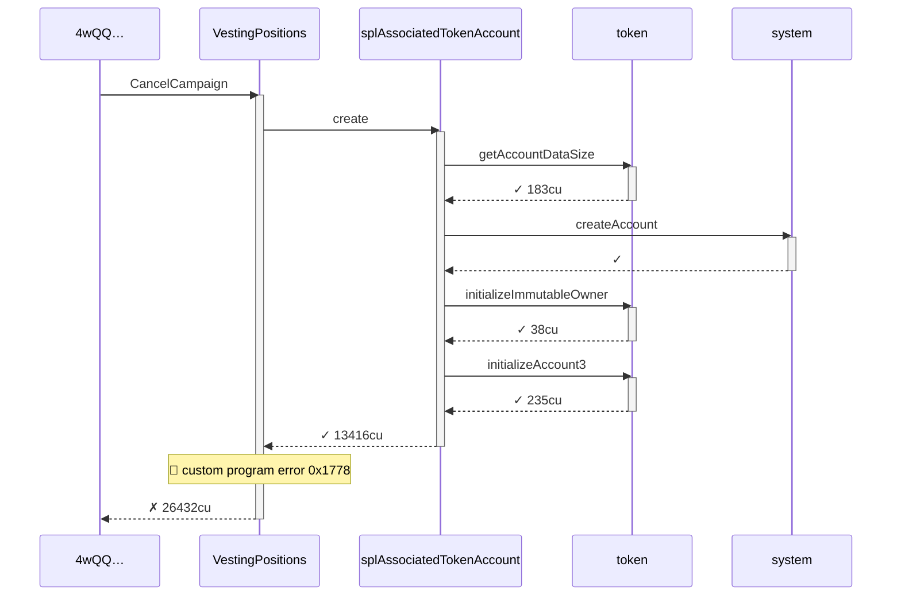
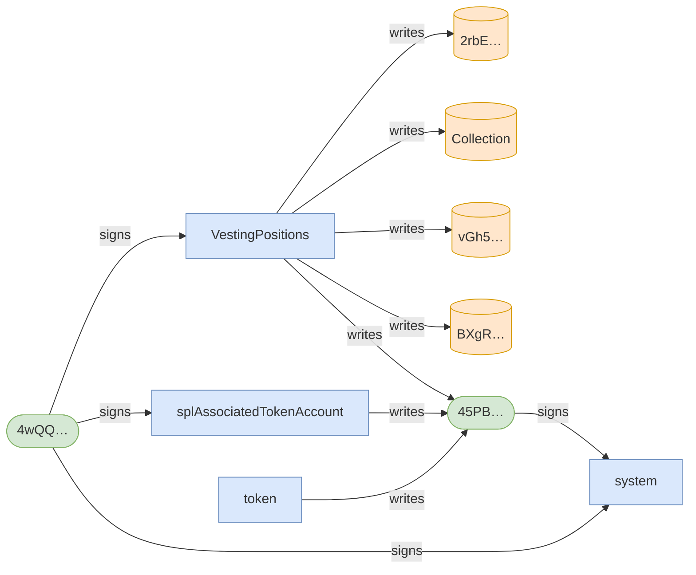
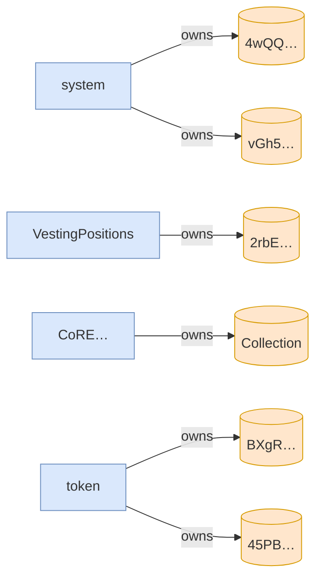

# cancel_campaign_requires_creator

**Source:** [`tests/clawback.rs` L337](https://github.com/cds-turbin3/vesting-position/blob/dab04926463cdac4c16b53accb9222fcd8fbea43/babelfish-tests/tests/clawback.rs#L337)

### Action: Initialize

| account | before | after |
| --- | --- | --- |
| Creator | 10000000000000 | 0 |
| Vault | 0 | 10000000000000 |

<details>
<summary>tree</summary>

```

Creator (85369cu)
└─ VestingPositions::Initialize ✓ 85369cu
   ├─ system::createAccount ✓
   ├─ splAssociatedTokenAccount::create ✓ 13517cu
   │  ├─ token::getAccountDataSize ✓ 183cu
   │  ├─ system::createAccount ✓
   │  ├─ token::initializeImmutableOwner ✓ 38cu
   │  └─ token::initializeAccount3 ✓ 235cu
   ├─ CoRE…::CreateCollectionV2 ✓ 19976cu
   │  ├─ system::createAccount ✓
   │  ├─ system::transferSol ✓
   │  ├─ system::transferSol ✓
   │  └─ system::transferSol ✓
   └─ token::transferChecked ✓ 105cu
```

</details>

### Sequence



### Authority



### Ownership



<details>
<summary>tree</summary>

```

Creator (85369cu)
└─ VestingPositions::Initialize ✓ 85369cu
   ├─ system::createAccount ✓
   ├─ splAssociatedTokenAccount::create ✓ 13517cu
   │  ├─ token::getAccountDataSize ✓ 183cu
   │  ├─ system::createAccount ✓
   │  ├─ token::initializeImmutableOwner ✓ 38cu
   │  └─ token::initializeAccount3 ✓ 235cu
   ├─ CoRE…::CreateCollectionV2 ✓ 19976cu
   │  ├─ system::createAccount ✓
   │  ├─ system::transferSol ✓
   │  ├─ system::transferSol ✓
   │  └─ system::transferSol ✓
   └─ token::transferChecked ✓ 105cu
```

</details>

### Action: CancelCampaign

| account | before | after |
| --- | --- | --- |
| Alice | — | 0 |

<details>
<summary>tree</summary>

```

4wQQ… (26432cu)
└─ VestingPositions::CancelCampaign ✗ 26432cu
   └─ splAssociatedTokenAccount::create ✓ 13416cu
      ├─ token::getAccountDataSize ✓ 183cu
      ├─ system::createAccount ✓
      ├─ token::initializeImmutableOwner ✓ 38cu
      └─ token::initializeAccount3 ✓ 235cu
```

</details>

### Sequence



### Authority



### Ownership



<details>
<summary>tree</summary>

```

4wQQ… (26432cu)
└─ VestingPositions::CancelCampaign ✗ 26432cu
   └─ splAssociatedTokenAccount::create ✓ 13416cu
      ├─ token::getAccountDataSize ✓ 183cu
      ├─ system::createAccount ✓
      ├─ token::initializeImmutableOwner ✓ 38cu
      └─ token::initializeAccount3 ✓ 235cu
```

</details>
