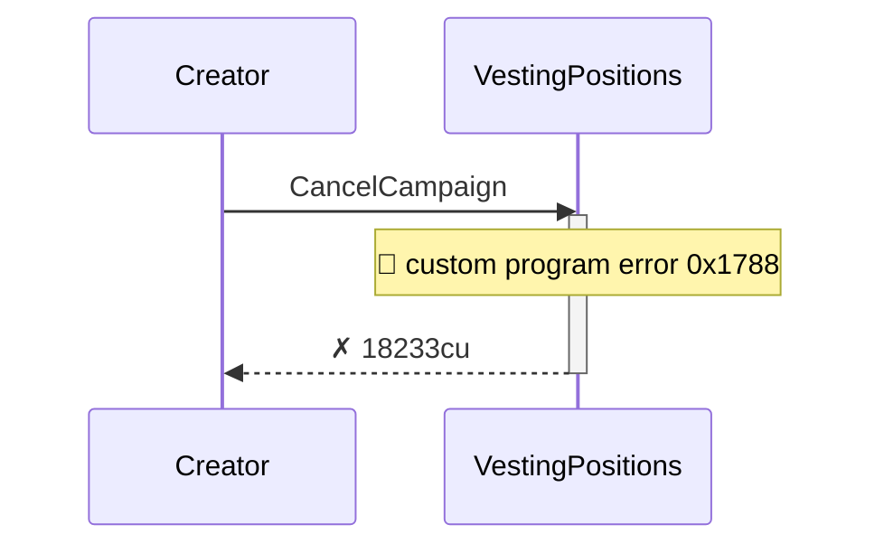
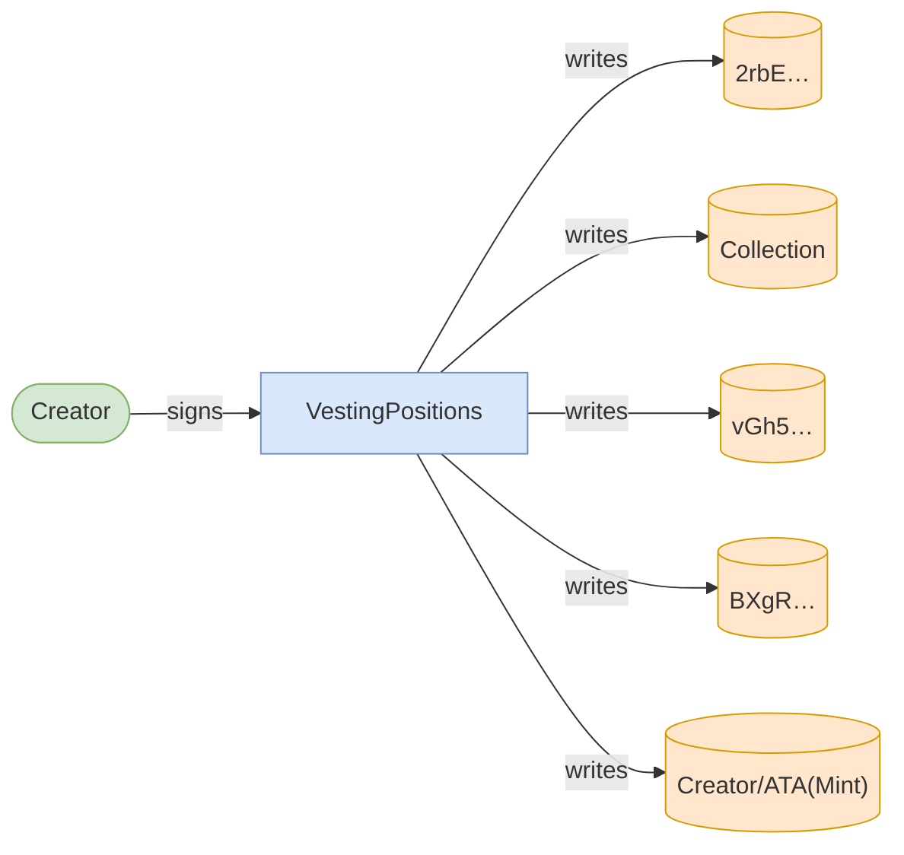
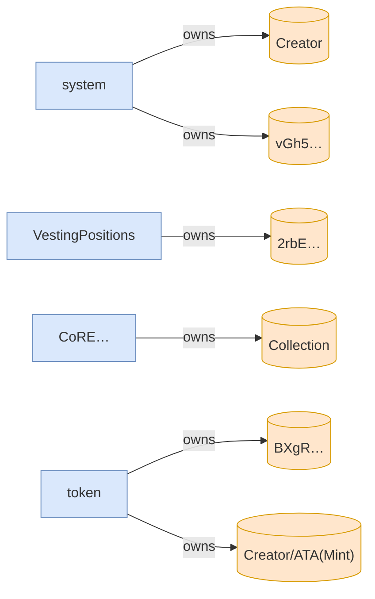

# cancel_campaign_returns_deposit_and_closes_accounts

**Source:** [`tests/clawback.rs` L268](https://github.com/cds-turbin3/vesting-position/blob/3f946c506628d348826d858340b4ac335a62e967/babelfish-tests/tests/clawback.rs#L268)







<details>
<summary>tree</summary>

```

Creator (18233cu)
└─ VestingPositions::CancelCampaign ✗ 18233cu
```

</details>
