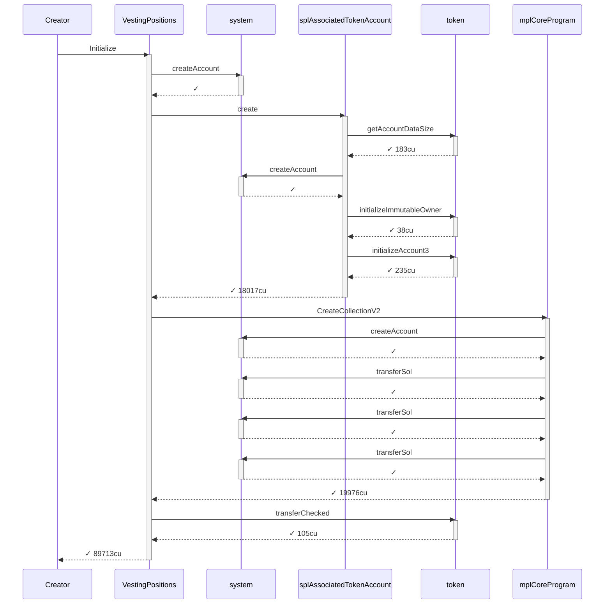
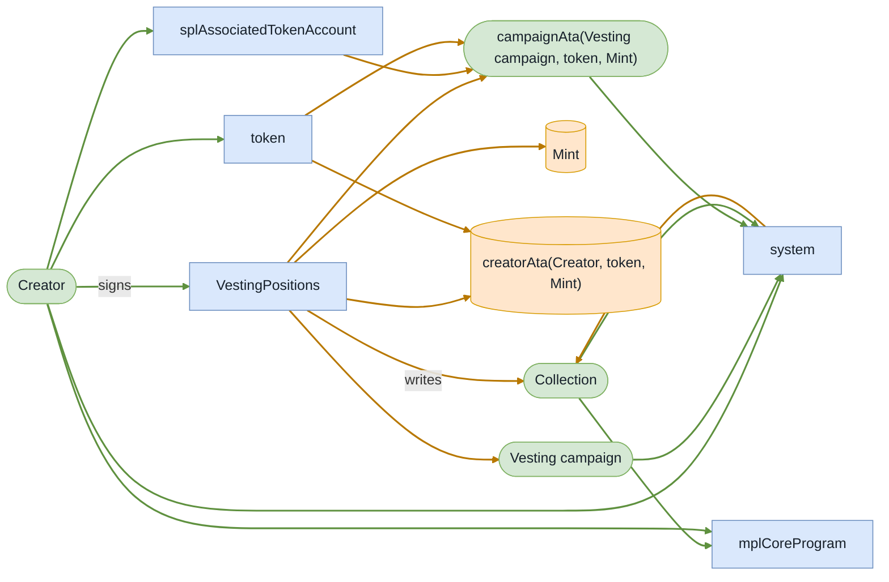
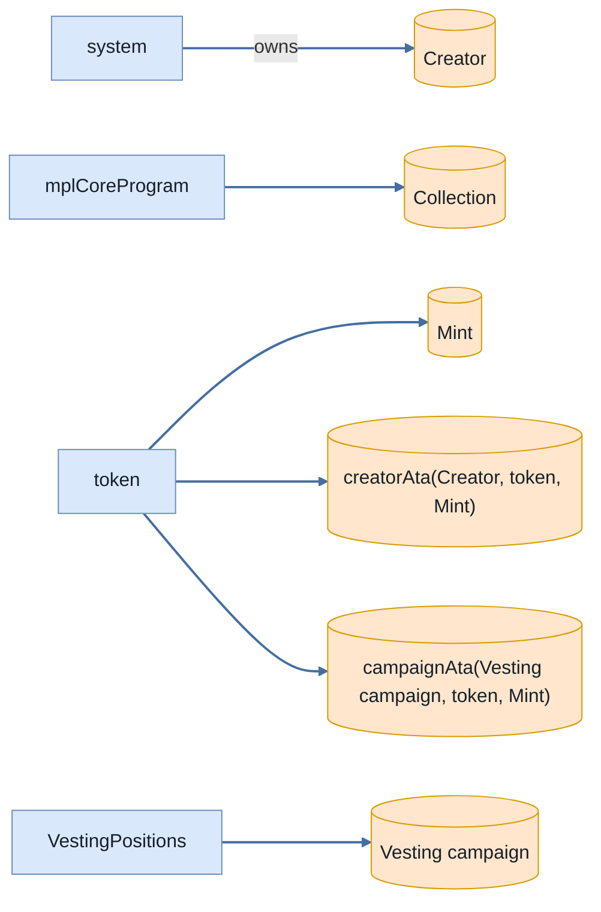
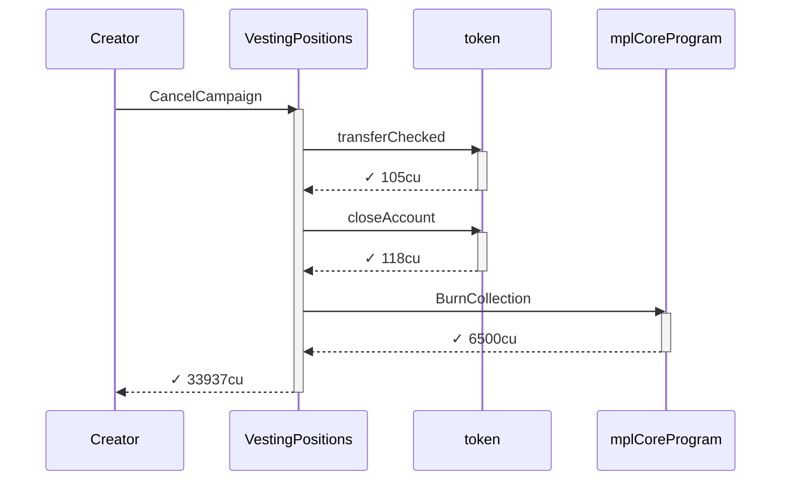
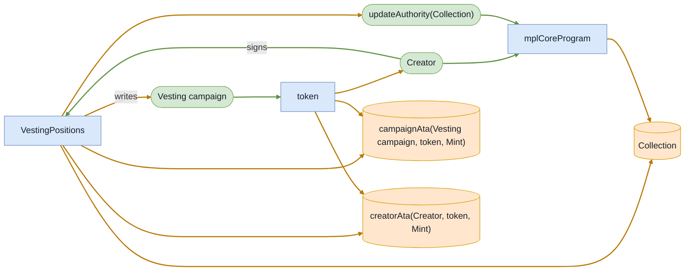
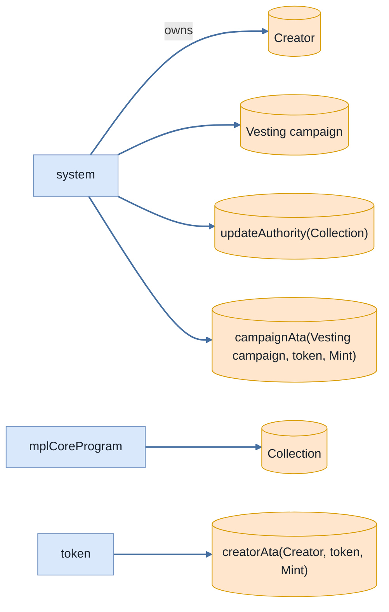

# cancel_campaign_returns_deposit_and_closes_accounts

**Source:** [`tests/clawback.rs` L276](https://github.com/cds-turbin3/vesting-position/blob/873a8a9165959219e522b5cdb1d614516d9f6a10/babelfish-tests/tests/clawback.rs#L276)

Over 0 days: 2 moments.

<details>
<summary>Cast</summary>

| name | address |
| --- | --- |
| Collection | 9HbgSnRdBeYKzrjr9DYtcT6oKYrcTVB8NWUoU7JVKuWW |
| Creator | 2ZBYuwtWiRzk7CwiCYTv5MQhQHDEaN4B8xhw4L7L3RY5 |
| Mint | 4Kr8ypueV83MddH54fZXLkKFKRd7eWFcejQ8HtynfJRk |
| Vesting campaign | G4GWLHr4aHZoxWra82eRc111wRJ9aDiXsSuk3bWoys2G |
| VestingPositions | 7DkU9TQhcN87f2djZDd2MjjPZoXLfnZZj8HhybeZswX1 |
| campaignAta(Vesting campaign, token, Mint) | 3kKwPKo9z6XQWrZxuo75c36vm9ChMgGDAMBV7cFEhjSn |
| creatorAta(Creator, token, Mint) | AvzkuSUEzjhXyboXRyfQcsjzKLBqeP9FeoExRBWkXjdJ |
| updateAuthority(Collection) | CYBwE6G2RjrsFYbwy5pUVVDVL5UR5g5VaRcWBPbzby1p |

</details>

### Timeline

| time | Vault balance | Δ | Creator balance | Δ | comment |
| --- | --- | --- | --- | --- | --- |
| T0 | 10,000,000,000,000 | +10,000,000,000,000 | 0 |  | Initialize (day 0) |
| T1 | 0 | -10,000,000,000,000 | 10,000,000,000,000 | +10,000,000,000,000 | CancelCampaign (day 0) |

### T0: Initialize (day 0)

| observation | before | after |
| --- | --- | --- |
| Vault balance | — | 10,000,000,000,000 |
| Creator balance | — | 0 |

<details>
<summary>diagrams</summary>

### Sequence



### Authority



### Ownership



### Tree

```

Creator (89713cu)
└─ VestingPositions::Initialize ✓ 89713cu
   ├─ system::createAccount ✓
   ├─ splAssociatedTokenAccount::create ✓ 18017cu
   │  ├─ token::getAccountDataSize ✓ 183cu
   │  ├─ system::createAccount ✓
   │  ├─ token::initializeImmutableOwner ✓ 38cu
   │  └─ token::initializeAccount3 ✓ 235cu
   ├─ mplCoreProgram::CreateCollectionV2 ✓ 19976cu
   │  ├─ system::createAccount ✓
   │  ├─ system::transferSol ✓
   │  ├─ system::transferSol ✓
   │  └─ system::transferSol ✓
   └─ token::transferChecked ✓ 105cu
```

</details>

### T1: CancelCampaign (day 0)

| observation | before | after |
| --- | --- | --- |
| Vault balance | 10,000,000,000,000 | 0 |
| Creator balance | 0 | 10,000,000,000,000 |

<details>
<summary>diagrams</summary>

### Sequence



### Authority



### Ownership



### Tree

```

Creator (33937cu)
└─ VestingPositions::CancelCampaign ✓ 33937cu
   ├─ token::transferChecked ✓ 105cu
   ├─ token::closeAccount ✓ 118cu
   └─ mplCoreProgram::BurnCollection ✓ 6500cu
```

</details>
