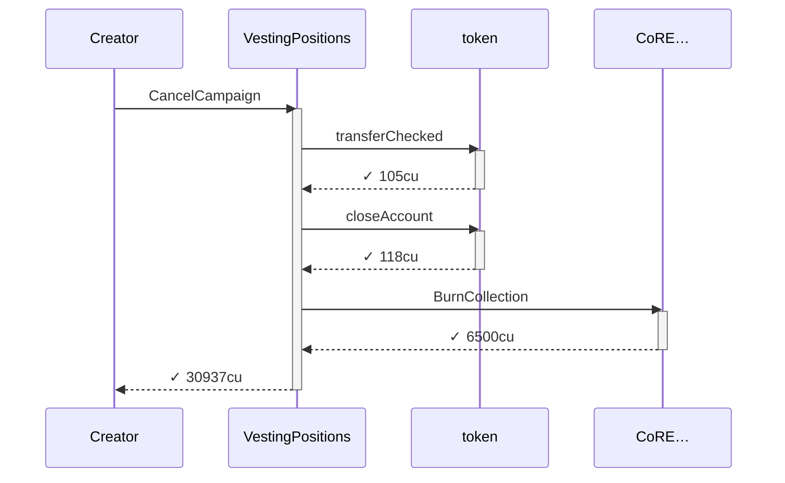
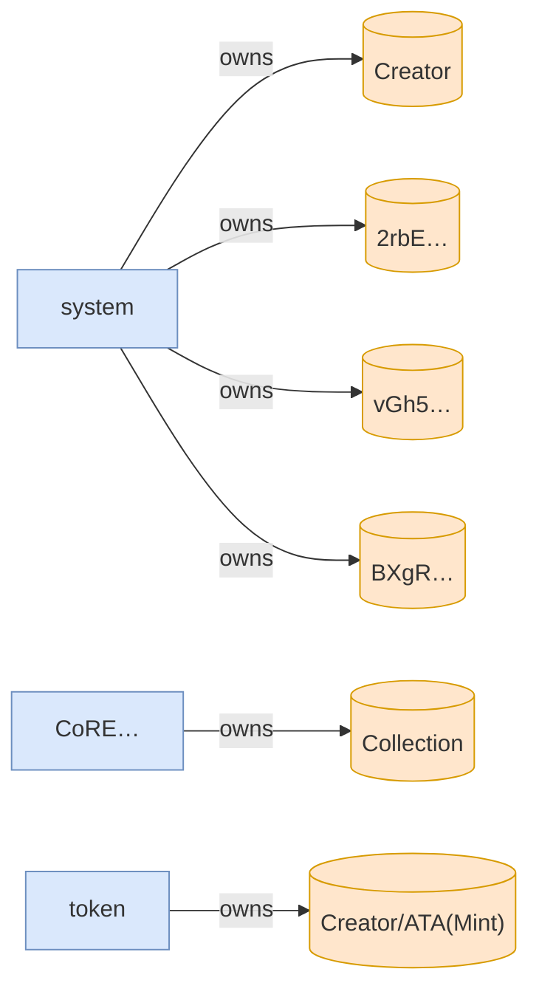

# cancel_campaign_returns_deposit_and_closes_accounts

**Source:** [`tests/clawback.rs` L270](https://github.com/cds-turbin3/vesting-position/blob/cbb8875460ccf5cc3d9023c540f31113adcd0573/babelfish-tests/tests/clawback.rs#L270)

### Action: Initialize

| account | before | after |
| --- | --- | --- |
| Creator | 10000000000000 | 0 |
| Vault | 0 | 10000000000000 |

<details>
<summary>tree</summary>

```

Creator (85369cu)
└─ VestingPositions::Initialize ✓ 85369cu
   ├─ system::createAccount ✓
   ├─ splAssociatedTokenAccount::create ✓ 13517cu
   │  ├─ token::getAccountDataSize ✓ 183cu
   │  ├─ system::createAccount ✓
   │  ├─ token::initializeImmutableOwner ✓ 38cu
   │  └─ token::initializeAccount3 ✓ 235cu
   ├─ CoRE…::CreateCollectionV2 ✓ 19976cu
   │  ├─ system::createAccount ✓
   │  ├─ system::transferSol ✓
   │  ├─ system::transferSol ✓
   │  └─ system::transferSol ✓
   └─ token::transferChecked ✓ 105cu
```

</details>

### Action: CancelCampaign

| account | before | after |
| --- | --- | --- |
| Creator | 0 | 10000000000000 |
| Vault | 10000000000000 | 0 |

<details>
<summary>tree</summary>

```

Creator (30937cu)
└─ VestingPositions::CancelCampaign ✓ 30937cu
   ├─ token::transferChecked ✓ 105cu
   ├─ token::closeAccount ✓ 118cu
   └─ CoRE…::BurnCollection ✓ 6500cu
```

</details>






<details>
<summary>tree</summary>

```

Creator (30937cu)
└─ VestingPositions::CancelCampaign ✓ 30937cu
   ├─ token::transferChecked ✓ 105cu
   ├─ token::closeAccount ✓ 118cu
   └─ CoRE…::BurnCollection ✓ 6500cu
```

</details>
