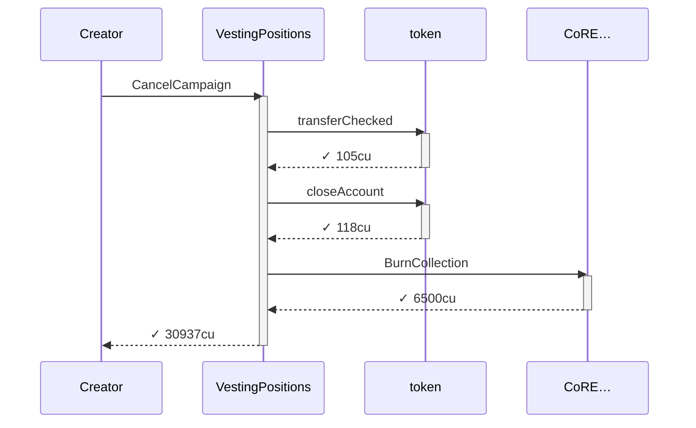
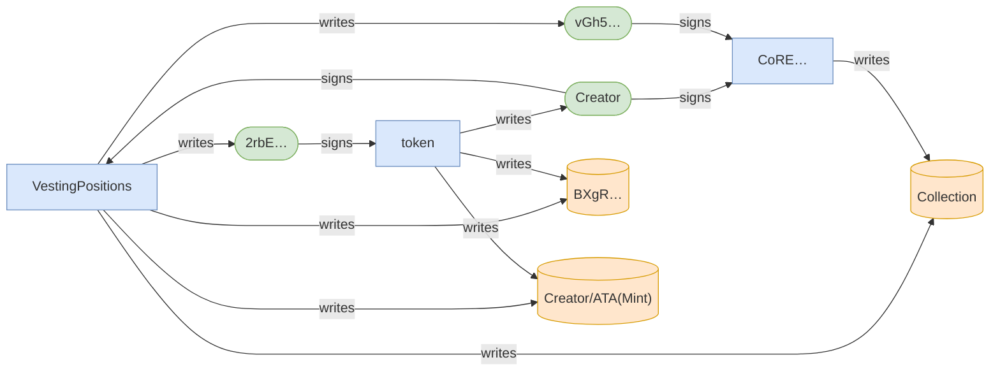
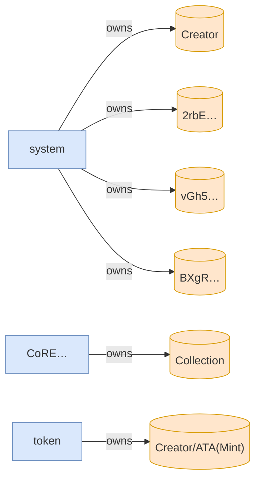

# cancel_campaign_returns_deposit_and_closes_accounts

**Source:** [`tests/clawback.rs` L268](https://github.com/cds-turbin3/vesting-position/blob/c4f43acad0bb9f007622fb43bc19ddc3610c7688/babelfish-tests/tests/clawback.rs#L268)







<details>
<summary>tree</summary>

```

Creator (30937cu)
└─ VestingPositions::CancelCampaign ✓ 30937cu
   ├─ token::transferChecked ✓ 105cu
   ├─ token::closeAccount ✓ 118cu
   └─ CoRE…::BurnCollection ✓ 6500cu
```

</details>
