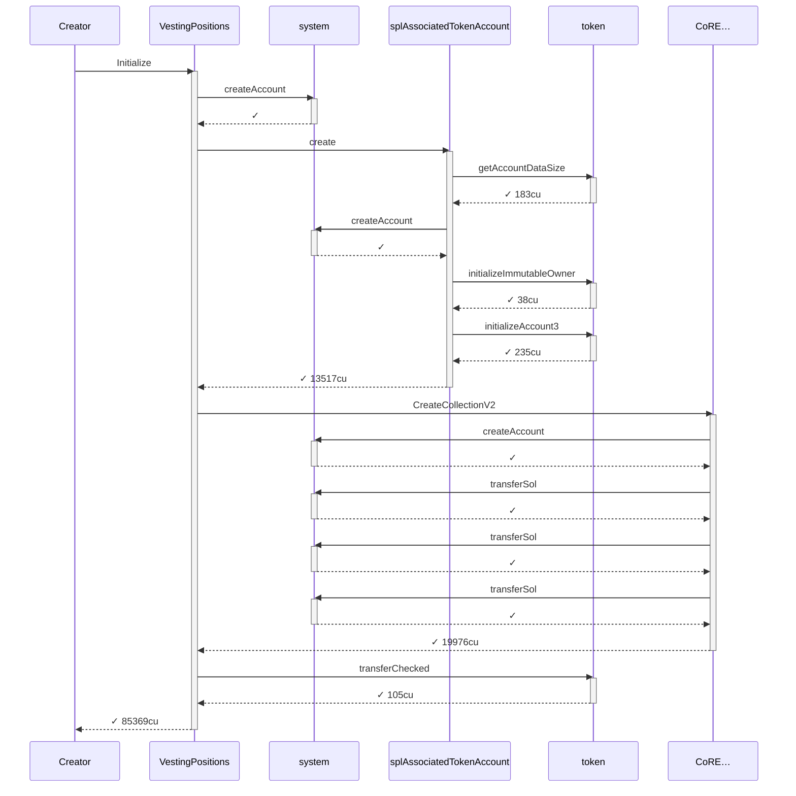
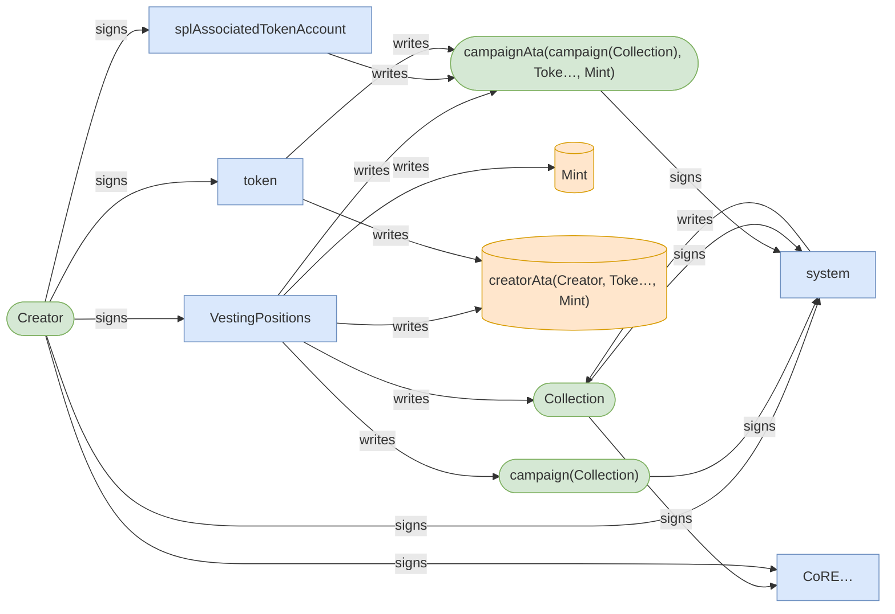
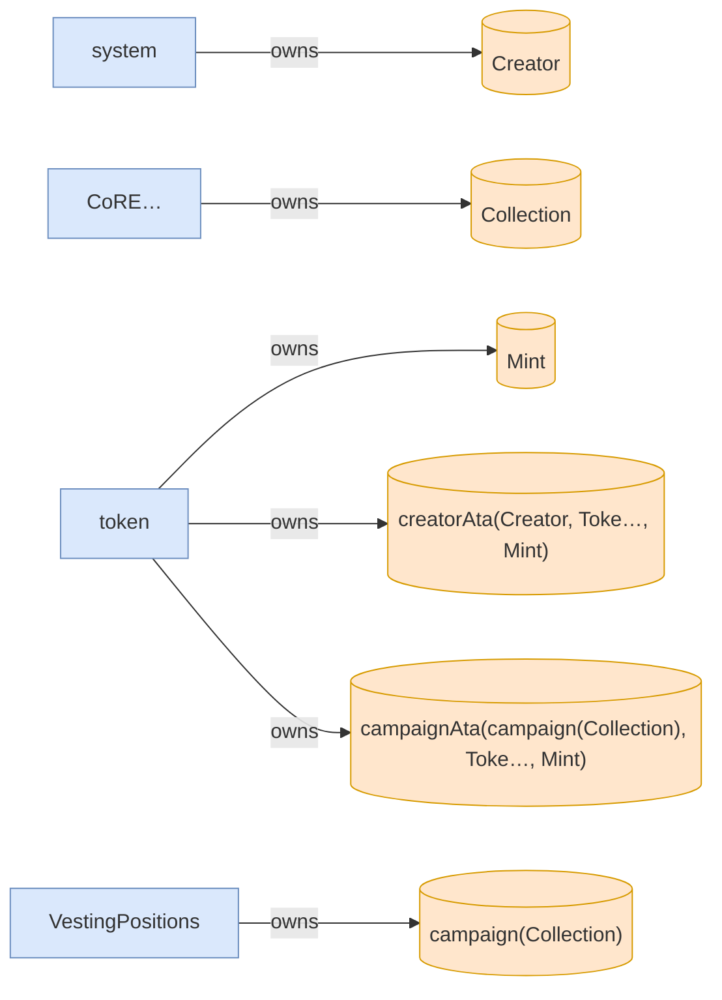
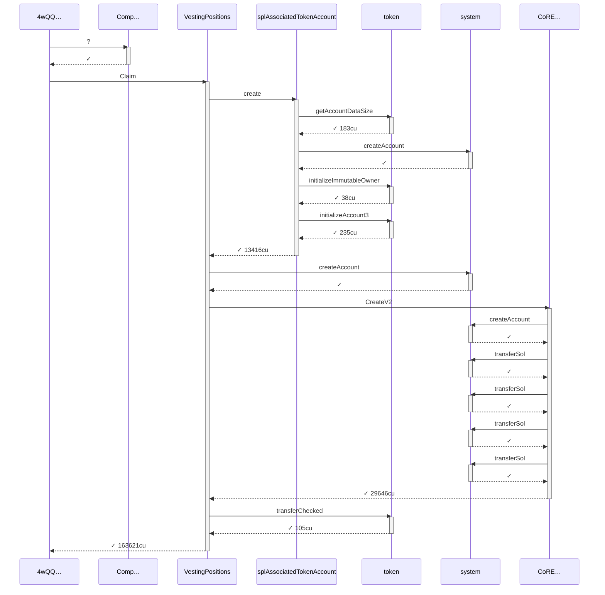
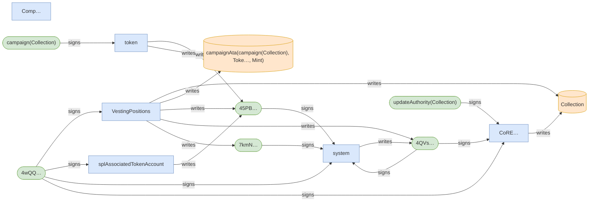
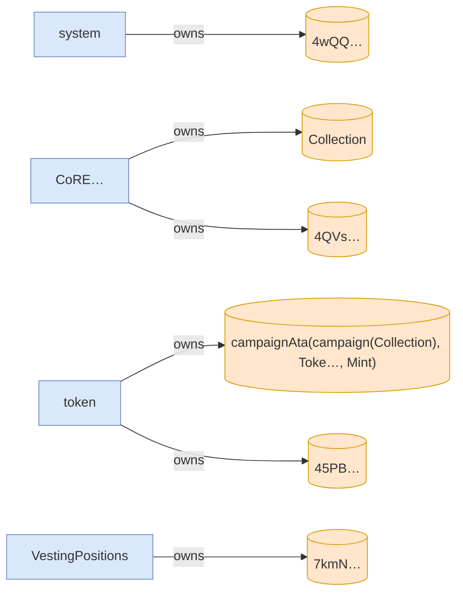
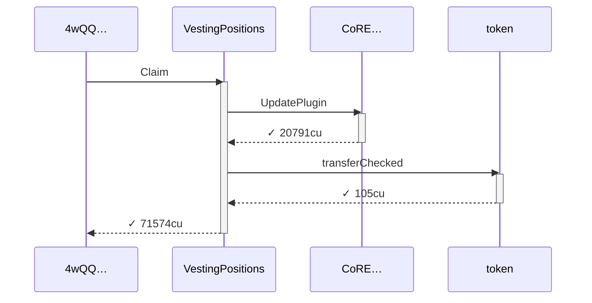
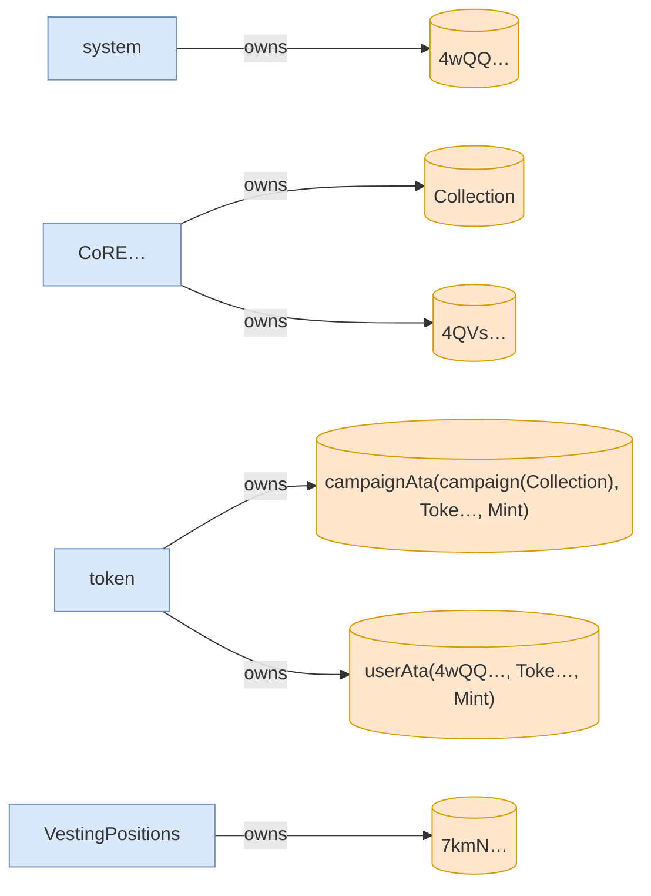
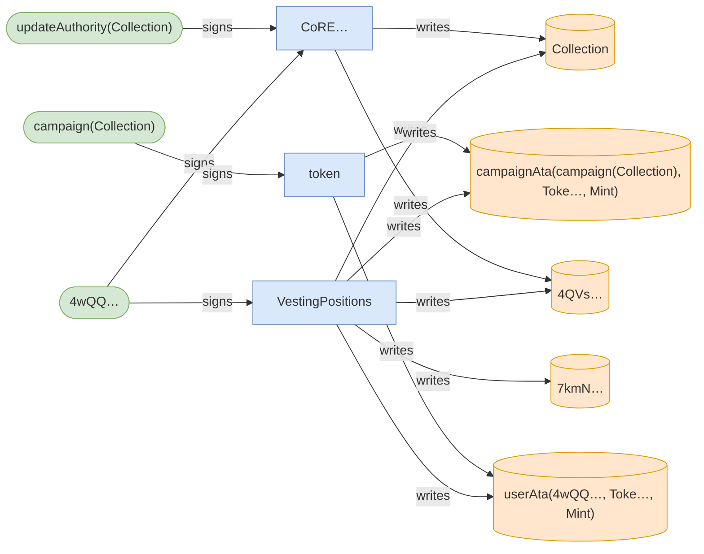

# claims_at_linear_checkpoints

**Source:** [`tests/vesting_schedule.rs` L181](https://github.com/cds-turbin3/vesting-position/blob/3e6571dde7b989ae353cd0a141b35da0171e1a57/babelfish-tests/tests/vesting_schedule.rs#L181)

<details>
<summary>Over 31 days: 16 moments; 1/1 law held.</summary>

Invariants (laws):

- Alice balance is monotonic ✓ across 16 moment(s)

</details>

<details>
<summary>Cast</summary>

| name | address |
| --- | --- |
| Collection | DZ9SxyoirUd6SJtqTyLzGjyRuQjmxcs1ySPeuZqzmAA9 |
| Creator | 2ZBYuwtWiRzk7CwiCYTv5MQhQHDEaN4B8xhw4L7L3RY5 |
| Mint | J6WtRQHtRxemkWECcNq1wQAfgyJtsx7ZUT7Xpb53vo2N |
| VestingPositions | 7DkU9TQhcN87f2djZDd2MjjPZoXLfnZZj8HhybeZswX1 |
| campaign(Collection) | 2rbEagbB2s6tm4BWjcCmYnPxEi8cmF6CqCYPK6WhKZrC |
| campaignAta(campaign(Collection), Toke…, Mint) | BXgRMbNU5GHfjUAEUL4gc4dkK47Kbd26uZfbunemQyjQ |
| creatorAta(Creator, Toke…, Mint) | 7RKXPrw2SRFrpVR7h81dMPhHdaVV7y57tEYmDraizX43 |
| updateAuthority(Collection) | vGh5gMbD7AsVatTVNDo3pC7hveLFKdXbZ3eNt17chDs |
| userAta(4wQQ…, Toke…, Mint) | 45PBE5WDayGKEeGHvaLP5VfqXSS5JoGVewXyVbSE8JSq |

</details>

### Timeline

| time | Vault balance | Δ | Creator balance | Δ | Alice claimable (schedule ceiling) | Δ | Alice balance | Δ | comment |
| --- | --- | --- | --- | --- | --- | --- | --- | --- | --- |
| T0 | 10,000,000,000,000 | +10,000,000,000,000 | 0 |  | — |  | — |  | Initialize (day 0) |
| T1 | 9,900,000,000,000 | -100,000,000,000 | 0 |  | 100,000,000,000 | +100,000,000,000 | 100,000,000,000 | +100,000,000,000 | FirstClaim (day 2) |
| T2 | 9,891,000,000,000 | -9,000,000,000 | 0 |  | 109,000,000,000 | +9,000,000,000 | 109,000,000,000 | +9,000,000,000 | Claim (day 2) |
| T3 | 9,837,000,000,000 | -54,000,000,000 | 0 |  | 163,000,000,000 | +54,000,000,000 | 163,000,000,000 | +54,000,000,000 | Claim (day 4) |
| T4 | 9,783,000,000,000 | -54,000,000,000 | 0 |  | 217,000,000,000 | +54,000,000,000 | 217,000,000,000 | +54,000,000,000 | Claim (day 5) |
| T5 | 9,720,000,000,000 | -63,000,000,000 | 0 |  | 280,000,000,000 | +63,000,000,000 | 280,000,000,000 | +63,000,000,000 | Claim (day 7) |
| T6 | 9,603,000,000,000 | -117,000,000,000 | 0 |  | 397,000,000,000 | +117,000,000,000 | 397,000,000,000 | +117,000,000,000 | Claim (day 11) |
| T7 | 9,495,000,000,000 | -108,000,000,000 | 0 |  | 505,000,000,000 | +108,000,000,000 | 505,000,000,000 | +108,000,000,000 | Claim (day 15) |
| T8 | 9,450,000,000,000 | -45,000,000,000 | 0 |  | 550,000,000,000 | +45,000,000,000 | 550,000,000,000 | +45,000,000,000 | Claim (day 16) |
| T9 | 9,387,000,000,000 | -63,000,000,000 | 0 |  | 613,000,000,000 | +63,000,000,000 | 613,000,000,000 | +63,000,000,000 | Claim (day 18) |
| T10 | 9,297,000,000,000 | -90,000,000,000 | 0 |  | 703,000,000,000 | +90,000,000,000 | 703,000,000,000 | +90,000,000,000 | Claim (day 21) |
| T11 | 9,225,000,000,000 | -72,000,000,000 | 0 |  | 775,000,000,000 | +72,000,000,000 | 775,000,000,000 | +72,000,000,000 | Claim (day 23) |
| T12 | 9,153,000,000,000 | -72,000,000,000 | 0 |  | 847,000,000,000 | +72,000,000,000 | 847,000,000,000 | +72,000,000,000 | Claim (day 26) |
| T13 | 9,081,000,000,000 | -72,000,000,000 | 0 |  | 919,000,000,000 | +72,000,000,000 | 919,000,000,000 | +72,000,000,000 | Claim (day 28) |
| T14 | 9,009,000,000,000 | -72,000,000,000 | 0 |  | 991,000,000,000 | +72,000,000,000 | 991,000,000,000 | +72,000,000,000 | Claim (day 30) |
| T15 | 9,000,000,000,000 | -9,000,000,000 | 0 |  | 1,000,000,000,000 | +9,000,000,000 | 1,000,000,000,000 | +9,000,000,000 | Claim (day 31) |

### T0: Initialize (day 0)

| observation | before | after |
| --- | --- | --- |
| Vault balance | — | 10,000,000,000,000 |
| Creator balance | — | 0 |

*observed Alice claimable (schedule ceiling): 0*

*observed Alice claimable (schedule ceiling): 100,000,000,000*

<details>
<summary>diagrams</summary>

### Sequence



### Authority



### Ownership



### Tree

```

Creator (85369cu)
└─ VestingPositions::Initialize ✓ 85369cu
   ├─ system::createAccount ✓
   ├─ splAssociatedTokenAccount::create ✓ 13517cu
   │  ├─ token::getAccountDataSize ✓ 183cu
   │  ├─ system::createAccount ✓
   │  ├─ token::initializeImmutableOwner ✓ 38cu
   │  └─ token::initializeAccount3 ✓ 235cu
   ├─ CoRE…::CreateCollectionV2 ✓ 19976cu
   │  ├─ system::createAccount ✓
   │  ├─ system::transferSol ✓
   │  ├─ system::transferSol ✓
   │  └─ system::transferSol ✓
   └─ token::transferChecked ✓ 105cu
```

</details>

*2 days pass.*

### T1: FirstClaim (day 2)

| observation | before | after |
| --- | --- | --- |
| Vault balance | 10,000,000,000,000 | 9,900,000,000,000 |
| Alice balance | — | 100,000,000,000 |

<details>
<summary>diagrams</summary>

### Sequence



### Authority



### Ownership



### Tree

```

4wQQ… (163771cu)
├─ Comp…::? ✓
└─ VestingPositions::Claim ✓ 163621cu
   ├─ splAssociatedTokenAccount::create ✓ 13416cu
   │  ├─ token::getAccountDataSize ✓ 183cu
   │  ├─ system::createAccount ✓
   │  ├─ token::initializeImmutableOwner ✓ 38cu
   │  └─ token::initializeAccount3 ✓ 235cu
   ├─ system::createAccount ✓
   ├─ CoRE…::CreateV2 ✓ 29646cu
   │  ├─ system::createAccount ✓
   │  ├─ system::transferSol ✓
   │  ├─ system::transferSol ✓
   │  ├─ system::transferSol ✓
   │  └─ system::transferSol ✓
   └─ token::transferChecked ✓ 105cu
```

</details>

*25056 seconds pass.*

### T2: Claim (day 2)

| observation | before | after |
| --- | --- | --- |
| Vault balance | 9,900,000,000,000 | 9,891,000,000,000 |
| Alice claimable (schedule ceiling) | 100,000,000,000 | 109,000,000,000 |
| Alice balance | 100,000,000,000 | 109,000,000,000 |

<details>
<summary>diagrams</summary>

### Sequence



### Authority


### Ownership



### Tree

```

4wQQ… (71574cu)
└─ VestingPositions::Claim ✓ 71574cu
   ├─ CoRE…::UpdatePlugin ✓ 20791cu
   └─ token::transferChecked ✓ 105cu
```

</details>

*150336 seconds pass.*

### T3: Claim (day 4)

| observation | before | after |
| --- | --- | --- |
| Vault balance | 9,891,000,000,000 | 9,837,000,000,000 |
| Alice claimable (schedule ceiling) | 109,000,000,000 | 163,000,000,000 |
| Alice balance | 109,000,000,000 | 163,000,000,000 |

<details>
<summary>diagrams</summary>

### Sequence


### Authority


### Ownership


### Tree

```

4wQQ… (71574cu)
└─ VestingPositions::Claim ✓ 71574cu
   ├─ CoRE…::UpdatePlugin ✓ 20791cu
   └─ token::transferChecked ✓ 105cu
```

</details>

*150336 seconds pass.*

### T4: Claim (day 5)

| observation | before | after |
| --- | --- | --- |
| Vault balance | 9,837,000,000,000 | 9,783,000,000,000 |
| Alice claimable (schedule ceiling) | 163,000,000,000 | 217,000,000,000 |
| Alice balance | 163,000,000,000 | 217,000,000,000 |

<details>
<summary>diagrams</summary>

### Sequence


### Authority


### Ownership


### Tree

```

4wQQ… (71574cu)
└─ VestingPositions::Claim ✓ 71574cu
   ├─ CoRE…::UpdatePlugin ✓ 20791cu
   └─ token::transferChecked ✓ 105cu
```

</details>

*175392 seconds pass.*

### T5: Claim (day 7)

| observation | before | after |
| --- | --- | --- |
| Vault balance | 9,783,000,000,000 | 9,720,000,000,000 |
| Alice claimable (schedule ceiling) | 217,000,000,000 | 280,000,000,000 |
| Alice balance | 217,000,000,000 | 280,000,000,000 |

<details>
<summary>diagrams</summary>

### Sequence


### Authority


### Ownership


### Tree

```

4wQQ… (71574cu)
└─ VestingPositions::Claim ✓ 71574cu
   ├─ CoRE…::UpdatePlugin ✓ 20791cu
   └─ token::transferChecked ✓ 105cu
```

</details>

*325728 seconds pass.*

### T6: Claim (day 11)

| observation | before | after |
| --- | --- | --- |
| Vault balance | 9,720,000,000,000 | 9,603,000,000,000 |
| Alice claimable (schedule ceiling) | 280,000,000,000 | 397,000,000,000 |
| Alice balance | 280,000,000,000 | 397,000,000,000 |

<details>
<summary>diagrams</summary>

### Sequence


### Authority



### Ownership

```mermaid
flowchart LR
    system["system"]:::program
    4wQQ[("4wQQ…")]:::state
    CoRE["CoRE…"]:::program
    Collection[("Collection")]:::state
    token["token"]:::program
    campaignAtacampaignCollectionTokeMint[("campaignAta(campaign(Collection), Toke…, Mint)")]:::state
    userAta4wQQTokeMint[("userAta(4wQQ…, Toke…, Mint)")]:::state
    4QVs[("4QVs…")]:::state
    VestingPositions["VestingPositions"]:::program
    7kmN[("7kmN…")]:::state
    system -->|owns| 4wQQ
    CoRE -->|owns| Collection
    token -->|owns| campaignAtacampaignCollectionTokeMint
    token -->|owns| userAta4wQQTokeMint
    CoRE -->|owns| 4QVs
    VestingPositions -->|owns| 7kmN
    classDef program fill:#dae8fc,stroke:#6c8ebf;
    classDef signer fill:#d5e8d4,stroke:#82b366;
    classDef state fill:#ffe6cc,stroke:#d79b00;
```

### Tree

```

4wQQ… (71574cu)
└─ VestingPositions::Claim ✓ 71574cu
   ├─ CoRE…::UpdatePlugin ✓ 20791cu
   └─ token::transferChecked ✓ 105cu
```

</details>

*300672 seconds pass.*

### T7: Claim (day 15)

| observation | before | after |
| --- | --- | --- |
| Vault balance | 9,603,000,000,000 | 9,495,000,000,000 |
| Alice claimable (schedule ceiling) | 397,000,000,000 | 505,000,000,000 |
| Alice balance | 397,000,000,000 | 505,000,000,000 |

<details>
<summary>diagrams</summary>

### Sequence

```mermaid
sequenceDiagram
    participant p0 as 4wQQ…
    participant p1 as VestingPositions
    participant p2 as CoRE…
    participant p3 as token
    p0->>p1: Claim
    activate p1
    p1->>p2: UpdatePlugin
    activate p2
    p2-->>p1: ✓ 20791cu
    deactivate p2
    p1->>p3: transferChecked
    activate p3
    p3-->>p1: ✓ 105cu
    deactivate p3
    p1-->>p0: ✓ 71574cu
    deactivate p1
```

### Authority

```mermaid
flowchart LR
    VestingPositions["VestingPositions"]:::program
    4wQQ(["4wQQ…"]):::signer
    Collection[("Collection")]:::state
    campaignAtacampaignCollectionTokeMint[("campaignAta(campaign(Collection), Toke…, Mint)")]:::state
    userAta4wQQTokeMint[("userAta(4wQQ…, Toke…, Mint)")]:::state
    4QVs[("4QVs…")]:::state
    7kmN[("7kmN…")]:::state
    CoRE["CoRE…"]:::program
    updateAuthorityCollection(["updateAuthority(Collection)"]):::signer
    token["token"]:::program
    campaignCollection(["campaign(Collection)"]):::signer
    4wQQ -->|signs| VestingPositions
    VestingPositions -->|writes| Collection
    VestingPositions -->|writes| campaignAtacampaignCollectionTokeMint
    VestingPositions -->|writes| userAta4wQQTokeMint
    VestingPositions -->|writes| 4QVs
    VestingPositions -->|writes| 7kmN
    CoRE -->|writes| 4QVs
    CoRE -->|writes| Collection
    4wQQ -->|signs| CoRE
    updateAuthorityCollection -->|signs| CoRE
    token -->|writes| campaignAtacampaignCollectionTokeMint
    token -->|writes| userAta4wQQTokeMint
    campaignCollection -->|signs| token
    classDef program fill:#dae8fc,stroke:#6c8ebf;
    classDef signer fill:#d5e8d4,stroke:#82b366;
    classDef state fill:#ffe6cc,stroke:#d79b00;
```

### Ownership

```mermaid
flowchart LR
    system["system"]:::program
    4wQQ[("4wQQ…")]:::state
    CoRE["CoRE…"]:::program
    Collection[("Collection")]:::state
    token["token"]:::program
    campaignAtacampaignCollectionTokeMint[("campaignAta(campaign(Collection), Toke…, Mint)")]:::state
    userAta4wQQTokeMint[("userAta(4wQQ…, Toke…, Mint)")]:::state
    4QVs[("4QVs…")]:::state
    VestingPositions["VestingPositions"]:::program
    7kmN[("7kmN…")]:::state
    system -->|owns| 4wQQ
    CoRE -->|owns| Collection
    token -->|owns| campaignAtacampaignCollectionTokeMint
    token -->|owns| userAta4wQQTokeMint
    CoRE -->|owns| 4QVs
    VestingPositions -->|owns| 7kmN
    classDef program fill:#dae8fc,stroke:#6c8ebf;
    classDef signer fill:#d5e8d4,stroke:#82b366;
    classDef state fill:#ffe6cc,stroke:#d79b00;
```

### Tree

```

4wQQ… (71574cu)
└─ VestingPositions::Claim ✓ 71574cu
   ├─ CoRE…::UpdatePlugin ✓ 20791cu
   └─ token::transferChecked ✓ 105cu
```

</details>

*125280 seconds pass.*

### T8: Claim (day 16)

| observation | before | after |
| --- | --- | --- |
| Vault balance | 9,495,000,000,000 | 9,450,000,000,000 |
| Alice claimable (schedule ceiling) | 505,000,000,000 | 550,000,000,000 |
| Alice balance | 505,000,000,000 | 550,000,000,000 |

<details>
<summary>diagrams</summary>

### Sequence

```mermaid
sequenceDiagram
    participant p0 as 4wQQ…
    participant p1 as VestingPositions
    participant p2 as CoRE…
    participant p3 as token
    p0->>p1: Claim
    activate p1
    p1->>p2: UpdatePlugin
    activate p2
    p2-->>p1: ✓ 20791cu
    deactivate p2
    p1->>p3: transferChecked
    activate p3
    p3-->>p1: ✓ 105cu
    deactivate p3
    p1-->>p0: ✓ 71574cu
    deactivate p1
```

### Authority

```mermaid
flowchart LR
    VestingPositions["VestingPositions"]:::program
    4wQQ(["4wQQ…"]):::signer
    Collection[("Collection")]:::state
    campaignAtacampaignCollectionTokeMint[("campaignAta(campaign(Collection), Toke…, Mint)")]:::state
    userAta4wQQTokeMint[("userAta(4wQQ…, Toke…, Mint)")]:::state
    4QVs[("4QVs…")]:::state
    7kmN[("7kmN…")]:::state
    CoRE["CoRE…"]:::program
    updateAuthorityCollection(["updateAuthority(Collection)"]):::signer
    token["token"]:::program
    campaignCollection(["campaign(Collection)"]):::signer
    4wQQ -->|signs| VestingPositions
    VestingPositions -->|writes| Collection
    VestingPositions -->|writes| campaignAtacampaignCollectionTokeMint
    VestingPositions -->|writes| userAta4wQQTokeMint
    VestingPositions -->|writes| 4QVs
    VestingPositions -->|writes| 7kmN
    CoRE -->|writes| 4QVs
    CoRE -->|writes| Collection
    4wQQ -->|signs| CoRE
    updateAuthorityCollection -->|signs| CoRE
    token -->|writes| campaignAtacampaignCollectionTokeMint
    token -->|writes| userAta4wQQTokeMint
    campaignCollection -->|signs| token
    classDef program fill:#dae8fc,stroke:#6c8ebf;
    classDef signer fill:#d5e8d4,stroke:#82b366;
    classDef state fill:#ffe6cc,stroke:#d79b00;
```

### Ownership

```mermaid
flowchart LR
    system["system"]:::program
    4wQQ[("4wQQ…")]:::state
    CoRE["CoRE…"]:::program
    Collection[("Collection")]:::state
    token["token"]:::program
    campaignAtacampaignCollectionTokeMint[("campaignAta(campaign(Collection), Toke…, Mint)")]:::state
    userAta4wQQTokeMint[("userAta(4wQQ…, Toke…, Mint)")]:::state
    4QVs[("4QVs…")]:::state
    VestingPositions["VestingPositions"]:::program
    7kmN[("7kmN…")]:::state
    system -->|owns| 4wQQ
    CoRE -->|owns| Collection
    token -->|owns| campaignAtacampaignCollectionTokeMint
    token -->|owns| userAta4wQQTokeMint
    CoRE -->|owns| 4QVs
    VestingPositions -->|owns| 7kmN
    classDef program fill:#dae8fc,stroke:#6c8ebf;
    classDef signer fill:#d5e8d4,stroke:#82b366;
    classDef state fill:#ffe6cc,stroke:#d79b00;
```

### Tree

```

4wQQ… (71574cu)
└─ VestingPositions::Claim ✓ 71574cu
   ├─ CoRE…::UpdatePlugin ✓ 20791cu
   └─ token::transferChecked ✓ 105cu
```

</details>

*175392 seconds pass.*

### T9: Claim (day 18)

| observation | before | after |
| --- | --- | --- |
| Vault balance | 9,450,000,000,000 | 9,387,000,000,000 |
| Alice claimable (schedule ceiling) | 550,000,000,000 | 613,000,000,000 |
| Alice balance | 550,000,000,000 | 613,000,000,000 |

<details>
<summary>diagrams</summary>

### Sequence

```mermaid
sequenceDiagram
    participant p0 as 4wQQ…
    participant p1 as VestingPositions
    participant p2 as CoRE…
    participant p3 as token
    p0->>p1: Claim
    activate p1
    p1->>p2: UpdatePlugin
    activate p2
    p2-->>p1: ✓ 20791cu
    deactivate p2
    p1->>p3: transferChecked
    activate p3
    p3-->>p1: ✓ 105cu
    deactivate p3
    p1-->>p0: ✓ 71574cu
    deactivate p1
```

### Authority

```mermaid
flowchart LR
    VestingPositions["VestingPositions"]:::program
    4wQQ(["4wQQ…"]):::signer
    Collection[("Collection")]:::state
    campaignAtacampaignCollectionTokeMint[("campaignAta(campaign(Collection), Toke…, Mint)")]:::state
    userAta4wQQTokeMint[("userAta(4wQQ…, Toke…, Mint)")]:::state
    4QVs[("4QVs…")]:::state
    7kmN[("7kmN…")]:::state
    CoRE["CoRE…"]:::program
    updateAuthorityCollection(["updateAuthority(Collection)"]):::signer
    token["token"]:::program
    campaignCollection(["campaign(Collection)"]):::signer
    4wQQ -->|signs| VestingPositions
    VestingPositions -->|writes| Collection
    VestingPositions -->|writes| campaignAtacampaignCollectionTokeMint
    VestingPositions -->|writes| userAta4wQQTokeMint
    VestingPositions -->|writes| 4QVs
    VestingPositions -->|writes| 7kmN
    CoRE -->|writes| 4QVs
    CoRE -->|writes| Collection
    4wQQ -->|signs| CoRE
    updateAuthorityCollection -->|signs| CoRE
    token -->|writes| campaignAtacampaignCollectionTokeMint
    token -->|writes| userAta4wQQTokeMint
    campaignCollection -->|signs| token
    classDef program fill:#dae8fc,stroke:#6c8ebf;
    classDef signer fill:#d5e8d4,stroke:#82b366;
    classDef state fill:#ffe6cc,stroke:#d79b00;
```

### Ownership

```mermaid
flowchart LR
    system["system"]:::program
    4wQQ[("4wQQ…")]:::state
    CoRE["CoRE…"]:::program
    Collection[("Collection")]:::state
    token["token"]:::program
    campaignAtacampaignCollectionTokeMint[("campaignAta(campaign(Collection), Toke…, Mint)")]:::state
    userAta4wQQTokeMint[("userAta(4wQQ…, Toke…, Mint)")]:::state
    4QVs[("4QVs…")]:::state
    VestingPositions["VestingPositions"]:::program
    7kmN[("7kmN…")]:::state
    system -->|owns| 4wQQ
    CoRE -->|owns| Collection
    token -->|owns| campaignAtacampaignCollectionTokeMint
    token -->|owns| userAta4wQQTokeMint
    CoRE -->|owns| 4QVs
    VestingPositions -->|owns| 7kmN
    classDef program fill:#dae8fc,stroke:#6c8ebf;
    classDef signer fill:#d5e8d4,stroke:#82b366;
    classDef state fill:#ffe6cc,stroke:#d79b00;
```

### Tree

```

4wQQ… (71574cu)
└─ VestingPositions::Claim ✓ 71574cu
   ├─ CoRE…::UpdatePlugin ✓ 20791cu
   └─ token::transferChecked ✓ 105cu
```

</details>

*250560 seconds pass.*

### T10: Claim (day 21)

| observation | before | after |
| --- | --- | --- |
| Vault balance | 9,387,000,000,000 | 9,297,000,000,000 |
| Alice claimable (schedule ceiling) | 613,000,000,000 | 703,000,000,000 |
| Alice balance | 613,000,000,000 | 703,000,000,000 |

<details>
<summary>diagrams</summary>

### Sequence

```mermaid
sequenceDiagram
    participant p0 as 4wQQ…
    participant p1 as VestingPositions
    participant p2 as CoRE…
    participant p3 as token
    p0->>p1: Claim
    activate p1
    p1->>p2: UpdatePlugin
    activate p2
    p2-->>p1: ✓ 20791cu
    deactivate p2
    p1->>p3: transferChecked
    activate p3
    p3-->>p1: ✓ 105cu
    deactivate p3
    p1-->>p0: ✓ 71574cu
    deactivate p1
```

### Authority

```mermaid
flowchart LR
    VestingPositions["VestingPositions"]:::program
    4wQQ(["4wQQ…"]):::signer
    Collection[("Collection")]:::state
    campaignAtacampaignCollectionTokeMint[("campaignAta(campaign(Collection), Toke…, Mint)")]:::state
    userAta4wQQTokeMint[("userAta(4wQQ…, Toke…, Mint)")]:::state
    4QVs[("4QVs…")]:::state
    7kmN[("7kmN…")]:::state
    CoRE["CoRE…"]:::program
    updateAuthorityCollection(["updateAuthority(Collection)"]):::signer
    token["token"]:::program
    campaignCollection(["campaign(Collection)"]):::signer
    4wQQ -->|signs| VestingPositions
    VestingPositions -->|writes| Collection
    VestingPositions -->|writes| campaignAtacampaignCollectionTokeMint
    VestingPositions -->|writes| userAta4wQQTokeMint
    VestingPositions -->|writes| 4QVs
    VestingPositions -->|writes| 7kmN
    CoRE -->|writes| 4QVs
    CoRE -->|writes| Collection
    4wQQ -->|signs| CoRE
    updateAuthorityCollection -->|signs| CoRE
    token -->|writes| campaignAtacampaignCollectionTokeMint
    token -->|writes| userAta4wQQTokeMint
    campaignCollection -->|signs| token
    classDef program fill:#dae8fc,stroke:#6c8ebf;
    classDef signer fill:#d5e8d4,stroke:#82b366;
    classDef state fill:#ffe6cc,stroke:#d79b00;
```

### Ownership

```mermaid
flowchart LR
    system["system"]:::program
    4wQQ[("4wQQ…")]:::state
    CoRE["CoRE…"]:::program
    Collection[("Collection")]:::state
    token["token"]:::program
    campaignAtacampaignCollectionTokeMint[("campaignAta(campaign(Collection), Toke…, Mint)")]:::state
    userAta4wQQTokeMint[("userAta(4wQQ…, Toke…, Mint)")]:::state
    4QVs[("4QVs…")]:::state
    VestingPositions["VestingPositions"]:::program
    7kmN[("7kmN…")]:::state
    system -->|owns| 4wQQ
    CoRE -->|owns| Collection
    token -->|owns| campaignAtacampaignCollectionTokeMint
    token -->|owns| userAta4wQQTokeMint
    CoRE -->|owns| 4QVs
    VestingPositions -->|owns| 7kmN
    classDef program fill:#dae8fc,stroke:#6c8ebf;
    classDef signer fill:#d5e8d4,stroke:#82b366;
    classDef state fill:#ffe6cc,stroke:#d79b00;
```

### Tree

```

4wQQ… (71574cu)
└─ VestingPositions::Claim ✓ 71574cu
   ├─ CoRE…::UpdatePlugin ✓ 20791cu
   └─ token::transferChecked ✓ 105cu
```

</details>

*200448 seconds pass.*

### T11: Claim (day 23)

| observation | before | after |
| --- | --- | --- |
| Vault balance | 9,297,000,000,000 | 9,225,000,000,000 |
| Alice claimable (schedule ceiling) | 703,000,000,000 | 775,000,000,000 |
| Alice balance | 703,000,000,000 | 775,000,000,000 |

<details>
<summary>diagrams</summary>

### Sequence

```mermaid
sequenceDiagram
    participant p0 as 4wQQ…
    participant p1 as VestingPositions
    participant p2 as CoRE…
    participant p3 as token
    p0->>p1: Claim
    activate p1
    p1->>p2: UpdatePlugin
    activate p2
    p2-->>p1: ✓ 20791cu
    deactivate p2
    p1->>p3: transferChecked
    activate p3
    p3-->>p1: ✓ 105cu
    deactivate p3
    p1-->>p0: ✓ 71574cu
    deactivate p1
```

### Authority

```mermaid
flowchart LR
    VestingPositions["VestingPositions"]:::program
    4wQQ(["4wQQ…"]):::signer
    Collection[("Collection")]:::state
    campaignAtacampaignCollectionTokeMint[("campaignAta(campaign(Collection), Toke…, Mint)")]:::state
    userAta4wQQTokeMint[("userAta(4wQQ…, Toke…, Mint)")]:::state
    4QVs[("4QVs…")]:::state
    7kmN[("7kmN…")]:::state
    CoRE["CoRE…"]:::program
    updateAuthorityCollection(["updateAuthority(Collection)"]):::signer
    token["token"]:::program
    campaignCollection(["campaign(Collection)"]):::signer
    4wQQ -->|signs| VestingPositions
    VestingPositions -->|writes| Collection
    VestingPositions -->|writes| campaignAtacampaignCollectionTokeMint
    VestingPositions -->|writes| userAta4wQQTokeMint
    VestingPositions -->|writes| 4QVs
    VestingPositions -->|writes| 7kmN
    CoRE -->|writes| 4QVs
    CoRE -->|writes| Collection
    4wQQ -->|signs| CoRE
    updateAuthorityCollection -->|signs| CoRE
    token -->|writes| campaignAtacampaignCollectionTokeMint
    token -->|writes| userAta4wQQTokeMint
    campaignCollection -->|signs| token
    classDef program fill:#dae8fc,stroke:#6c8ebf;
    classDef signer fill:#d5e8d4,stroke:#82b366;
    classDef state fill:#ffe6cc,stroke:#d79b00;
```

### Ownership

```mermaid
flowchart LR
    system["system"]:::program
    4wQQ[("4wQQ…")]:::state
    CoRE["CoRE…"]:::program
    Collection[("Collection")]:::state
    token["token"]:::program
    campaignAtacampaignCollectionTokeMint[("campaignAta(campaign(Collection), Toke…, Mint)")]:::state
    userAta4wQQTokeMint[("userAta(4wQQ…, Toke…, Mint)")]:::state
    4QVs[("4QVs…")]:::state
    VestingPositions["VestingPositions"]:::program
    7kmN[("7kmN…")]:::state
    system -->|owns| 4wQQ
    CoRE -->|owns| Collection
    token -->|owns| campaignAtacampaignCollectionTokeMint
    token -->|owns| userAta4wQQTokeMint
    CoRE -->|owns| 4QVs
    VestingPositions -->|owns| 7kmN
    classDef program fill:#dae8fc,stroke:#6c8ebf;
    classDef signer fill:#d5e8d4,stroke:#82b366;
    classDef state fill:#ffe6cc,stroke:#d79b00;
```

### Tree

```

4wQQ… (71574cu)
└─ VestingPositions::Claim ✓ 71574cu
   ├─ CoRE…::UpdatePlugin ✓ 20791cu
   └─ token::transferChecked ✓ 105cu
```

</details>

*200448 seconds pass.*

### T12: Claim (day 26)

| observation | before | after |
| --- | --- | --- |
| Vault balance | 9,225,000,000,000 | 9,153,000,000,000 |
| Alice claimable (schedule ceiling) | 775,000,000,000 | 847,000,000,000 |
| Alice balance | 775,000,000,000 | 847,000,000,000 |

<details>
<summary>diagrams</summary>

### Sequence

```mermaid
sequenceDiagram
    participant p0 as 4wQQ…
    participant p1 as VestingPositions
    participant p2 as CoRE…
    participant p3 as token
    p0->>p1: Claim
    activate p1
    p1->>p2: UpdatePlugin
    activate p2
    p2-->>p1: ✓ 20791cu
    deactivate p2
    p1->>p3: transferChecked
    activate p3
    p3-->>p1: ✓ 105cu
    deactivate p3
    p1-->>p0: ✓ 71574cu
    deactivate p1
```

### Authority

```mermaid
flowchart LR
    VestingPositions["VestingPositions"]:::program
    4wQQ(["4wQQ…"]):::signer
    Collection[("Collection")]:::state
    campaignAtacampaignCollectionTokeMint[("campaignAta(campaign(Collection), Toke…, Mint)")]:::state
    userAta4wQQTokeMint[("userAta(4wQQ…, Toke…, Mint)")]:::state
    4QVs[("4QVs…")]:::state
    7kmN[("7kmN…")]:::state
    CoRE["CoRE…"]:::program
    updateAuthorityCollection(["updateAuthority(Collection)"]):::signer
    token["token"]:::program
    campaignCollection(["campaign(Collection)"]):::signer
    4wQQ -->|signs| VestingPositions
    VestingPositions -->|writes| Collection
    VestingPositions -->|writes| campaignAtacampaignCollectionTokeMint
    VestingPositions -->|writes| userAta4wQQTokeMint
    VestingPositions -->|writes| 4QVs
    VestingPositions -->|writes| 7kmN
    CoRE -->|writes| 4QVs
    CoRE -->|writes| Collection
    4wQQ -->|signs| CoRE
    updateAuthorityCollection -->|signs| CoRE
    token -->|writes| campaignAtacampaignCollectionTokeMint
    token -->|writes| userAta4wQQTokeMint
    campaignCollection -->|signs| token
    classDef program fill:#dae8fc,stroke:#6c8ebf;
    classDef signer fill:#d5e8d4,stroke:#82b366;
    classDef state fill:#ffe6cc,stroke:#d79b00;
```

### Ownership

```mermaid
flowchart LR
    system["system"]:::program
    4wQQ[("4wQQ…")]:::state
    CoRE["CoRE…"]:::program
    Collection[("Collection")]:::state
    token["token"]:::program
    campaignAtacampaignCollectionTokeMint[("campaignAta(campaign(Collection), Toke…, Mint)")]:::state
    userAta4wQQTokeMint[("userAta(4wQQ…, Toke…, Mint)")]:::state
    4QVs[("4QVs…")]:::state
    VestingPositions["VestingPositions"]:::program
    7kmN[("7kmN…")]:::state
    system -->|owns| 4wQQ
    CoRE -->|owns| Collection
    token -->|owns| campaignAtacampaignCollectionTokeMint
    token -->|owns| userAta4wQQTokeMint
    CoRE -->|owns| 4QVs
    VestingPositions -->|owns| 7kmN
    classDef program fill:#dae8fc,stroke:#6c8ebf;
    classDef signer fill:#d5e8d4,stroke:#82b366;
    classDef state fill:#ffe6cc,stroke:#d79b00;
```

### Tree

```

4wQQ… (71574cu)
└─ VestingPositions::Claim ✓ 71574cu
   ├─ CoRE…::UpdatePlugin ✓ 20791cu
   └─ token::transferChecked ✓ 105cu
```

</details>

*200448 seconds pass.*

### T13: Claim (day 28)

| observation | before | after |
| --- | --- | --- |
| Vault balance | 9,153,000,000,000 | 9,081,000,000,000 |
| Alice claimable (schedule ceiling) | 847,000,000,000 | 919,000,000,000 |
| Alice balance | 847,000,000,000 | 919,000,000,000 |

<details>
<summary>diagrams</summary>

### Sequence

```mermaid
sequenceDiagram
    participant p0 as 4wQQ…
    participant p1 as VestingPositions
    participant p2 as CoRE…
    participant p3 as token
    p0->>p1: Claim
    activate p1
    p1->>p2: UpdatePlugin
    activate p2
    p2-->>p1: ✓ 20791cu
    deactivate p2
    p1->>p3: transferChecked
    activate p3
    p3-->>p1: ✓ 105cu
    deactivate p3
    p1-->>p0: ✓ 71574cu
    deactivate p1
```

### Authority

```mermaid
flowchart LR
    VestingPositions["VestingPositions"]:::program
    4wQQ(["4wQQ…"]):::signer
    Collection[("Collection")]:::state
    campaignAtacampaignCollectionTokeMint[("campaignAta(campaign(Collection), Toke…, Mint)")]:::state
    userAta4wQQTokeMint[("userAta(4wQQ…, Toke…, Mint)")]:::state
    4QVs[("4QVs…")]:::state
    7kmN[("7kmN…")]:::state
    CoRE["CoRE…"]:::program
    updateAuthorityCollection(["updateAuthority(Collection)"]):::signer
    token["token"]:::program
    campaignCollection(["campaign(Collection)"]):::signer
    4wQQ -->|signs| VestingPositions
    VestingPositions -->|writes| Collection
    VestingPositions -->|writes| campaignAtacampaignCollectionTokeMint
    VestingPositions -->|writes| userAta4wQQTokeMint
    VestingPositions -->|writes| 4QVs
    VestingPositions -->|writes| 7kmN
    CoRE -->|writes| 4QVs
    CoRE -->|writes| Collection
    4wQQ -->|signs| CoRE
    updateAuthorityCollection -->|signs| CoRE
    token -->|writes| campaignAtacampaignCollectionTokeMint
    token -->|writes| userAta4wQQTokeMint
    campaignCollection -->|signs| token
    classDef program fill:#dae8fc,stroke:#6c8ebf;
    classDef signer fill:#d5e8d4,stroke:#82b366;
    classDef state fill:#ffe6cc,stroke:#d79b00;
```

### Ownership

```mermaid
flowchart LR
    system["system"]:::program
    4wQQ[("4wQQ…")]:::state
    CoRE["CoRE…"]:::program
    Collection[("Collection")]:::state
    token["token"]:::program
    campaignAtacampaignCollectionTokeMint[("campaignAta(campaign(Collection), Toke…, Mint)")]:::state
    userAta4wQQTokeMint[("userAta(4wQQ…, Toke…, Mint)")]:::state
    4QVs[("4QVs…")]:::state
    VestingPositions["VestingPositions"]:::program
    7kmN[("7kmN…")]:::state
    system -->|owns| 4wQQ
    CoRE -->|owns| Collection
    token -->|owns| campaignAtacampaignCollectionTokeMint
    token -->|owns| userAta4wQQTokeMint
    CoRE -->|owns| 4QVs
    VestingPositions -->|owns| 7kmN
    classDef program fill:#dae8fc,stroke:#6c8ebf;
    classDef signer fill:#d5e8d4,stroke:#82b366;
    classDef state fill:#ffe6cc,stroke:#d79b00;
```

### Tree

```

4wQQ… (71574cu)
└─ VestingPositions::Claim ✓ 71574cu
   ├─ CoRE…::UpdatePlugin ✓ 20791cu
   └─ token::transferChecked ✓ 105cu
```

</details>

*200448 seconds pass.*

### T14: Claim (day 30)

| observation | before | after |
| --- | --- | --- |
| Vault balance | 9,081,000,000,000 | 9,009,000,000,000 |
| Alice claimable (schedule ceiling) | 919,000,000,000 | 991,000,000,000 |
| Alice balance | 919,000,000,000 | 991,000,000,000 |

<details>
<summary>diagrams</summary>

### Sequence

```mermaid
sequenceDiagram
    participant p0 as 4wQQ…
    participant p1 as VestingPositions
    participant p2 as CoRE…
    participant p3 as token
    p0->>p1: Claim
    activate p1
    p1->>p2: UpdatePlugin
    activate p2
    p2-->>p1: ✓ 20791cu
    deactivate p2
    p1->>p3: transferChecked
    activate p3
    p3-->>p1: ✓ 105cu
    deactivate p3
    p1-->>p0: ✓ 71574cu
    deactivate p1
```

### Authority

```mermaid
flowchart LR
    VestingPositions["VestingPositions"]:::program
    4wQQ(["4wQQ…"]):::signer
    Collection[("Collection")]:::state
    campaignAtacampaignCollectionTokeMint[("campaignAta(campaign(Collection), Toke…, Mint)")]:::state
    userAta4wQQTokeMint[("userAta(4wQQ…, Toke…, Mint)")]:::state
    4QVs[("4QVs…")]:::state
    7kmN[("7kmN…")]:::state
    CoRE["CoRE…"]:::program
    updateAuthorityCollection(["updateAuthority(Collection)"]):::signer
    token["token"]:::program
    campaignCollection(["campaign(Collection)"]):::signer
    4wQQ -->|signs| VestingPositions
    VestingPositions -->|writes| Collection
    VestingPositions -->|writes| campaignAtacampaignCollectionTokeMint
    VestingPositions -->|writes| userAta4wQQTokeMint
    VestingPositions -->|writes| 4QVs
    VestingPositions -->|writes| 7kmN
    CoRE -->|writes| 4QVs
    CoRE -->|writes| Collection
    4wQQ -->|signs| CoRE
    updateAuthorityCollection -->|signs| CoRE
    token -->|writes| campaignAtacampaignCollectionTokeMint
    token -->|writes| userAta4wQQTokeMint
    campaignCollection -->|signs| token
    classDef program fill:#dae8fc,stroke:#6c8ebf;
    classDef signer fill:#d5e8d4,stroke:#82b366;
    classDef state fill:#ffe6cc,stroke:#d79b00;
```

### Ownership

```mermaid
flowchart LR
    system["system"]:::program
    4wQQ[("4wQQ…")]:::state
    CoRE["CoRE…"]:::program
    Collection[("Collection")]:::state
    token["token"]:::program
    campaignAtacampaignCollectionTokeMint[("campaignAta(campaign(Collection), Toke…, Mint)")]:::state
    userAta4wQQTokeMint[("userAta(4wQQ…, Toke…, Mint)")]:::state
    4QVs[("4QVs…")]:::state
    VestingPositions["VestingPositions"]:::program
    7kmN[("7kmN…")]:::state
    system -->|owns| 4wQQ
    CoRE -->|owns| Collection
    token -->|owns| campaignAtacampaignCollectionTokeMint
    token -->|owns| userAta4wQQTokeMint
    CoRE -->|owns| 4QVs
    VestingPositions -->|owns| 7kmN
    classDef program fill:#dae8fc,stroke:#6c8ebf;
    classDef signer fill:#d5e8d4,stroke:#82b366;
    classDef state fill:#ffe6cc,stroke:#d79b00;
```

### Tree

```

4wQQ… (71574cu)
└─ VestingPositions::Claim ✓ 71574cu
   ├─ CoRE…::UpdatePlugin ✓ 20791cu
   └─ token::transferChecked ✓ 105cu
```

</details>

*25056 seconds pass.*

### T15: Claim (day 31)

| observation | before | after |
| --- | --- | --- |
| Vault balance | 9,009,000,000,000 | 9,000,000,000,000 |
| Alice claimable (schedule ceiling) | 991,000,000,000 | 1,000,000,000,000 |
| Alice balance | 991,000,000,000 | 1,000,000,000,000 |

<details>
<summary>diagrams</summary>

### Sequence

```mermaid
sequenceDiagram
    participant p0 as 4wQQ…
    participant p1 as VestingPositions
    participant p2 as CoRE…
    participant p3 as system
    participant p4 as token
    p0->>p1: Claim
    activate p1
    p1->>p2: UpdatePlugin
    activate p2
    p2->>p3: transferSol
    activate p3
    p3-->>p2: ✓
    deactivate p3
    p2-->>p1: ✓ 23442cu
    deactivate p2
    p1->>p4: transferChecked
    activate p4
    p4-->>p1: ✓ 105cu
    deactivate p4
    p1->>p2: UpdatePlugin
    activate p2
    p2-->>p1: ✓ 13574cu
    deactivate p2
    p1-->>p0: ✓ 93078cu
    deactivate p1
```

### Authority

```mermaid
flowchart LR
    VestingPositions["VestingPositions"]:::program
    4wQQ(["4wQQ…"]):::signer
    Collection[("Collection")]:::state
    campaignAtacampaignCollectionTokeMint[("campaignAta(campaign(Collection), Toke…, Mint)")]:::state
    userAta4wQQTokeMint[("userAta(4wQQ…, Toke…, Mint)")]:::state
    4QVs[("4QVs…")]:::state
    7kmN[("7kmN…")]:::state
    CoRE["CoRE…"]:::program
    updateAuthorityCollection(["updateAuthority(Collection)"]):::signer
    system["system"]:::program
    token["token"]:::program
    campaignCollection(["campaign(Collection)"]):::signer
    4wQQ -->|signs| VestingPositions
    VestingPositions -->|writes| Collection
    VestingPositions -->|writes| campaignAtacampaignCollectionTokeMint
    VestingPositions -->|writes| userAta4wQQTokeMint
    VestingPositions -->|writes| 4QVs
    VestingPositions -->|writes| 7kmN
    CoRE -->|writes| 4QVs
    CoRE -->|writes| Collection
    4wQQ -->|signs| CoRE
    updateAuthorityCollection -->|signs| CoRE
    4wQQ -->|signs| system
    system -->|writes| 4QVs
    token -->|writes| campaignAtacampaignCollectionTokeMint
    token -->|writes| userAta4wQQTokeMint
    campaignCollection -->|signs| token
    classDef program fill:#dae8fc,stroke:#6c8ebf;
    classDef signer fill:#d5e8d4,stroke:#82b366;
    classDef state fill:#ffe6cc,stroke:#d79b00;
```

### Ownership

```mermaid
flowchart LR
    system["system"]:::program
    4wQQ[("4wQQ…")]:::state
    CoRE["CoRE…"]:::program
    Collection[("Collection")]:::state
    token["token"]:::program
    campaignAtacampaignCollectionTokeMint[("campaignAta(campaign(Collection), Toke…, Mint)")]:::state
    userAta4wQQTokeMint[("userAta(4wQQ…, Toke…, Mint)")]:::state
    4QVs[("4QVs…")]:::state
    VestingPositions["VestingPositions"]:::program
    7kmN[("7kmN…")]:::state
    system -->|owns| 4wQQ
    CoRE -->|owns| Collection
    token -->|owns| campaignAtacampaignCollectionTokeMint
    token -->|owns| userAta4wQQTokeMint
    CoRE -->|owns| 4QVs
    VestingPositions -->|owns| 7kmN
    classDef program fill:#dae8fc,stroke:#6c8ebf;
    classDef signer fill:#d5e8d4,stroke:#82b366;
    classDef state fill:#ffe6cc,stroke:#d79b00;
```

### Tree

```

4wQQ… (93078cu)
└─ VestingPositions::Claim ✓ 93078cu
   ├─ CoRE…::UpdatePlugin ✓ 23442cu
   │  └─ system::transferSol ✓
   ├─ token::transferChecked ✓ 105cu
   └─ CoRE…::UpdatePlugin ✓ 13574cu
```

</details>
