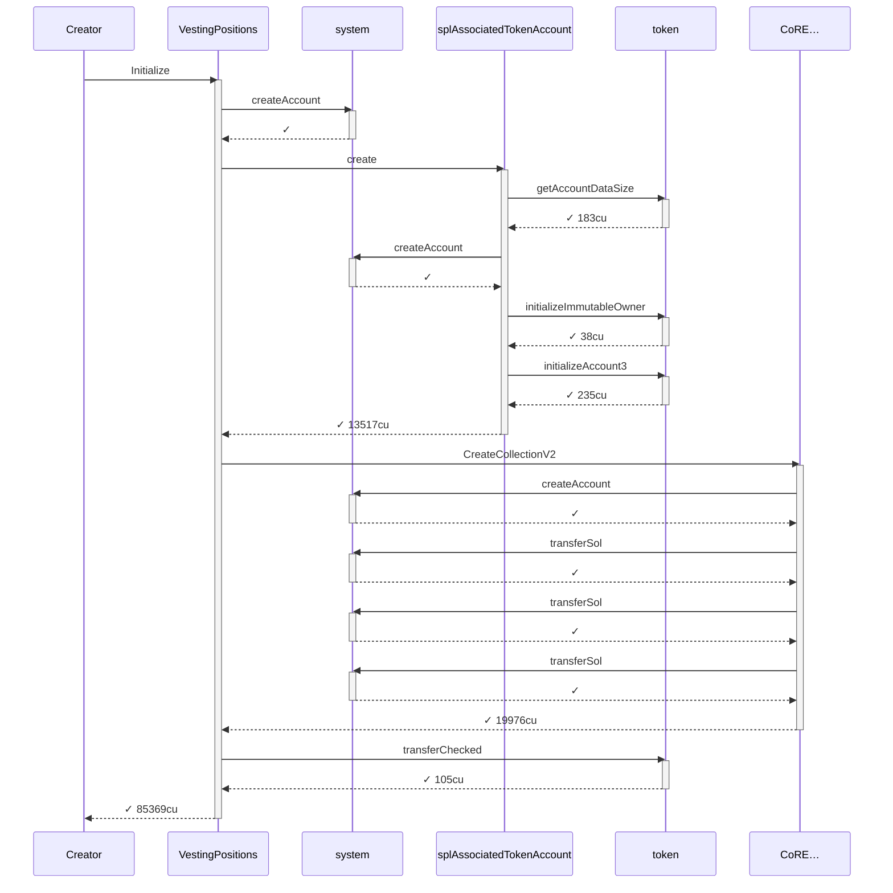
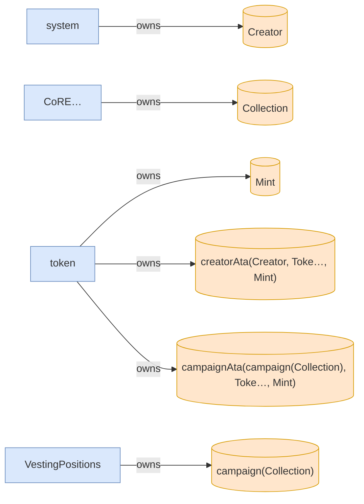
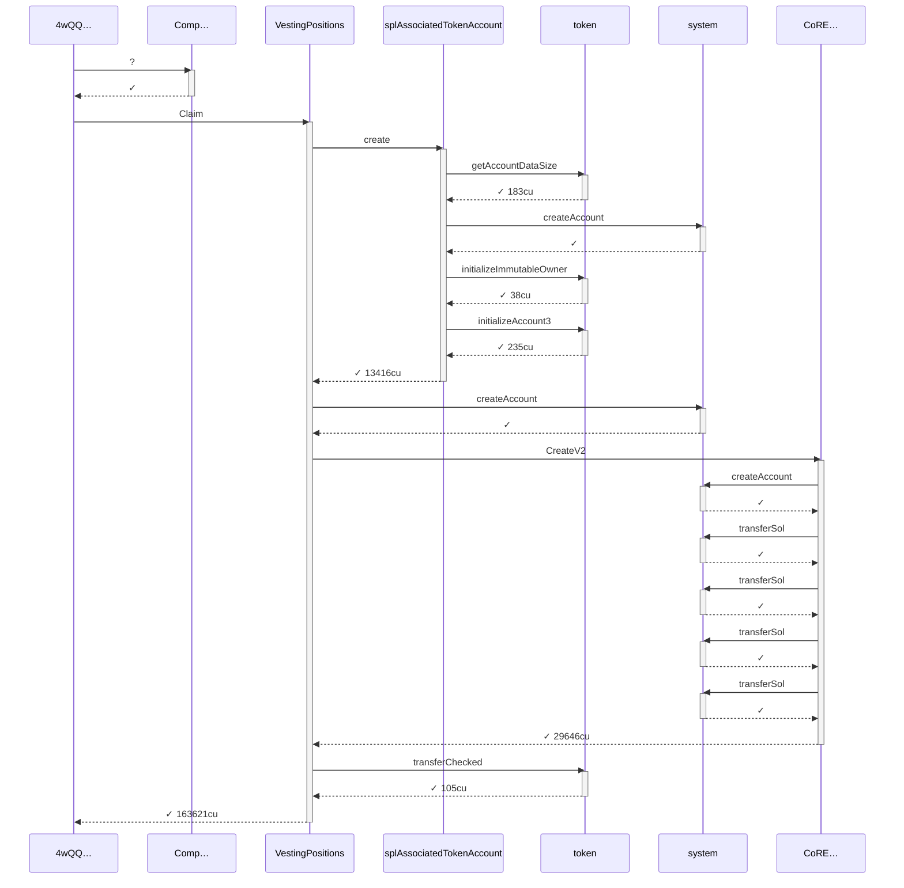
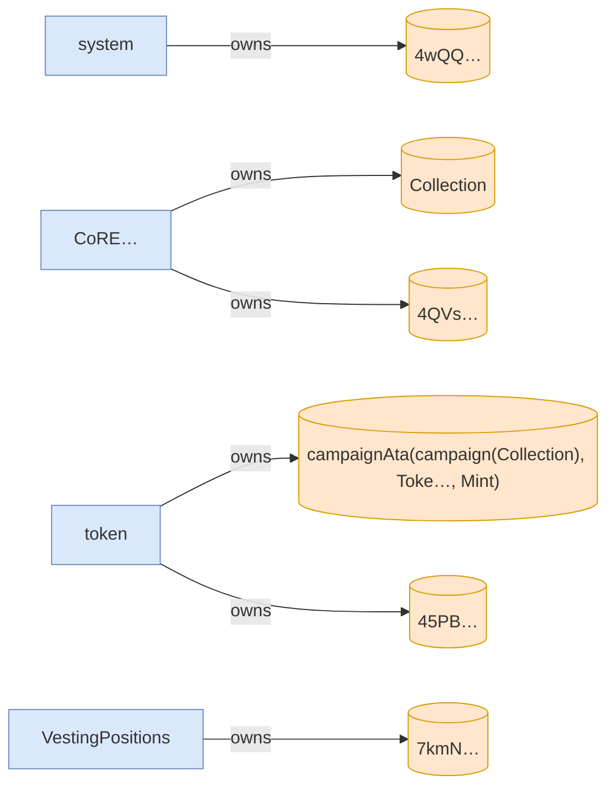
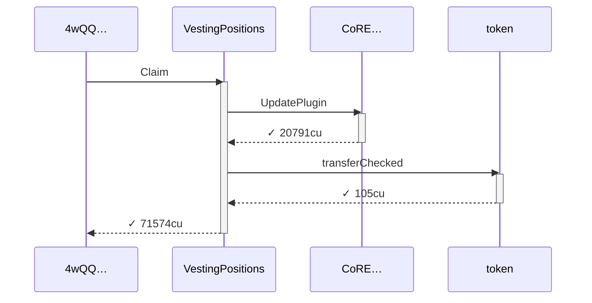
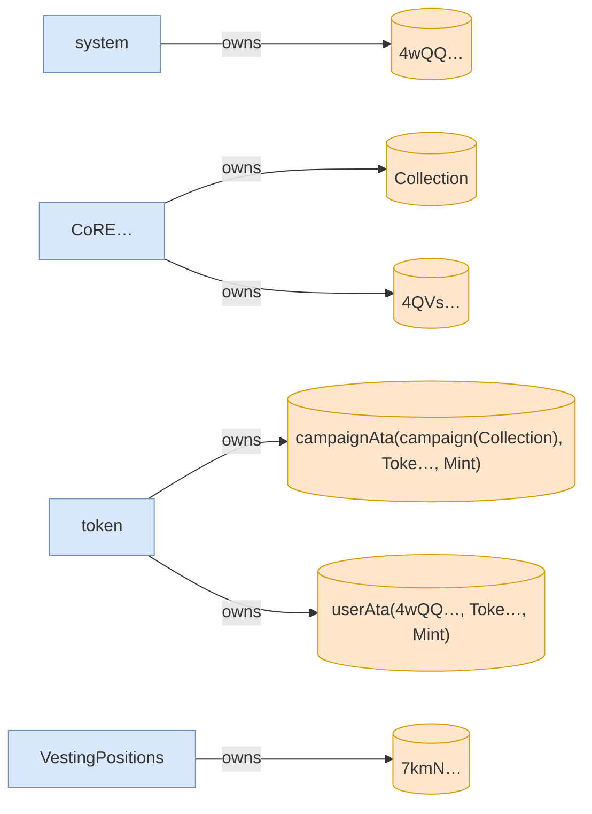

# claims_at_linear_checkpoints

**Source:** [`tests/vesting_schedule.rs` L181](https://github.com/cds-turbin3/vesting-position/blob/e74e9dd5f39b0343e73e0fc7f68b7aba8525b951/babelfish-tests/tests/vesting_schedule.rs#L181)

Over 31 days: 16 moments; 1/1 law(s) held.

### T0: Initialize (day 0)

| observation | before | after |
| --- | --- | --- |
| Vault balance | — | 10000000000000 |
| Creator balance | — | 0 |

*observed Alice claimable (schedule ceiling): 0*

*observed Alice claimable (schedule ceiling): 100000000000*

### Sequence



### Authority


### Ownership



<details>
<summary>tree</summary>

```

Creator (85369cu)
└─ VestingPositions::Initialize ✓ 85369cu
   ├─ system::createAccount ✓
   ├─ splAssociatedTokenAccount::create ✓ 13517cu
   │  ├─ token::getAccountDataSize ✓ 183cu
   │  ├─ system::createAccount ✓
   │  ├─ token::initializeImmutableOwner ✓ 38cu
   │  └─ token::initializeAccount3 ✓ 235cu
   ├─ CoRE…::CreateCollectionV2 ✓ 19976cu
   │  ├─ system::createAccount ✓
   │  ├─ system::transferSol ✓
   │  ├─ system::transferSol ✓
   │  └─ system::transferSol ✓
   └─ token::transferChecked ✓ 105cu
```

</details>

*2 days pass.*

### T1: (instruction) (day 2)

| observation | before | after |
| --- | --- | --- |
| Vault balance | 10000000000000 | 9900000000000 |
| Alice balance | — | 100000000000 |

### Sequence



### Authority


### Ownership



<details>
<summary>tree</summary>

```

4wQQ… (163771cu)
├─ Comp…::? ✓
└─ VestingPositions::Claim ✓ 163621cu
   ├─ splAssociatedTokenAccount::create ✓ 13416cu
   │  ├─ token::getAccountDataSize ✓ 183cu
   │  ├─ system::createAccount ✓
   │  ├─ token::initializeImmutableOwner ✓ 38cu
   │  └─ token::initializeAccount3 ✓ 235cu
   ├─ system::createAccount ✓
   ├─ CoRE…::CreateV2 ✓ 29646cu
   │  ├─ system::createAccount ✓
   │  ├─ system::transferSol ✓
   │  ├─ system::transferSol ✓
   │  ├─ system::transferSol ✓
   │  └─ system::transferSol ✓
   └─ token::transferChecked ✓ 105cu
```

</details>

*25056 seconds pass.*

### T2: Claim (day 2)

| observation | before | after |
| --- | --- | --- |
| Vault balance | 9900000000000 | 9891000000000 |
| Alice claimable (schedule ceiling) | 100000000000 | 109000000000 |
| Alice balance | 100000000000 | 109000000000 |

### Sequence



### Authority


### Ownership



<details>
<summary>tree</summary>

```

4wQQ… (71574cu)
└─ VestingPositions::Claim ✓ 71574cu
   ├─ CoRE…::UpdatePlugin ✓ 20791cu
   └─ token::transferChecked ✓ 105cu
```

</details>

*150336 seconds pass.*

### T3: Claim (day 4)

| observation | before | after |
| --- | --- | --- |
| Vault balance | 9891000000000 | 9837000000000 |
| Alice claimable (schedule ceiling) | 109000000000 | 163000000000 |
| Alice balance | 109000000000 | 163000000000 |

### Sequence


### Authority


### Ownership


<details>
<summary>tree</summary>

```

4wQQ… (71574cu)
└─ VestingPositions::Claim ✓ 71574cu
   ├─ CoRE…::UpdatePlugin ✓ 20791cu
   └─ token::transferChecked ✓ 105cu
```

</details>

*150336 seconds pass.*

### T4: Claim (day 5)

| observation | before | after |
| --- | --- | --- |
| Vault balance | 9837000000000 | 9783000000000 |
| Alice claimable (schedule ceiling) | 163000000000 | 217000000000 |
| Alice balance | 163000000000 | 217000000000 |

### Sequence


### Authority


### Ownership


<details>
<summary>tree</summary>

```

4wQQ… (71574cu)
└─ VestingPositions::Claim ✓ 71574cu
   ├─ CoRE…::UpdatePlugin ✓ 20791cu
   └─ token::transferChecked ✓ 105cu
```

</details>

*175392 seconds pass.*

### T5: Claim (day 7)

| observation | before | after |
| --- | --- | --- |
| Vault balance | 9783000000000 | 9720000000000 |
| Alice claimable (schedule ceiling) | 217000000000 | 280000000000 |
| Alice balance | 217000000000 | 280000000000 |

### Sequence


### Authority


### Ownership


<details>
<summary>tree</summary>

```

4wQQ… (71574cu)
└─ VestingPositions::Claim ✓ 71574cu
   ├─ CoRE…::UpdatePlugin ✓ 20791cu
   └─ token::transferChecked ✓ 105cu
```

</details>

*325728 seconds pass.*

### T6: Claim (day 11)

| observation | before | after |
| --- | --- | --- |
| Vault balance | 9720000000000 | 9603000000000 |
| Alice claimable (schedule ceiling) | 280000000000 | 397000000000 |
| Alice balance | 280000000000 | 397000000000 |

### Sequence


### Authority


### Ownership

```mermaid
flowchart LR
    system["system"]:::program
    4wQQ[("4wQQ…")]:::state
    CoRE["CoRE…"]:::program
    Collection[("Collection")]:::state
    token["token"]:::program
    campaignAtacampaignCollectionTokeMint[("campaignAta(campaign(Collection), Toke…, Mint)")]:::state
    userAta4wQQTokeMint[("userAta(4wQQ…, Toke…, Mint)")]:::state
    4QVs[("4QVs…")]:::state
    VestingPositions["VestingPositions"]:::program
    7kmN[("7kmN…")]:::state
    system -->|owns| 4wQQ
    CoRE -->|owns| Collection
    token -->|owns| campaignAtacampaignCollectionTokeMint
    token -->|owns| userAta4wQQTokeMint
    CoRE -->|owns| 4QVs
    VestingPositions -->|owns| 7kmN
    classDef program fill:#dae8fc,stroke:#6c8ebf;
    classDef signer fill:#d5e8d4,stroke:#82b366;
    classDef state fill:#ffe6cc,stroke:#d79b00;
```

<details>
<summary>tree</summary>

```

4wQQ… (71574cu)
└─ VestingPositions::Claim ✓ 71574cu
   ├─ CoRE…::UpdatePlugin ✓ 20791cu
   └─ token::transferChecked ✓ 105cu
```

</details>

*300672 seconds pass.*

### T7: Claim (day 15)

| observation | before | after |
| --- | --- | --- |
| Vault balance | 9603000000000 | 9495000000000 |
| Alice claimable (schedule ceiling) | 397000000000 | 505000000000 |
| Alice balance | 397000000000 | 505000000000 |

### Sequence

```mermaid
sequenceDiagram
    participant p0 as 4wQQ…
    participant p1 as VestingPositions
    participant p2 as CoRE…
    participant p3 as token
    p0->>p1: Claim
    activate p1
    p1->>p2: UpdatePlugin
    activate p2
    p2-->>p1: ✓ 20791cu
    deactivate p2
    p1->>p3: transferChecked
    activate p3
    p3-->>p1: ✓ 105cu
    deactivate p3
    p1-->>p0: ✓ 71574cu
    deactivate p1
```

### Authority

```mermaid
flowchart LR
    VestingPositions["VestingPositions"]:::program
    4wQQ(["4wQQ…"]):::signer
    Collection[("Collection")]:::state
    campaignAtacampaignCollectionTokeMint[("campaignAta(campaign(Collection), Toke…, Mint)")]:::state
    userAta4wQQTokeMint[("userAta(4wQQ…, Toke…, Mint)")]:::state
    4QVs[("4QVs…")]:::state
    7kmN[("7kmN…")]:::state
    CoRE["CoRE…"]:::program
    updateAuthorityCollection(["updateAuthority(Collection)"]):::signer
    token["token"]:::program
    campaignCollection(["campaign(Collection)"]):::signer
    4wQQ -->|signs| VestingPositions
    VestingPositions -->|writes| Collection
    VestingPositions -->|writes| campaignAtacampaignCollectionTokeMint
    VestingPositions -->|writes| userAta4wQQTokeMint
    VestingPositions -->|writes| 4QVs
    VestingPositions -->|writes| 7kmN
    CoRE -->|writes| 4QVs
    CoRE -->|writes| Collection
    4wQQ -->|signs| CoRE
    updateAuthorityCollection -->|signs| CoRE
    token -->|writes| campaignAtacampaignCollectionTokeMint
    token -->|writes| userAta4wQQTokeMint
    campaignCollection -->|signs| token
    classDef program fill:#dae8fc,stroke:#6c8ebf;
    classDef signer fill:#d5e8d4,stroke:#82b366;
    classDef state fill:#ffe6cc,stroke:#d79b00;
```

### Ownership

```mermaid
flowchart LR
    system["system"]:::program
    4wQQ[("4wQQ…")]:::state
    CoRE["CoRE…"]:::program
    Collection[("Collection")]:::state
    token["token"]:::program
    campaignAtacampaignCollectionTokeMint[("campaignAta(campaign(Collection), Toke…, Mint)")]:::state
    userAta4wQQTokeMint[("userAta(4wQQ…, Toke…, Mint)")]:::state
    4QVs[("4QVs…")]:::state
    VestingPositions["VestingPositions"]:::program
    7kmN[("7kmN…")]:::state
    system -->|owns| 4wQQ
    CoRE -->|owns| Collection
    token -->|owns| campaignAtacampaignCollectionTokeMint
    token -->|owns| userAta4wQQTokeMint
    CoRE -->|owns| 4QVs
    VestingPositions -->|owns| 7kmN
    classDef program fill:#dae8fc,stroke:#6c8ebf;
    classDef signer fill:#d5e8d4,stroke:#82b366;
    classDef state fill:#ffe6cc,stroke:#d79b00;
```

<details>
<summary>tree</summary>

```

4wQQ… (71574cu)
└─ VestingPositions::Claim ✓ 71574cu
   ├─ CoRE…::UpdatePlugin ✓ 20791cu
   └─ token::transferChecked ✓ 105cu
```

</details>

*125280 seconds pass.*

### T8: Claim (day 16)

| observation | before | after |
| --- | --- | --- |
| Vault balance | 9495000000000 | 9450000000000 |
| Alice claimable (schedule ceiling) | 505000000000 | 550000000000 |
| Alice balance | 505000000000 | 550000000000 |

### Sequence

```mermaid
sequenceDiagram
    participant p0 as 4wQQ…
    participant p1 as VestingPositions
    participant p2 as CoRE…
    participant p3 as token
    p0->>p1: Claim
    activate p1
    p1->>p2: UpdatePlugin
    activate p2
    p2-->>p1: ✓ 20791cu
    deactivate p2
    p1->>p3: transferChecked
    activate p3
    p3-->>p1: ✓ 105cu
    deactivate p3
    p1-->>p0: ✓ 71574cu
    deactivate p1
```

### Authority

```mermaid
flowchart LR
    VestingPositions["VestingPositions"]:::program
    4wQQ(["4wQQ…"]):::signer
    Collection[("Collection")]:::state
    campaignAtacampaignCollectionTokeMint[("campaignAta(campaign(Collection), Toke…, Mint)")]:::state
    userAta4wQQTokeMint[("userAta(4wQQ…, Toke…, Mint)")]:::state
    4QVs[("4QVs…")]:::state
    7kmN[("7kmN…")]:::state
    CoRE["CoRE…"]:::program
    updateAuthorityCollection(["updateAuthority(Collection)"]):::signer
    token["token"]:::program
    campaignCollection(["campaign(Collection)"]):::signer
    4wQQ -->|signs| VestingPositions
    VestingPositions -->|writes| Collection
    VestingPositions -->|writes| campaignAtacampaignCollectionTokeMint
    VestingPositions -->|writes| userAta4wQQTokeMint
    VestingPositions -->|writes| 4QVs
    VestingPositions -->|writes| 7kmN
    CoRE -->|writes| 4QVs
    CoRE -->|writes| Collection
    4wQQ -->|signs| CoRE
    updateAuthorityCollection -->|signs| CoRE
    token -->|writes| campaignAtacampaignCollectionTokeMint
    token -->|writes| userAta4wQQTokeMint
    campaignCollection -->|signs| token
    classDef program fill:#dae8fc,stroke:#6c8ebf;
    classDef signer fill:#d5e8d4,stroke:#82b366;
    classDef state fill:#ffe6cc,stroke:#d79b00;
```

### Ownership

```mermaid
flowchart LR
    system["system"]:::program
    4wQQ[("4wQQ…")]:::state
    CoRE["CoRE…"]:::program
    Collection[("Collection")]:::state
    token["token"]:::program
    campaignAtacampaignCollectionTokeMint[("campaignAta(campaign(Collection), Toke…, Mint)")]:::state
    userAta4wQQTokeMint[("userAta(4wQQ…, Toke…, Mint)")]:::state
    4QVs[("4QVs…")]:::state
    VestingPositions["VestingPositions"]:::program
    7kmN[("7kmN…")]:::state
    system -->|owns| 4wQQ
    CoRE -->|owns| Collection
    token -->|owns| campaignAtacampaignCollectionTokeMint
    token -->|owns| userAta4wQQTokeMint
    CoRE -->|owns| 4QVs
    VestingPositions -->|owns| 7kmN
    classDef program fill:#dae8fc,stroke:#6c8ebf;
    classDef signer fill:#d5e8d4,stroke:#82b366;
    classDef state fill:#ffe6cc,stroke:#d79b00;
```

<details>
<summary>tree</summary>

```

4wQQ… (71574cu)
└─ VestingPositions::Claim ✓ 71574cu
   ├─ CoRE…::UpdatePlugin ✓ 20791cu
   └─ token::transferChecked ✓ 105cu
```

</details>

*175392 seconds pass.*

### T9: Claim (day 18)

| observation | before | after |
| --- | --- | --- |
| Vault balance | 9450000000000 | 9387000000000 |
| Alice claimable (schedule ceiling) | 550000000000 | 613000000000 |
| Alice balance | 550000000000 | 613000000000 |

### Sequence

```mermaid
sequenceDiagram
    participant p0 as 4wQQ…
    participant p1 as VestingPositions
    participant p2 as CoRE…
    participant p3 as token
    p0->>p1: Claim
    activate p1
    p1->>p2: UpdatePlugin
    activate p2
    p2-->>p1: ✓ 20791cu
    deactivate p2
    p1->>p3: transferChecked
    activate p3
    p3-->>p1: ✓ 105cu
    deactivate p3
    p1-->>p0: ✓ 71574cu
    deactivate p1
```

### Authority

```mermaid
flowchart LR
    VestingPositions["VestingPositions"]:::program
    4wQQ(["4wQQ…"]):::signer
    Collection[("Collection")]:::state
    campaignAtacampaignCollectionTokeMint[("campaignAta(campaign(Collection), Toke…, Mint)")]:::state
    userAta4wQQTokeMint[("userAta(4wQQ…, Toke…, Mint)")]:::state
    4QVs[("4QVs…")]:::state
    7kmN[("7kmN…")]:::state
    CoRE["CoRE…"]:::program
    updateAuthorityCollection(["updateAuthority(Collection)"]):::signer
    token["token"]:::program
    campaignCollection(["campaign(Collection)"]):::signer
    4wQQ -->|signs| VestingPositions
    VestingPositions -->|writes| Collection
    VestingPositions -->|writes| campaignAtacampaignCollectionTokeMint
    VestingPositions -->|writes| userAta4wQQTokeMint
    VestingPositions -->|writes| 4QVs
    VestingPositions -->|writes| 7kmN
    CoRE -->|writes| 4QVs
    CoRE -->|writes| Collection
    4wQQ -->|signs| CoRE
    updateAuthorityCollection -->|signs| CoRE
    token -->|writes| campaignAtacampaignCollectionTokeMint
    token -->|writes| userAta4wQQTokeMint
    campaignCollection -->|signs| token
    classDef program fill:#dae8fc,stroke:#6c8ebf;
    classDef signer fill:#d5e8d4,stroke:#82b366;
    classDef state fill:#ffe6cc,stroke:#d79b00;
```

### Ownership

```mermaid
flowchart LR
    system["system"]:::program
    4wQQ[("4wQQ…")]:::state
    CoRE["CoRE…"]:::program
    Collection[("Collection")]:::state
    token["token"]:::program
    campaignAtacampaignCollectionTokeMint[("campaignAta(campaign(Collection), Toke…, Mint)")]:::state
    userAta4wQQTokeMint[("userAta(4wQQ…, Toke…, Mint)")]:::state
    4QVs[("4QVs…")]:::state
    VestingPositions["VestingPositions"]:::program
    7kmN[("7kmN…")]:::state
    system -->|owns| 4wQQ
    CoRE -->|owns| Collection
    token -->|owns| campaignAtacampaignCollectionTokeMint
    token -->|owns| userAta4wQQTokeMint
    CoRE -->|owns| 4QVs
    VestingPositions -->|owns| 7kmN
    classDef program fill:#dae8fc,stroke:#6c8ebf;
    classDef signer fill:#d5e8d4,stroke:#82b366;
    classDef state fill:#ffe6cc,stroke:#d79b00;
```

<details>
<summary>tree</summary>

```

4wQQ… (71574cu)
└─ VestingPositions::Claim ✓ 71574cu
   ├─ CoRE…::UpdatePlugin ✓ 20791cu
   └─ token::transferChecked ✓ 105cu
```

</details>

*250560 seconds pass.*

### T10: Claim (day 21)

| observation | before | after |
| --- | --- | --- |
| Vault balance | 9387000000000 | 9297000000000 |
| Alice claimable (schedule ceiling) | 613000000000 | 703000000000 |
| Alice balance | 613000000000 | 703000000000 |

### Sequence

```mermaid
sequenceDiagram
    participant p0 as 4wQQ…
    participant p1 as VestingPositions
    participant p2 as CoRE…
    participant p3 as token
    p0->>p1: Claim
    activate p1
    p1->>p2: UpdatePlugin
    activate p2
    p2-->>p1: ✓ 20791cu
    deactivate p2
    p1->>p3: transferChecked
    activate p3
    p3-->>p1: ✓ 105cu
    deactivate p3
    p1-->>p0: ✓ 71574cu
    deactivate p1
```

### Authority

```mermaid
flowchart LR
    VestingPositions["VestingPositions"]:::program
    4wQQ(["4wQQ…"]):::signer
    Collection[("Collection")]:::state
    campaignAtacampaignCollectionTokeMint[("campaignAta(campaign(Collection), Toke…, Mint)")]:::state
    userAta4wQQTokeMint[("userAta(4wQQ…, Toke…, Mint)")]:::state
    4QVs[("4QVs…")]:::state
    7kmN[("7kmN…")]:::state
    CoRE["CoRE…"]:::program
    updateAuthorityCollection(["updateAuthority(Collection)"]):::signer
    token["token"]:::program
    campaignCollection(["campaign(Collection)"]):::signer
    4wQQ -->|signs| VestingPositions
    VestingPositions -->|writes| Collection
    VestingPositions -->|writes| campaignAtacampaignCollectionTokeMint
    VestingPositions -->|writes| userAta4wQQTokeMint
    VestingPositions -->|writes| 4QVs
    VestingPositions -->|writes| 7kmN
    CoRE -->|writes| 4QVs
    CoRE -->|writes| Collection
    4wQQ -->|signs| CoRE
    updateAuthorityCollection -->|signs| CoRE
    token -->|writes| campaignAtacampaignCollectionTokeMint
    token -->|writes| userAta4wQQTokeMint
    campaignCollection -->|signs| token
    classDef program fill:#dae8fc,stroke:#6c8ebf;
    classDef signer fill:#d5e8d4,stroke:#82b366;
    classDef state fill:#ffe6cc,stroke:#d79b00;
```

### Ownership

```mermaid
flowchart LR
    system["system"]:::program
    4wQQ[("4wQQ…")]:::state
    CoRE["CoRE…"]:::program
    Collection[("Collection")]:::state
    token["token"]:::program
    campaignAtacampaignCollectionTokeMint[("campaignAta(campaign(Collection), Toke…, Mint)")]:::state
    userAta4wQQTokeMint[("userAta(4wQQ…, Toke…, Mint)")]:::state
    4QVs[("4QVs…")]:::state
    VestingPositions["VestingPositions"]:::program
    7kmN[("7kmN…")]:::state
    system -->|owns| 4wQQ
    CoRE -->|owns| Collection
    token -->|owns| campaignAtacampaignCollectionTokeMint
    token -->|owns| userAta4wQQTokeMint
    CoRE -->|owns| 4QVs
    VestingPositions -->|owns| 7kmN
    classDef program fill:#dae8fc,stroke:#6c8ebf;
    classDef signer fill:#d5e8d4,stroke:#82b366;
    classDef state fill:#ffe6cc,stroke:#d79b00;
```

<details>
<summary>tree</summary>

```

4wQQ… (71574cu)
└─ VestingPositions::Claim ✓ 71574cu
   ├─ CoRE…::UpdatePlugin ✓ 20791cu
   └─ token::transferChecked ✓ 105cu
```

</details>

*200448 seconds pass.*

### T11: Claim (day 23)

| observation | before | after |
| --- | --- | --- |
| Vault balance | 9297000000000 | 9225000000000 |
| Alice claimable (schedule ceiling) | 703000000000 | 775000000000 |
| Alice balance | 703000000000 | 775000000000 |

### Sequence

```mermaid
sequenceDiagram
    participant p0 as 4wQQ…
    participant p1 as VestingPositions
    participant p2 as CoRE…
    participant p3 as token
    p0->>p1: Claim
    activate p1
    p1->>p2: UpdatePlugin
    activate p2
    p2-->>p1: ✓ 20791cu
    deactivate p2
    p1->>p3: transferChecked
    activate p3
    p3-->>p1: ✓ 105cu
    deactivate p3
    p1-->>p0: ✓ 71574cu
    deactivate p1
```

### Authority

```mermaid
flowchart LR
    VestingPositions["VestingPositions"]:::program
    4wQQ(["4wQQ…"]):::signer
    Collection[("Collection")]:::state
    campaignAtacampaignCollectionTokeMint[("campaignAta(campaign(Collection), Toke…, Mint)")]:::state
    userAta4wQQTokeMint[("userAta(4wQQ…, Toke…, Mint)")]:::state
    4QVs[("4QVs…")]:::state
    7kmN[("7kmN…")]:::state
    CoRE["CoRE…"]:::program
    updateAuthorityCollection(["updateAuthority(Collection)"]):::signer
    token["token"]:::program
    campaignCollection(["campaign(Collection)"]):::signer
    4wQQ -->|signs| VestingPositions
    VestingPositions -->|writes| Collection
    VestingPositions -->|writes| campaignAtacampaignCollectionTokeMint
    VestingPositions -->|writes| userAta4wQQTokeMint
    VestingPositions -->|writes| 4QVs
    VestingPositions -->|writes| 7kmN
    CoRE -->|writes| 4QVs
    CoRE -->|writes| Collection
    4wQQ -->|signs| CoRE
    updateAuthorityCollection -->|signs| CoRE
    token -->|writes| campaignAtacampaignCollectionTokeMint
    token -->|writes| userAta4wQQTokeMint
    campaignCollection -->|signs| token
    classDef program fill:#dae8fc,stroke:#6c8ebf;
    classDef signer fill:#d5e8d4,stroke:#82b366;
    classDef state fill:#ffe6cc,stroke:#d79b00;
```

### Ownership

```mermaid
flowchart LR
    system["system"]:::program
    4wQQ[("4wQQ…")]:::state
    CoRE["CoRE…"]:::program
    Collection[("Collection")]:::state
    token["token"]:::program
    campaignAtacampaignCollectionTokeMint[("campaignAta(campaign(Collection), Toke…, Mint)")]:::state
    userAta4wQQTokeMint[("userAta(4wQQ…, Toke…, Mint)")]:::state
    4QVs[("4QVs…")]:::state
    VestingPositions["VestingPositions"]:::program
    7kmN[("7kmN…")]:::state
    system -->|owns| 4wQQ
    CoRE -->|owns| Collection
    token -->|owns| campaignAtacampaignCollectionTokeMint
    token -->|owns| userAta4wQQTokeMint
    CoRE -->|owns| 4QVs
    VestingPositions -->|owns| 7kmN
    classDef program fill:#dae8fc,stroke:#6c8ebf;
    classDef signer fill:#d5e8d4,stroke:#82b366;
    classDef state fill:#ffe6cc,stroke:#d79b00;
```

<details>
<summary>tree</summary>

```

4wQQ… (71574cu)
└─ VestingPositions::Claim ✓ 71574cu
   ├─ CoRE…::UpdatePlugin ✓ 20791cu
   └─ token::transferChecked ✓ 105cu
```

</details>

*200448 seconds pass.*

### T12: Claim (day 26)

| observation | before | after |
| --- | --- | --- |
| Vault balance | 9225000000000 | 9153000000000 |
| Alice claimable (schedule ceiling) | 775000000000 | 847000000000 |
| Alice balance | 775000000000 | 847000000000 |

### Sequence

```mermaid
sequenceDiagram
    participant p0 as 4wQQ…
    participant p1 as VestingPositions
    participant p2 as CoRE…
    participant p3 as token
    p0->>p1: Claim
    activate p1
    p1->>p2: UpdatePlugin
    activate p2
    p2-->>p1: ✓ 20791cu
    deactivate p2
    p1->>p3: transferChecked
    activate p3
    p3-->>p1: ✓ 105cu
    deactivate p3
    p1-->>p0: ✓ 71574cu
    deactivate p1
```

### Authority

```mermaid
flowchart LR
    VestingPositions["VestingPositions"]:::program
    4wQQ(["4wQQ…"]):::signer
    Collection[("Collection")]:::state
    campaignAtacampaignCollectionTokeMint[("campaignAta(campaign(Collection), Toke…, Mint)")]:::state
    userAta4wQQTokeMint[("userAta(4wQQ…, Toke…, Mint)")]:::state
    4QVs[("4QVs…")]:::state
    7kmN[("7kmN…")]:::state
    CoRE["CoRE…"]:::program
    updateAuthorityCollection(["updateAuthority(Collection)"]):::signer
    token["token"]:::program
    campaignCollection(["campaign(Collection)"]):::signer
    4wQQ -->|signs| VestingPositions
    VestingPositions -->|writes| Collection
    VestingPositions -->|writes| campaignAtacampaignCollectionTokeMint
    VestingPositions -->|writes| userAta4wQQTokeMint
    VestingPositions -->|writes| 4QVs
    VestingPositions -->|writes| 7kmN
    CoRE -->|writes| 4QVs
    CoRE -->|writes| Collection
    4wQQ -->|signs| CoRE
    updateAuthorityCollection -->|signs| CoRE
    token -->|writes| campaignAtacampaignCollectionTokeMint
    token -->|writes| userAta4wQQTokeMint
    campaignCollection -->|signs| token
    classDef program fill:#dae8fc,stroke:#6c8ebf;
    classDef signer fill:#d5e8d4,stroke:#82b366;
    classDef state fill:#ffe6cc,stroke:#d79b00;
```

### Ownership

```mermaid
flowchart LR
    system["system"]:::program
    4wQQ[("4wQQ…")]:::state
    CoRE["CoRE…"]:::program
    Collection[("Collection")]:::state
    token["token"]:::program
    campaignAtacampaignCollectionTokeMint[("campaignAta(campaign(Collection), Toke…, Mint)")]:::state
    userAta4wQQTokeMint[("userAta(4wQQ…, Toke…, Mint)")]:::state
    4QVs[("4QVs…")]:::state
    VestingPositions["VestingPositions"]:::program
    7kmN[("7kmN…")]:::state
    system -->|owns| 4wQQ
    CoRE -->|owns| Collection
    token -->|owns| campaignAtacampaignCollectionTokeMint
    token -->|owns| userAta4wQQTokeMint
    CoRE -->|owns| 4QVs
    VestingPositions -->|owns| 7kmN
    classDef program fill:#dae8fc,stroke:#6c8ebf;
    classDef signer fill:#d5e8d4,stroke:#82b366;
    classDef state fill:#ffe6cc,stroke:#d79b00;
```

<details>
<summary>tree</summary>

```

4wQQ… (71574cu)
└─ VestingPositions::Claim ✓ 71574cu
   ├─ CoRE…::UpdatePlugin ✓ 20791cu
   └─ token::transferChecked ✓ 105cu
```

</details>

*200448 seconds pass.*

### T13: Claim (day 28)

| observation | before | after |
| --- | --- | --- |
| Vault balance | 9153000000000 | 9081000000000 |
| Alice claimable (schedule ceiling) | 847000000000 | 919000000000 |
| Alice balance | 847000000000 | 919000000000 |

### Sequence

```mermaid
sequenceDiagram
    participant p0 as 4wQQ…
    participant p1 as VestingPositions
    participant p2 as CoRE…
    participant p3 as token
    p0->>p1: Claim
    activate p1
    p1->>p2: UpdatePlugin
    activate p2
    p2-->>p1: ✓ 20791cu
    deactivate p2
    p1->>p3: transferChecked
    activate p3
    p3-->>p1: ✓ 105cu
    deactivate p3
    p1-->>p0: ✓ 71574cu
    deactivate p1
```

### Authority

```mermaid
flowchart LR
    VestingPositions["VestingPositions"]:::program
    4wQQ(["4wQQ…"]):::signer
    Collection[("Collection")]:::state
    campaignAtacampaignCollectionTokeMint[("campaignAta(campaign(Collection), Toke…, Mint)")]:::state
    userAta4wQQTokeMint[("userAta(4wQQ…, Toke…, Mint)")]:::state
    4QVs[("4QVs…")]:::state
    7kmN[("7kmN…")]:::state
    CoRE["CoRE…"]:::program
    updateAuthorityCollection(["updateAuthority(Collection)"]):::signer
    token["token"]:::program
    campaignCollection(["campaign(Collection)"]):::signer
    4wQQ -->|signs| VestingPositions
    VestingPositions -->|writes| Collection
    VestingPositions -->|writes| campaignAtacampaignCollectionTokeMint
    VestingPositions -->|writes| userAta4wQQTokeMint
    VestingPositions -->|writes| 4QVs
    VestingPositions -->|writes| 7kmN
    CoRE -->|writes| 4QVs
    CoRE -->|writes| Collection
    4wQQ -->|signs| CoRE
    updateAuthorityCollection -->|signs| CoRE
    token -->|writes| campaignAtacampaignCollectionTokeMint
    token -->|writes| userAta4wQQTokeMint
    campaignCollection -->|signs| token
    classDef program fill:#dae8fc,stroke:#6c8ebf;
    classDef signer fill:#d5e8d4,stroke:#82b366;
    classDef state fill:#ffe6cc,stroke:#d79b00;
```

### Ownership

```mermaid
flowchart LR
    system["system"]:::program
    4wQQ[("4wQQ…")]:::state
    CoRE["CoRE…"]:::program
    Collection[("Collection")]:::state
    token["token"]:::program
    campaignAtacampaignCollectionTokeMint[("campaignAta(campaign(Collection), Toke…, Mint)")]:::state
    userAta4wQQTokeMint[("userAta(4wQQ…, Toke…, Mint)")]:::state
    4QVs[("4QVs…")]:::state
    VestingPositions["VestingPositions"]:::program
    7kmN[("7kmN…")]:::state
    system -->|owns| 4wQQ
    CoRE -->|owns| Collection
    token -->|owns| campaignAtacampaignCollectionTokeMint
    token -->|owns| userAta4wQQTokeMint
    CoRE -->|owns| 4QVs
    VestingPositions -->|owns| 7kmN
    classDef program fill:#dae8fc,stroke:#6c8ebf;
    classDef signer fill:#d5e8d4,stroke:#82b366;
    classDef state fill:#ffe6cc,stroke:#d79b00;
```

<details>
<summary>tree</summary>

```

4wQQ… (71574cu)
└─ VestingPositions::Claim ✓ 71574cu
   ├─ CoRE…::UpdatePlugin ✓ 20791cu
   └─ token::transferChecked ✓ 105cu
```

</details>

*200448 seconds pass.*

### T14: Claim (day 30)

| observation | before | after |
| --- | --- | --- |
| Vault balance | 9081000000000 | 9009000000000 |
| Alice claimable (schedule ceiling) | 919000000000 | 991000000000 |
| Alice balance | 919000000000 | 991000000000 |

### Sequence

```mermaid
sequenceDiagram
    participant p0 as 4wQQ…
    participant p1 as VestingPositions
    participant p2 as CoRE…
    participant p3 as token
    p0->>p1: Claim
    activate p1
    p1->>p2: UpdatePlugin
    activate p2
    p2-->>p1: ✓ 20791cu
    deactivate p2
    p1->>p3: transferChecked
    activate p3
    p3-->>p1: ✓ 105cu
    deactivate p3
    p1-->>p0: ✓ 71574cu
    deactivate p1
```

### Authority

```mermaid
flowchart LR
    VestingPositions["VestingPositions"]:::program
    4wQQ(["4wQQ…"]):::signer
    Collection[("Collection")]:::state
    campaignAtacampaignCollectionTokeMint[("campaignAta(campaign(Collection), Toke…, Mint)")]:::state
    userAta4wQQTokeMint[("userAta(4wQQ…, Toke…, Mint)")]:::state
    4QVs[("4QVs…")]:::state
    7kmN[("7kmN…")]:::state
    CoRE["CoRE…"]:::program
    updateAuthorityCollection(["updateAuthority(Collection)"]):::signer
    token["token"]:::program
    campaignCollection(["campaign(Collection)"]):::signer
    4wQQ -->|signs| VestingPositions
    VestingPositions -->|writes| Collection
    VestingPositions -->|writes| campaignAtacampaignCollectionTokeMint
    VestingPositions -->|writes| userAta4wQQTokeMint
    VestingPositions -->|writes| 4QVs
    VestingPositions -->|writes| 7kmN
    CoRE -->|writes| 4QVs
    CoRE -->|writes| Collection
    4wQQ -->|signs| CoRE
    updateAuthorityCollection -->|signs| CoRE
    token -->|writes| campaignAtacampaignCollectionTokeMint
    token -->|writes| userAta4wQQTokeMint
    campaignCollection -->|signs| token
    classDef program fill:#dae8fc,stroke:#6c8ebf;
    classDef signer fill:#d5e8d4,stroke:#82b366;
    classDef state fill:#ffe6cc,stroke:#d79b00;
```

### Ownership

```mermaid
flowchart LR
    system["system"]:::program
    4wQQ[("4wQQ…")]:::state
    CoRE["CoRE…"]:::program
    Collection[("Collection")]:::state
    token["token"]:::program
    campaignAtacampaignCollectionTokeMint[("campaignAta(campaign(Collection), Toke…, Mint)")]:::state
    userAta4wQQTokeMint[("userAta(4wQQ…, Toke…, Mint)")]:::state
    4QVs[("4QVs…")]:::state
    VestingPositions["VestingPositions"]:::program
    7kmN[("7kmN…")]:::state
    system -->|owns| 4wQQ
    CoRE -->|owns| Collection
    token -->|owns| campaignAtacampaignCollectionTokeMint
    token -->|owns| userAta4wQQTokeMint
    CoRE -->|owns| 4QVs
    VestingPositions -->|owns| 7kmN
    classDef program fill:#dae8fc,stroke:#6c8ebf;
    classDef signer fill:#d5e8d4,stroke:#82b366;
    classDef state fill:#ffe6cc,stroke:#d79b00;
```

<details>
<summary>tree</summary>

```

4wQQ… (71574cu)
└─ VestingPositions::Claim ✓ 71574cu
   ├─ CoRE…::UpdatePlugin ✓ 20791cu
   └─ token::transferChecked ✓ 105cu
```

</details>

*25056 seconds pass.*

### T15: Claim (day 31)

| observation | before | after |
| --- | --- | --- |
| Vault balance | 9009000000000 | 9000000000000 |
| Alice claimable (schedule ceiling) | 991000000000 | 1000000000000 |
| Alice balance | 991000000000 | 1000000000000 |

### Sequence

```mermaid
sequenceDiagram
    participant p0 as 4wQQ…
    participant p1 as VestingPositions
    participant p2 as CoRE…
    participant p3 as system
    participant p4 as token
    p0->>p1: Claim
    activate p1
    p1->>p2: UpdatePlugin
    activate p2
    p2->>p3: transferSol
    activate p3
    p3-->>p2: ✓
    deactivate p3
    p2-->>p1: ✓ 23442cu
    deactivate p2
    p1->>p4: transferChecked
    activate p4
    p4-->>p1: ✓ 105cu
    deactivate p4
    p1->>p2: UpdatePlugin
    activate p2
    p2-->>p1: ✓ 13574cu
    deactivate p2
    p1-->>p0: ✓ 93078cu
    deactivate p1
```

### Authority

```mermaid
flowchart LR
    VestingPositions["VestingPositions"]:::program
    4wQQ(["4wQQ…"]):::signer
    Collection[("Collection")]:::state
    campaignAtacampaignCollectionTokeMint[("campaignAta(campaign(Collection), Toke…, Mint)")]:::state
    userAta4wQQTokeMint[("userAta(4wQQ…, Toke…, Mint)")]:::state
    4QVs[("4QVs…")]:::state
    7kmN[("7kmN…")]:::state
    CoRE["CoRE…"]:::program
    updateAuthorityCollection(["updateAuthority(Collection)"]):::signer
    system["system"]:::program
    token["token"]:::program
    campaignCollection(["campaign(Collection)"]):::signer
    4wQQ -->|signs| VestingPositions
    VestingPositions -->|writes| Collection
    VestingPositions -->|writes| campaignAtacampaignCollectionTokeMint
    VestingPositions -->|writes| userAta4wQQTokeMint
    VestingPositions -->|writes| 4QVs
    VestingPositions -->|writes| 7kmN
    CoRE -->|writes| 4QVs
    CoRE -->|writes| Collection
    4wQQ -->|signs| CoRE
    updateAuthorityCollection -->|signs| CoRE
    4wQQ -->|signs| system
    system -->|writes| 4QVs
    token -->|writes| campaignAtacampaignCollectionTokeMint
    token -->|writes| userAta4wQQTokeMint
    campaignCollection -->|signs| token
    classDef program fill:#dae8fc,stroke:#6c8ebf;
    classDef signer fill:#d5e8d4,stroke:#82b366;
    classDef state fill:#ffe6cc,stroke:#d79b00;
```

### Ownership

```mermaid
flowchart LR
    system["system"]:::program
    4wQQ[("4wQQ…")]:::state
    CoRE["CoRE…"]:::program
    Collection[("Collection")]:::state
    token["token"]:::program
    campaignAtacampaignCollectionTokeMint[("campaignAta(campaign(Collection), Toke…, Mint)")]:::state
    userAta4wQQTokeMint[("userAta(4wQQ…, Toke…, Mint)")]:::state
    4QVs[("4QVs…")]:::state
    VestingPositions["VestingPositions"]:::program
    7kmN[("7kmN…")]:::state
    system -->|owns| 4wQQ
    CoRE -->|owns| Collection
    token -->|owns| campaignAtacampaignCollectionTokeMint
    token -->|owns| userAta4wQQTokeMint
    CoRE -->|owns| 4QVs
    VestingPositions -->|owns| 7kmN
    classDef program fill:#dae8fc,stroke:#6c8ebf;
    classDef signer fill:#d5e8d4,stroke:#82b366;
    classDef state fill:#ffe6cc,stroke:#d79b00;
```

<details>
<summary>tree</summary>

```

4wQQ… (93078cu)
└─ VestingPositions::Claim ✓ 93078cu
   ├─ CoRE…::UpdatePlugin ✓ 23442cu
   │  └─ system::transferSol ✓
   ├─ token::transferChecked ✓ 105cu
   └─ CoRE…::UpdatePlugin ✓ 13574cu
```

</details>

## Conclusion

- Alice balance is monotonic ✓ across 16 moment(s)
