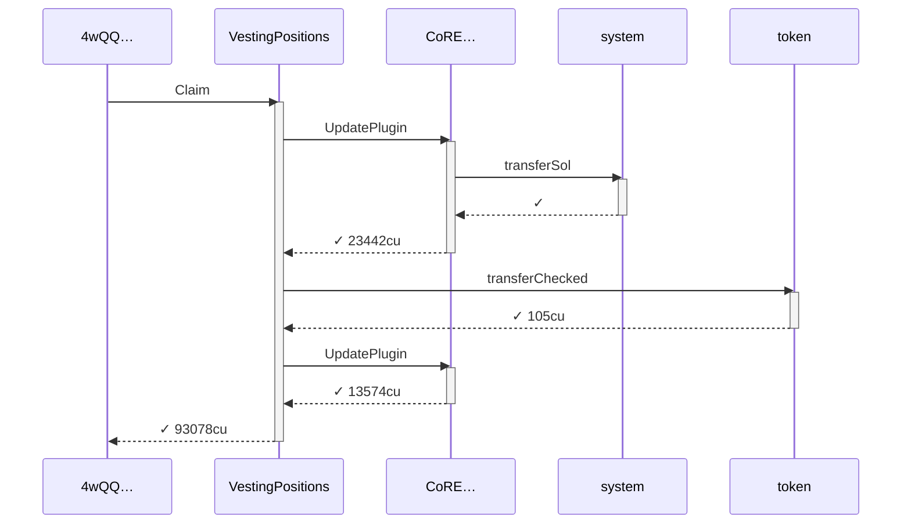
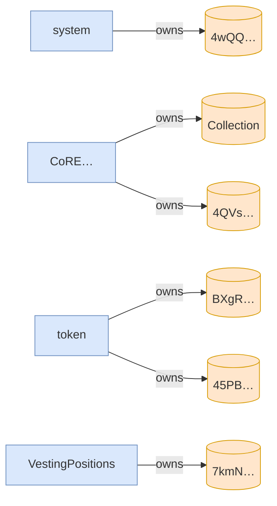

# claims_at_linear_checkpoints

**Source:** [`tests/vesting_schedule.rs` L169](https://github.com/cds-turbin3/vesting-position/blob/c4f43acad0bb9f007622fb43bc19ddc3610c7688/babelfish-tests/tests/vesting_schedule.rs#L169)






<details>
<summary>tree</summary>

```

4wQQ… (93078cu)
└─ VestingPositions::Claim ✓ 93078cu
   ├─ CoRE…::UpdatePlugin ✓ 23442cu
   │  └─ system::transferSol ✓
   ├─ token::transferChecked ✓ 105cu
   └─ CoRE…::UpdatePlugin ✓ 13574cu
```

</details>
