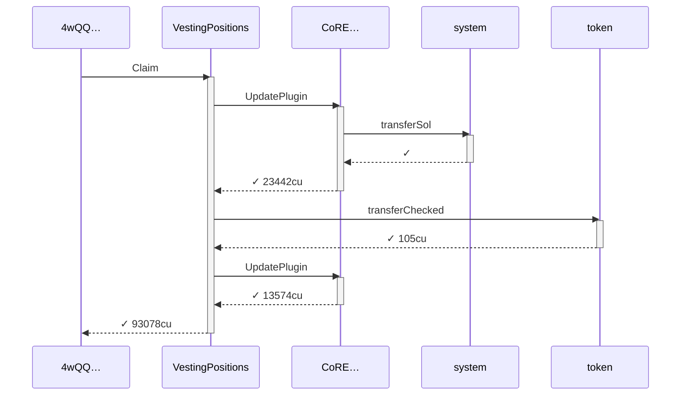
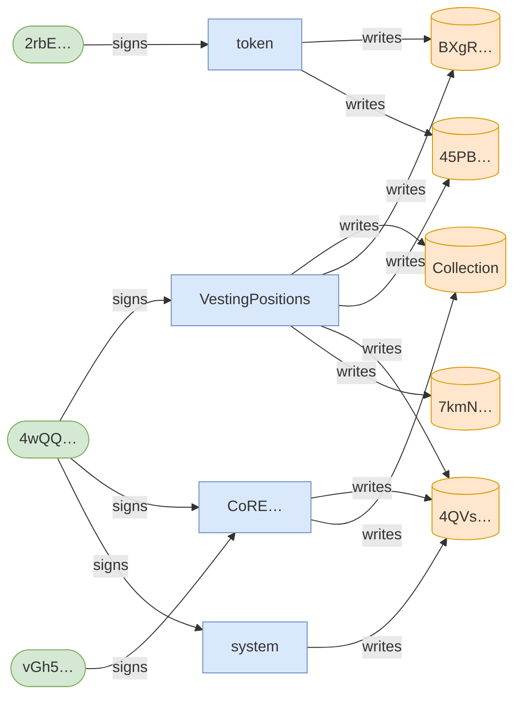
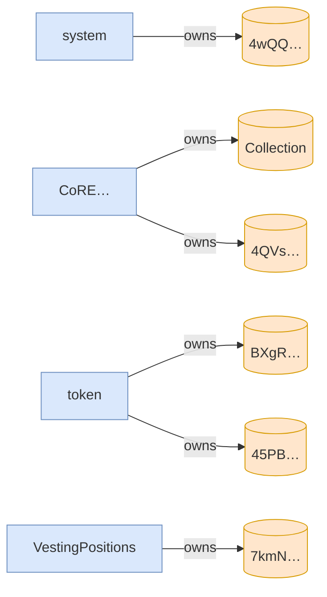

# claims_at_linear_checkpoints

**Source:** [`tests/vesting_schedule.rs` L180](https://github.com/cds-turbin3/vesting-position/blob/cbb8875460ccf5cc3d9023c540f31113adcd0573/babelfish-tests/tests/vesting_schedule.rs#L180)

### Action: Initialize

| account | before | after |
| --- | --- | --- |
| Creator | 10000000000000 | 0 |
| Vault | 0 | 10000000000000 |

<details>
<summary>tree</summary>

```

Creator (85369cu)
└─ VestingPositions::Initialize ✓ 85369cu
   ├─ system::createAccount ✓
   ├─ splAssociatedTokenAccount::create ✓ 13517cu
   │  ├─ token::getAccountDataSize ✓ 183cu
   │  ├─ system::createAccount ✓
   │  ├─ token::initializeImmutableOwner ✓ 38cu
   │  └─ token::initializeAccount3 ✓ 235cu
   ├─ CoRE…::CreateCollectionV2 ✓ 19976cu
   │  ├─ system::createAccount ✓
   │  ├─ system::transferSol ✓
   │  ├─ system::transferSol ✓
   │  └─ system::transferSol ✓
   └─ token::transferChecked ✓ 105cu
```

</details>

### Action: tx

| account | before | after |
| --- | --- | --- |
| Vault | 10000000000000 | 9900000000000 |
| whitelisted_1 | — | 100000000000 |

<details>
<summary>tree</summary>

```

4wQQ… (163771cu)
├─ Comp…::? ✓
└─ VestingPositions::Claim ✓ 163621cu
   ├─ splAssociatedTokenAccount::create ✓ 13416cu
   │  ├─ token::getAccountDataSize ✓ 183cu
   │  ├─ system::createAccount ✓
   │  ├─ token::initializeImmutableOwner ✓ 38cu
   │  └─ token::initializeAccount3 ✓ 235cu
   ├─ system::createAccount ✓
   ├─ CoRE…::CreateV2 ✓ 29646cu
   │  ├─ system::createAccount ✓
   │  ├─ system::transferSol ✓
   │  ├─ system::transferSol ✓
   │  ├─ system::transferSol ✓
   │  └─ system::transferSol ✓
   └─ token::transferChecked ✓ 105cu
```

</details>

### Action: Claim

| account | before | after |
| --- | --- | --- |
| Vault | 9900000000000 | 9891000000000 |
| whitelisted_1 | 100000000000 | 109000000000 |

<details>
<summary>tree</summary>

```

4wQQ… (71574cu)
└─ VestingPositions::Claim ✓ 71574cu
   ├─ CoRE…::UpdatePlugin ✓ 20791cu
   └─ token::transferChecked ✓ 105cu
```

</details>

### Action: Claim

| account | before | after |
| --- | --- | --- |
| Vault | 9891000000000 | 9837000000000 |
| whitelisted_1 | 109000000000 | 163000000000 |

<details>
<summary>tree</summary>

```

4wQQ… (71574cu)
└─ VestingPositions::Claim ✓ 71574cu
   ├─ CoRE…::UpdatePlugin ✓ 20791cu
   └─ token::transferChecked ✓ 105cu
```

</details>

### Action: Claim

| account | before | after |
| --- | --- | --- |
| Vault | 9837000000000 | 9783000000000 |
| whitelisted_1 | 163000000000 | 217000000000 |

<details>
<summary>tree</summary>

```

4wQQ… (71574cu)
└─ VestingPositions::Claim ✓ 71574cu
   ├─ CoRE…::UpdatePlugin ✓ 20791cu
   └─ token::transferChecked ✓ 105cu
```

</details>

### Action: Claim

| account | before | after |
| --- | --- | --- |
| Vault | 9783000000000 | 9720000000000 |
| whitelisted_1 | 217000000000 | 280000000000 |

<details>
<summary>tree</summary>

```

4wQQ… (71574cu)
└─ VestingPositions::Claim ✓ 71574cu
   ├─ CoRE…::UpdatePlugin ✓ 20791cu
   └─ token::transferChecked ✓ 105cu
```

</details>

### Action: Claim

| account | before | after |
| --- | --- | --- |
| Vault | 9720000000000 | 9603000000000 |
| whitelisted_1 | 280000000000 | 397000000000 |

<details>
<summary>tree</summary>

```

4wQQ… (71574cu)
└─ VestingPositions::Claim ✓ 71574cu
   ├─ CoRE…::UpdatePlugin ✓ 20791cu
   └─ token::transferChecked ✓ 105cu
```

</details>

### Action: Claim

| account | before | after |
| --- | --- | --- |
| Vault | 9603000000000 | 9495000000000 |
| whitelisted_1 | 397000000000 | 505000000000 |

<details>
<summary>tree</summary>

```

4wQQ… (71574cu)
└─ VestingPositions::Claim ✓ 71574cu
   ├─ CoRE…::UpdatePlugin ✓ 20791cu
   └─ token::transferChecked ✓ 105cu
```

</details>

### Action: Claim

| account | before | after |
| --- | --- | --- |
| Vault | 9495000000000 | 9450000000000 |
| whitelisted_1 | 505000000000 | 550000000000 |

<details>
<summary>tree</summary>

```

4wQQ… (71574cu)
└─ VestingPositions::Claim ✓ 71574cu
   ├─ CoRE…::UpdatePlugin ✓ 20791cu
   └─ token::transferChecked ✓ 105cu
```

</details>

### Action: Claim

| account | before | after |
| --- | --- | --- |
| Vault | 9450000000000 | 9387000000000 |
| whitelisted_1 | 550000000000 | 613000000000 |

<details>
<summary>tree</summary>

```

4wQQ… (71574cu)
└─ VestingPositions::Claim ✓ 71574cu
   ├─ CoRE…::UpdatePlugin ✓ 20791cu
   └─ token::transferChecked ✓ 105cu
```

</details>

### Action: Claim

| account | before | after |
| --- | --- | --- |
| Vault | 9387000000000 | 9297000000000 |
| whitelisted_1 | 613000000000 | 703000000000 |

<details>
<summary>tree</summary>

```

4wQQ… (71574cu)
└─ VestingPositions::Claim ✓ 71574cu
   ├─ CoRE…::UpdatePlugin ✓ 20791cu
   └─ token::transferChecked ✓ 105cu
```

</details>

### Action: Claim

| account | before | after |
| --- | --- | --- |
| Vault | 9297000000000 | 9225000000000 |
| whitelisted_1 | 703000000000 | 775000000000 |

<details>
<summary>tree</summary>

```

4wQQ… (71574cu)
└─ VestingPositions::Claim ✓ 71574cu
   ├─ CoRE…::UpdatePlugin ✓ 20791cu
   └─ token::transferChecked ✓ 105cu
```

</details>

### Action: Claim

| account | before | after |
| --- | --- | --- |
| Vault | 9225000000000 | 9153000000000 |
| whitelisted_1 | 775000000000 | 847000000000 |

<details>
<summary>tree</summary>

```

4wQQ… (71574cu)
└─ VestingPositions::Claim ✓ 71574cu
   ├─ CoRE…::UpdatePlugin ✓ 20791cu
   └─ token::transferChecked ✓ 105cu
```

</details>

### Action: Claim

| account | before | after |
| --- | --- | --- |
| Vault | 9153000000000 | 9081000000000 |
| whitelisted_1 | 847000000000 | 919000000000 |

<details>
<summary>tree</summary>

```

4wQQ… (71574cu)
└─ VestingPositions::Claim ✓ 71574cu
   ├─ CoRE…::UpdatePlugin ✓ 20791cu
   └─ token::transferChecked ✓ 105cu
```

</details>

### Action: Claim

| account | before | after |
| --- | --- | --- |
| Vault | 9081000000000 | 9009000000000 |
| whitelisted_1 | 919000000000 | 991000000000 |

<details>
<summary>tree</summary>

```

4wQQ… (71574cu)
└─ VestingPositions::Claim ✓ 71574cu
   ├─ CoRE…::UpdatePlugin ✓ 20791cu
   └─ token::transferChecked ✓ 105cu
```

</details>

### Action: Claim

| account | before | after |
| --- | --- | --- |
| Vault | 9009000000000 | 9000000000000 |
| whitelisted_1 | 991000000000 | 1000000000000 |

<details>
<summary>tree</summary>

```

4wQQ… (93078cu)
└─ VestingPositions::Claim ✓ 93078cu
   ├─ CoRE…::UpdatePlugin ✓ 23442cu
   │  └─ system::transferSol ✓
   ├─ token::transferChecked ✓ 105cu
   └─ CoRE…::UpdatePlugin ✓ 13574cu
```

</details>







<details>
<summary>tree</summary>

```

4wQQ… (93078cu)
└─ VestingPositions::Claim ✓ 93078cu
   ├─ CoRE…::UpdatePlugin ✓ 23442cu
   │  └─ system::transferSol ✓
   ├─ token::transferChecked ✓ 105cu
   └─ CoRE…::UpdatePlugin ✓ 13574cu
```

</details>
