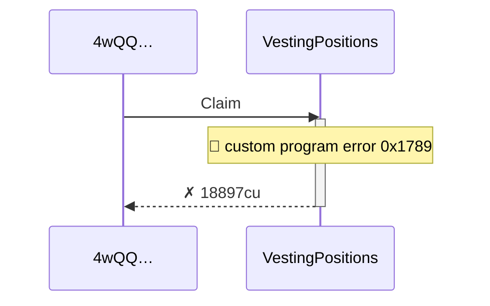
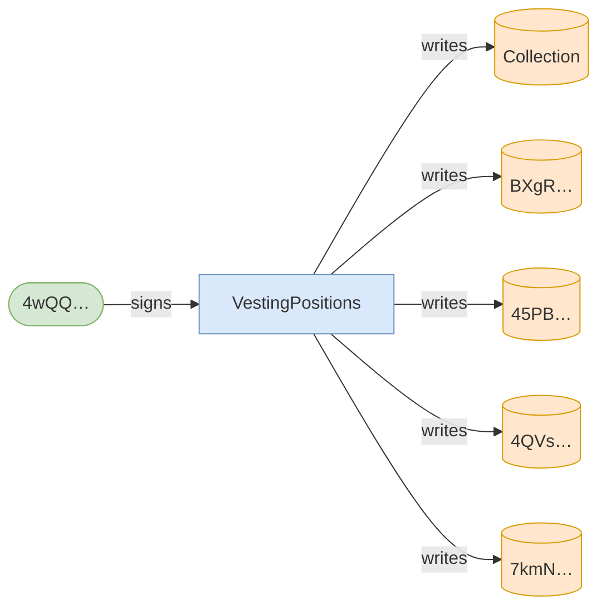
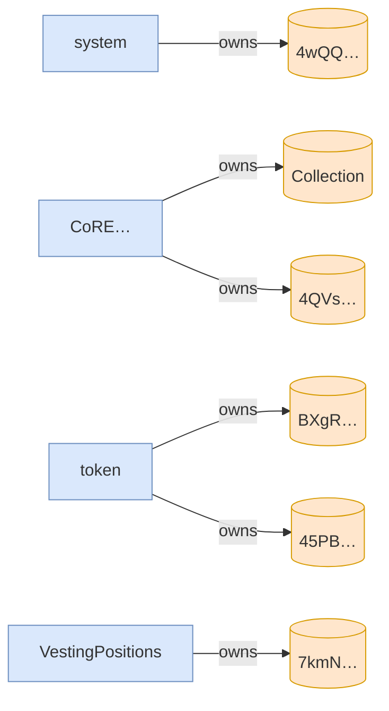

# clawback_after_grace_burns_asset_and_recovers_remainder

**Source:** [`tests/clawback.rs` L36](https://github.com/cds-turbin3/vesting-position/blob/c4f43acad0bb9f007622fb43bc19ddc3610c7688/babelfish-tests/tests/clawback.rs#L36)







<details>
<summary>tree</summary>

```

4wQQ… (18897cu)
└─ VestingPositions::Claim ✗ 18897cu
```

</details>
