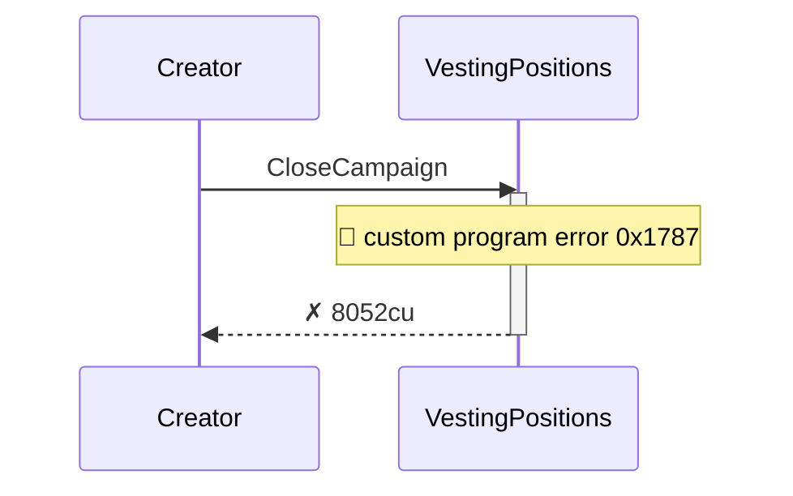
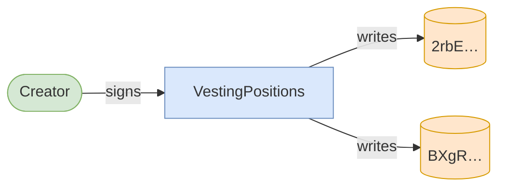
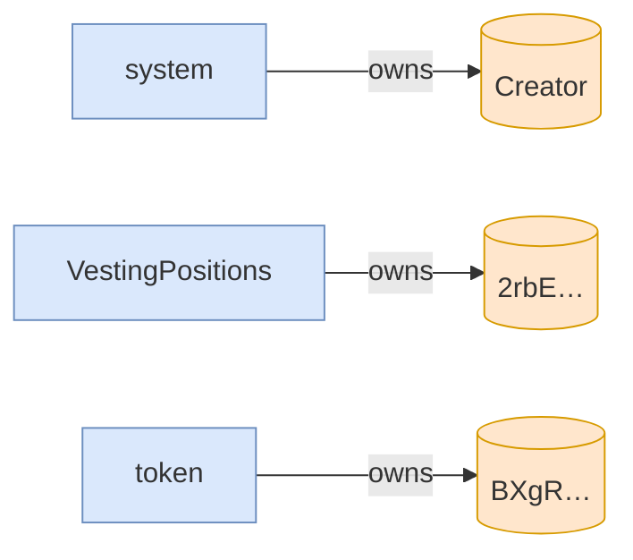

# clawback_unclaimed_before_grace_fails

**Source:** [`tests/clawback.rs` L196](https://github.com/cds-turbin3/vesting-position/blob/3f946c506628d348826d858340b4ac335a62e967/babelfish-tests/tests/clawback.rs#L196)







<details>
<summary>tree</summary>

```

Creator (8052cu)
└─ VestingPositions::CloseCampaign ✗ 8052cu
```

</details>
