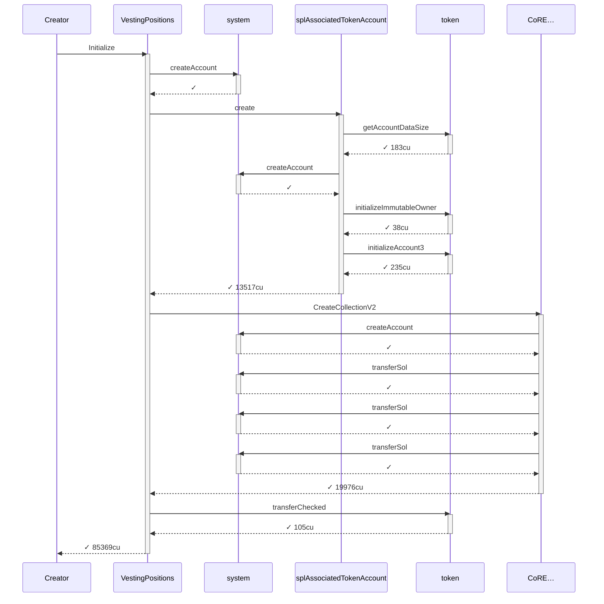
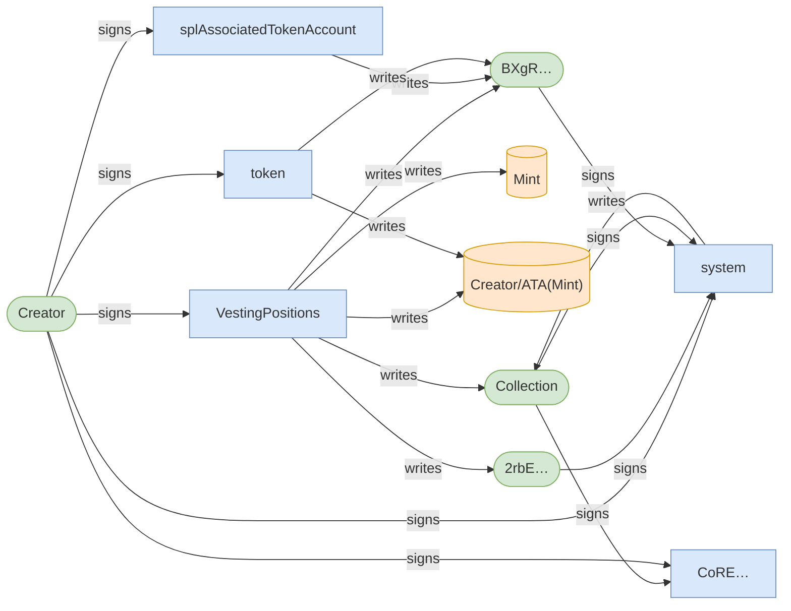
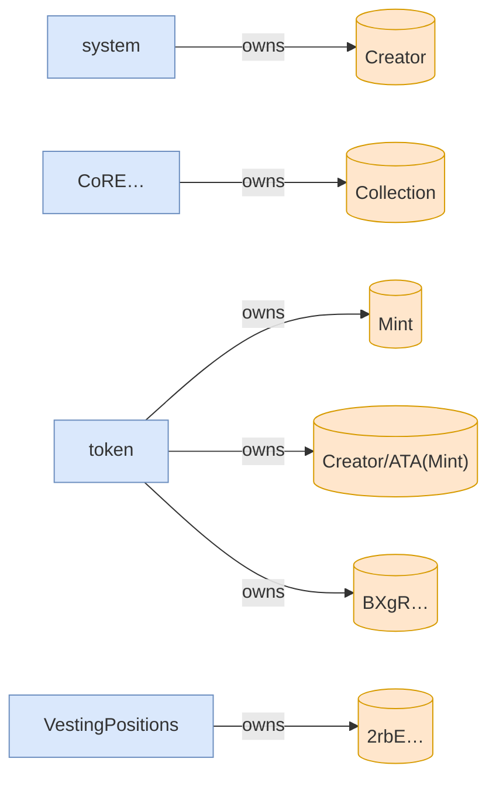
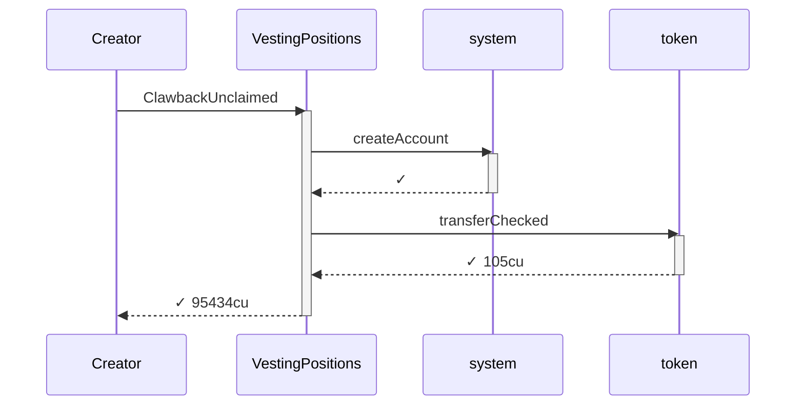
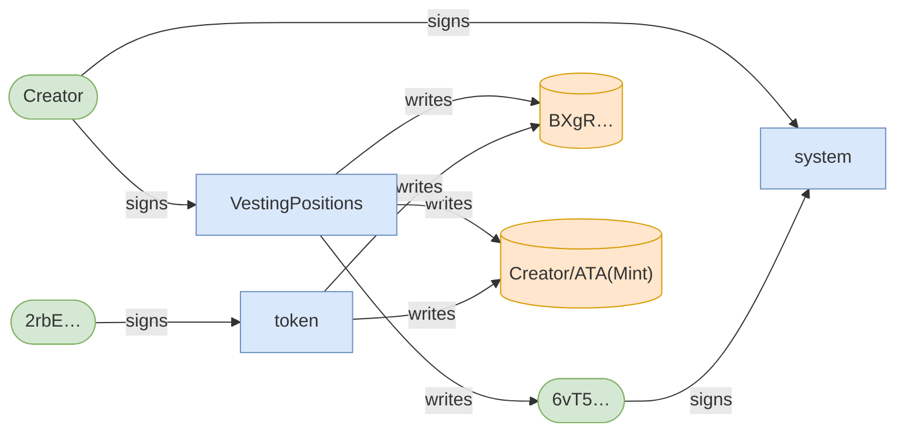
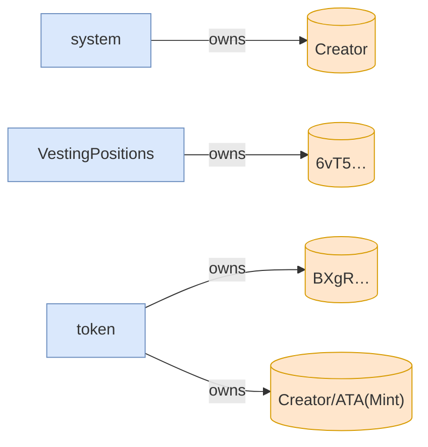
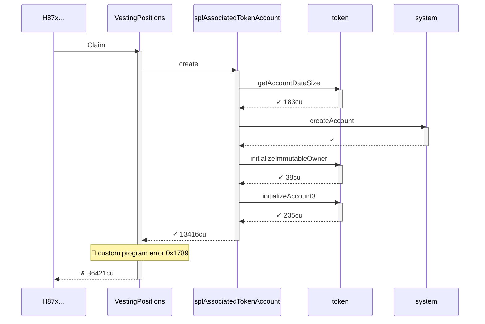
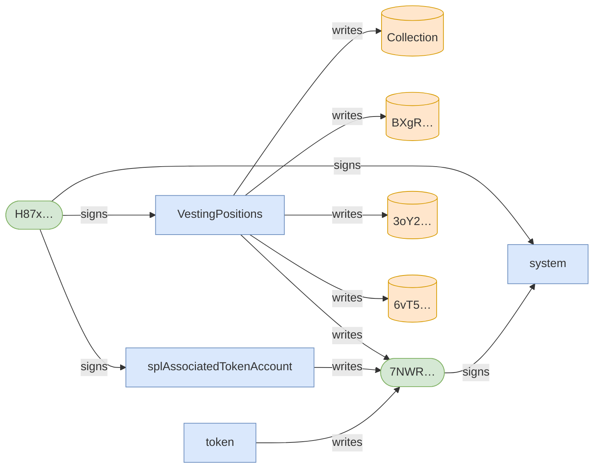
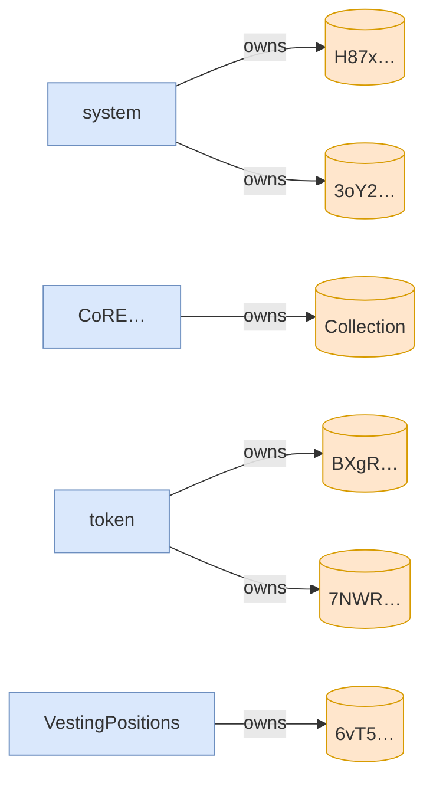

# clawback_unclaimed_recovers_allocation_and_blocks_claim

**Source:** [`tests/clawback.rs` L103](https://github.com/cds-turbin3/vesting-position/blob/d7284035bc429fc5d6367f7936c0e522cc6549d8/babelfish-tests/tests/clawback.rs#L103)

### Action: Initialize

| account | before | after |
| --- | --- | --- |
| Creator | 10000000000000 | 0 |
| Vault | 0 | 10000000000000 |

<details>
<summary>tree</summary>

```

Creator (85369cu)
└─ VestingPositions::Initialize ✓ 85369cu
   ├─ system::createAccount ✓
   ├─ splAssociatedTokenAccount::create ✓ 13517cu
   │  ├─ token::getAccountDataSize ✓ 183cu
   │  ├─ system::createAccount ✓
   │  ├─ token::initializeImmutableOwner ✓ 38cu
   │  └─ token::initializeAccount3 ✓ 235cu
   ├─ CoRE…::CreateCollectionV2 ✓ 19976cu
   │  ├─ system::createAccount ✓
   │  ├─ system::transferSol ✓
   │  ├─ system::transferSol ✓
   │  └─ system::transferSol ✓
   └─ token::transferChecked ✓ 105cu
```

</details>

### Sequence



### Authority



### Ownership



<details>
<summary>tree</summary>

```

Creator (85369cu)
└─ VestingPositions::Initialize ✓ 85369cu
   ├─ system::createAccount ✓
   ├─ splAssociatedTokenAccount::create ✓ 13517cu
   │  ├─ token::getAccountDataSize ✓ 183cu
   │  ├─ system::createAccount ✓
   │  ├─ token::initializeImmutableOwner ✓ 38cu
   │  └─ token::initializeAccount3 ✓ 235cu
   ├─ CoRE…::CreateCollectionV2 ✓ 19976cu
   │  ├─ system::createAccount ✓
   │  ├─ system::transferSol ✓
   │  ├─ system::transferSol ✓
   │  └─ system::transferSol ✓
   └─ token::transferChecked ✓ 105cu
```

</details>

### Action: ClawbackUnclaimed

| account | before | after |
| --- | --- | --- |
| Creator | 0 | 2000000000000 |
| Vault | 10000000000000 | 8000000000000 |

<details>
<summary>tree</summary>

```

Creator (95434cu)
└─ VestingPositions::ClawbackUnclaimed ✓ 95434cu
   ├─ system::createAccount ✓
   └─ token::transferChecked ✓ 105cu
```

</details>

### Sequence



### Authority



### Ownership



<details>
<summary>tree</summary>

```

Creator (95434cu)
└─ VestingPositions::ClawbackUnclaimed ✓ 95434cu
   ├─ system::createAccount ✓
   └─ token::transferChecked ✓ 105cu
```

</details>

### Action: Claim

| account | before | after |
| --- | --- | --- |
| Bob | — | 0 |

<details>
<summary>tree</summary>

```

H87x… (36421cu)
└─ VestingPositions::Claim ✗ 36421cu
   └─ splAssociatedTokenAccount::create ✓ 13416cu
      ├─ token::getAccountDataSize ✓ 183cu
      ├─ system::createAccount ✓
      ├─ token::initializeImmutableOwner ✓ 38cu
      └─ token::initializeAccount3 ✓ 235cu
```

</details>

### Sequence



### Authority



### Ownership



<details>
<summary>tree</summary>

```

H87x… (36421cu)
└─ VestingPositions::Claim ✗ 36421cu
   └─ splAssociatedTokenAccount::create ✓ 13416cu
      ├─ token::getAccountDataSize ✓ 183cu
      ├─ system::createAccount ✓
      ├─ token::initializeImmutableOwner ✓ 38cu
      └─ token::initializeAccount3 ✓ 235cu
```

</details>
