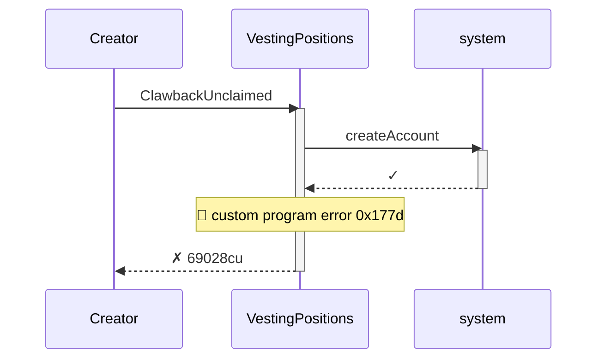
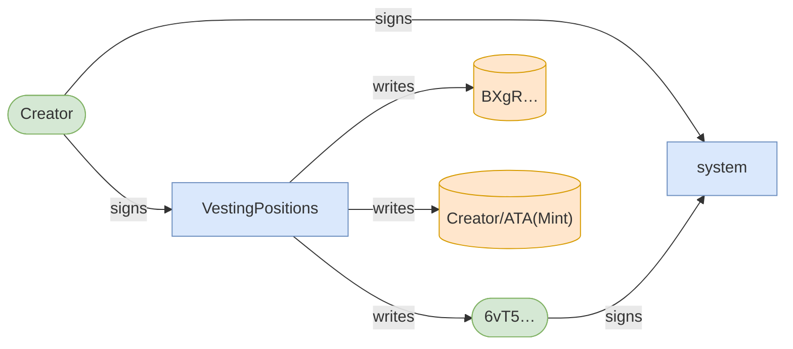
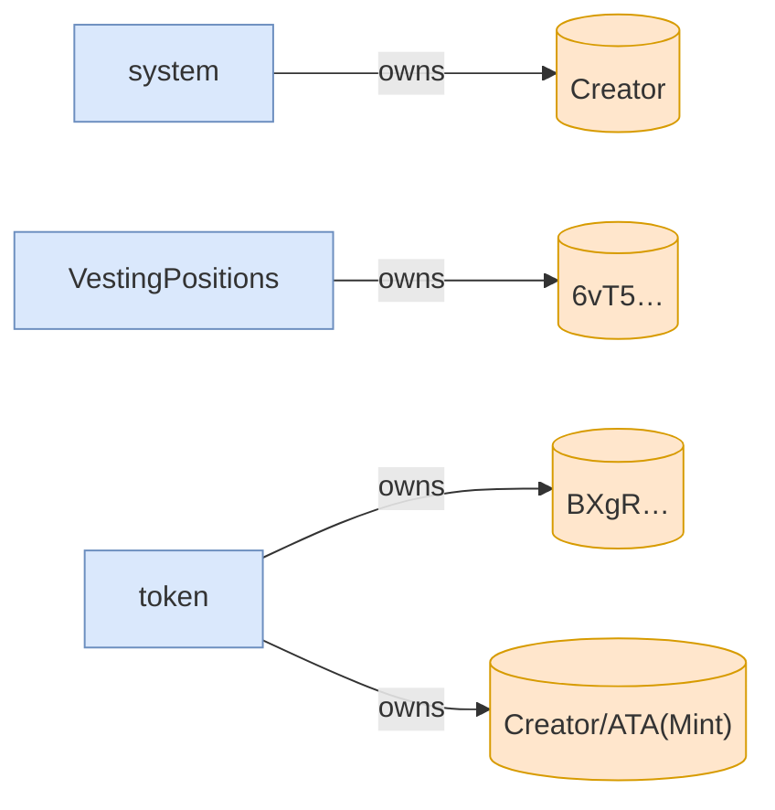

# clawback_unclaimed_recovers_allocation_and_blocks_claim

**Source:** [`tests/clawback.rs` L103](https://github.com/cds-turbin3/vesting-position/blob/3f946c506628d348826d858340b4ac335a62e967/babelfish-tests/tests/clawback.rs#L103)







<details>
<summary>tree</summary>

```

Creator (69028cu)
└─ VestingPositions::ClawbackUnclaimed ✗ 69028cu
   └─ system::createAccount ✓
```

</details>
