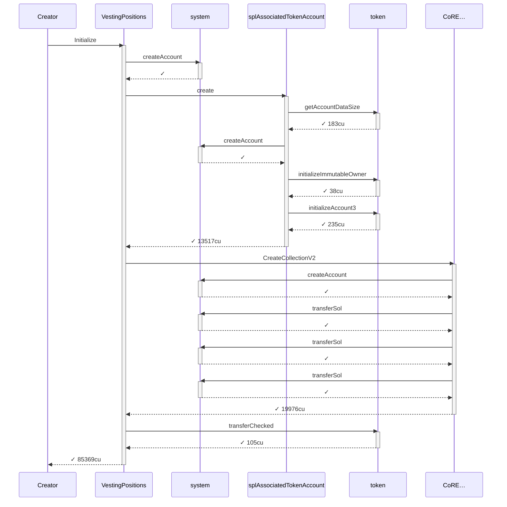
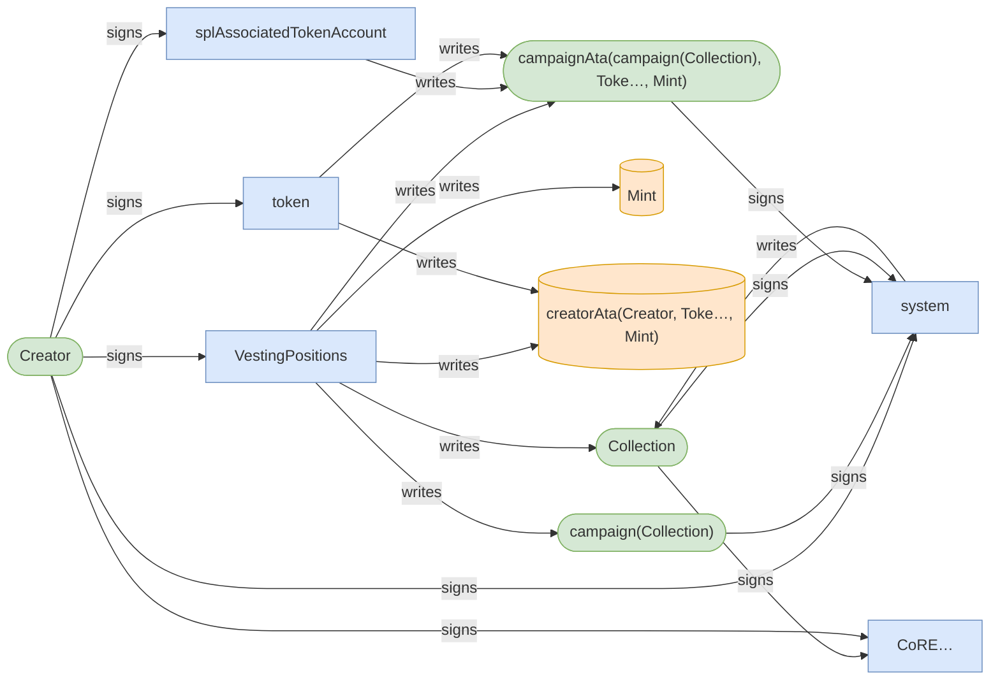
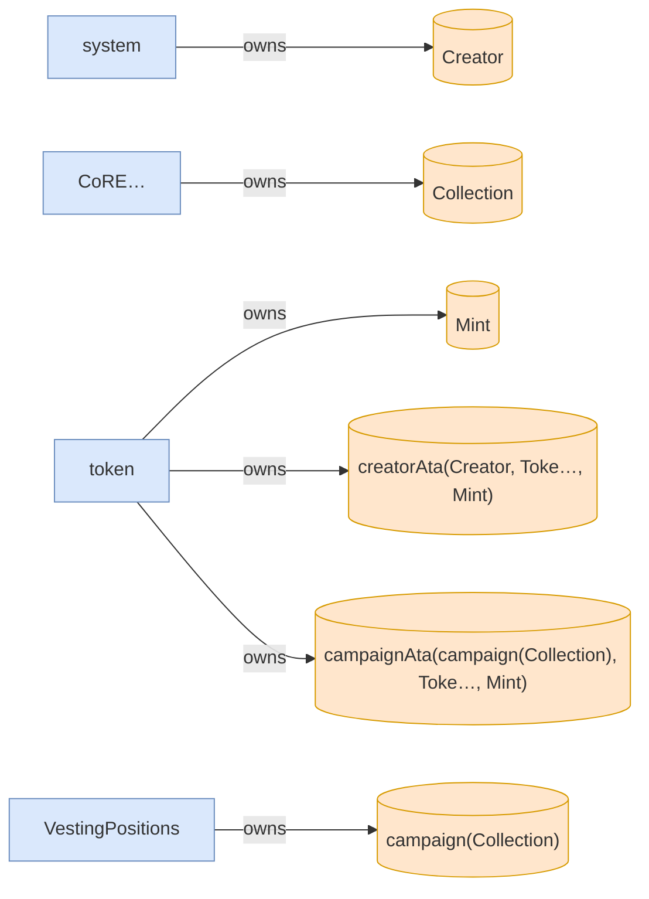
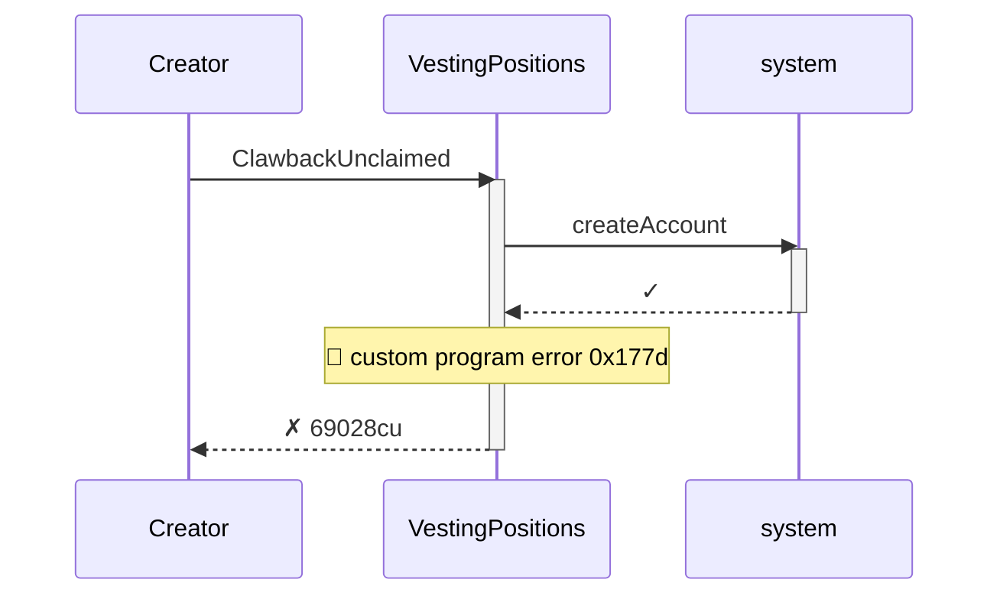
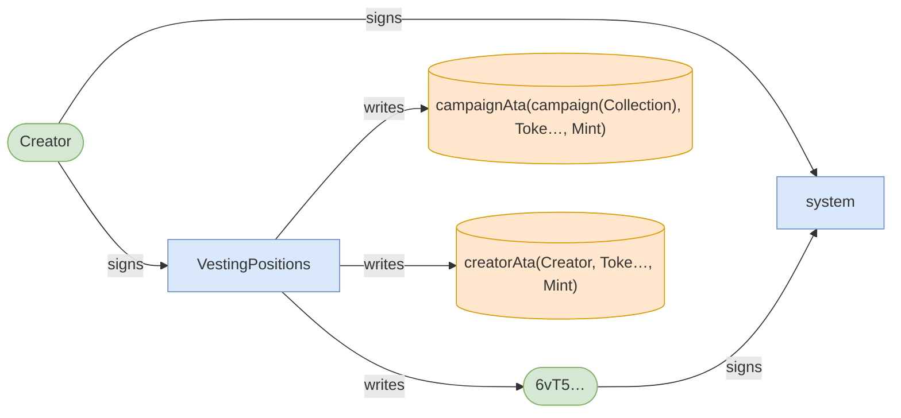
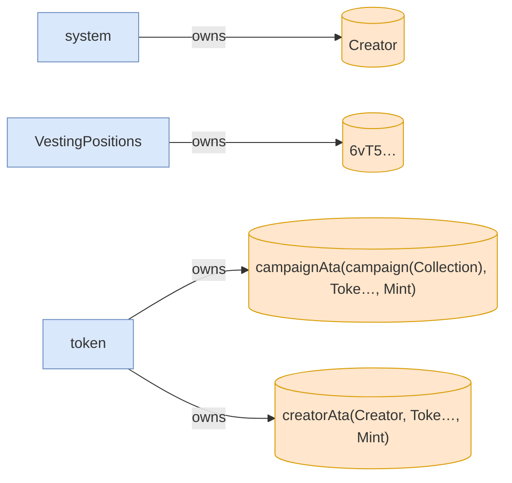

# clawback_unclaimed_rejects_invalid_proof

**Source:** [`tests/clawback.rs` L130](https://github.com/cds-turbin3/vesting-position/blob/7b03c373db96dabae9440a8c98ced4c97068b325/babelfish-tests/tests/clawback.rs#L130)

Over 38 days: 2 moments.

<details>
<summary>Cast</summary>

| name | address |
| --- | --- |
| Collection | DZ9SxyoirUd6SJtqTyLzGjyRuQjmxcs1ySPeuZqzmAA9 |
| Creator | 2ZBYuwtWiRzk7CwiCYTv5MQhQHDEaN4B8xhw4L7L3RY5 |
| Mint | J6WtRQHtRxemkWECcNq1wQAfgyJtsx7ZUT7Xpb53vo2N |
| VestingPositions | 7DkU9TQhcN87f2djZDd2MjjPZoXLfnZZj8HhybeZswX1 |
| campaign(Collection) | 2rbEagbB2s6tm4BWjcCmYnPxEi8cmF6CqCYPK6WhKZrC |
| campaignAta(campaign(Collection), Toke…, Mint) | BXgRMbNU5GHfjUAEUL4gc4dkK47Kbd26uZfbunemQyjQ |
| creatorAta(Creator, Toke…, Mint) | 7RKXPrw2SRFrpVR7h81dMPhHdaVV7y57tEYmDraizX43 |
| updateAuthority(Collection) | vGh5gMbD7AsVatTVNDo3pC7hveLFKdXbZ3eNt17chDs |

</details>

### Timeline

| time | Vault balance | Δ | Creator balance | Δ | comment |
| --- | --- | --- | --- | --- | --- |
| T0 | 10,000,000,000,000 | +10,000,000,000,000 | 0 |  | Initialize (day 0) |
| T1 | 10,000,000,000,000 |  | 0 |  | ClawbackUnclaimed (day 38) |

### T0: Initialize (day 0)

| observation | before | after |
| --- | --- | --- |
| Vault balance | — | 10,000,000,000,000 |
| Creator balance | — | 0 |

<details>
<summary>diagrams</summary>

### Sequence



### Authority



### Ownership



### Tree

```

Creator (85369cu)
└─ VestingPositions::Initialize ✓ 85369cu
   ├─ system::createAccount ✓
   ├─ splAssociatedTokenAccount::create ✓ 13517cu
   │  ├─ token::getAccountDataSize ✓ 183cu
   │  ├─ system::createAccount ✓
   │  ├─ token::initializeImmutableOwner ✓ 38cu
   │  └─ token::initializeAccount3 ✓ 235cu
   ├─ CoRE…::CreateCollectionV2 ✓ 19976cu
   │  ├─ system::createAccount ✓
   │  ├─ system::transferSol ✓
   │  ├─ system::transferSol ✓
   │  └─ system::transferSol ✓
   └─ token::transferChecked ✓ 105cu
```

</details>

*3283201 seconds pass.*

### T1: ClawbackUnclaimed (day 38)

- [x] refused: InvalidProofs — InstructionError(0, Custom(6013))

<details>
<summary>diagrams</summary>

### Sequence



### Authority



### Ownership



### Tree

```

Creator (69028cu)
└─ VestingPositions::ClawbackUnclaimed ✗ 69028cu
   └─ system::createAccount ✓
```

</details>
