# clawback_unclaimed_succeeds_despite_buyers_zeroed_receipt

**Source:** [`tests/clawback.rs` L165](https://github.com/cds-turbin3/vesting-position/blob/70f317227be8c993c3d0c9def30edc147bb5a28a/babelfish-tests/tests/clawback.rs#L165)

Over 38 days: 5 moments.

<details>
<summary>Cast</summary>

| name | address |
| --- | --- |
| Alice | 4wQQJM9LNuhinieNAqmHuPCm8LXDTVfhx84P32nAVE9P |
| Alice's position NFT | 6hhAjXPGt41Y6oPH6mATnAqMECdaHrKaAGbE4SFuARXK |
| Alice's receipt | 5yfASCcX25V4fzBgdfixtXgS2JrvpWdwX27JQXpVyuHB |
| Bob | H87xi4CUqrUPXzppV3jotTmre6DyR5pCaMk5bKQQBFTg |
| Bob's position NFT | 5fjLQR7cXnkBzwud4xAzHaxWKbTiQMJyrNe72RXUtieC |
| Bob's receipt | C49GR57waDzt1nFUvxKPDs1HVAKF694inGJeB2KGRPM9 |
| Collection | 9HbgSnRdBeYKzrjr9DYtcT6oKYrcTVB8NWUoU7JVKuWW |
| Creator | 2ZBYuwtWiRzk7CwiCYTv5MQhQHDEaN4B8xhw4L7L3RY5 |
| Mint | 4Kr8ypueV83MddH54fZXLkKFKRd7eWFcejQ8HtynfJRk |
| Vesting campaign | G4GWLHr4aHZoxWra82eRc111wRJ9aDiXsSuk3bWoys2G |
| VestingPositions | 7DkU9TQhcN87f2djZDd2MjjPZoXLfnZZj8HhybeZswX1 |
| campaignAta(Vesting campaign, token, Mint) | 3kKwPKo9z6XQWrZxuo75c36vm9ChMgGDAMBV7cFEhjSn |
| creatorAta(Creator, token, Mint) | AvzkuSUEzjhXyboXRyfQcsjzKLBqeP9FeoExRBWkXjdJ |
| updateAuthority(Collection) | CYBwE6G2RjrsFYbwy5pUVVDVL5UR5g5VaRcWBPbzby1p |
| userAta(Bob, token, Mint) | DiZfCmUXMWffwHP4eus9hwgnvTVbiZL7ZGGTBjJ9vc68 |

</details>

### Timeline

| time | Vault balance | Δ | Creator balance | Δ | Alice balance | Δ | Bob balance | Δ | comment |
| --- | --- | --- | --- | --- | --- | --- | --- | --- | --- |
| T0 | 10,000,000,000,000 | +10,000,000,000,000 | 0 |  | — |  | — |  | Initialize (day 0) |
| T1 | 10,000,000,000,000 |  | 0 |  | — |  | — |  | FirstClaim (day 1) |
| T2 | 10,000,000,000,000 |  | 0 |  | 0 |  | — |  | TransferPosition (day 1) |
| T3 | 9,450,000,000,000 | -550,000,000,000 | 0 |  | 0 |  | — |  | Claim (day 16) |
| T4 | 7,450,000,000,000 | -2,000,000,000,000 | 2,000,000,000,000 | +2,000,000,000,000 | 0 |  | 550,000,000,000 | +550,000,000,000 | ClawbackUnclaimed (day 38) |

### T0: Initialize (day 0)

| observation | before | after |
| --- | --- | --- |
| Vault balance | — | 10,000,000,000,000 |
| Creator balance | — | 0 |

<details>
<summary>diagrams</summary>

### Sequence

```mermaid
sequenceDiagram
    participant p0 as Creator
    participant p1 as VestingPositions
    participant p2 as system
    participant p3 as splAssociatedTokenAccount
    participant p4 as token
    participant p5 as mplCoreProgram
    p0->>p1: Initialize
    activate p1
    p1->>p2: createAccount
    activate p2
    p2-->>p1: ✓
    deactivate p2
    p1->>p3: create
    activate p3
    p3->>p4: getAccountDataSize
    activate p4
    p4-->>p3: ✓ 183cu
    deactivate p4
    p3->>p2: createAccount
    activate p2
    p2-->>p3: ✓
    deactivate p2
    p3->>p4: initializeImmutableOwner
    activate p4
    p4-->>p3: ✓ 38cu
    deactivate p4
    p3->>p4: initializeAccount3
    activate p4
    p4-->>p3: ✓ 235cu
    deactivate p4
    p3-->>p1: ✓ 18017cu
    deactivate p3
    p1->>p5: CreateCollectionV2
    activate p5
    p5->>p2: createAccount
    activate p2
    p2-->>p5: ✓
    deactivate p2
    p5->>p2: transferSol
    activate p2
    p2-->>p5: ✓
    deactivate p2
    p5->>p2: transferSol
    activate p2
    p2-->>p5: ✓
    deactivate p2
    p5->>p2: transferSol
    activate p2
    p2-->>p5: ✓
    deactivate p2
    p5-->>p1: ✓ 19976cu
    deactivate p5
    p1->>p4: transferChecked
    activate p4
    p4-->>p1: ✓ 105cu
    deactivate p4
    p1-->>p0: ✓ 89713cu
    deactivate p1
```

### Authority

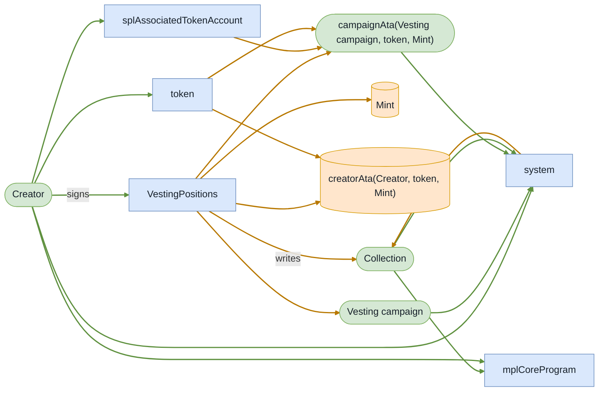

### Ownership

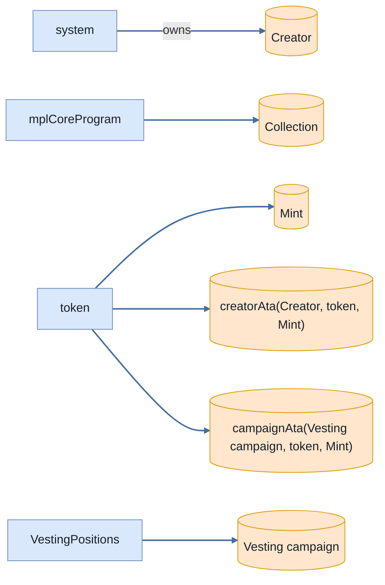

### Tree

```

Creator (89713cu)
└─ VestingPositions::Initialize ✓ 89713cu
   ├─ system::createAccount ✓
   ├─ splAssociatedTokenAccount::create ✓ 18017cu
   │  ├─ token::getAccountDataSize ✓ 183cu
   │  ├─ system::createAccount ✓
   │  ├─ token::initializeImmutableOwner ✓ 38cu
   │  └─ token::initializeAccount3 ✓ 235cu
   ├─ mplCoreProgram::CreateCollectionV2 ✓ 19976cu
   │  ├─ system::createAccount ✓
   │  ├─ system::transferSol ✓
   │  ├─ system::transferSol ✓
   │  └─ system::transferSol ✓
   └─ token::transferChecked ✓ 105cu
```

</details>

*1 day pass.*

### T1: FirstClaim (day 1)

<details>
<summary>diagrams</summary>

### Sequence

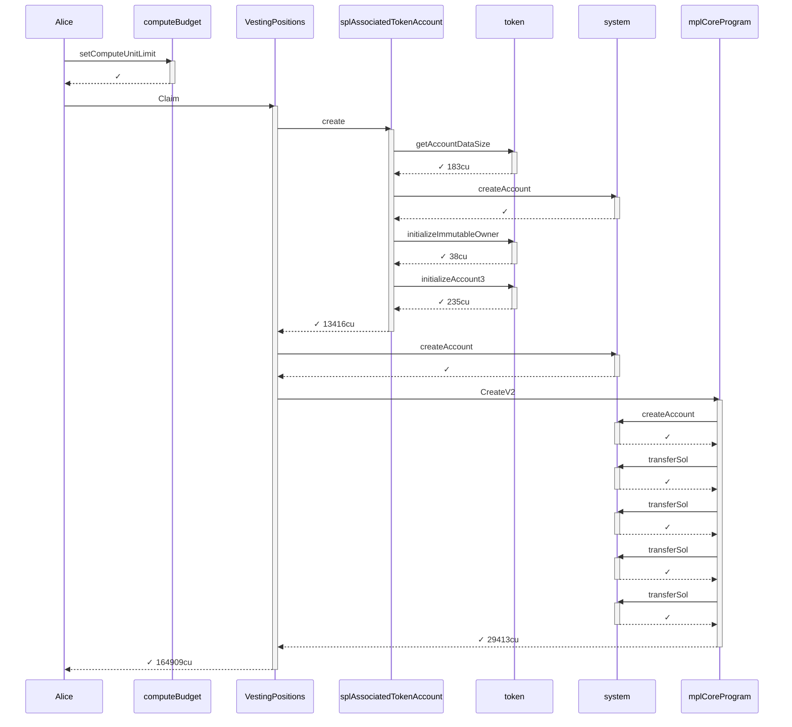

### Authority

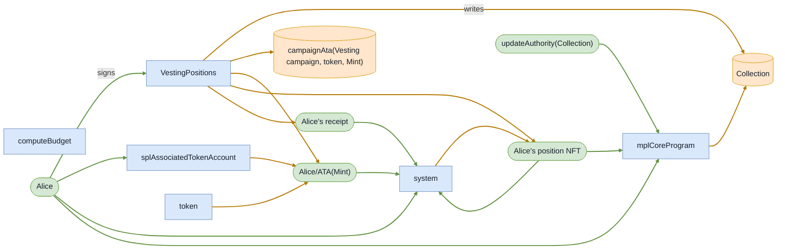

### Ownership

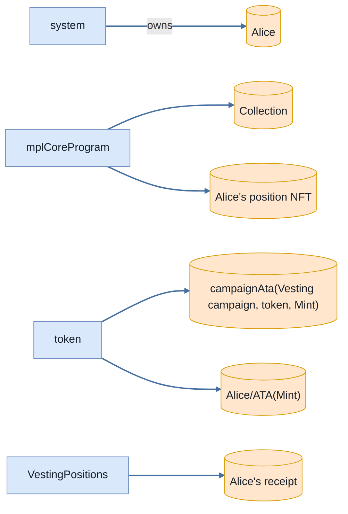

### Tree

```

Alice (165059cu)
├─ computeBudget::setComputeUnitLimit ✓
└─ VestingPositions::Claim ✓ 164909cu
   ├─ splAssociatedTokenAccount::create ✓ 13416cu
   │  ├─ token::getAccountDataSize ✓ 183cu
   │  ├─ system::createAccount ✓
   │  ├─ token::initializeImmutableOwner ✓ 38cu
   │  └─ token::initializeAccount3 ✓ 235cu
   ├─ system::createAccount ✓
   └─ mplCoreProgram::CreateV2 ✓ 29413cu
      ├─ system::createAccount ✓
      ├─ system::transferSol ✓
      ├─ system::transferSol ✓
      ├─ system::transferSol ✓
      └─ system::transferSol ✓
```

</details>

### T2: TransferPosition (day 1)

| observation | before | after |
| --- | --- | --- |
| Alice balance | — | 0 |

<details>
<summary>diagrams</summary>

### Sequence

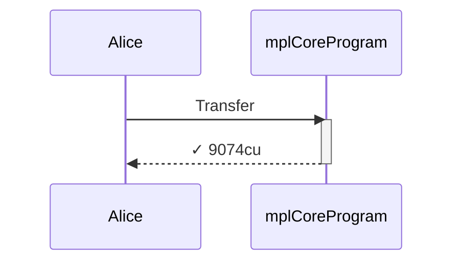

### Authority

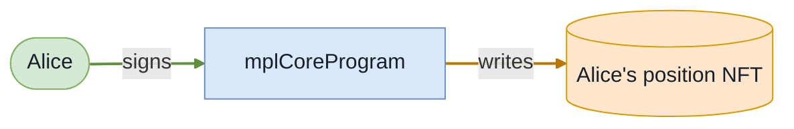

### Ownership

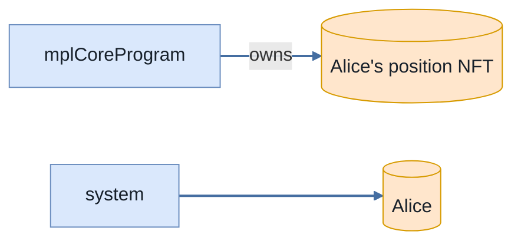

### Tree

```

Alice (9074cu)
└─ mplCoreProgram::Transfer ✓ 9074cu
```

</details>

*1339200 seconds pass.*

### T3: Claim (day 16)

| observation | before | after |
| --- | --- | --- |
| Vault balance | 10,000,000,000,000 | 9,450,000,000,000 |

<details>
<summary>diagrams</summary>

### Sequence

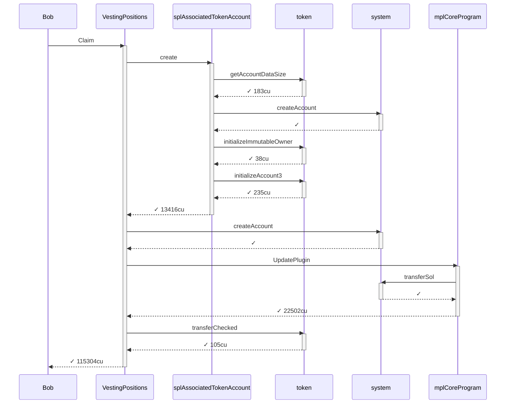

### Authority

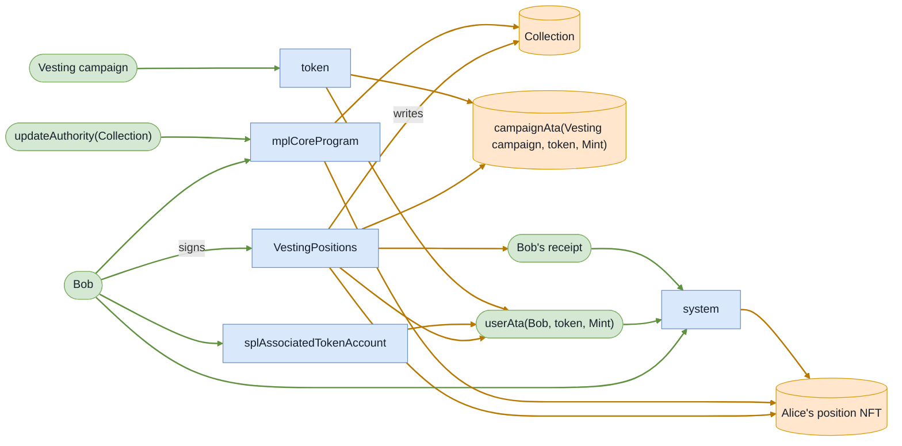

### Ownership

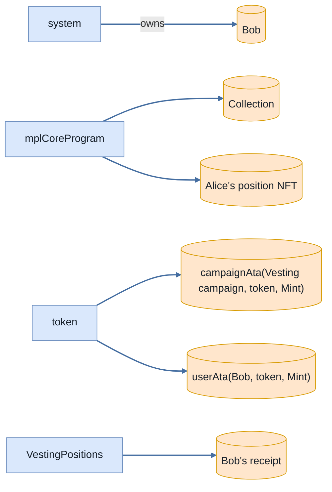

### Tree

```

Bob (115304cu)
└─ VestingPositions::Claim ✓ 115304cu
   ├─ splAssociatedTokenAccount::create ✓ 13416cu
   │  ├─ token::getAccountDataSize ✓ 183cu
   │  ├─ system::createAccount ✓
   │  ├─ token::initializeImmutableOwner ✓ 38cu
   │  └─ token::initializeAccount3 ✓ 235cu
   ├─ system::createAccount ✓
   ├─ mplCoreProgram::UpdatePlugin ✓ 22502cu
   │  └─ system::transferSol ✓
   └─ token::transferChecked ✓ 105cu
```

</details>

*1857601 seconds pass.*

### T4: ClawbackUnclaimed (day 38)

| observation | before | after |
| --- | --- | --- |
| Vault balance | 9,450,000,000,000 | 7,450,000,000,000 |
| Creator balance | 0 | 2,000,000,000,000 |
| Bob balance | — | 550,000,000,000 |

<details>
<summary>diagrams</summary>

### Sequence


### Authority

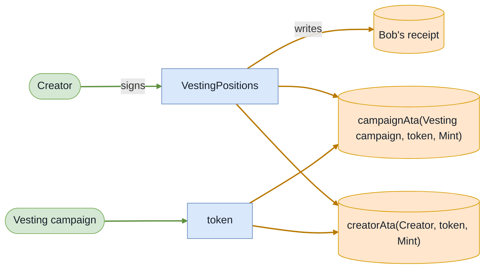

### Ownership

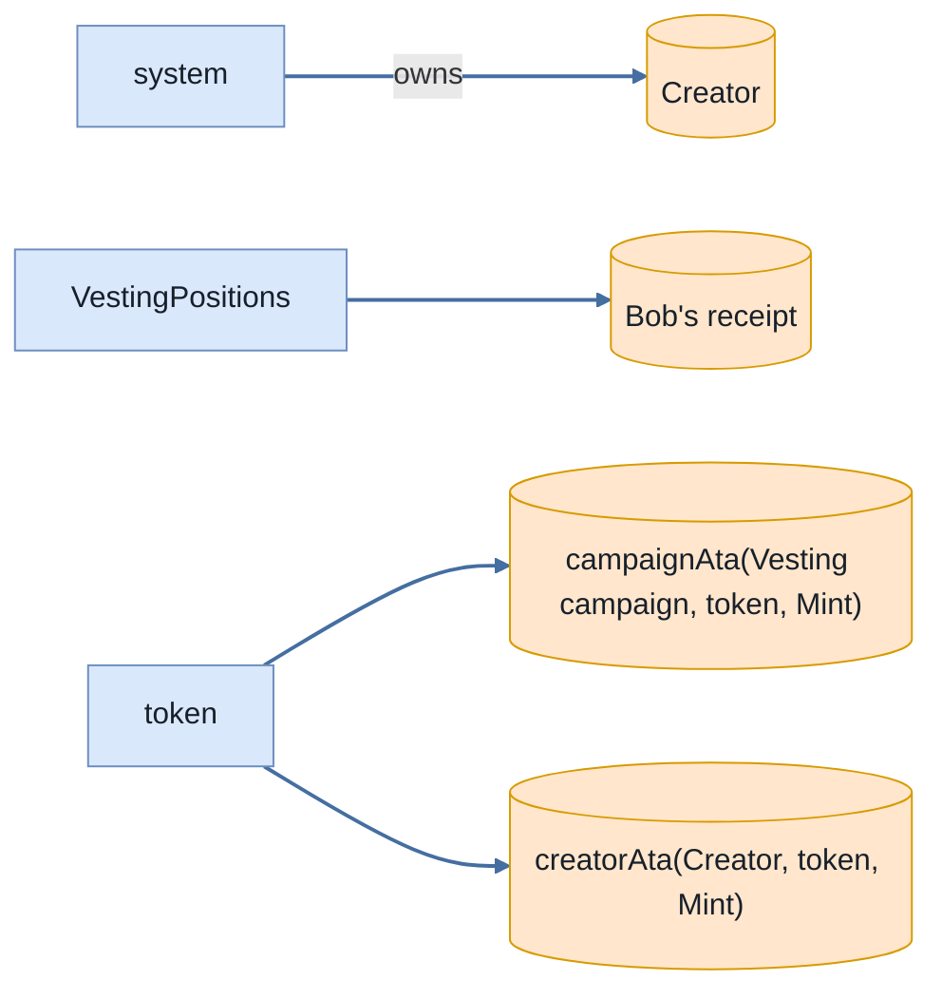

### Tree

```

Creator (116625cu)
└─ VestingPositions::ClawbackUnclaimed ✓ 116625cu
   └─ token::transferChecked ✓ 105cu
```

</details>
