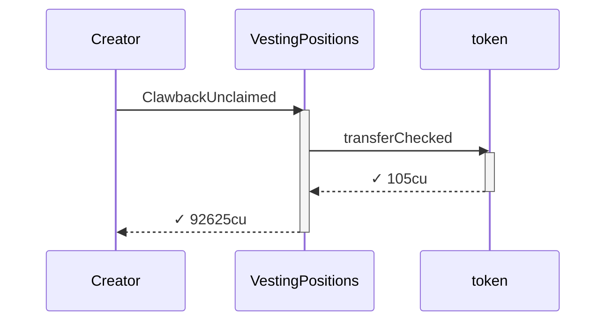
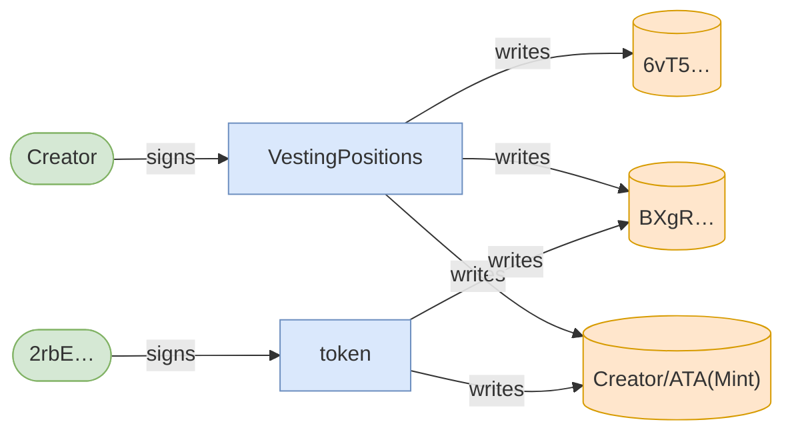
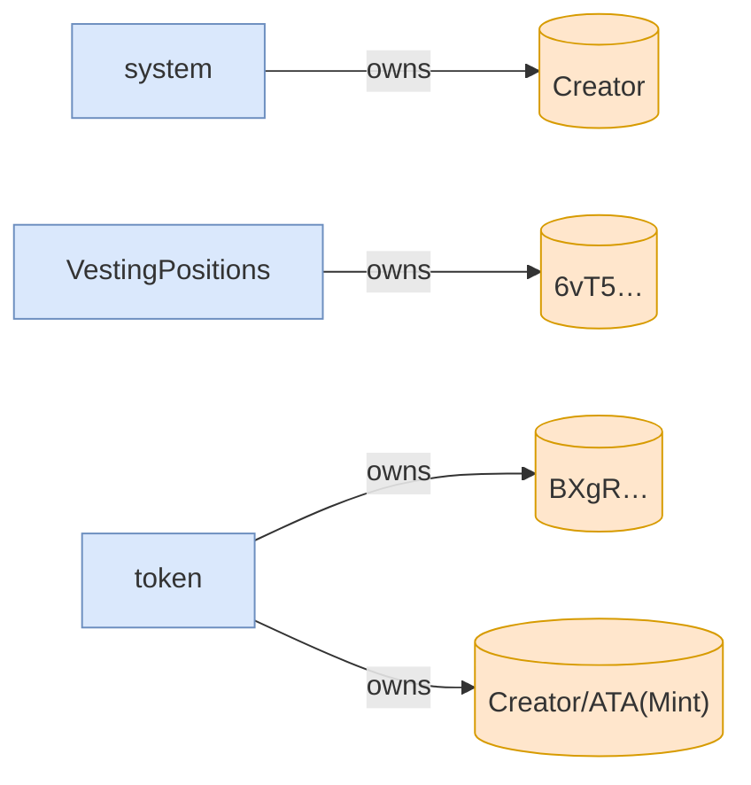

# clawback_unclaimed_succeeds_despite_buyers_zeroed_receipt

**Source:** [`tests/clawback.rs` L163](https://github.com/cds-turbin3/vesting-position/blob/c4f43acad0bb9f007622fb43bc19ddc3610c7688/babelfish-tests/tests/clawback.rs#L163)







<details>
<summary>tree</summary>

```

Creator (92625cu)
└─ VestingPositions::ClawbackUnclaimed ✓ 92625cu
   └─ token::transferChecked ✓ 105cu
```

</details>
