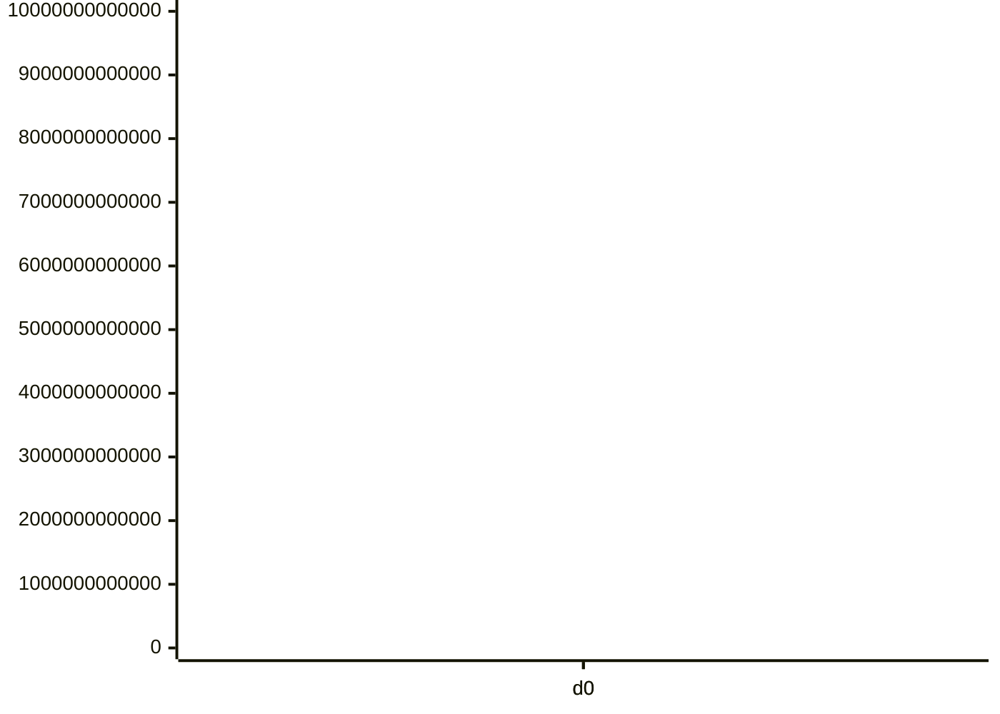
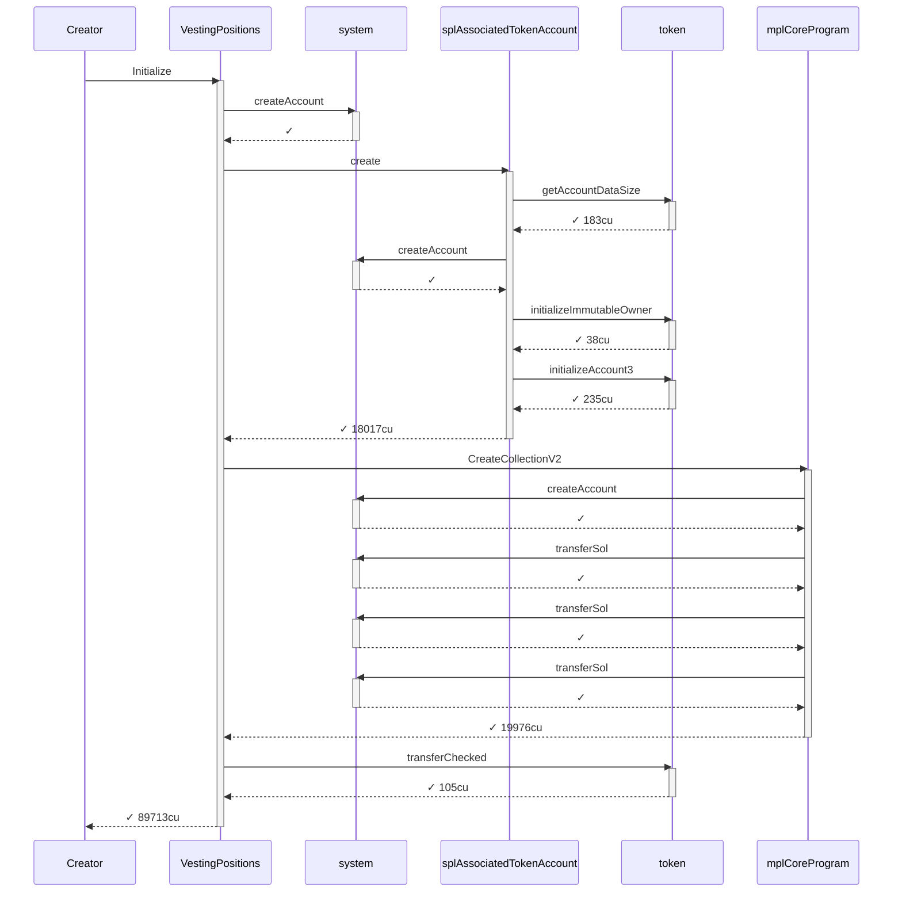
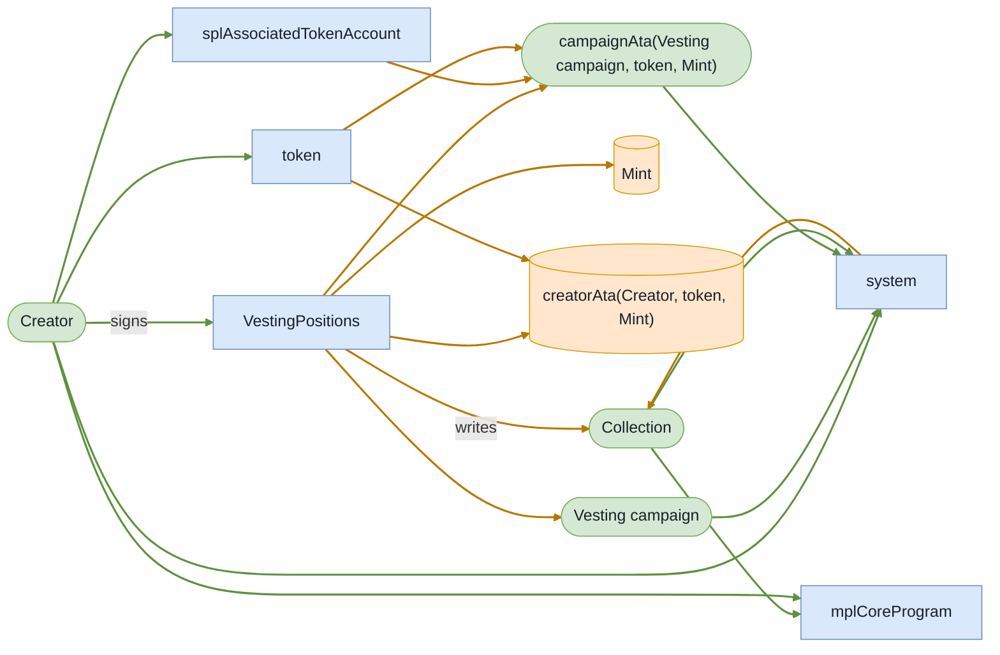
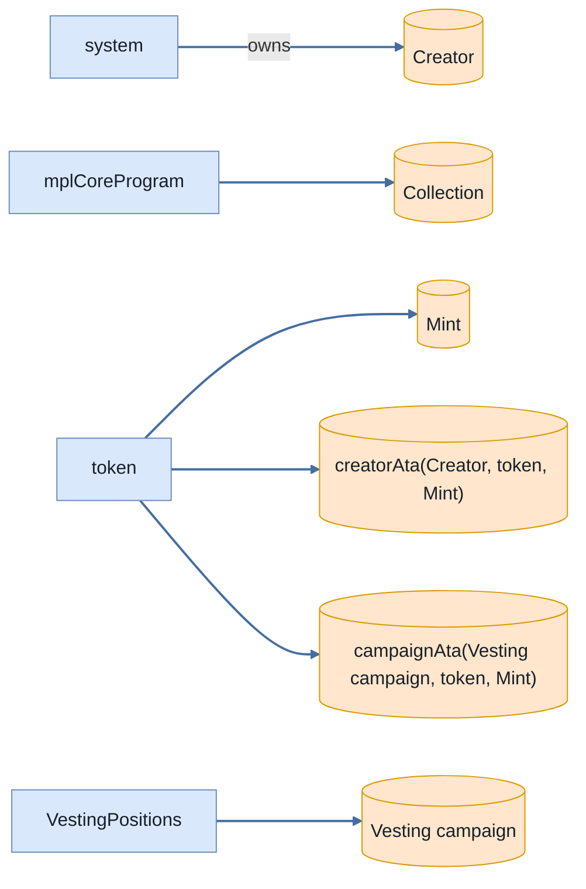
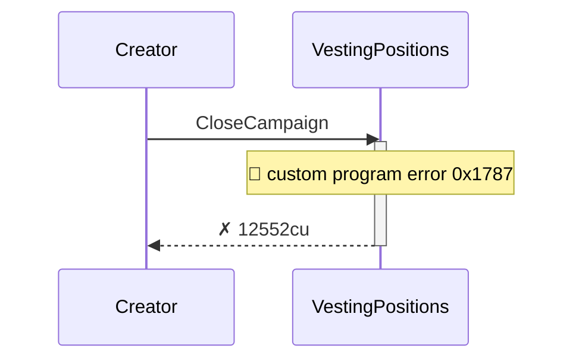
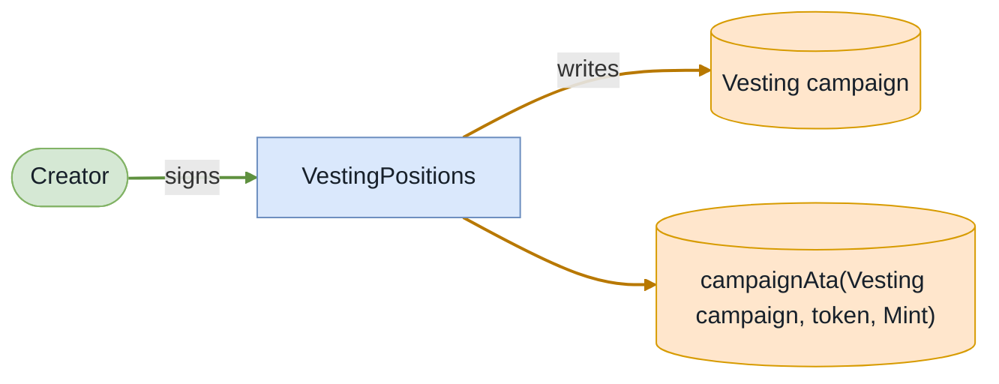
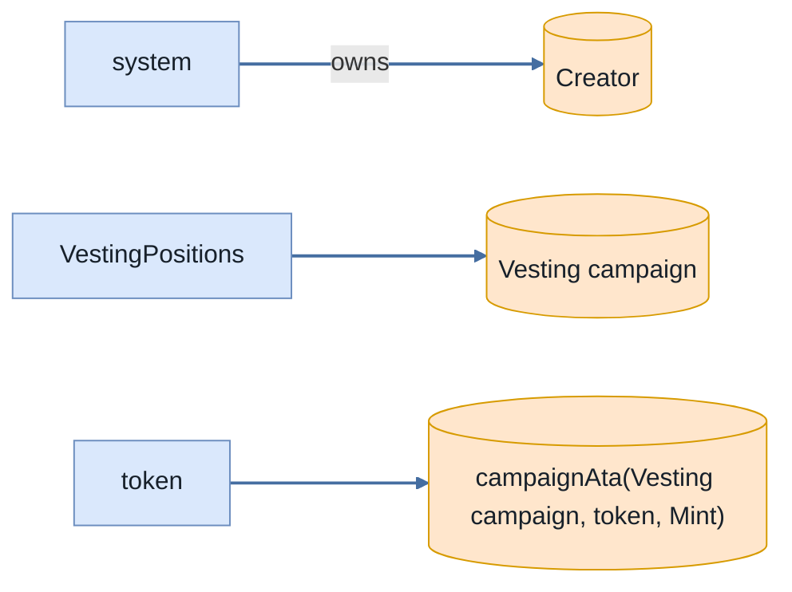

# close_campaign_fails_when_vault_not_empty

**Source:** [`tests/clawback.rs` L220](https://github.com/cds-turbin3/vesting-position/blob/7172eb8fb4ae69b1e7af671b76095a6112c41e68/babelfish-tests/tests/clawback.rs#L220)

Over 0 days: 2 moments.

<details>
<summary>Cast</summary>

| name | address |
| --- | --- |
| Collection | 9HbgSnRdBeYKzrjr9DYtcT6oKYrcTVB8NWUoU7JVKuWW |
| Creator | 2ZBYuwtWiRzk7CwiCYTv5MQhQHDEaN4B8xhw4L7L3RY5 |
| Mint | 4Kr8ypueV83MddH54fZXLkKFKRd7eWFcejQ8HtynfJRk |
| Vesting campaign | G4GWLHr4aHZoxWra82eRc111wRJ9aDiXsSuk3bWoys2G |
| VestingPositions | 7DkU9TQhcN87f2djZDd2MjjPZoXLfnZZj8HhybeZswX1 |
| campaignAta(Vesting campaign, token, Mint) | 3kKwPKo9z6XQWrZxuo75c36vm9ChMgGDAMBV7cFEhjSn |
| creatorAta(Creator, token, Mint) | AvzkuSUEzjhXyboXRyfQcsjzKLBqeP9FeoExRBWkXjdJ |
| updateAuthority(Collection) | CYBwE6G2RjrsFYbwy5pUVVDVL5UR5g5VaRcWBPbzby1p |

</details>

### Timeline

| time | Vault balance | Δ | Creator balance | Δ | comment |
| --- | --- | --- | --- | --- | --- |
| T0 | 10,000,000,000,000 | +10,000,000,000,000 | 0 |  | Initialize (day 0) |
| T1 | 10,000,000,000,000 |  | 0 |  | CloseCampaign (day 0) |

<details>
<summary>Chart</summary>



*series: Vault balance (blue), Creator balance (orange)*

</details>

### T0: Initialize (day 0)

| observation | before | after |
| --- | --- | --- |
| Vault balance | — | 10,000,000,000,000 |
| Creator balance | — | 0 |

<details>
<summary>diagrams</summary>

### Sequence



### Authority



### Ownership



### Tree

```

Creator (89713cu)
└─ VestingPositions::Initialize ✓ 89713cu
   ├─ system::createAccount ✓
   ├─ splAssociatedTokenAccount::create ✓ 18017cu
   │  ├─ token::getAccountDataSize ✓ 183cu
   │  ├─ system::createAccount ✓
   │  ├─ token::initializeImmutableOwner ✓ 38cu
   │  └─ token::initializeAccount3 ✓ 235cu
   ├─ mplCoreProgram::CreateCollectionV2 ✓ 19976cu
   │  ├─ system::createAccount ✓
   │  ├─ system::transferSol ✓
   │  ├─ system::transferSol ✓
   │  └─ system::transferSol ✓
   └─ token::transferChecked ✓ 105cu
```

</details>

### T1: CloseCampaign (day 0)

- [x] refused: VaultNotEmpty — InstructionError(0, Custom(6023))

<details>
<summary>diagrams</summary>

### Sequence



### Authority



### Ownership



### Tree

```

Creator (12552cu)
└─ VestingPositions::CloseCampaign ✗ 12552cu
```

</details>
