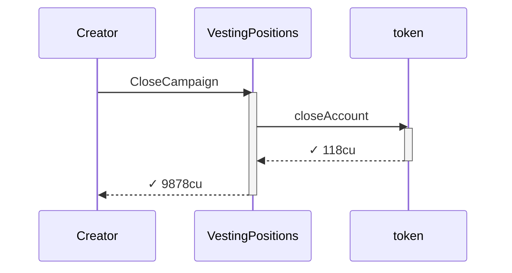
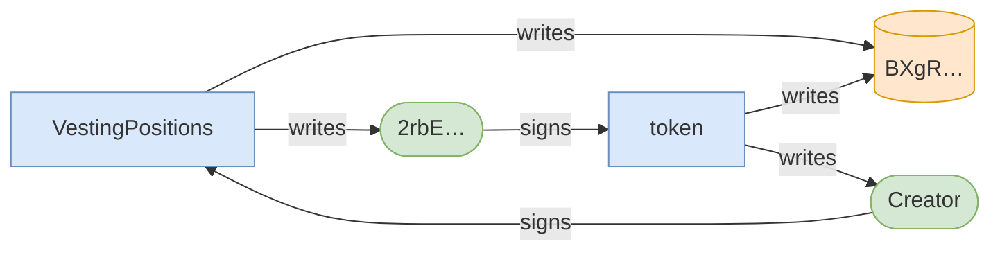
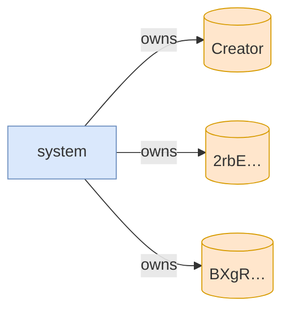

# close_campaign_succeeds_when_vault_empty

**Source:** [`tests/clawback.rs` L222](https://github.com/cds-turbin3/vesting-position/blob/3f946c506628d348826d858340b4ac335a62e967/babelfish-tests/tests/clawback.rs#L222)







<details>
<summary>tree</summary>

```

Creator (9878cu)
└─ VestingPositions::CloseCampaign ✓ 9878cu
   └─ token::closeAccount ✓ 118cu
```

</details>
