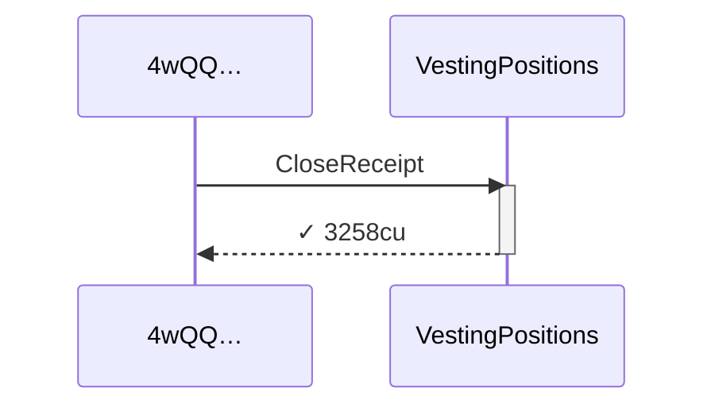
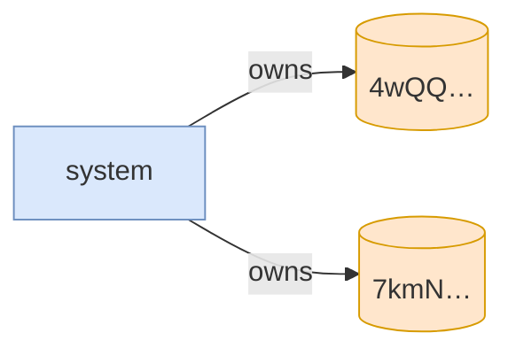

# close_receipt_fails_while_campaign_active

**Source:** [`tests/clawback.rs` L347](https://github.com/cds-turbin3/vesting-position/blob/3f946c506628d348826d858340b4ac335a62e967/babelfish-tests/tests/clawback.rs#L347)






<details>
<summary>tree</summary>

```

4wQQ… (3258cu)
└─ VestingPositions::CloseReceipt ✓ 3258cu
```

</details>
