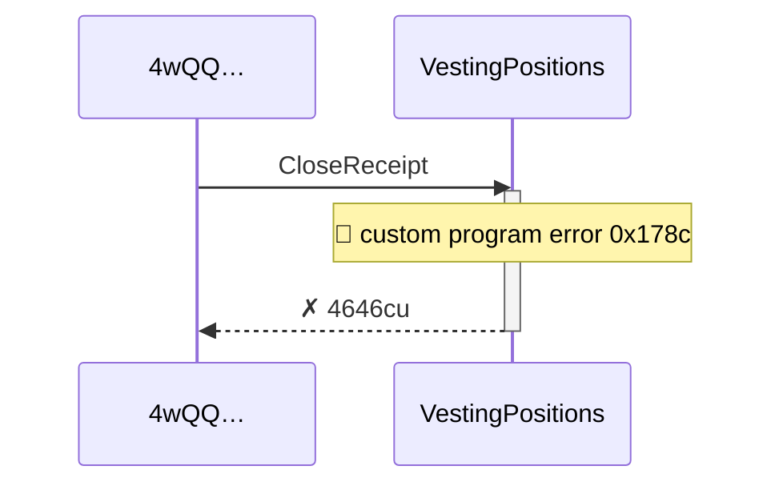
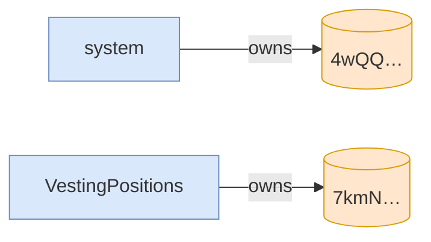

# close_receipt_fails_while_campaign_active

**Source:** [`tests/clawback.rs` L347](https://github.com/cds-turbin3/vesting-position/blob/c4f43acad0bb9f007622fb43bc19ddc3610c7688/babelfish-tests/tests/clawback.rs#L347)






<details>
<summary>tree</summary>

```

4wQQ… (4646cu)
└─ VestingPositions::CloseReceipt ✗ 4646cu
```

</details>
