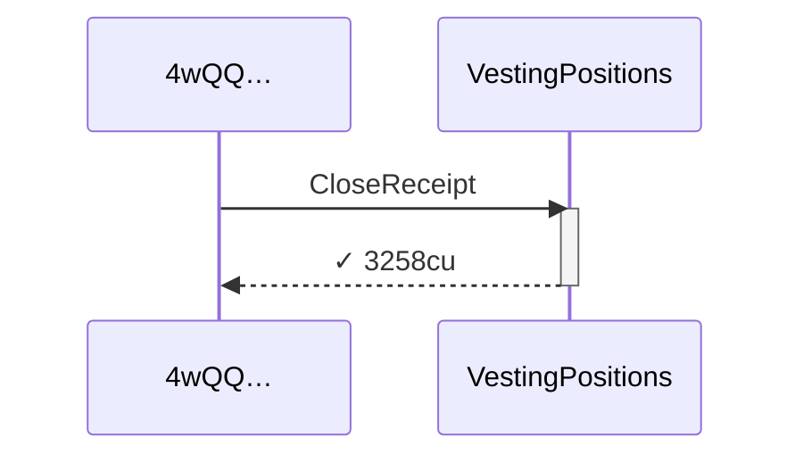
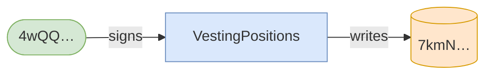
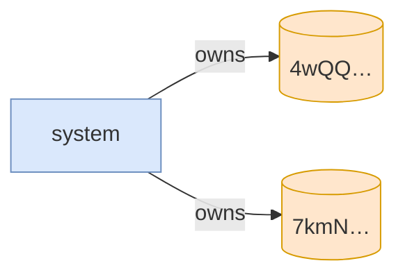

# close_receipt_returns_rent_after_close_campaign

**Source:** [`tests/clawback.rs` L358](https://github.com/cds-turbin3/vesting-position/blob/b1f1485d1913faf6443e233580c9b626cfd06178/babelfish-tests/tests/clawback.rs#L358)

### Action: Initialize

| account | before | after |
| --- | --- | --- |
| Creator | 1000000000000 | 0 |
| Vault | 0 | 1000000000000 |

<details>
<summary>tree</summary>

```

Creator (85369cu)
└─ VestingPositions::Initialize ✓ 85369cu
   ├─ system::createAccount ✓
   ├─ splAssociatedTokenAccount::create ✓ 13517cu
   │  ├─ token::getAccountDataSize ✓ 183cu
   │  ├─ system::createAccount ✓
   │  ├─ token::initializeImmutableOwner ✓ 38cu
   │  └─ token::initializeAccount3 ✓ 235cu
   ├─ CoRE…::CreateCollectionV2 ✓ 19976cu
   │  ├─ system::createAccount ✓
   │  ├─ system::transferSol ✓
   │  ├─ system::transferSol ✓
   │  └─ system::transferSol ✓
   └─ token::transferChecked ✓ 105cu
```

</details>

### Action: Claim

| account | before | after |
| --- | --- | --- |
| Alice | — | 0 |

<details>
<summary>tree</summary>

```

4wQQ… (160559cu)
├─ Comp…::? ✓
└─ VestingPositions::Claim ✓ 160409cu
   ├─ splAssociatedTokenAccount::create ✓ 13416cu
   │  ├─ token::getAccountDataSize ✓ 183cu
   │  ├─ system::createAccount ✓
   │  ├─ token::initializeImmutableOwner ✓ 38cu
   │  └─ token::initializeAccount3 ✓ 235cu
   ├─ system::createAccount ✓
   └─ CoRE…::CreateV2 ✓ 29413cu
      ├─ system::createAccount ✓
      ├─ system::transferSol ✓
      ├─ system::transferSol ✓
      ├─ system::transferSol ✓
      └─ system::transferSol ✓
```

</details>

### Action: Claim

| account | before | after |
| --- | --- | --- |
| Vault | 1000000000000 | 0 |
| Alice | 0 | 1000000000000 |

<details>
<summary>tree</summary>

```

4wQQ… (91477cu)
└─ VestingPositions::Claim ✓ 91477cu
   ├─ CoRE…::UpdatePlugin ✓ 22492cu
   │  └─ system::transferSol ✓
   ├─ token::transferChecked ✓ 105cu
   └─ CoRE…::UpdatePlugin ✓ 13574cu
```

</details>

<details>
<summary>tree</summary>

```

Creator (9878cu)
└─ VestingPositions::CloseCampaign ✓ 9878cu
   └─ token::closeAccount ✓ 118cu
```

</details>

<details>
<summary>tree</summary>

```

4wQQ… (3258cu)
└─ VestingPositions::CloseReceipt ✓ 3258cu
```

</details>







<details>
<summary>tree</summary>

```

4wQQ… (3258cu)
└─ VestingPositions::CloseReceipt ✓ 3258cu
```

</details>
