# collection_freeze_does_not_block_existing_transferable_positions

**Source:** [`tests/freeze.rs` L73](https://github.com/cds-turbin3/vesting-position/blob/28dc8ede57427d32d19572b56334ba5ee4d73e8b/babelfish-tests/tests/freeze.rs#L73)

Over 1 day: 4 moments.

<details>
<summary>Cast</summary>

| name | address |
| --- | --- |
| Collection | 9HbgSnRdBeYKzrjr9DYtcT6oKYrcTVB8NWUoU7JVKuWW |
| Creator | 2ZBYuwtWiRzk7CwiCYTv5MQhQHDEaN4B8xhw4L7L3RY5 |
| Mint | 4Kr8ypueV83MddH54fZXLkKFKRd7eWFcejQ8HtynfJRk |
| VestingPositions | 7DkU9TQhcN87f2djZDd2MjjPZoXLfnZZj8HhybeZswX1 |
| campaign(Collection) | G4GWLHr4aHZoxWra82eRc111wRJ9aDiXsSuk3bWoys2G |
| campaignAta(campaign(Collection), Toke…, Mint) | 3kKwPKo9z6XQWrZxuo75c36vm9ChMgGDAMBV7cFEhjSn |
| creatorAta(Creator, Toke…, Mint) | AvzkuSUEzjhXyboXRyfQcsjzKLBqeP9FeoExRBWkXjdJ |
| updateAuthority(Collection) | CYBwE6G2RjrsFYbwy5pUVVDVL5UR5g5VaRcWBPbzby1p |
| 4wQQ… | 4wQQJM9LNuhinieNAqmHuPCm8LXDTVfhx84P32nAVE9P |
| 5yfA… | 5yfASCcX25V4fzBgdfixtXgS2JrvpWdwX27JQXpVyuHB |
| 6hhA… | 6hhAjXPGt41Y6oPH6mATnAqMECdaHrKaAGbE4SFuARXK |
| C7Pg… | C7PguAKs34J4WkXRRp762bPFhzhmFBYKdLuHQYBrVmAW |

</details>

### Timeline

| time | Vault balance | Δ | Creator balance | Δ | Alice balance | Δ | comment |
| --- | --- | --- | --- | --- | --- | --- | --- |
| T0 | 10,000,000,000,000 | +10,000,000,000,000 | 0 |  | — |  | Initialize (day 0) |
| T1 | 10,000,000,000,000 |  | 0 |  | — |  | FirstClaim (day 1) |
| T2 | 10,000,000,000,000 |  | 0 |  | 0 |  | FreezeCollection (day 1) |
| T3 | 10,000,000,000,000 |  | 0 |  | 0 |  | TransferPosition (day 1) |

### T0: Initialize (day 0)

| observation | before | after |
| --- | --- | --- |
| Vault balance | — | 10,000,000,000,000 |
| Creator balance | — | 0 |

<details>
<summary>diagrams</summary>

### Sequence

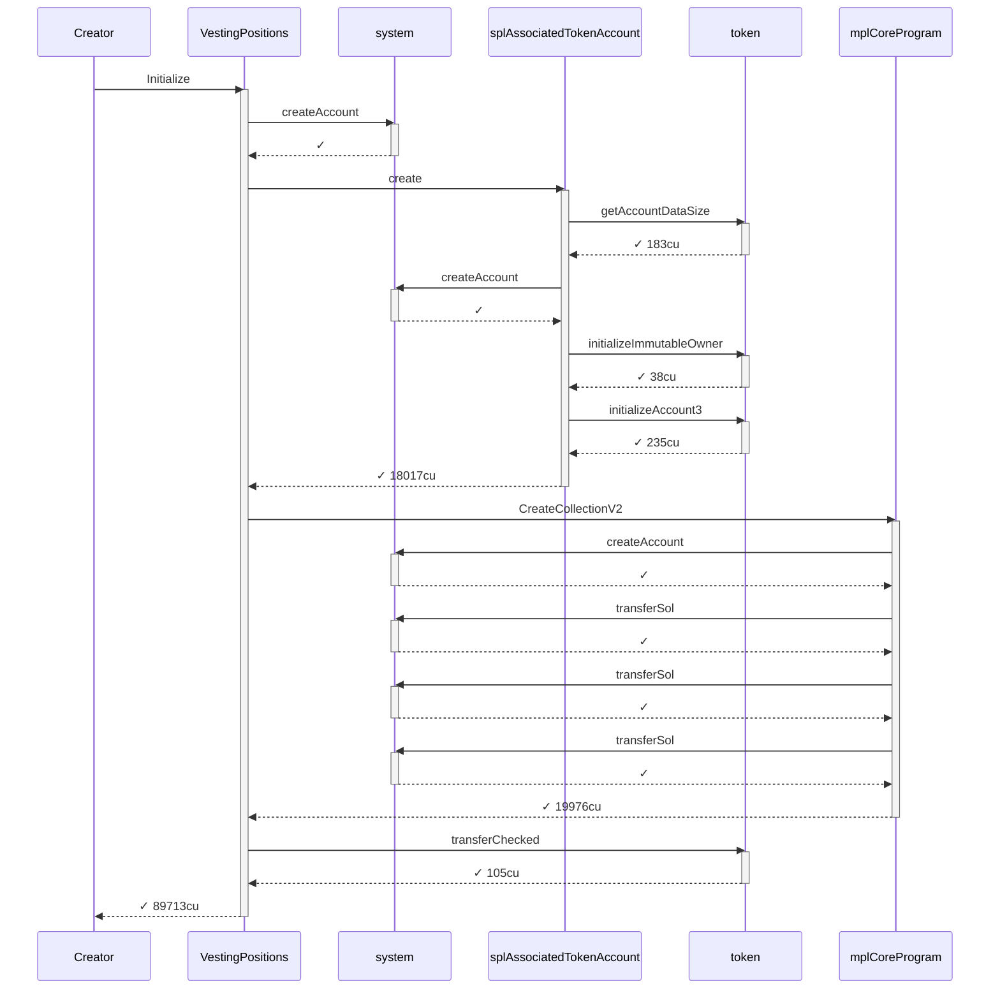

### Authority

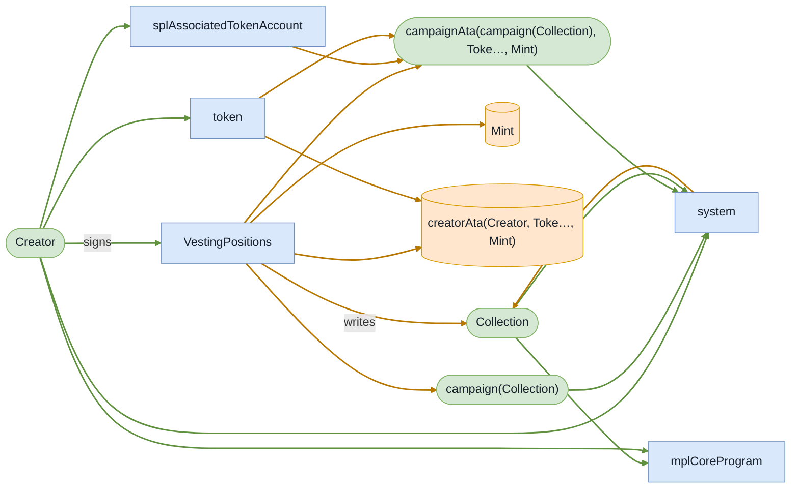

### Ownership

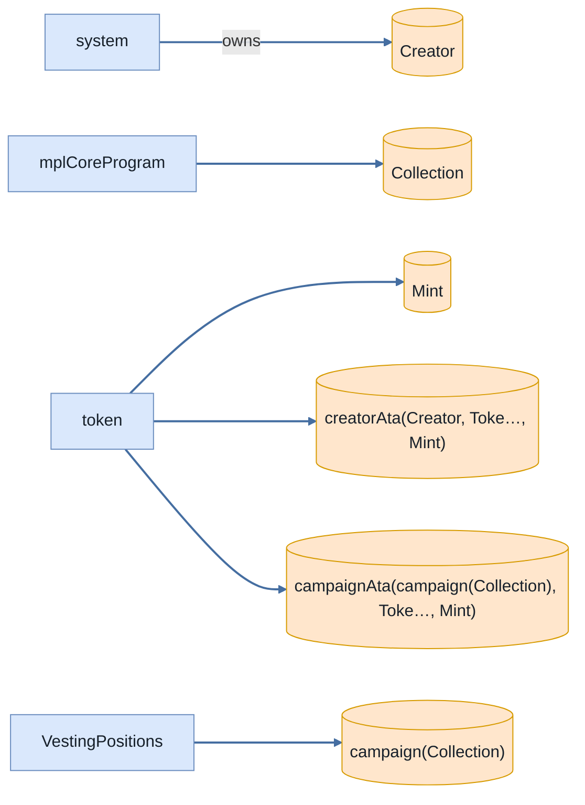

### Tree

```

Creator (89713cu)
└─ VestingPositions::Initialize ✓ 89713cu
   ├─ system::createAccount ✓
   ├─ splAssociatedTokenAccount::create ✓ 18017cu
   │  ├─ token::getAccountDataSize ✓ 183cu
   │  ├─ system::createAccount ✓
   │  ├─ token::initializeImmutableOwner ✓ 38cu
   │  └─ token::initializeAccount3 ✓ 235cu
   ├─ mplCoreProgram::CreateCollectionV2 ✓ 19976cu
   │  ├─ system::createAccount ✓
   │  ├─ system::transferSol ✓
   │  ├─ system::transferSol ✓
   │  └─ system::transferSol ✓
   └─ token::transferChecked ✓ 105cu
```

</details>

*1 day pass.*

### T1: FirstClaim (day 1)

<details>
<summary>diagrams</summary>

### Sequence

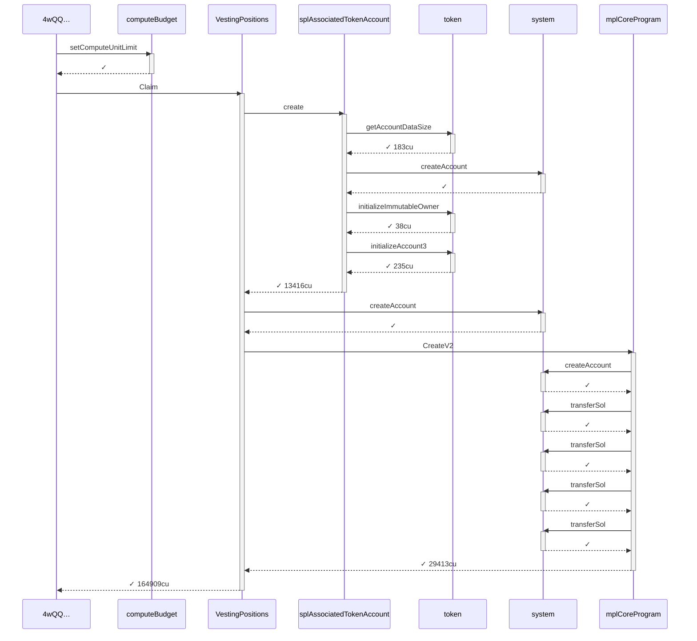

### Authority

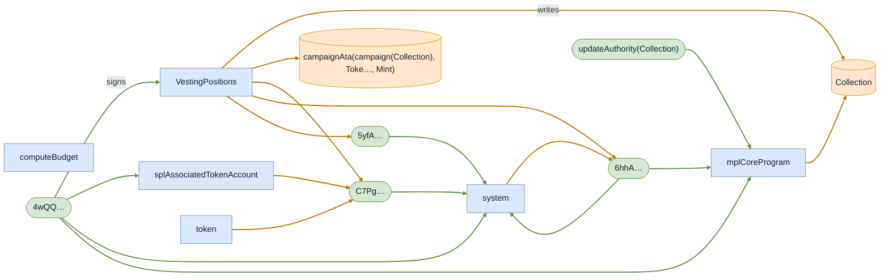

### Ownership

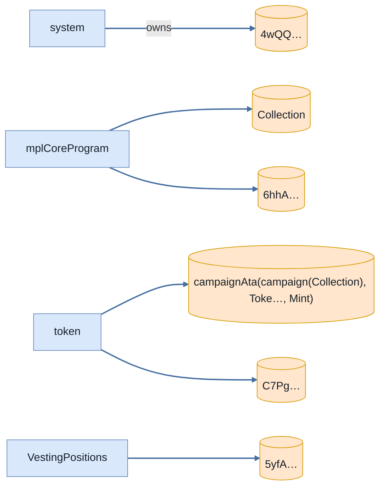

### Tree

```

4wQQ… (165059cu)
├─ computeBudget::setComputeUnitLimit ✓
└─ VestingPositions::Claim ✓ 164909cu
   ├─ splAssociatedTokenAccount::create ✓ 13416cu
   │  ├─ token::getAccountDataSize ✓ 183cu
   │  ├─ system::createAccount ✓
   │  ├─ token::initializeImmutableOwner ✓ 38cu
   │  └─ token::initializeAccount3 ✓ 235cu
   ├─ system::createAccount ✓
   └─ mplCoreProgram::CreateV2 ✓ 29413cu
      ├─ system::createAccount ✓
      ├─ system::transferSol ✓
      ├─ system::transferSol ✓
      ├─ system::transferSol ✓
      └─ system::transferSol ✓
```

</details>

### T2: FreezeCollection (day 1)

| observation | before | after |
| --- | --- | --- |
| Alice balance | — | 0 |

<details>
<summary>diagrams</summary>

### Sequence

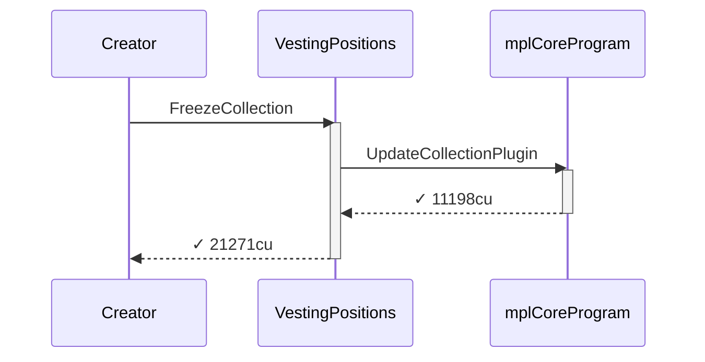

### Authority

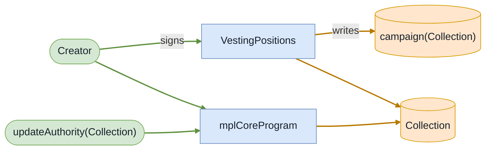

### Ownership

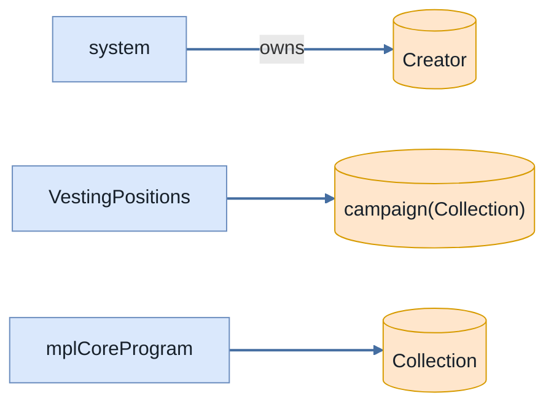

### Tree

```

Creator (21271cu)
└─ VestingPositions::FreezeCollection ✓ 21271cu
   └─ mplCoreProgram::UpdateCollectionPlugin ✓ 11198cu
```

</details>

### T3: TransferPosition (day 1)

<details>
<summary>diagrams</summary>

### Sequence

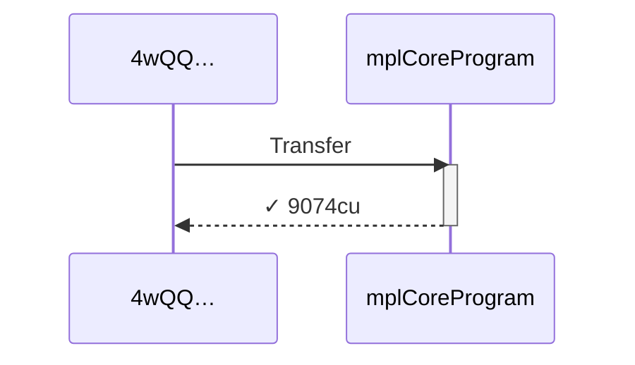

### Authority


### Ownership

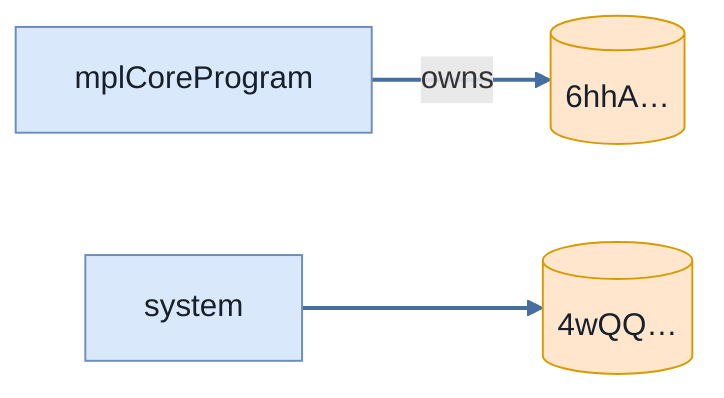

### Tree

```

4wQQ… (9074cu)
└─ mplCoreProgram::Transfer ✓ 9074cu
```

</details>
