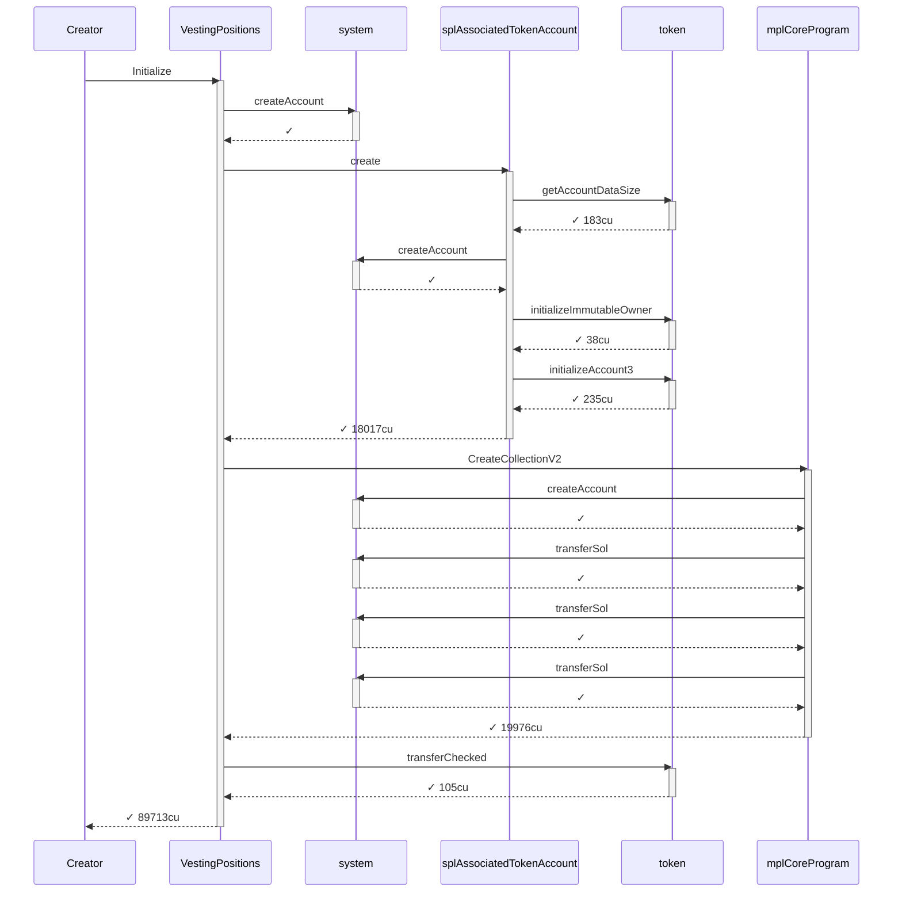
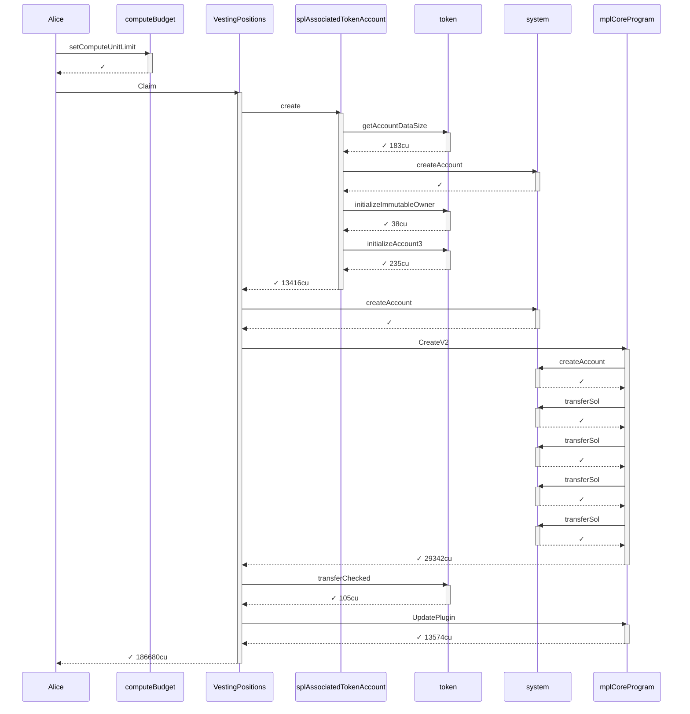

# compute_units_profile

**Source:** [`tests/compute_units.rs` L16](https://github.com/cds-turbin3/vesting-position/blob/7172eb8fb4ae69b1e7af671b76095a6112c41e68/babelfish-tests/tests/compute_units.rs#L16)

Over 31 days: 2 moments.

### T0: Initialize (day 0)

| observation | before | after |
| --- | --- | --- |
| Vault balance | — | 10,000,000,000,000 |
| Creator balance | — | 0 |

### Sequence



<details>
<summary>tree</summary>

```

Creator (89713cu)
└─ VestingPositions::Initialize ✓ 89713cu
   ├─ system::createAccount ✓
   ├─ splAssociatedTokenAccount::create ✓ 18017cu
   │  ├─ token::getAccountDataSize ✓ 183cu
   │  ├─ system::createAccount ✓
   │  ├─ token::initializeImmutableOwner ✓ 38cu
   │  └─ token::initializeAccount3 ✓ 235cu
   ├─ mplCoreProgram::CreateCollectionV2 ✓ 19976cu
   │  ├─ system::createAccount ✓
   │  ├─ system::transferSol ✓
   │  ├─ system::transferSol ✓
   │  └─ system::transferSol ✓
   └─ token::transferChecked ✓ 105cu
```

</details>

*2678401 seconds pass.*

### T1: FirstClaim (day 31)

| observation | before | after |
| --- | --- | --- |
| Vault balance | 10,000,000,000,000 | 9,000,000,000,000 |

### Sequence



<details>
<summary>tree</summary>

```

Alice (186830cu)
├─ computeBudget::setComputeUnitLimit ✓
└─ VestingPositions::Claim ✓ 186680cu
   ├─ splAssociatedTokenAccount::create ✓ 13416cu
   │  ├─ token::getAccountDataSize ✓ 183cu
   │  ├─ system::createAccount ✓
   │  ├─ token::initializeImmutableOwner ✓ 38cu
   │  └─ token::initializeAccount3 ✓ 235cu
   ├─ system::createAccount ✓
   ├─ mplCoreProgram::CreateV2 ✓ 29342cu
   │  ├─ system::createAccount ✓
   │  ├─ system::transferSol ✓
   │  ├─ system::transferSol ✓
   │  ├─ system::transferSol ✓
   │  └─ system::transferSol ✓
   ├─ token::transferChecked ✓ 105cu
   └─ mplCoreProgram::UpdatePlugin ✓ 13574cu
```

</details>
