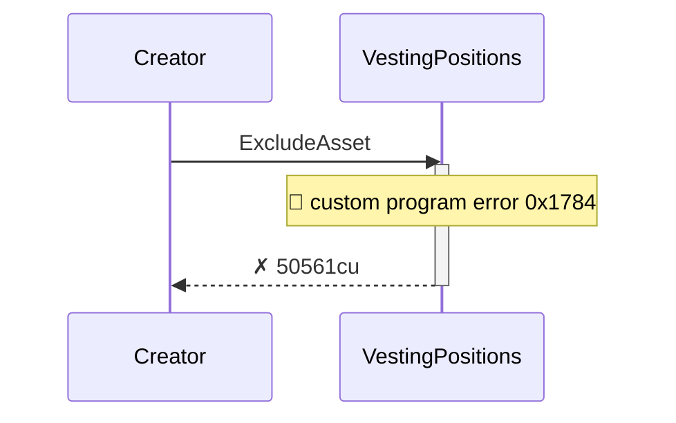
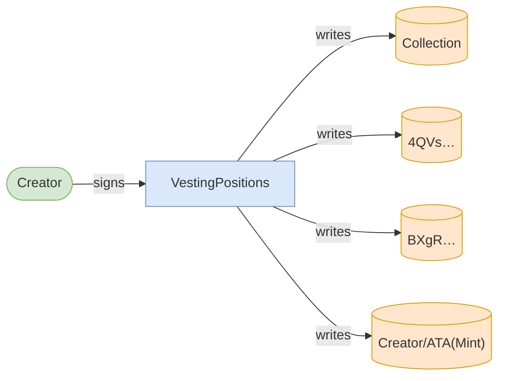
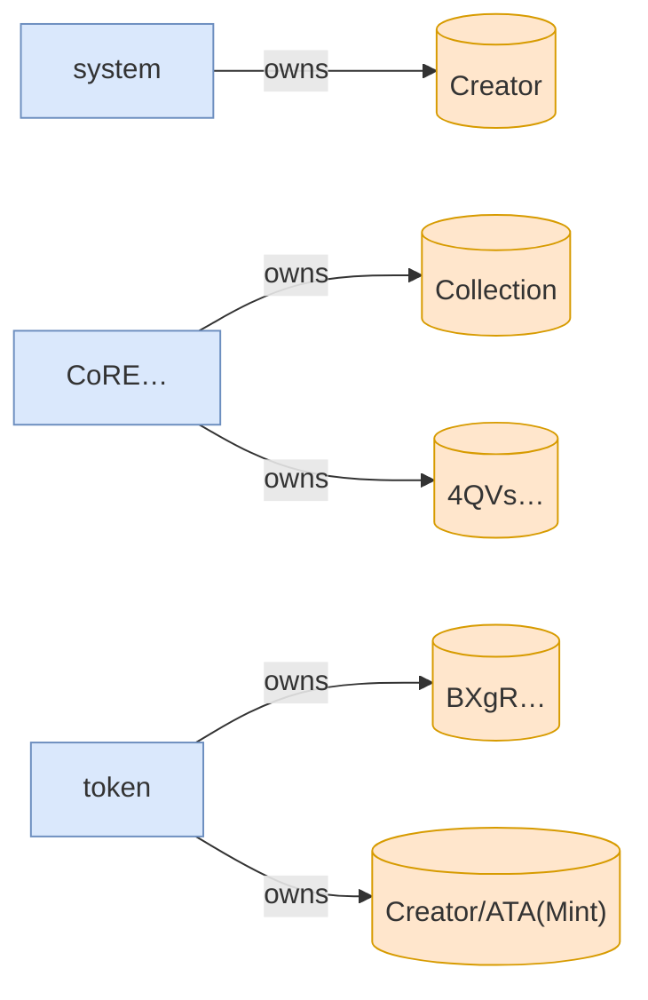

# exclude_asset_blocks_subsequent_claims

**Source:** [`tests/freeze.rs` L175](https://github.com/cds-turbin3/vesting-position/blob/3f946c506628d348826d858340b4ac335a62e967/babelfish-tests/tests/freeze.rs#L175)







<details>
<summary>tree</summary>

```

Creator (50561cu)
└─ VestingPositions::ExcludeAsset ✗ 50561cu
```

</details>
