# exclude_asset_blocks_subsequent_claims

**Source:** [`tests/freeze.rs` L187](https://github.com/cds-turbin3/vesting-position/blob/8b919a4afb93b5878c3ba60d3c6a8b23c5b3b11f/babelfish-tests/tests/freeze.rs#L187)

Over 31 days: 5 moments.

### Cast

| name | address |
| --- | --- |
| Collection | DZ9SxyoirUd6SJtqTyLzGjyRuQjmxcs1ySPeuZqzmAA9 |
| Creator | 2ZBYuwtWiRzk7CwiCYTv5MQhQHDEaN4B8xhw4L7L3RY5 |
| Mint | J6WtRQHtRxemkWECcNq1wQAfgyJtsx7ZUT7Xpb53vo2N |
| VestingPositions | 7DkU9TQhcN87f2djZDd2MjjPZoXLfnZZj8HhybeZswX1 |
| campaign(Collection) | 2rbEagbB2s6tm4BWjcCmYnPxEi8cmF6CqCYPK6WhKZrC |
| campaignAta(campaign(Collection), Toke…, Mint) | BXgRMbNU5GHfjUAEUL4gc4dkK47Kbd26uZfbunemQyjQ |
| creatorAta(Creator, Toke…, Mint) | 7RKXPrw2SRFrpVR7h81dMPhHdaVV7y57tEYmDraizX43 |
| updateAuthority(Collection) | vGh5gMbD7AsVatTVNDo3pC7hveLFKdXbZ3eNt17chDs |
| userAta(4wQQ…, Toke…, Mint) | 45PBE5WDayGKEeGHvaLP5VfqXSS5JoGVewXyVbSE8JSq |

### T0: Initialize (day 0)

| observation | before | after |
| --- | --- | --- |
| Vault balance | — | 10,000,000,000,000 |
| Creator balance | — | 0 |

### Sequence

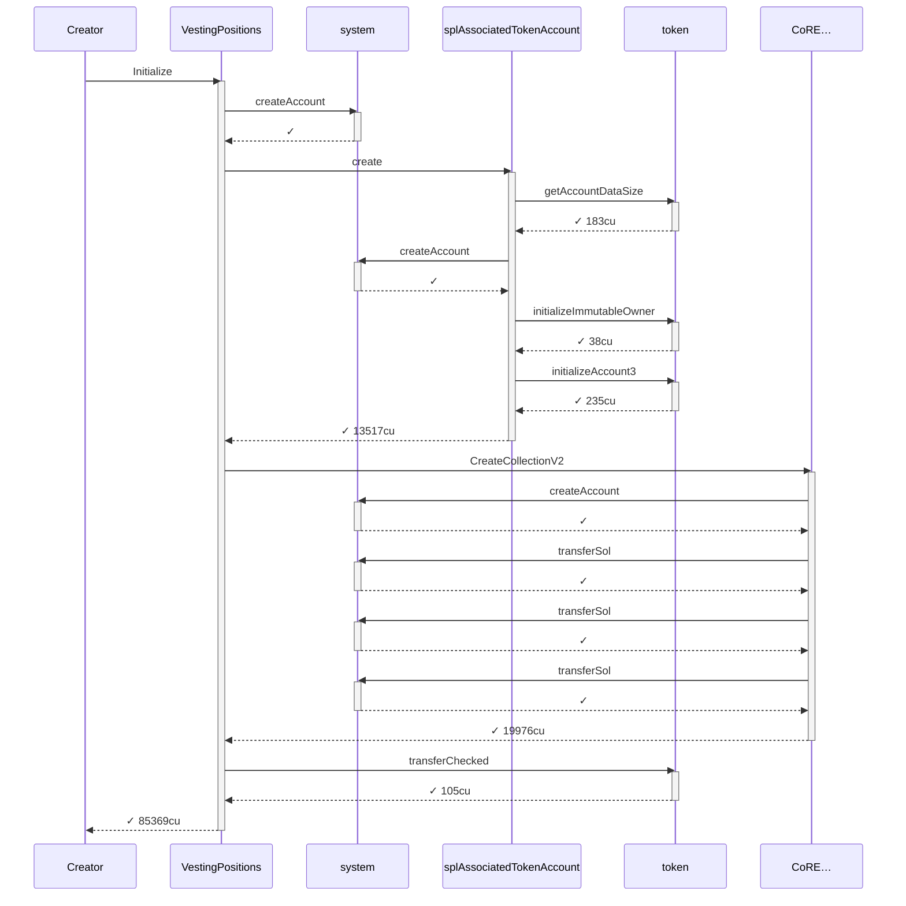

### Authority

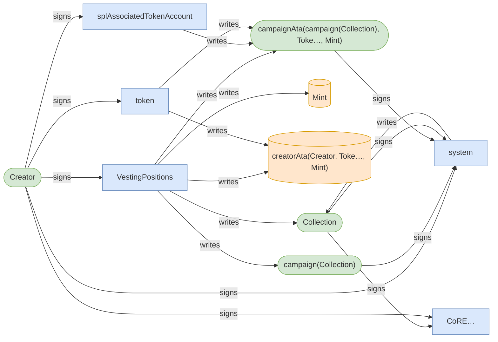

### Ownership

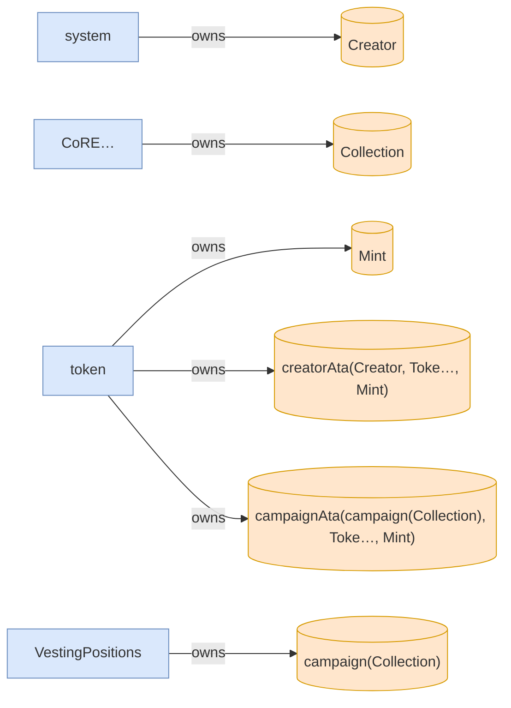

<details>
<summary>tree</summary>

```

Creator (85369cu)
└─ VestingPositions::Initialize ✓ 85369cu
   ├─ system::createAccount ✓
   ├─ splAssociatedTokenAccount::create ✓ 13517cu
   │  ├─ token::getAccountDataSize ✓ 183cu
   │  ├─ system::createAccount ✓
   │  ├─ token::initializeImmutableOwner ✓ 38cu
   │  └─ token::initializeAccount3 ✓ 235cu
   ├─ CoRE…::CreateCollectionV2 ✓ 19976cu
   │  ├─ system::createAccount ✓
   │  ├─ system::transferSol ✓
   │  ├─ system::transferSol ✓
   │  └─ system::transferSol ✓
   └─ token::transferChecked ✓ 105cu
```

</details>

*1 day pass.*

### T1: FirstClaim (day 1)

### Sequence

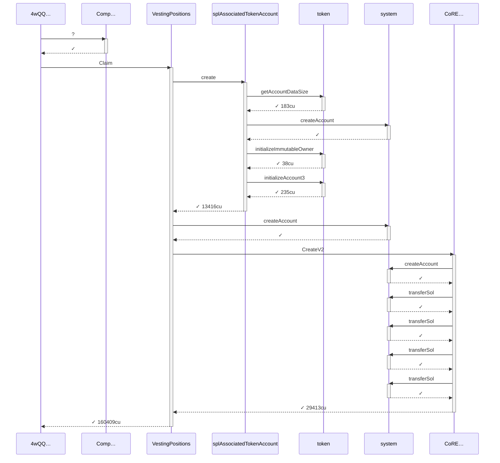

### Authority

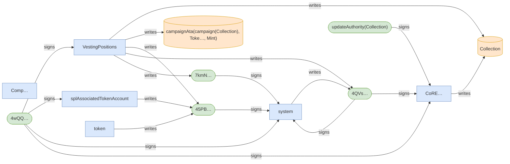

### Ownership

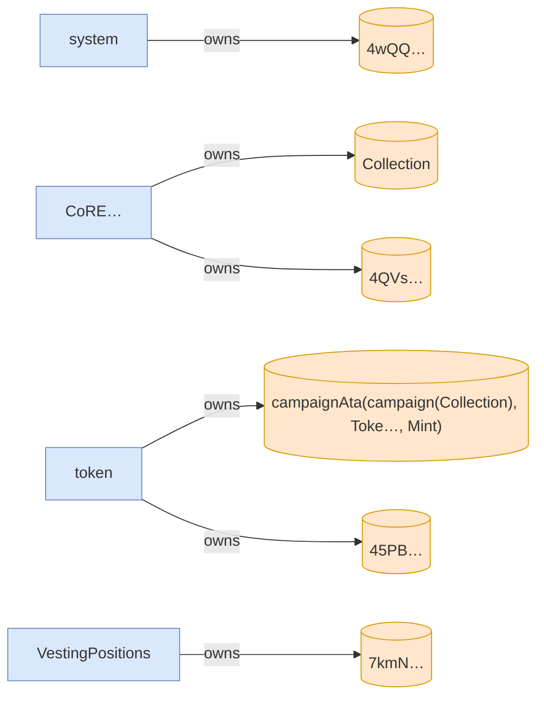

<details>
<summary>tree</summary>

```

4wQQ… (160559cu)
├─ Comp…::? ✓
└─ VestingPositions::Claim ✓ 160409cu
   ├─ splAssociatedTokenAccount::create ✓ 13416cu
   │  ├─ token::getAccountDataSize ✓ 183cu
   │  ├─ system::createAccount ✓
   │  ├─ token::initializeImmutableOwner ✓ 38cu
   │  └─ token::initializeAccount3 ✓ 235cu
   ├─ system::createAccount ✓
   └─ CoRE…::CreateV2 ✓ 29413cu
      ├─ system::createAccount ✓
      ├─ system::transferSol ✓
      ├─ system::transferSol ✓
      ├─ system::transferSol ✓
      └─ system::transferSol ✓
```

</details>

*1339200 seconds pass.*

### T2: Claim (day 16)

| observation | before | after |
| --- | --- | --- |
| Vault balance | 10,000,000,000,000 | 9,450,000,000,000 |
| Alice balance | — | 550,000,000,000 |

### Sequence

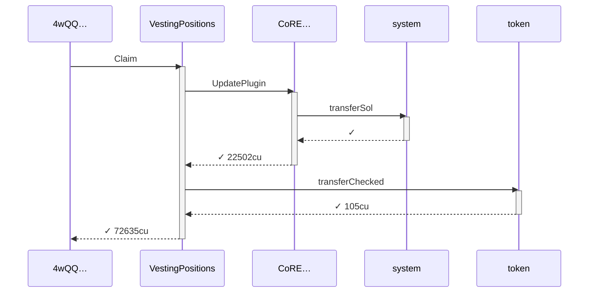

### Authority

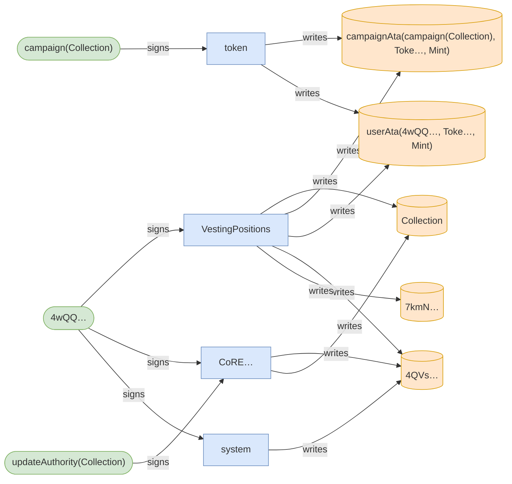

### Ownership

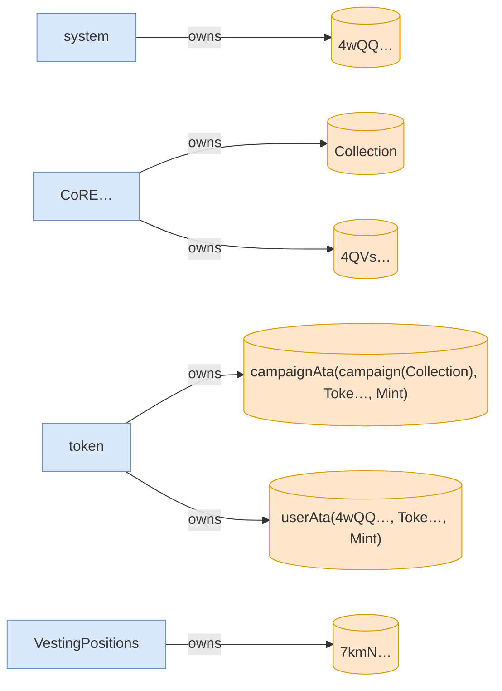

<details>
<summary>tree</summary>

```

4wQQ… (72635cu)
└─ VestingPositions::Claim ✓ 72635cu
   ├─ CoRE…::UpdatePlugin ✓ 22502cu
   │  └─ system::transferSol ✓
   └─ token::transferChecked ✓ 105cu
```

</details>

### T3: ExcludeAsset (day 16)

| observation | before | after |
| --- | --- | --- |
| Vault balance | 9,450,000,000,000 | 9,000,000,000,000 |
| Creator balance | 0 | 450,000,000,000 |

### Sequence

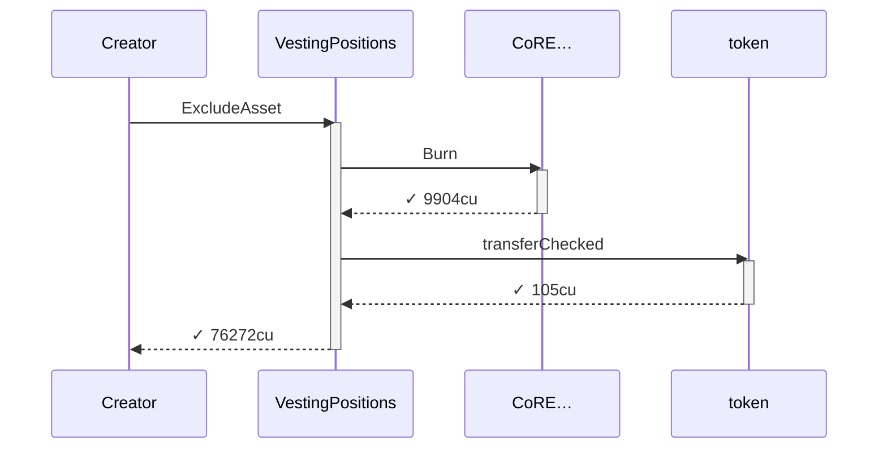

### Authority

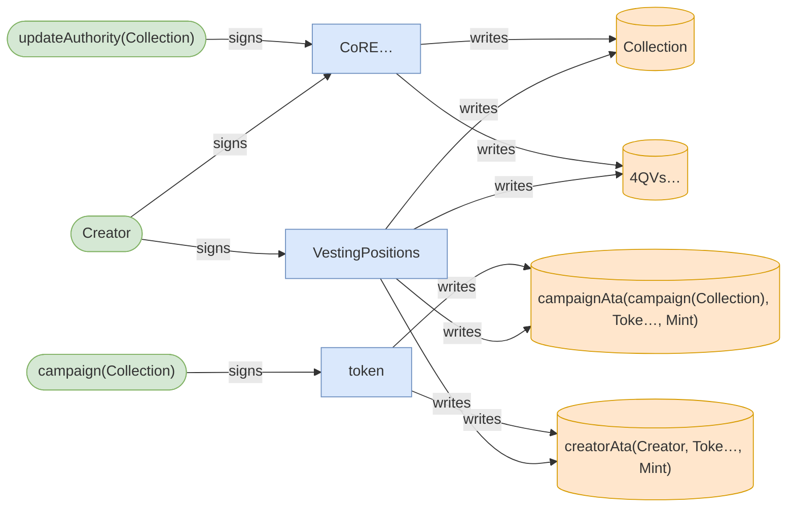

### Ownership

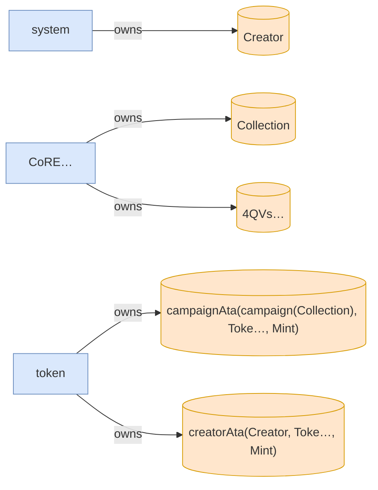

<details>
<summary>tree</summary>

```

Creator (76272cu)
└─ VestingPositions::ExcludeAsset ✓ 76272cu
   ├─ CoRE…::Burn ✓ 9904cu
   └─ token::transferChecked ✓ 105cu
```

</details>

*1252801 seconds pass.*

### T4: Claim (day 31)

- [x] refused: InvalidAsset — InstructionError(0, Custom(6015))

### Sequence

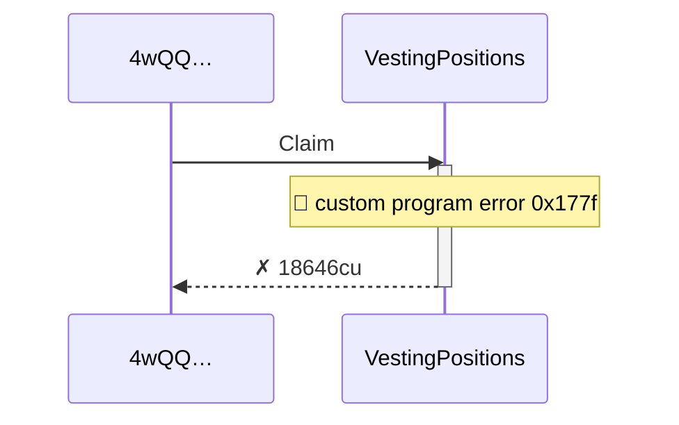

### Authority

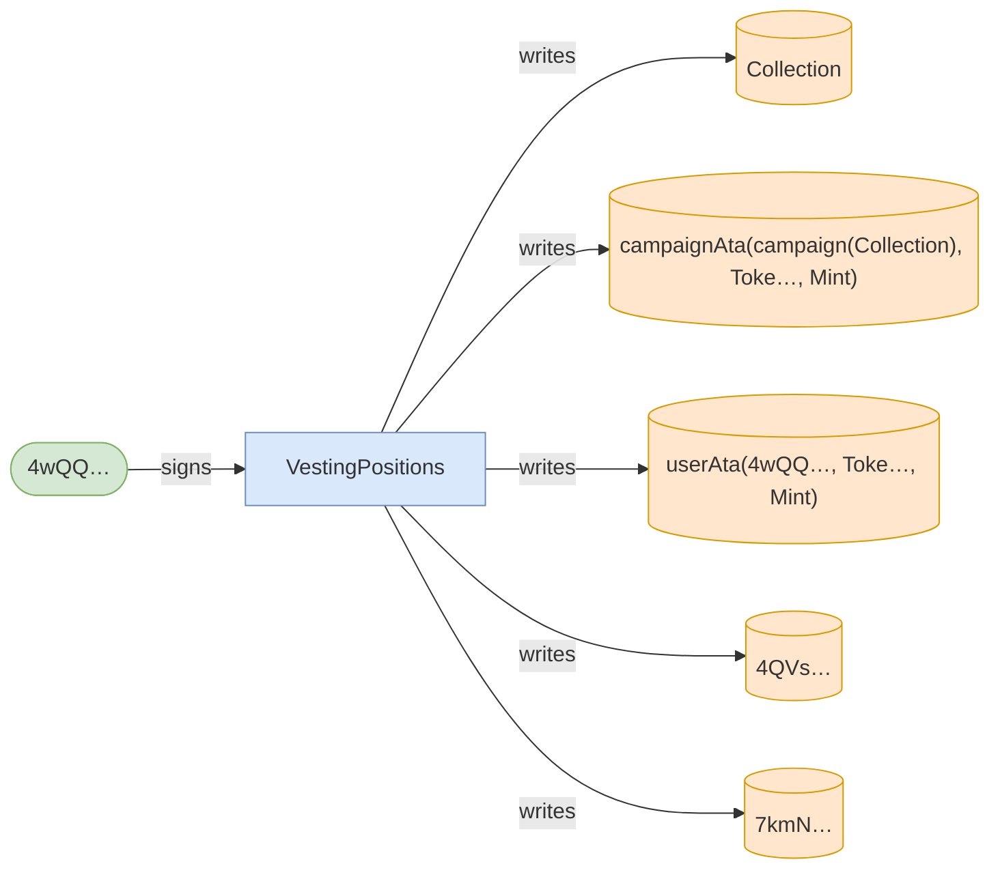

### Ownership


<details>
<summary>tree</summary>

```

4wQQ… (18646cu)
└─ VestingPositions::Claim ✗ 18646cu
```

</details>
