# exclude_asset_burns_position

**Source:** [`tests/freeze.rs` L232](https://github.com/cds-turbin3/vesting-position/blob/1a7ceef2d99e574860e959cc0f6c79bfbc7fbb95/babelfish-tests/tests/freeze.rs#L232)

Over 1 day: 4 moments.

<details>
<summary>Cast</summary>

| name | address |
| --- | --- |
| Collection | DZ9SxyoirUd6SJtqTyLzGjyRuQjmxcs1ySPeuZqzmAA9 |
| Creator | 2ZBYuwtWiRzk7CwiCYTv5MQhQHDEaN4B8xhw4L7L3RY5 |
| Mint | J6WtRQHtRxemkWECcNq1wQAfgyJtsx7ZUT7Xpb53vo2N |
| VestingPositions | 7DkU9TQhcN87f2djZDd2MjjPZoXLfnZZj8HhybeZswX1 |
| campaign(Collection) | 2rbEagbB2s6tm4BWjcCmYnPxEi8cmF6CqCYPK6WhKZrC |
| campaignAta(campaign(Collection), Toke…, Mint) | BXgRMbNU5GHfjUAEUL4gc4dkK47Kbd26uZfbunemQyjQ |
| creatorAta(Creator, Toke…, Mint) | 7RKXPrw2SRFrpVR7h81dMPhHdaVV7y57tEYmDraizX43 |
| updateAuthority(Collection) | vGh5gMbD7AsVatTVNDo3pC7hveLFKdXbZ3eNt17chDs |

</details>

### Timeline

| time | Vault balance | Δ | Creator balance | Δ | Alice balance | Δ | comment |
| --- | --- | --- | --- | --- | --- | --- | --- |
| T0 | 10,000,000,000,000 | +10,000,000,000,000 | 0 |  | — |  | Initialize (day 0) |
| T1 | 10,000,000,000,000 |  | 0 |  | — |  | FirstClaim (day 1) |
| T2 | 9,000,000,000,000 | -1,000,000,000,000 | 1,000,000,000,000 | +1,000,000,000,000 | 0 |  | ExcludeAsset (day 1) |
| T3 | 9,000,000,000,000 |  | 1,000,000,000,000 |  | 0 |  | TransferPosition (day 1) |

### T0: Initialize (day 0)

| observation | before | after |
| --- | --- | --- |
| Vault balance | — | 10,000,000,000,000 |
| Creator balance | — | 0 |

<details>
<summary>diagrams</summary>

### Sequence

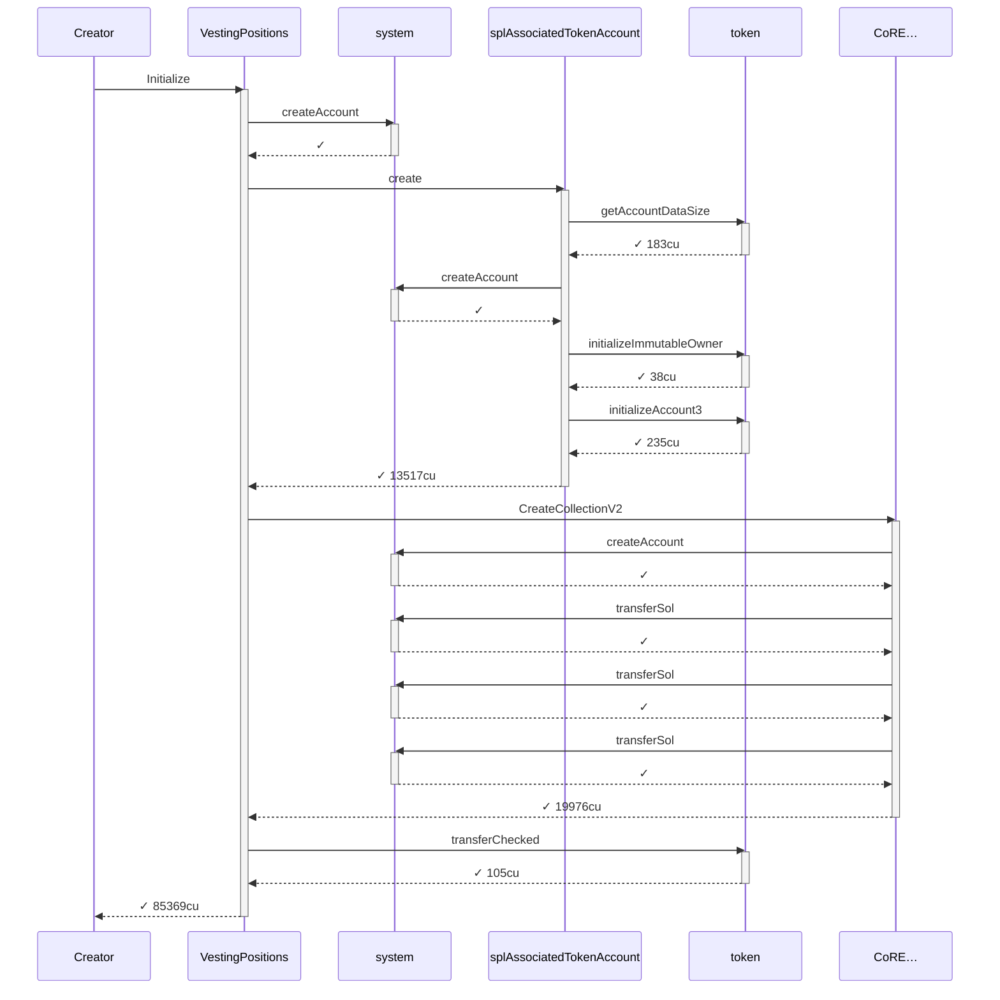

### Authority

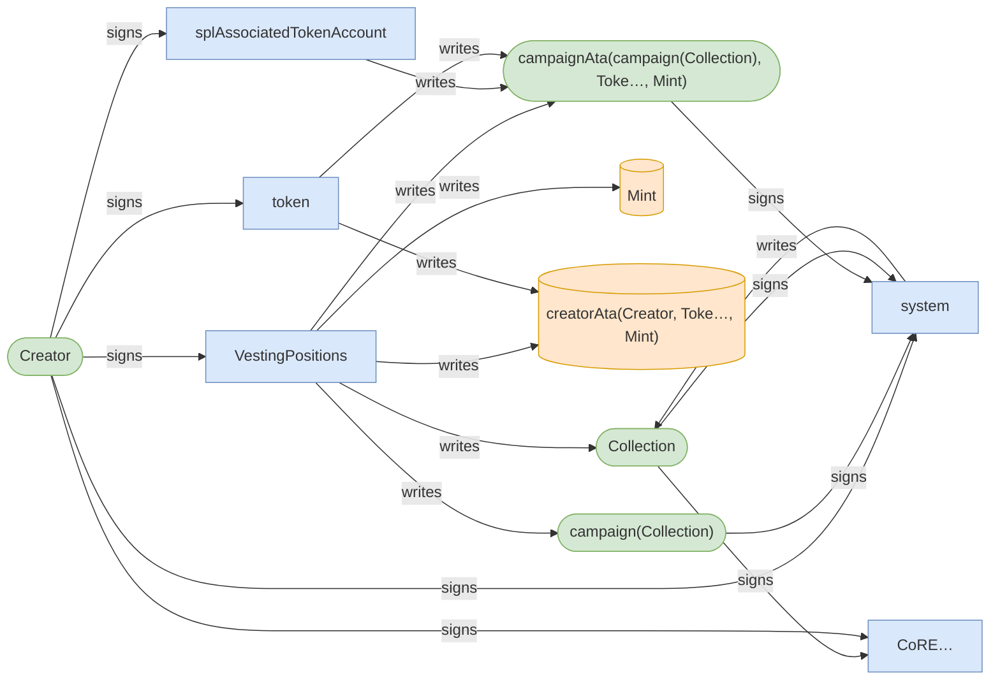

### Ownership

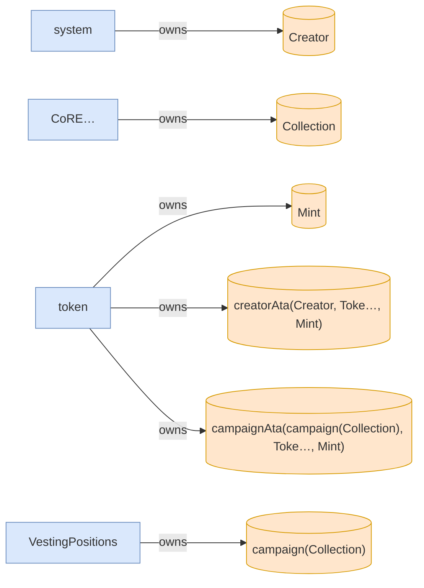

### Tree

```

Creator (85369cu)
└─ VestingPositions::Initialize ✓ 85369cu
   ├─ system::createAccount ✓
   ├─ splAssociatedTokenAccount::create ✓ 13517cu
   │  ├─ token::getAccountDataSize ✓ 183cu
   │  ├─ system::createAccount ✓
   │  ├─ token::initializeImmutableOwner ✓ 38cu
   │  └─ token::initializeAccount3 ✓ 235cu
   ├─ CoRE…::CreateCollectionV2 ✓ 19976cu
   │  ├─ system::createAccount ✓
   │  ├─ system::transferSol ✓
   │  ├─ system::transferSol ✓
   │  └─ system::transferSol ✓
   └─ token::transferChecked ✓ 105cu
```

</details>

*1 day pass.*

### T1: FirstClaim (day 1)

<details>
<summary>diagrams</summary>

### Sequence

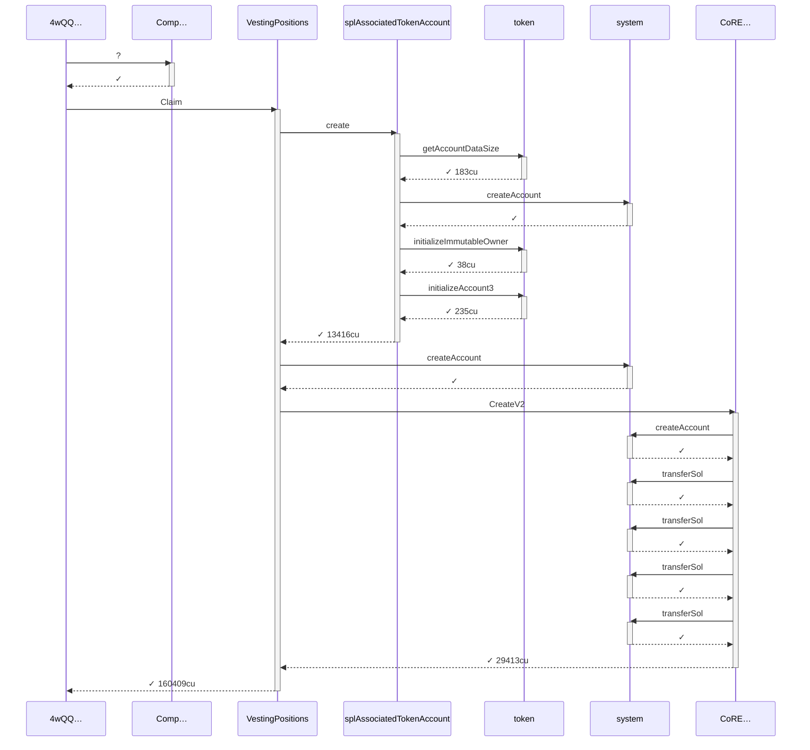

### Authority

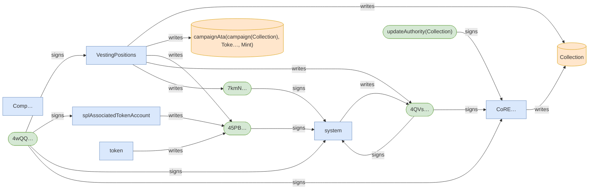

### Ownership

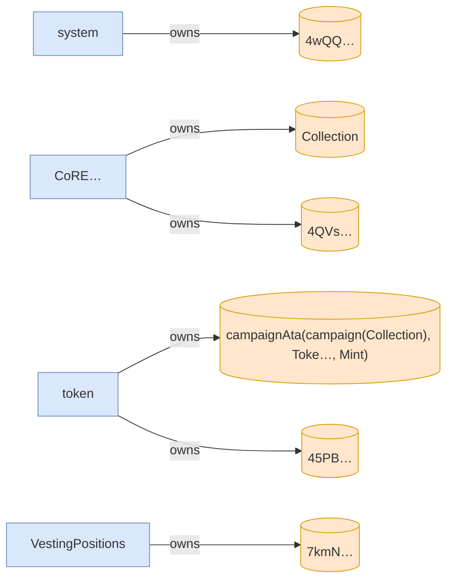

### Tree

```

4wQQ… (160559cu)
├─ Comp…::? ✓
└─ VestingPositions::Claim ✓ 160409cu
   ├─ splAssociatedTokenAccount::create ✓ 13416cu
   │  ├─ token::getAccountDataSize ✓ 183cu
   │  ├─ system::createAccount ✓
   │  ├─ token::initializeImmutableOwner ✓ 38cu
   │  └─ token::initializeAccount3 ✓ 235cu
   ├─ system::createAccount ✓
   └─ CoRE…::CreateV2 ✓ 29413cu
      ├─ system::createAccount ✓
      ├─ system::transferSol ✓
      ├─ system::transferSol ✓
      ├─ system::transferSol ✓
      └─ system::transferSol ✓
```

</details>

### T2: ExcludeAsset (day 1)

| observation | before | after |
| --- | --- | --- |
| Vault balance | 10,000,000,000,000 | 9,000,000,000,000 |
| Creator balance | 0 | 1,000,000,000,000 |
| Alice balance | — | 0 |

<details>
<summary>diagrams</summary>

### Sequence

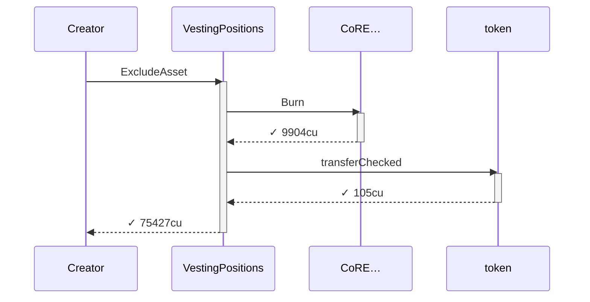

### Authority

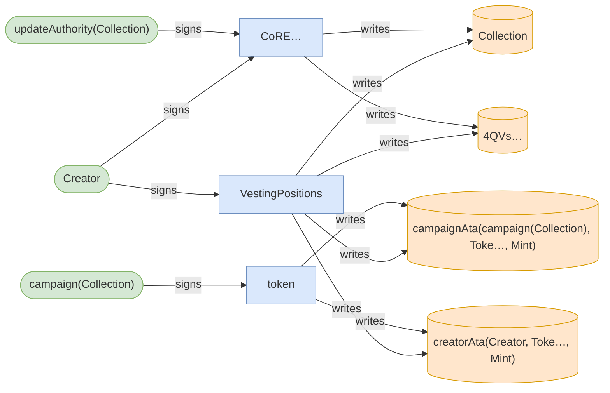

### Ownership

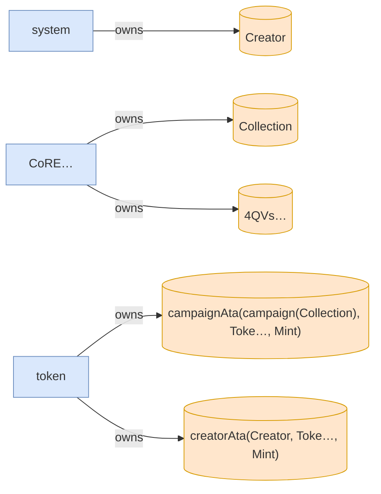

### Tree

```

Creator (75427cu)
└─ VestingPositions::ExcludeAsset ✓ 75427cu
   ├─ CoRE…::Burn ✓ 9904cu
   └─ token::transferChecked ✓ 105cu
```

</details>

### T3: TransferPosition (day 1)

🚩 T3 failed: InstructionError(0, Custom(6))

<details>
<summary>diagrams</summary>

### Sequence

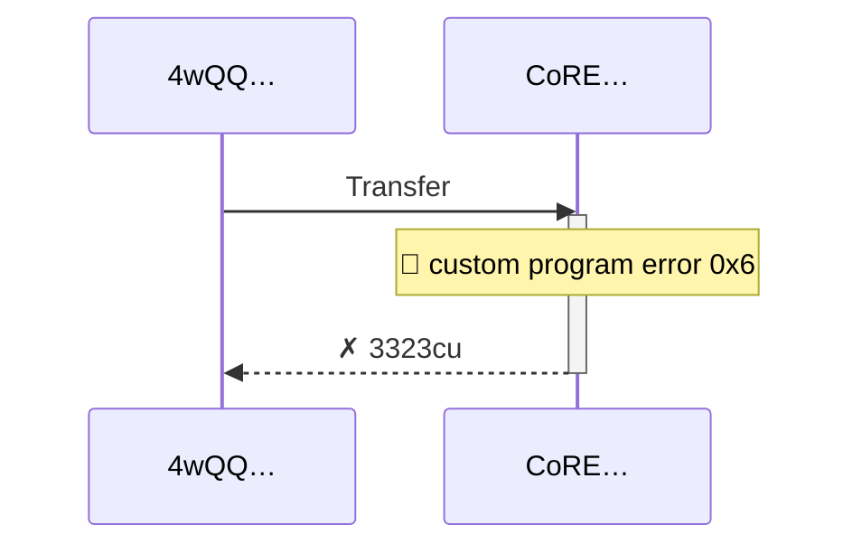

### Authority

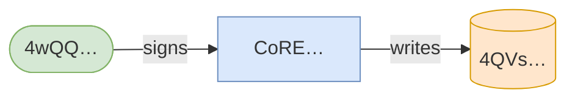

### Ownership

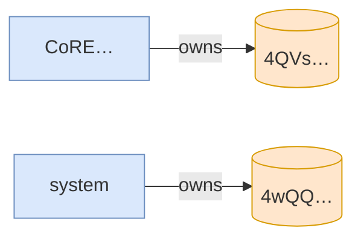

### Tree

```

4wQQ… (3323cu)
└─ CoRE…::Transfer ✗ 3323cu
```

</details>
