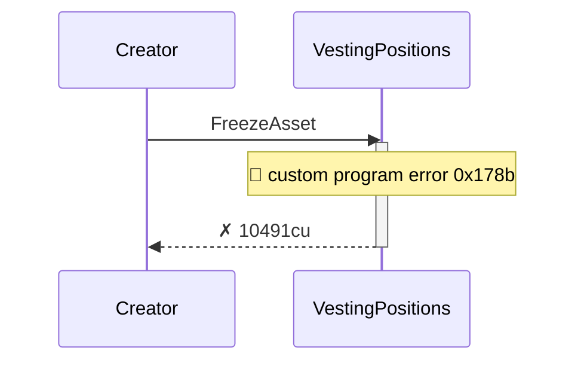
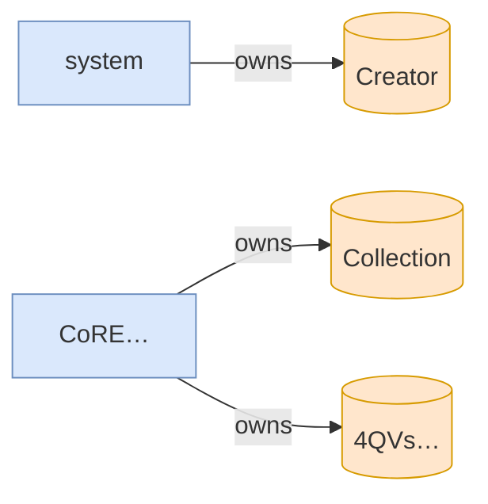

# freeze_asset_fails_without_freeze_plugin

**Source:** [`tests/freeze.rs` L278](https://github.com/cds-turbin3/vesting-position/blob/cbb8875460ccf5cc3d9023c540f31113adcd0573/babelfish-tests/tests/freeze.rs#L278)

### Action: Initialize

| account | before | after |
| --- | --- | --- |
| Creator | 10000000000000 | 0 |
| Vault | 0 | 10000000000000 |

<details>
<summary>tree</summary>

```

Creator (85370cu)
└─ VestingPositions::Initialize ✓ 85370cu
   ├─ system::createAccount ✓
   ├─ splAssociatedTokenAccount::create ✓ 13517cu
   │  ├─ token::getAccountDataSize ✓ 183cu
   │  ├─ system::createAccount ✓
   │  ├─ token::initializeImmutableOwner ✓ 38cu
   │  └─ token::initializeAccount3 ✓ 235cu
   ├─ CoRE…::CreateCollectionV2 ✓ 19976cu
   │  ├─ system::createAccount ✓
   │  ├─ system::transferSol ✓
   │  ├─ system::transferSol ✓
   │  └─ system::transferSol ✓
   └─ token::transferChecked ✓ 105cu
```

</details>

### Action: tx

| account | before | after |
| --- | --- | --- |
| whitelisted_1 | — | 0 |

<details>
<summary>tree</summary>

```

4wQQ… (156702cu)
├─ Comp…::? ✓
└─ VestingPositions::Claim ✓ 156552cu
   ├─ splAssociatedTokenAccount::create ✓ 13416cu
   │  ├─ token::getAccountDataSize ✓ 183cu
   │  ├─ system::createAccount ✓
   │  ├─ token::initializeImmutableOwner ✓ 38cu
   │  └─ token::initializeAccount3 ✓ 235cu
   ├─ system::createAccount ✓
   └─ CoRE…::CreateV2 ✓ 25757cu
      ├─ system::createAccount ✓
      ├─ system::transferSol ✓
      ├─ system::transferSol ✓
      └─ system::transferSol ✓
```

</details>

<details>
<summary>tree</summary>

```

Creator (10491cu)
└─ VestingPositions::FreezeAsset ✗ 10491cu
```

</details>






<details>
<summary>tree</summary>

```

Creator (10491cu)
└─ VestingPositions::FreezeAsset ✗ 10491cu
```

</details>
