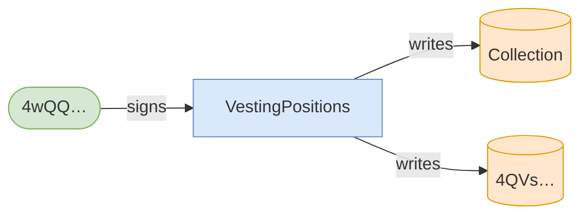
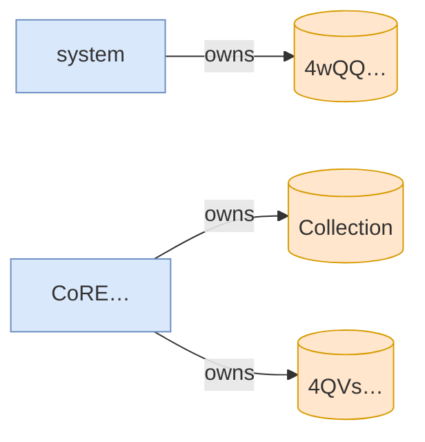

# freeze_asset_fails_without_freeze_plugin

**Source:** [`tests/freeze.rs` L277](https://github.com/cds-turbin3/vesting-position/blob/3f946c506628d348826d858340b4ac335a62e967/babelfish-tests/tests/freeze.rs#L277)






<details>
<summary>tree</summary>

```

4wQQ… (4227cu)
└─ VestingPositions::FreezeAsset ✗ 4227cu
```

</details>
