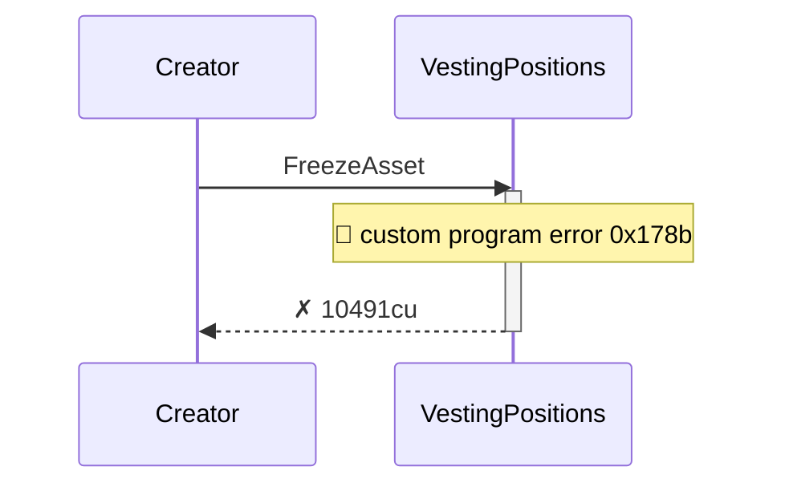
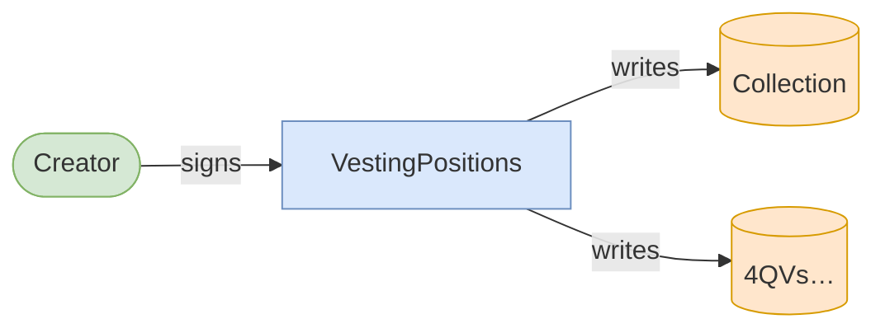
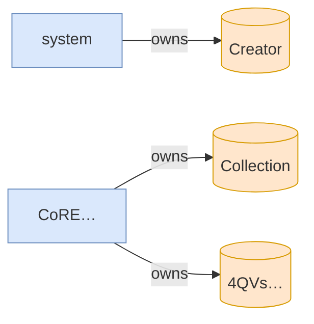

# freeze_asset_fails_without_freeze_plugin

**Source:** [`tests/freeze.rs` L277](https://github.com/cds-turbin3/vesting-position/blob/c4f43acad0bb9f007622fb43bc19ddc3610c7688/babelfish-tests/tests/freeze.rs#L277)







<details>
<summary>tree</summary>

```

Creator (10491cu)
└─ VestingPositions::FreezeAsset ✗ 10491cu
```

</details>
