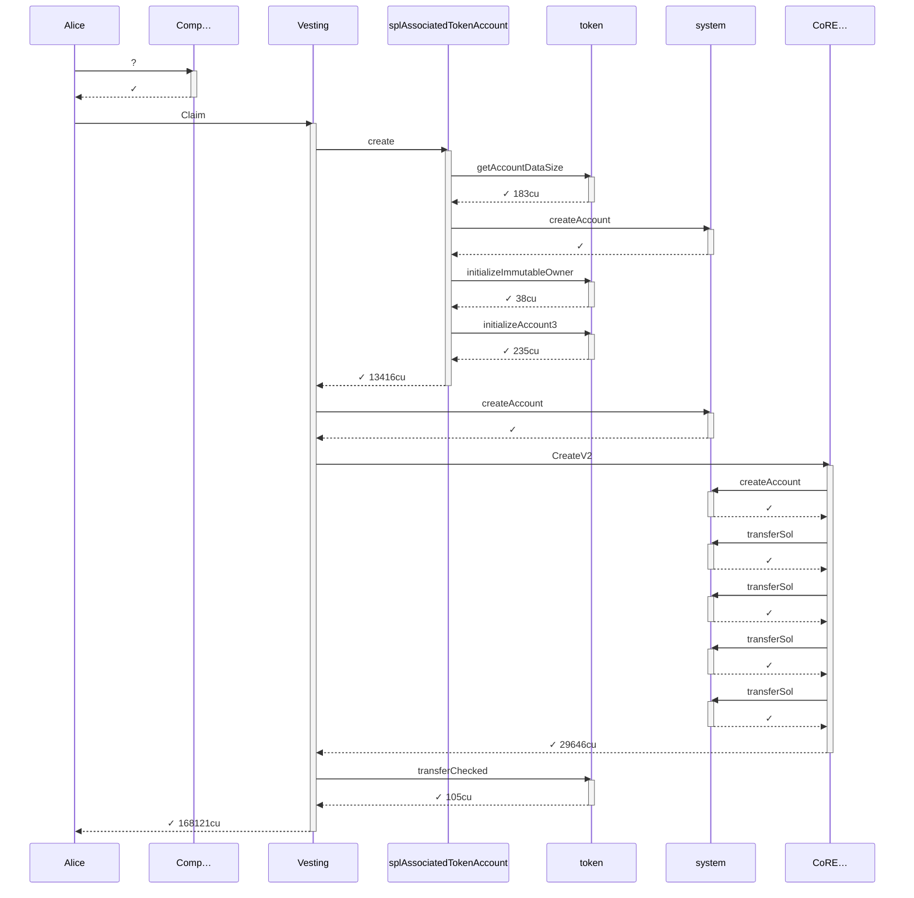
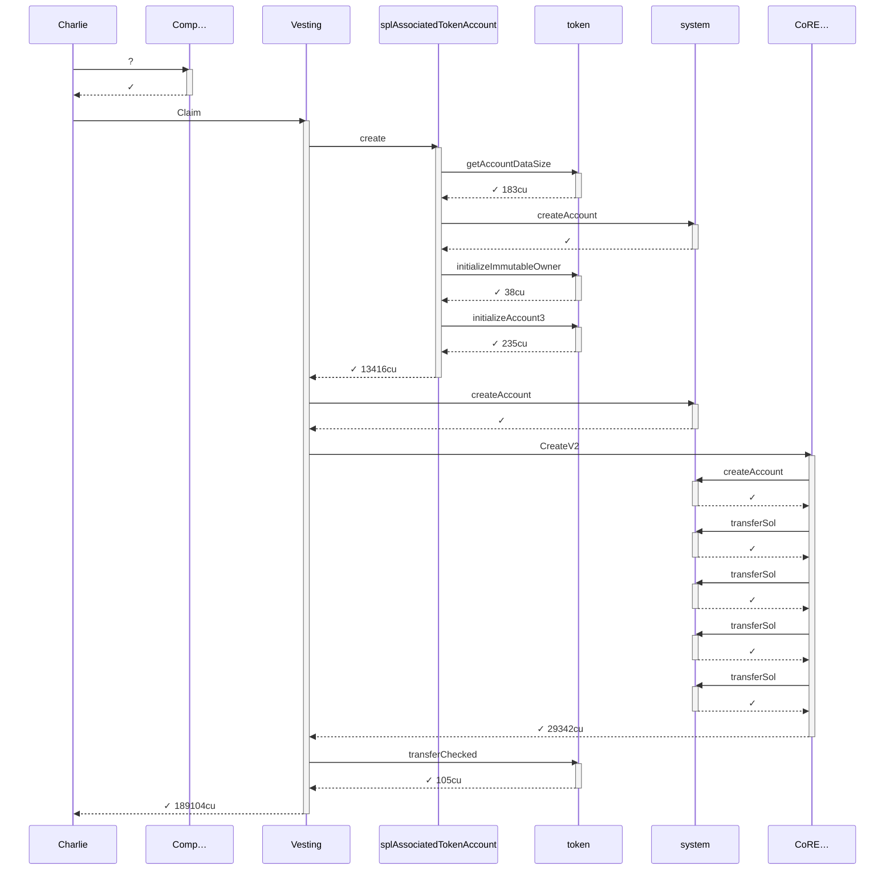
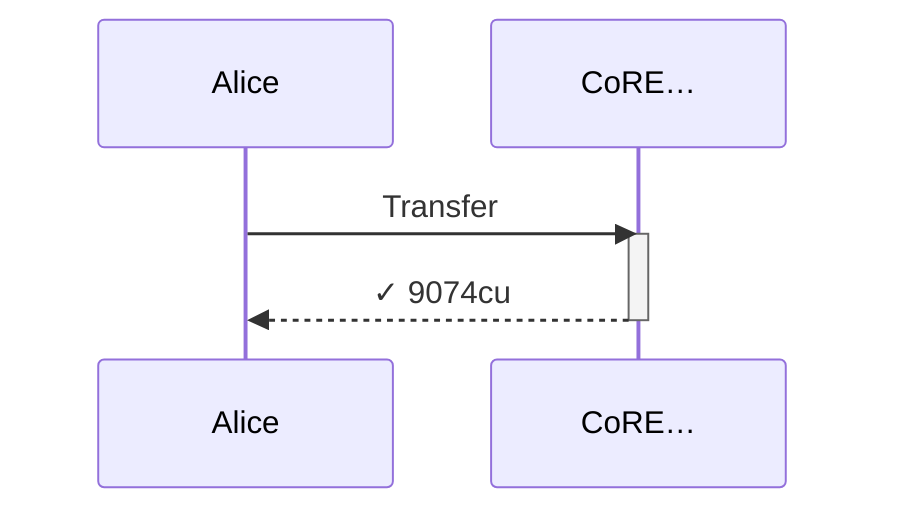
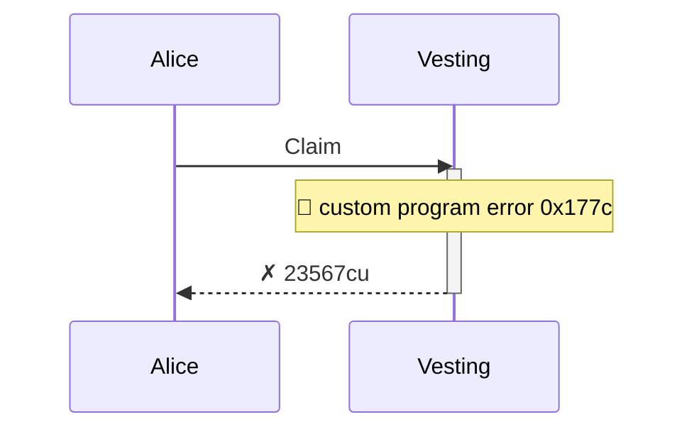

# full_lifecycle

**Source:** [`tests/full_lifecycle.rs` L24](https://github.com/cds-turbin3/vesting-position/blob/b53ae11528330be9e19c3e4b327a7dc3572aac7e/babelfish-tests/tests/full_lifecycle.rs#L24)

> Given: a live campaign; Alice and Charlie whitelisted, Bob not

> Given: Bob, never whitelisted, now holds Alice's position NFT

<details>
<summary>Over 28 days: 12 moments; 2/2 laws held; 3/3 final checks passed.</summary>

Invariants (laws):

- claimed + vault conserves the total deposit ✓ across 12 moment(s)
- receipt claimer is constant ✓ across 12 moment(s)

Final state checks:

- six Claim-labeled transactions settled (subsequent claims, success or refusal) ✓
- the campaign vault still holds an unclaimed remainder (no clawback ran) ✓
- the receipt-claimer binding never broke ✓

</details>

<details>
<summary>Cast</summary>

| name | address |
| --- | --- |
| Alice | 4wQQJM9LNuhinieNAqmHuPCm8LXDTVfhx84P32nAVE9P |
| Alice position NFT | 6hhAjXPGt41Y6oPH6mATnAqMECdaHrKaAGbE4SFuARXK |
| Bob | ErV63ApqLgh1Je5PdiVj6kzwkKJmLjKV41QoN9U4BNag |
| Campaign | G4GWLHr4aHZoxWra82eRc111wRJ9aDiXsSuk3bWoys2G |
| Charlie | H87xi4CUqrUPXzppV3jotTmre6DyR5pCaMk5bKQQBFTg |
| Charlie position NFT | 5fjLQR7cXnkBzwud4xAzHaxWKbTiQMJyrNe72RXUtieC |
| Collection | 9HbgSnRdBeYKzrjr9DYtcT6oKYrcTVB8NWUoU7JVKuWW |
| Creator | 2ZBYuwtWiRzk7CwiCYTv5MQhQHDEaN4B8xhw4L7L3RY5 |
| Mint | 4Kr8ypueV83MddH54fZXLkKFKRd7eWFcejQ8HtynfJRk |
| Vesting | 7DkU9TQhcN87f2djZDd2MjjPZoXLfnZZj8HhybeZswX1 |
| campaignAta(campaign(Collection), Toke…, Mint) | 3kKwPKo9z6XQWrZxuo75c36vm9ChMgGDAMBV7cFEhjSn |
| creatorAta(Creator, Toke…, Mint) | AvzkuSUEzjhXyboXRyfQcsjzKLBqeP9FeoExRBWkXjdJ |
| updateAuthority(Collection) | CYBwE6G2RjrsFYbwy5pUVVDVL5UR5g5VaRcWBPbzby1p |
| userAta(Alice, Toke…, Mint) | C7PguAKs34J4WkXRRp762bPFhzhmFBYKdLuHQYBrVmAW |
| userAta(Bob, Toke…, Mint) | A8Eu8FarK5CxvYkBoYeJ9bsoA4mFZFvH9dqgH56TZQnf |
| userAta(Charlie, Toke…, Mint) | DiZfCmUXMWffwHP4eus9hwgnvTVbiZL7ZGGTBjJ9vc68 |
| 5yfA… | 5yfASCcX25V4fzBgdfixtXgS2JrvpWdwX27JQXpVyuHB |
| BPGT… | BPGTo3tYBXeY4XK6hNXkHKXP4DvNd6dgiU66GapJTtFj |
| C49G… | C49GR57waDzt1nFUvxKPDs1HVAKF694inGJeB2KGRPM9 |
| CoRE… | CoREENxT6tW1HoK8ypY1SxRMZTcVPm7R94rH4PZNhX7d |
| Comp… | ComputeBudget111111111111111111111111111111 |

</details>

### Timeline

| time | Vault balance | Δ | Creator balance | Δ | Alice balance | Δ | receipt claimer | Charlie balance | Δ | Bob balance | Δ | comment |
| --- | --- | --- | --- | --- | --- | --- | --- | --- | --- | --- | --- | --- |
| T0 | 10,000,000,000,000 | +10,000,000,000,000 | 0 |  | — |  | — | — |  | — |  | Initialize (day 0) |
| T1 | 9,900,000,000,000 | -100,000,000,000 | 0 |  | — |  | — | — |  | — |  | FirstClaim (day 2) |
| T2 | 9,450,000,000,000 | -450,000,000,000 | 0 |  | 550,000,000,000 | +550,000,000,000 | 4wQQ… | — |  | — |  | Claim (day 16) |
| T3 | 8,350,000,000,000 | -1,100,000,000,000 | 0 |  | 550,000,000,000 |  | 4wQQ… | — |  | — |  | FirstClaim (day 16) |
| T4 | 8,350,000,000,000 |  | 0 |  | 550,000,000,000 |  | 4wQQ… | 1,100,000,000,000 | +1,100,000,000,000 | — |  | TransferPosition (day 16) |
| T5 | 8,350,000,000,000 |  | 0 |  | 550,000,000,000 |  | 4wQQ… | 1,100,000,000,000 |  | — |  | FirstClaim (day 16) |
| T6 | 8,350,000,000,000 |  | 0 |  | 550,000,000,000 |  | 4wQQ… | 1,100,000,000,000 |  | — |  | Claim (day 16) |
| T7 | 8,125,000,000,000 | -225,000,000,000 | 0 |  | 550,000,000,000 |  | 4wQQ… | 1,100,000,000,000 |  | — |  | Claim (day 23) |
| T8 | 7,675,000,000,000 | -450,000,000,000 | 0 |  | 550,000,000,000 |  | 4wQQ… | 1,550,000,000,000 | +450,000,000,000 | 225,000,000,000 | +225,000,000,000 | Claim (day 23) |
| T9 | 7,675,000,000,000 |  | 0 |  | 550,000,000,000 |  | 4wQQ… | 1,550,000,000,000 |  | 225,000,000,000 |  | TransferPosition (day 23) |
| T10 | 7,675,000,000,000 |  | 0 |  | 550,000,000,000 |  | 4wQQ… | 1,550,000,000,000 |  | 225,000,000,000 |  | Claim (day 23) |
| T11 | 7,405,000,000,000 | -270,000,000,000 | 0 |  | 820,000,000,000 | +270,000,000,000 | 4wQQ… | 1,550,000,000,000 |  | 225,000,000,000 |  | Claim (day 28) |

### T0: Initialize (day 0)

| observation | before | after |
| --- | --- | --- |
| Vault balance | — | 10,000,000,000,000 |
| Creator balance | — | 0 |

## Phase: Alice claims and vests

<details>
<summary>diagrams</summary>

### Sequence


### Authority

```mermaid
flowchart LR
    VestingPositions["VestingPositions"]:::program
    Creator(["Creator"]):::signer
    Collection(["Collection"]):::signer
    Mint[("Mint")]:::state
    creatorAtaCreatorTokeMint[("creatorAta(Creator, Toke…, Mint)")]:::state
    campaignCollection(["campaign(Collection)"]):::signer
    campaignAtacampaignCollectionTokeMint(["campaignAta(campaign(Collection), Toke…, Mint)"]):::signer
    system["system"]:::program
    splAssociatedTokenAccount["splAssociatedTokenAccount"]:::program
    token["token"]:::program
    CoRE["CoRE…"]:::program
    Creator -->|signs| VestingPositions
    VestingPositions -->|writes| Collection
    VestingPositions --> Mint
    VestingPositions --> creatorAtaCreatorTokeMint
    VestingPositions --> campaignCollection
    VestingPositions --> campaignAtacampaignCollectionTokeMint
    Creator --> system
    campaignCollection --> system
    Creator --> splAssociatedTokenAccount
    splAssociatedTokenAccount --> campaignAtacampaignCollectionTokeMint
    campaignAtacampaignCollectionTokeMint --> system
    token --> campaignAtacampaignCollectionTokeMint
    Collection --> CoRE
    Creator --> CoRE
    Collection --> system
    system --> Collection
    token --> creatorAtaCreatorTokeMint
    Creator --> token
    classDef program fill:#dae8fc,stroke:#6c8ebf;
    classDef signer fill:#d5e8d4,stroke:#82b366;
    classDef state fill:#ffe6cc,stroke:#d79b00;
    linkStyle 0,6,7,8,10,12,13,14,17 stroke:#82b366;
    linkStyle 1,2,3,4,5,9,11,15,16 stroke:#d79b00;
```

### Ownership

```mermaid
flowchart LR
    system["system"]:::program
    Creator[("Creator")]:::state
    CoRE["CoRE…"]:::program
    Collection[("Collection")]:::state
    token["token"]:::program
    Mint[("Mint")]:::state
    creatorAtaCreatorTokeMint[("creatorAta(Creator, Toke…, Mint)")]:::state
    VestingPositions["VestingPositions"]:::program
    campaignCollection[("campaign(Collection)")]:::state
    campaignAtacampaignCollectionTokeMint[("campaignAta(campaign(Collection), Toke…, Mint)")]:::state
    system -->|owns| Creator
    CoRE --> Collection
    token --> Mint
    token --> creatorAtaCreatorTokeMint
    VestingPositions --> campaignCollection
    token --> campaignAtacampaignCollectionTokeMint
    classDef program fill:#dae8fc,stroke:#6c8ebf;
    classDef signer fill:#d5e8d4,stroke:#82b366;
    classDef state fill:#ffe6cc,stroke:#d79b00;
    linkStyle 0,1,2,3,4,5 stroke:#6c8ebf;
```

### Tree

```

Creator (89713cu)
└─ VestingPositions::Initialize ✓ 89713cu
   ├─ system::createAccount ✓
   ├─ splAssociatedTokenAccount::create ✓ 18017cu
   │  ├─ token::getAccountDataSize ✓ 183cu
   │  ├─ system::createAccount ✓
   │  ├─ token::initializeImmutableOwner ✓ 38cu
   │  └─ token::initializeAccount3 ✓ 235cu
   ├─ CoRE…::CreateCollectionV2 ✓ 19976cu
   │  ├─ system::createAccount ✓
   │  ├─ system::transferSol ✓
   │  ├─ system::transferSol ✓
   │  └─ system::transferSol ✓
   └─ token::transferChecked ✓ 105cu
```

</details>

*2 days pass.*

### T1: FirstClaim (day 2)

| observation | before | after |
| --- | --- | --- |
| Vault balance | 10,000,000,000,000 | 9,900,000,000,000 |

<details>
<summary>diagrams</summary>

### Sequence



### Authority

```mermaid
flowchart LR
    Comp["Comp…"]:::program
    Vesting["Vesting"]:::program
    Alice(["Alice"]):::signer
    Collection[("Collection")]:::state
    campaignAtacampaignCollectionTokeMint[("campaignAta(campaign(Collection), Toke…, Mint)")]:::state
    AliceATAMint(["Alice/ATA(Mint)"]):::signer
    AlicepositionNFT(["Alice position NFT"]):::signer
    5yfA(["5yfA…"]):::signer
    splAssociatedTokenAccount["splAssociatedTokenAccount"]:::program
    token["token"]:::program
    system["system"]:::program
    CoRE["CoRE…"]:::program
    updateAuthorityCollection(["updateAuthority(Collection)"]):::signer
    Campaign(["Campaign"]):::signer
    Alice -->|signs| Vesting
    Vesting -->|writes| Collection
    Vesting --> campaignAtacampaignCollectionTokeMint
    Vesting --> AliceATAMint
    Vesting --> AlicepositionNFT
    Vesting --> 5yfA
    Alice --> splAssociatedTokenAccount
    splAssociatedTokenAccount --> AliceATAMint
    Alice --> system
    AliceATAMint --> system
    token --> AliceATAMint
    5yfA --> system
    AlicepositionNFT --> CoRE
    CoRE --> Collection
    updateAuthorityCollection --> CoRE
    Alice --> CoRE
    AlicepositionNFT --> system
    system --> AlicepositionNFT
    token --> campaignAtacampaignCollectionTokeMint
    Campaign --> token
    classDef program fill:#dae8fc,stroke:#6c8ebf;
    classDef signer fill:#d5e8d4,stroke:#82b366;
    classDef state fill:#ffe6cc,stroke:#d79b00;
    linkStyle 0,6,8,9,11,12,14,15,16,19 stroke:#82b366;
    linkStyle 1,2,3,4,5,7,10,13,17,18 stroke:#d79b00;
```

### Ownership

```mermaid
flowchart LR
    system["system"]:::program
    Alice[("Alice")]:::state
    CoRE["CoRE…"]:::program
    Collection[("Collection")]:::state
    token["token"]:::program
    campaignAtacampaignCollectionTokeMint[("campaignAta(campaign(Collection), Toke…, Mint)")]:::state
    AliceATAMint[("Alice/ATA(Mint)")]:::state
    AlicepositionNFT[("Alice position NFT")]:::state
    Vesting["Vesting"]:::program
    5yfA[("5yfA…")]:::state
    system -->|owns| Alice
    CoRE --> Collection
    token --> campaignAtacampaignCollectionTokeMint
    token --> AliceATAMint
    CoRE --> AlicepositionNFT
    Vesting --> 5yfA
    classDef program fill:#dae8fc,stroke:#6c8ebf;
    classDef signer fill:#d5e8d4,stroke:#82b366;
    classDef state fill:#ffe6cc,stroke:#d79b00;
    linkStyle 0,1,2,3,4,5 stroke:#6c8ebf;
```

### Tree

```

Alice (168271cu)
├─ Comp…::? ✓
└─ Vesting::Claim ✓ 168121cu
   ├─ splAssociatedTokenAccount::create ✓ 13416cu
   │  ├─ token::getAccountDataSize ✓ 183cu
   │  ├─ system::createAccount ✓
   │  ├─ token::initializeImmutableOwner ✓ 38cu
   │  └─ token::initializeAccount3 ✓ 235cu
   ├─ system::createAccount ✓
   ├─ CoRE…::CreateV2 ✓ 29646cu
   │  ├─ system::createAccount ✓
   │  ├─ system::transferSol ✓
   │  ├─ system::transferSol ✓
   │  ├─ system::transferSol ✓
   │  └─ system::transferSol ✓
   └─ token::transferChecked ✓ 105cu
```

</details>

*1252800 seconds pass.*

### T2: Claim (day 16)

| observation | before | after |
| --- | --- | --- |
| Vault balance | 9,900,000,000,000 | 9,450,000,000,000 |
| Alice balance | — | 550,000,000,000 |
| receipt claimer | — | 4wQQ… |

<details>
<summary>diagrams</summary>

### Sequence


### Authority

```mermaid
flowchart LR
    Vesting["Vesting"]:::program
    Alice(["Alice"]):::signer
    Collection[("Collection")]:::state
    campaignAtacampaignCollectionTokeMint[("campaignAta(campaign(Collection), Toke…, Mint)")]:::state
    userAtaAliceTokeMint[("userAta(Alice, Toke…, Mint)")]:::state
    AlicepositionNFT[("Alice position NFT")]:::state
    5yfA[("5yfA…")]:::state
    CoRE["CoRE…"]:::program
    updateAuthorityCollection(["updateAuthority(Collection)"]):::signer
    token["token"]:::program
    Campaign(["Campaign"]):::signer
    Alice -->|signs| Vesting
    Vesting -->|writes| Collection
    Vesting --> campaignAtacampaignCollectionTokeMint
    Vesting --> userAtaAliceTokeMint
    Vesting --> AlicepositionNFT
    Vesting --> 5yfA
    CoRE --> AlicepositionNFT
    CoRE --> Collection
    Alice --> CoRE
    updateAuthorityCollection --> CoRE
    token --> campaignAtacampaignCollectionTokeMint
    token --> userAtaAliceTokeMint
    Campaign --> token
    classDef program fill:#dae8fc,stroke:#6c8ebf;
    classDef signer fill:#d5e8d4,stroke:#82b366;
    classDef state fill:#ffe6cc,stroke:#d79b00;
    linkStyle 0,8,9,12 stroke:#82b366;
    linkStyle 1,2,3,4,5,6,7,10,11 stroke:#d79b00;
```

### Ownership

```mermaid
flowchart LR
    system["system"]:::program
    Alice[("Alice")]:::state
    CoRE["CoRE…"]:::program
    Collection[("Collection")]:::state
    token["token"]:::program
    campaignAtacampaignCollectionTokeMint[("campaignAta(campaign(Collection), Toke…, Mint)")]:::state
    userAtaAliceTokeMint[("userAta(Alice, Toke…, Mint)")]:::state
    AlicepositionNFT[("Alice position NFT")]:::state
    Vesting["Vesting"]:::program
    5yfA[("5yfA…")]:::state
    system -->|owns| Alice
    CoRE --> Collection
    token --> campaignAtacampaignCollectionTokeMint
    token --> userAtaAliceTokeMint
    CoRE --> AlicepositionNFT
    Vesting --> 5yfA
    classDef program fill:#dae8fc,stroke:#6c8ebf;
    classDef signer fill:#d5e8d4,stroke:#82b366;
    classDef state fill:#ffe6cc,stroke:#d79b00;
    linkStyle 0,1,2,3,4,5 stroke:#6c8ebf;
```

### Tree

```

Alice (76074cu)
└─ Vesting::Claim ✓ 76074cu
   ├─ CoRE…::UpdatePlugin ✓ 20791cu
   └─ token::transferChecked ✓ 105cu
```

</details>

### T3: FirstClaim (day 16)

| observation | before | after |
| --- | --- | --- |
| Vault balance | 9,450,000,000,000 | 8,350,000,000,000 |

## Phase: positions change hands

<details>
<summary>diagrams</summary>

### Sequence



### Authority

```mermaid
flowchart LR
    Comp["Comp…"]:::program
    Vesting["Vesting"]:::program
    Charlie(["Charlie"]):::signer
    Collection[("Collection")]:::state
    campaignAtacampaignCollectionTokeMint[("campaignAta(campaign(Collection), Toke…, Mint)")]:::state
    CharlieATAMint(["Charlie/ATA(Mint)"]):::signer
    CharliepositionNFT(["Charlie position NFT"]):::signer
    C49G(["C49G…"]):::signer
    splAssociatedTokenAccount["splAssociatedTokenAccount"]:::program
    token["token"]:::program
    system["system"]:::program
    CoRE["CoRE…"]:::program
    updateAuthorityCollection(["updateAuthority(Collection)"]):::signer
    Campaign(["Campaign"]):::signer
    Charlie -->|signs| Vesting
    Vesting -->|writes| Collection
    Vesting --> campaignAtacampaignCollectionTokeMint
    Vesting --> CharlieATAMint
    Vesting --> CharliepositionNFT
    Vesting --> C49G
    Charlie --> splAssociatedTokenAccount
    splAssociatedTokenAccount --> CharlieATAMint
    Charlie --> system
    CharlieATAMint --> system
    token --> CharlieATAMint
    C49G --> system
    CharliepositionNFT --> CoRE
    CoRE --> Collection
    updateAuthorityCollection --> CoRE
    Charlie --> CoRE
    CharliepositionNFT --> system
    system --> CharliepositionNFT
    token --> campaignAtacampaignCollectionTokeMint
    Campaign --> token
    classDef program fill:#dae8fc,stroke:#6c8ebf;
    classDef signer fill:#d5e8d4,stroke:#82b366;
    classDef state fill:#ffe6cc,stroke:#d79b00;
    linkStyle 0,6,8,9,11,12,14,15,16,19 stroke:#82b366;
    linkStyle 1,2,3,4,5,7,10,13,17,18 stroke:#d79b00;
```

### Ownership

```mermaid
flowchart LR
    system["system"]:::program
    Charlie[("Charlie")]:::state
    CoRE["CoRE…"]:::program
    Collection[("Collection")]:::state
    token["token"]:::program
    campaignAtacampaignCollectionTokeMint[("campaignAta(campaign(Collection), Toke…, Mint)")]:::state
    CharlieATAMint[("Charlie/ATA(Mint)")]:::state
    CharliepositionNFT[("Charlie position NFT")]:::state
    Vesting["Vesting"]:::program
    C49G[("C49G…")]:::state
    system -->|owns| Charlie
    CoRE --> Collection
    token --> campaignAtacampaignCollectionTokeMint
    token --> CharlieATAMint
    CoRE --> CharliepositionNFT
    Vesting --> C49G
    classDef program fill:#dae8fc,stroke:#6c8ebf;
    classDef signer fill:#d5e8d4,stroke:#82b366;
    classDef state fill:#ffe6cc,stroke:#d79b00;
    linkStyle 0,1,2,3,4,5 stroke:#6c8ebf;
```

### Tree

```

Charlie (189254cu)
├─ Comp…::? ✓
└─ Vesting::Claim ✓ 189104cu
   ├─ splAssociatedTokenAccount::create ✓ 13416cu
   │  ├─ token::getAccountDataSize ✓ 183cu
   │  ├─ system::createAccount ✓
   │  ├─ token::initializeImmutableOwner ✓ 38cu
   │  └─ token::initializeAccount3 ✓ 235cu
   ├─ system::createAccount ✓
   ├─ CoRE…::CreateV2 ✓ 29342cu
   │  ├─ system::createAccount ✓
   │  ├─ system::transferSol ✓
   │  ├─ system::transferSol ✓
   │  ├─ system::transferSol ✓
   │  └─ system::transferSol ✓
   └─ token::transferChecked ✓ 105cu
```

</details>

### T4: TransferPosition (day 16)

| observation | before | after |
| --- | --- | --- |
| Charlie balance | — | 1,100,000,000,000 |

<details>
<summary>diagrams</summary>

### Sequence



### Authority

```mermaid
flowchart LR
    CoRE["CoRE…"]:::program
    AlicepositionNFT[("Alice position NFT")]:::state
    Alice(["Alice"]):::signer
    CoRE -->|writes| AlicepositionNFT
    Alice -->|signs| CoRE
    classDef program fill:#dae8fc,stroke:#6c8ebf;
    classDef signer fill:#d5e8d4,stroke:#82b366;
    classDef state fill:#ffe6cc,stroke:#d79b00;
    linkStyle 0 stroke:#d79b00;
    linkStyle 1 stroke:#82b366;
```

### Ownership

```mermaid
flowchart LR
    CoRE["CoRE…"]:::program
    AlicepositionNFT[("Alice position NFT")]:::state
    system["system"]:::program
    Alice[("Alice")]:::state
    CoRE -->|owns| AlicepositionNFT
    system --> Alice
    classDef program fill:#dae8fc,stroke:#6c8ebf;
    classDef signer fill:#d5e8d4,stroke:#82b366;
    classDef state fill:#ffe6cc,stroke:#d79b00;
    linkStyle 0,1 stroke:#6c8ebf;
```

### Tree

```

Alice (9074cu)
└─ CoRE…::Transfer ✓ 9074cu
```

</details>

### T5: FirstClaim (day 16)

- [x] refused: AlreadyClaimed — InstructionError(0, Custom(6012))

<details>
<summary>diagrams</summary>

### Sequence



### Authority

```mermaid
flowchart LR
    Vesting["Vesting"]:::program
    Alice(["Alice"]):::signer
    Collection[("Collection")]:::state
    campaignAtacampaignCollectionTokeMint[("campaignAta(campaign(Collection), Toke…, Mint)")]:::state
    userAtaAliceTokeMint[("userAta(Alice, Toke…, Mint)")]:::state
    AlicepositionNFT[("Alice position NFT")]:::state
    5yfA[("5yfA…")]:::state
    Alice -->|signs| Vesting
    Vesting -->|writes| Collection
    Vesting --> campaignAtacampaignCollectionTokeMint
    Vesting --> userAtaAliceTokeMint
    Vesting --> AlicepositionNFT
    Vesting --> 5yfA
    classDef program fill:#dae8fc,stroke:#6c8ebf;
    classDef signer fill:#d5e8d4,stroke:#82b366;
    classDef state fill:#ffe6cc,stroke:#d79b00;
    linkStyle 0 stroke:#82b366;
    linkStyle 1,2,3,4,5 stroke:#d79b00;
```

### Ownership

```mermaid
flowchart LR
    system["system"]:::program
    Alice[("Alice")]:::state
    CoRE["CoRE…"]:::program
    Collection[("Collection")]:::state
    token["token"]:::program
    campaignAtacampaignCollectionTokeMint[("campaignAta(campaign(Collection), Toke…, Mint)")]:::state
    userAtaAliceTokeMint[("userAta(Alice, Toke…, Mint)")]:::state
    AlicepositionNFT[("Alice position NFT")]:::state
    Vesting["Vesting"]:::program
    5yfA[("5yfA…")]:::state
    system -->|owns| Alice
    CoRE --> Collection
    token --> campaignAtacampaignCollectionTokeMint
    token --> userAtaAliceTokeMint
    CoRE --> AlicepositionNFT
    Vesting --> 5yfA
    classDef program fill:#dae8fc,stroke:#6c8ebf;
    classDef signer fill:#d5e8d4,stroke:#82b366;
    classDef state fill:#ffe6cc,stroke:#d79b00;
    linkStyle 0,1,2,3,4,5 stroke:#6c8ebf;
```

### Tree

```

Alice (23567cu)
└─ Vesting::Claim ✗ 23567cu
```

</details>

### T6: Claim (day 16)

- [x] refused: NotAssetOwner — InstructionError(0, Custom(6016))

## Phase: Bob claims Alice's position

<details>
<summary>diagrams</summary>

### Sequence


### Authority

```mermaid
flowchart LR
    Vesting["Vesting"]:::program
    Alice(["Alice"]):::signer
    Collection[("Collection")]:::state
    campaignAtacampaignCollectionTokeMint[("campaignAta(campaign(Collection), Toke…, Mint)")]:::state
    userAtaAliceTokeMint[("userAta(Alice, Toke…, Mint)")]:::state
    AlicepositionNFT[("Alice position NFT")]:::state
    5yfA[("5yfA…")]:::state
    Alice -->|signs| Vesting
    Vesting -->|writes| Collection
    Vesting --> campaignAtacampaignCollectionTokeMint
    Vesting --> userAtaAliceTokeMint
    Vesting --> AlicepositionNFT
    Vesting --> 5yfA
    classDef program fill:#dae8fc,stroke:#6c8ebf;
    classDef signer fill:#d5e8d4,stroke:#82b366;
    classDef state fill:#ffe6cc,stroke:#d79b00;
    linkStyle 0 stroke:#82b366;
    linkStyle 1,2,3,4,5 stroke:#d79b00;
```

### Ownership

```mermaid
flowchart LR
    system["system"]:::program
    Alice[("Alice")]:::state
    CoRE["CoRE…"]:::program
    Collection[("Collection")]:::state
    token["token"]:::program
    campaignAtacampaignCollectionTokeMint[("campaignAta(campaign(Collection), Toke…, Mint)")]:::state
    userAtaAliceTokeMint[("userAta(Alice, Toke…, Mint)")]:::state
    AlicepositionNFT[("Alice position NFT")]:::state
    Vesting["Vesting"]:::program
    5yfA[("5yfA…")]:::state
    system -->|owns| Alice
    CoRE --> Collection
    token --> campaignAtacampaignCollectionTokeMint
    token --> userAtaAliceTokeMint
    CoRE --> AlicepositionNFT
    Vesting --> 5yfA
    classDef program fill:#dae8fc,stroke:#6c8ebf;
    classDef signer fill:#d5e8d4,stroke:#82b366;
    classDef state fill:#ffe6cc,stroke:#d79b00;
    linkStyle 0,1,2,3,4,5 stroke:#6c8ebf;
```

### Tree

```

Alice (24198cu)
└─ Vesting::Claim ✗ 24198cu
```

</details>

*626400 seconds pass.*

### T7: Claim (day 23)

| observation | before | after |
| --- | --- | --- |
| Vault balance | 8,350,000,000,000 | 8,125,000,000,000 |

<details>
<summary>diagrams</summary>

### Sequence

```mermaid
sequenceDiagram
    participant p0 as Bob
    participant p1 as Vesting
    participant p2 as splAssociatedTokenAccount
    participant p3 as token
    participant p4 as system
    participant p5 as CoRE…
    Note over p0: 🧐 never whitelisted  claims through Alice's transferred position
    p0->>p1: Claim
    activate p1
    p1->>p2: create
    activate p2
    p2->>p3: getAccountDataSize
    activate p3
    p3-->>p2: ✓ 183cu
    deactivate p3
    p2->>p4: createAccount
    activate p4
    p4-->>p2: ✓
    deactivate p4
    p2->>p3: initializeImmutableOwner
    activate p3
    p3-->>p2: ✓ 38cu
    deactivate p3
    p2->>p3: initializeAccount3
    activate p3
    p3-->>p2: ✓ 235cu
    deactivate p3
    p2-->>p1: ✓ 13416cu
    deactivate p2
    p1->>p4: createAccount
    activate p4
    p4-->>p1: ✓
    deactivate p4
    p1->>p5: UpdatePlugin
    activate p5
    p5-->>p1: ✓ 20791cu
    deactivate p5
    p1->>p3: transferChecked
    activate p3
    p3-->>p1: ✓ 105cu
    deactivate p3
    p1-->>p0: ✓ 96243cu
    deactivate p1
```

### Authority

```mermaid
flowchart LR
    Vesting["Vesting"]:::program
    Bob(["Bob"]):::signer
    Collection[("Collection")]:::state
    campaignAtacampaignCollectionTokeMint[("campaignAta(campaign(Collection), Toke…, Mint)")]:::state
    userAtaBobTokeMint(["userAta(Bob, Toke…, Mint)"]):::signer
    AlicepositionNFT[("Alice position NFT")]:::state
    BPGT(["BPGT…"]):::signer
    splAssociatedTokenAccount["splAssociatedTokenAccount"]:::program
    token["token"]:::program
    system["system"]:::program
    CoRE["CoRE…"]:::program
    updateAuthorityCollection(["updateAuthority(Collection)"]):::signer
    Campaign(["Campaign"]):::signer
    Bob -->|signs| Vesting
    Vesting -->|writes| Collection
    Vesting --> campaignAtacampaignCollectionTokeMint
    Vesting --> userAtaBobTokeMint
    Vesting --> AlicepositionNFT
    Vesting --> BPGT
    Bob --> splAssociatedTokenAccount
    splAssociatedTokenAccount --> userAtaBobTokeMint
    Bob --> system
    userAtaBobTokeMint --> system
    token --> userAtaBobTokeMint
    BPGT --> system
    CoRE --> AlicepositionNFT
    CoRE --> Collection
    Bob --> CoRE
    updateAuthorityCollection --> CoRE
    token --> campaignAtacampaignCollectionTokeMint
    Campaign --> token
    classDef program fill:#dae8fc,stroke:#6c8ebf;
    classDef signer fill:#d5e8d4,stroke:#82b366;
    classDef state fill:#ffe6cc,stroke:#d79b00;
    linkStyle 0,6,8,9,11,14,15,17 stroke:#82b366;
    linkStyle 1,2,3,4,5,7,10,12,13,16 stroke:#d79b00;
```

### Ownership

```mermaid
flowchart LR
    system["system"]:::program
    Bob[("Bob")]:::state
    CoRE["CoRE…"]:::program
    Collection[("Collection")]:::state
    token["token"]:::program
    campaignAtacampaignCollectionTokeMint[("campaignAta(campaign(Collection), Toke…, Mint)")]:::state
    userAtaBobTokeMint[("userAta(Bob, Toke…, Mint)")]:::state
    AlicepositionNFT[("Alice position NFT")]:::state
    Vesting["Vesting"]:::program
    BPGT[("BPGT…")]:::state
    system -->|owns| Bob
    CoRE --> Collection
    token --> campaignAtacampaignCollectionTokeMint
    token --> userAtaBobTokeMint
    CoRE --> AlicepositionNFT
    Vesting --> BPGT
    classDef program fill:#dae8fc,stroke:#6c8ebf;
    classDef signer fill:#d5e8d4,stroke:#82b366;
    classDef state fill:#ffe6cc,stroke:#d79b00;
    linkStyle 0,1,2,3,4,5 stroke:#6c8ebf;
```

### Tree

```

Bob (96243cu)
└─ Vesting::Claim ✓ 96243cu
   ├─ splAssociatedTokenAccount::create ✓ 13416cu
   │  ├─ token::getAccountDataSize ✓ 183cu
   │  ├─ system::createAccount ✓
   │  ├─ token::initializeImmutableOwner ✓ 38cu
   │  └─ token::initializeAccount3 ✓ 235cu
   ├─ system::createAccount ✓
   ├─ CoRE…::UpdatePlugin ✓ 20791cu
   └─ token::transferChecked ✓ 105cu
```

</details>

### T8: Claim (day 23)

| observation | before | after |
| --- | --- | --- |
| Vault balance | 8,125,000,000,000 | 7,675,000,000,000 |
| Charlie balance | 1,100,000,000,000 | 1,550,000,000,000 |
| Bob balance | — | 225,000,000,000 |

<details>
<summary>diagrams</summary>

### Sequence

```mermaid
sequenceDiagram
    participant p0 as Charlie
    participant p1 as Vesting
    participant p2 as CoRE…
    participant p3 as token
    p0->>p1: Claim
    activate p1
    p1->>p2: UpdatePlugin
    activate p2
    p2-->>p1: ✓ 20727cu
    deactivate p2
    p1->>p3: transferChecked
    activate p3
    p3-->>p1: ✓ 105cu
    deactivate p3
    p1-->>p0: ✓ 94214cu
    deactivate p1
```

### Authority

```mermaid
flowchart LR
    Vesting["Vesting"]:::program
    Charlie(["Charlie"]):::signer
    Collection[("Collection")]:::state
    campaignAtacampaignCollectionTokeMint[("campaignAta(campaign(Collection), Toke…, Mint)")]:::state
    userAtaCharlieTokeMint[("userAta(Charlie, Toke…, Mint)")]:::state
    CharliepositionNFT[("Charlie position NFT")]:::state
    C49G[("C49G…")]:::state
    CoRE["CoRE…"]:::program
    updateAuthorityCollection(["updateAuthority(Collection)"]):::signer
    token["token"]:::program
    Campaign(["Campaign"]):::signer
    Charlie -->|signs| Vesting
    Vesting -->|writes| Collection
    Vesting --> campaignAtacampaignCollectionTokeMint
    Vesting --> userAtaCharlieTokeMint
    Vesting --> CharliepositionNFT
    Vesting --> C49G
    CoRE --> CharliepositionNFT
    CoRE --> Collection
    Charlie --> CoRE
    updateAuthorityCollection --> CoRE
    token --> campaignAtacampaignCollectionTokeMint
    token --> userAtaCharlieTokeMint
    Campaign --> token
    classDef program fill:#dae8fc,stroke:#6c8ebf;
    classDef signer fill:#d5e8d4,stroke:#82b366;
    classDef state fill:#ffe6cc,stroke:#d79b00;
    linkStyle 0,8,9,12 stroke:#82b366;
    linkStyle 1,2,3,4,5,6,7,10,11 stroke:#d79b00;
```

### Ownership

```mermaid
flowchart LR
    system["system"]:::program
    Charlie[("Charlie")]:::state
    CoRE["CoRE…"]:::program
    Collection[("Collection")]:::state
    token["token"]:::program
    campaignAtacampaignCollectionTokeMint[("campaignAta(campaign(Collection), Toke…, Mint)")]:::state
    userAtaCharlieTokeMint[("userAta(Charlie, Toke…, Mint)")]:::state
    CharliepositionNFT[("Charlie position NFT")]:::state
    Vesting["Vesting"]:::program
    C49G[("C49G…")]:::state
    system -->|owns| Charlie
    CoRE --> Collection
    token --> campaignAtacampaignCollectionTokeMint
    token --> userAtaCharlieTokeMint
    CoRE --> CharliepositionNFT
    Vesting --> C49G
    classDef program fill:#dae8fc,stroke:#6c8ebf;
    classDef signer fill:#d5e8d4,stroke:#82b366;
    classDef state fill:#ffe6cc,stroke:#d79b00;
    linkStyle 0,1,2,3,4,5 stroke:#6c8ebf;
```

### Tree

```

Charlie (94214cu)
└─ Vesting::Claim ✓ 94214cu
   ├─ CoRE…::UpdatePlugin ✓ 20727cu
   └─ token::transferChecked ✓ 105cu
```

</details>

### T9: TransferPosition (day 23)

<details>
<summary>diagrams</summary>

### Sequence

```mermaid
sequenceDiagram
    participant p0 as Charlie
    participant p1 as CoRE…
    p0->>p1: Transfer
    activate p1
    p1-->>p0: ✓ 9074cu
    deactivate p1
```

### Authority

```mermaid
flowchart LR
    CoRE["CoRE…"]:::program
    CharliepositionNFT[("Charlie position NFT")]:::state
    Charlie(["Charlie"]):::signer
    CoRE -->|writes| CharliepositionNFT
    Charlie -->|signs| CoRE
    classDef program fill:#dae8fc,stroke:#6c8ebf;
    classDef signer fill:#d5e8d4,stroke:#82b366;
    classDef state fill:#ffe6cc,stroke:#d79b00;
    linkStyle 0 stroke:#d79b00;
    linkStyle 1 stroke:#82b366;
```

### Ownership

```mermaid
flowchart LR
    CoRE["CoRE…"]:::program
    CharliepositionNFT[("Charlie position NFT")]:::state
    system["system"]:::program
    Charlie[("Charlie")]:::state
    CoRE -->|owns| CharliepositionNFT
    system --> Charlie
    classDef program fill:#dae8fc,stroke:#6c8ebf;
    classDef signer fill:#d5e8d4,stroke:#82b366;
    classDef state fill:#ffe6cc,stroke:#d79b00;
    linkStyle 0,1 stroke:#6c8ebf;
```

### Tree

```

Charlie (9074cu)
└─ CoRE…::Transfer ✓ 9074cu
```

</details>

### T10: Claim (day 23)

- [x] refused: NotAssetOwner — InstructionError(0, Custom(6016))

<details>
<summary>diagrams</summary>

### Sequence

```mermaid
sequenceDiagram
    participant p0 as Charlie
    participant p1 as Vesting
    p0->>p1: Claim
    activate p1
    note over p1: 🚩 custom program error  0x1780
    p1-->>p0: ✗ 42198cu
    deactivate p1
```

### Authority

```mermaid
flowchart LR
    Vesting["Vesting"]:::program
    Charlie(["Charlie"]):::signer
    Collection[("Collection")]:::state
    campaignAtacampaignCollectionTokeMint[("campaignAta(campaign(Collection), Toke…, Mint)")]:::state
    userAtaCharlieTokeMint[("userAta(Charlie, Toke…, Mint)")]:::state
    CharliepositionNFT[("Charlie position NFT")]:::state
    C49G[("C49G…")]:::state
    Charlie -->|signs| Vesting
    Vesting -->|writes| Collection
    Vesting --> campaignAtacampaignCollectionTokeMint
    Vesting --> userAtaCharlieTokeMint
    Vesting --> CharliepositionNFT
    Vesting --> C49G
    classDef program fill:#dae8fc,stroke:#6c8ebf;
    classDef signer fill:#d5e8d4,stroke:#82b366;
    classDef state fill:#ffe6cc,stroke:#d79b00;
    linkStyle 0 stroke:#82b366;
    linkStyle 1,2,3,4,5 stroke:#d79b00;
```

### Ownership

```mermaid
flowchart LR
    system["system"]:::program
    Charlie[("Charlie")]:::state
    CoRE["CoRE…"]:::program
    Collection[("Collection")]:::state
    token["token"]:::program
    campaignAtacampaignCollectionTokeMint[("campaignAta(campaign(Collection), Toke…, Mint)")]:::state
    userAtaCharlieTokeMint[("userAta(Charlie, Toke…, Mint)")]:::state
    CharliepositionNFT[("Charlie position NFT")]:::state
    Vesting["Vesting"]:::program
    C49G[("C49G…")]:::state
    system -->|owns| Charlie
    CoRE --> Collection
    token --> campaignAtacampaignCollectionTokeMint
    token --> userAtaCharlieTokeMint
    CoRE --> CharliepositionNFT
    Vesting --> C49G
    classDef program fill:#dae8fc,stroke:#6c8ebf;
    classDef signer fill:#d5e8d4,stroke:#82b366;
    classDef state fill:#ffe6cc,stroke:#d79b00;
    linkStyle 0,1,2,3,4,5 stroke:#6c8ebf;
```

### Tree

```

Charlie (42198cu)
└─ Vesting::Claim ✗ 42198cu
```

</details>

*375840 seconds pass.*

### T11: Claim (day 28)

| observation | before | after |
| --- | --- | --- |
| Vault balance | 7,675,000,000,000 | 7,405,000,000,000 |
| Alice balance | 550,000,000,000 | 820,000,000,000 |

<details>
<summary>diagrams</summary>

### Sequence

```mermaid
sequenceDiagram
    participant p0 as Alice
    participant p1 as Vesting
    participant p2 as CoRE…
    participant p3 as token
    p0->>p1: Claim
    activate p1
    p1->>p2: UpdatePlugin
    activate p2
    p2-->>p1: ✓ 20727cu
    deactivate p2
    p1->>p3: transferChecked
    activate p3
    p3-->>p1: ✓ 105cu
    deactivate p3
    p1-->>p0: ✓ 76214cu
    deactivate p1
```

### Authority

```mermaid
flowchart LR
    Vesting["Vesting"]:::program
    Alice(["Alice"]):::signer
    Collection[("Collection")]:::state
    campaignAtacampaignCollectionTokeMint[("campaignAta(campaign(Collection), Toke…, Mint)")]:::state
    userAtaAliceTokeMint[("userAta(Alice, Toke…, Mint)")]:::state
    CharliepositionNFT[("Charlie position NFT")]:::state
    5yfA[("5yfA…")]:::state
    CoRE["CoRE…"]:::program
    updateAuthorityCollection(["updateAuthority(Collection)"]):::signer
    token["token"]:::program
    Campaign(["Campaign"]):::signer
    Alice -->|signs| Vesting
    Vesting -->|writes| Collection
    Vesting --> campaignAtacampaignCollectionTokeMint
    Vesting --> userAtaAliceTokeMint
    Vesting --> CharliepositionNFT
    Vesting --> 5yfA
    CoRE --> CharliepositionNFT
    CoRE --> Collection
    Alice --> CoRE
    updateAuthorityCollection --> CoRE
    token --> campaignAtacampaignCollectionTokeMint
    token --> userAtaAliceTokeMint
    Campaign --> token
    classDef program fill:#dae8fc,stroke:#6c8ebf;
    classDef signer fill:#d5e8d4,stroke:#82b366;
    classDef state fill:#ffe6cc,stroke:#d79b00;
    linkStyle 0,8,9,12 stroke:#82b366;
    linkStyle 1,2,3,4,5,6,7,10,11 stroke:#d79b00;
```

### Ownership

```mermaid
flowchart LR
    system["system"]:::program
    Alice[("Alice")]:::state
    CoRE["CoRE…"]:::program
    Collection[("Collection")]:::state
    token["token"]:::program
    campaignAtacampaignCollectionTokeMint[("campaignAta(campaign(Collection), Toke…, Mint)")]:::state
    userAtaAliceTokeMint[("userAta(Alice, Toke…, Mint)")]:::state
    CharliepositionNFT[("Charlie position NFT")]:::state
    Vesting["Vesting"]:::program
    5yfA[("5yfA…")]:::state
    system -->|owns| Alice
    CoRE --> Collection
    token --> campaignAtacampaignCollectionTokeMint
    token --> userAtaAliceTokeMint
    CoRE --> CharliepositionNFT
    Vesting --> 5yfA
    classDef program fill:#dae8fc,stroke:#6c8ebf;
    classDef signer fill:#d5e8d4,stroke:#82b366;
    classDef state fill:#ffe6cc,stroke:#d79b00;
    linkStyle 0,1,2,3,4,5 stroke:#6c8ebf;
```

### Tree

```

Alice (76214cu)
└─ Vesting::Claim ✓ 76214cu
   ├─ CoRE…::UpdatePlugin ✓ 20727cu
   └─ token::transferChecked ✓ 105cu
```

</details>
