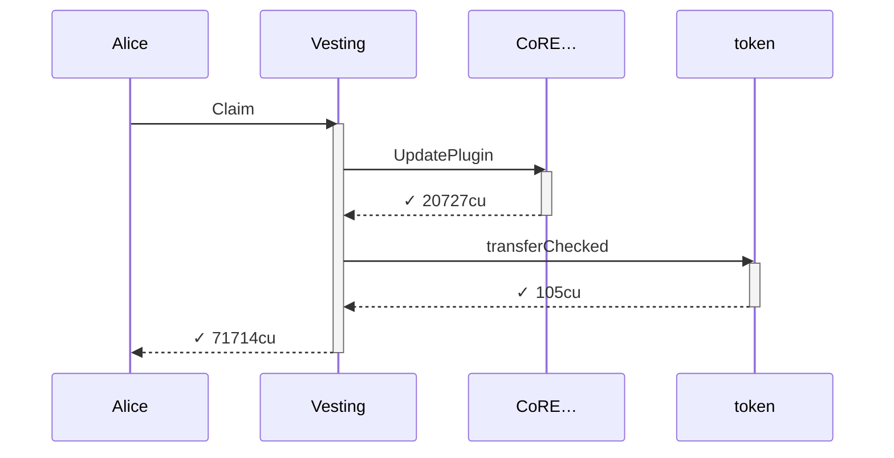
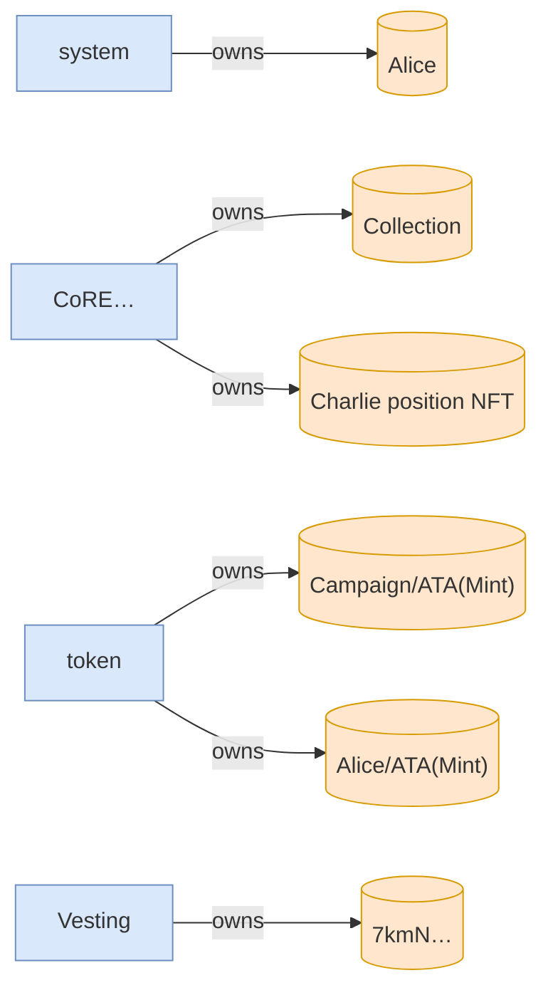

# full_lifecycle

**Source:** [`tests/full_lifecycle.rs` L23](https://github.com/cds-turbin3/vesting-position/blob/c4f43acad0bb9f007622fb43bc19ddc3610c7688/babelfish-tests/tests/full_lifecycle.rs#L23)






<details>
<summary>tree</summary>

```

Alice (71714cu)
└─ Vesting::Claim ✓ 71714cu
   ├─ CoRE…::UpdatePlugin ✓ 20727cu
   └─ token::transferChecked ✓ 105cu
```

</details>
