# full_lifecycle

**Source:** [`tests/full_lifecycle.rs` L24](https://github.com/cds-turbin3/vesting-position/blob/7b03c373db96dabae9440a8c98ced4c97068b325/babelfish-tests/tests/full_lifecycle.rs#L24)

> Given: a live campaign; Alice and Charlie whitelisted, Bob not

> Given: Bob, never whitelisted, now holds Alice's position NFT

Over 28 days: 12 moments; 2/2 law(s) held; 3/3 finally check(s) passed.

<details>
<summary>Cast</summary>

| name | address |
| --- | --- |
| Alice | 4wQQJM9LNuhinieNAqmHuPCm8LXDTVfhx84P32nAVE9P |
| Alice position NFT | 4QVsuwY3ob34zXWn921ANiD2Z88Hq8hizufySVtpKfsK |
| Bob | ErV63ApqLgh1Je5PdiVj6kzwkKJmLjKV41QoN9U4BNag |
| Campaign | 2rbEagbB2s6tm4BWjcCmYnPxEi8cmF6CqCYPK6WhKZrC |
| Charlie | H87xi4CUqrUPXzppV3jotTmre6DyR5pCaMk5bKQQBFTg |
| Charlie position NFT | 3oY2B3PLv23cDznh6ft2PcGFjqqESod1DYnbZe3RW4uA |
| Collection | DZ9SxyoirUd6SJtqTyLzGjyRuQjmxcs1ySPeuZqzmAA9 |
| Creator | 2ZBYuwtWiRzk7CwiCYTv5MQhQHDEaN4B8xhw4L7L3RY5 |
| Mint | J6WtRQHtRxemkWECcNq1wQAfgyJtsx7ZUT7Xpb53vo2N |
| Vesting | 7DkU9TQhcN87f2djZDd2MjjPZoXLfnZZj8HhybeZswX1 |
| campaignAta(campaign(Collection), Toke…, Mint) | BXgRMbNU5GHfjUAEUL4gc4dkK47Kbd26uZfbunemQyjQ |
| creatorAta(Creator, Toke…, Mint) | 7RKXPrw2SRFrpVR7h81dMPhHdaVV7y57tEYmDraizX43 |
| updateAuthority(Collection) | vGh5gMbD7AsVatTVNDo3pC7hveLFKdXbZ3eNt17chDs |
| userAta(Alice, Toke…, Mint) | 45PBE5WDayGKEeGHvaLP5VfqXSS5JoGVewXyVbSE8JSq |
| userAta(Bob, Toke…, Mint) | DP7csyre1YNuKdteez1puQMtq7kbgzhLKJabPePoNc39 |
| userAta(Charlie, Toke…, Mint) | 7NWR2QKmwfaPykvd5ANbrcLspWfNdTptcnyssMqSFi4 |

</details>

### Timeline

| time | Vault balance | Δ | Creator balance | Δ | Alice balance | Δ | receipt claimer | Charlie balance | Δ | Bob balance | Δ | comment |
| --- | --- | --- | --- | --- | --- | --- | --- | --- | --- | --- | --- | --- |
| T0 | 10,000,000,000,000 | +10,000,000,000,000 | 0 |  | — |  | — | — |  | — |  | Initialize (day 0) |
| T1 | 9,900,000,000,000 | -100,000,000,000 | 0 |  | — |  | — | — |  | — |  | FirstClaim (day 2) |
| T2 | 9,450,000,000,000 | -450,000,000,000 | 0 |  | 550,000,000,000 | +550,000,000,000 | 4wQQ… | — |  | — |  | Claim (day 16) |
| T3 | 8,350,000,000,000 | -1,100,000,000,000 | 0 |  | 550,000,000,000 |  | 4wQQ… | — |  | — |  | FirstClaim (day 16) |
| T4 | 8,350,000,000,000 |  | 0 |  | 550,000,000,000 |  | 4wQQ… | 1,100,000,000,000 | +1,100,000,000,000 | — |  | TransferPosition (day 16) |
| T5 | 8,350,000,000,000 |  | 0 |  | 550,000,000,000 |  | 4wQQ… | 1,100,000,000,000 |  | — |  | FirstClaim (day 16) |
| T6 | 8,350,000,000,000 |  | 0 |  | 550,000,000,000 |  | 4wQQ… | 1,100,000,000,000 |  | — |  | Claim (day 16) |
| T7 | 8,125,000,000,000 | -225,000,000,000 | 0 |  | 550,000,000,000 |  | 4wQQ… | 1,100,000,000,000 |  | — |  | Claim (day 23) |
| T8 | 7,675,000,000,000 | -450,000,000,000 | 0 |  | 550,000,000,000 |  | 4wQQ… | 1,550,000,000,000 | +450,000,000,000 | 225,000,000,000 | +225,000,000,000 | Claim (day 23) |
| T9 | 7,675,000,000,000 |  | 0 |  | 550,000,000,000 |  | 4wQQ… | 1,550,000,000,000 |  | 225,000,000,000 |  | TransferPosition (day 23) |
| T10 | 7,675,000,000,000 |  | 0 |  | 550,000,000,000 |  | 4wQQ… | 1,550,000,000,000 |  | 225,000,000,000 |  | Claim (day 23) |
| T11 | 7,405,000,000,000 | -270,000,000,000 | 0 |  | 820,000,000,000 | +270,000,000,000 | 4wQQ… | 1,550,000,000,000 |  | 225,000,000,000 |  | Claim (day 28) |

### T0: Initialize (day 0)

| observation | before | after |
| --- | --- | --- |
| Vault balance | — | 10,000,000,000,000 |
| Creator balance | — | 0 |

## Phase: Alice claims and vests

<details>
<summary>diagrams</summary>

### Sequence

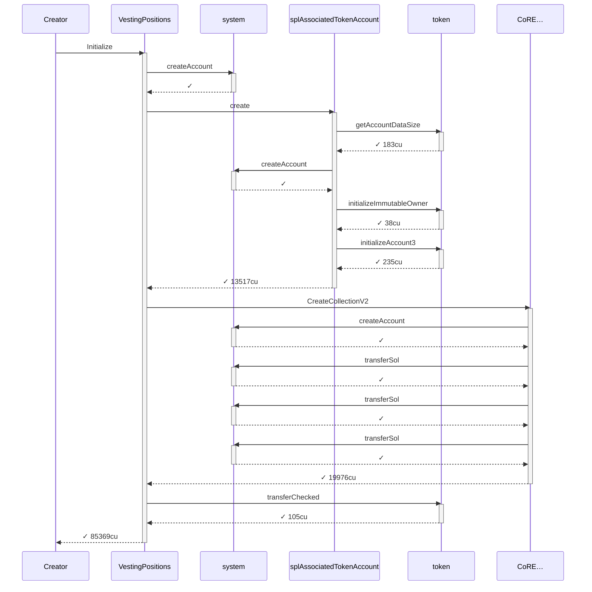

### Authority

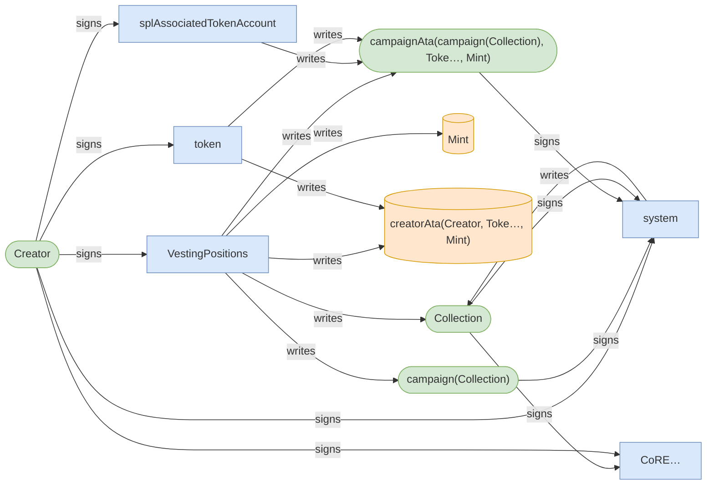

### Ownership

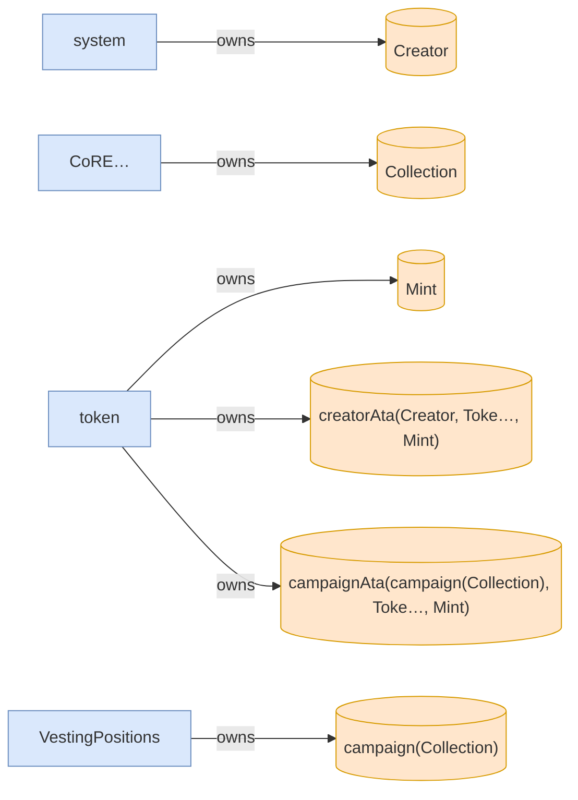

### Tree

```

Creator (85369cu)
└─ VestingPositions::Initialize ✓ 85369cu
   ├─ system::createAccount ✓
   ├─ splAssociatedTokenAccount::create ✓ 13517cu
   │  ├─ token::getAccountDataSize ✓ 183cu
   │  ├─ system::createAccount ✓
   │  ├─ token::initializeImmutableOwner ✓ 38cu
   │  └─ token::initializeAccount3 ✓ 235cu
   ├─ CoRE…::CreateCollectionV2 ✓ 19976cu
   │  ├─ system::createAccount ✓
   │  ├─ system::transferSol ✓
   │  ├─ system::transferSol ✓
   │  └─ system::transferSol ✓
   └─ token::transferChecked ✓ 105cu
```

</details>

*2 days pass.*

### T1: FirstClaim (day 2)

| observation | before | after |
| --- | --- | --- |
| Vault balance | 10,000,000,000,000 | 9,900,000,000,000 |

<details>
<summary>diagrams</summary>

### Sequence


### Authority


### Ownership

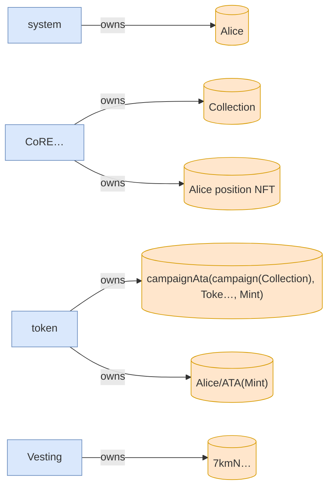

### Tree

```

Alice (163771cu)
├─ Comp…::? ✓
└─ Vesting::Claim ✓ 163621cu
   ├─ splAssociatedTokenAccount::create ✓ 13416cu
   │  ├─ token::getAccountDataSize ✓ 183cu
   │  ├─ system::createAccount ✓
   │  ├─ token::initializeImmutableOwner ✓ 38cu
   │  └─ token::initializeAccount3 ✓ 235cu
   ├─ system::createAccount ✓
   ├─ CoRE…::CreateV2 ✓ 29646cu
   │  ├─ system::createAccount ✓
   │  ├─ system::transferSol ✓
   │  ├─ system::transferSol ✓
   │  ├─ system::transferSol ✓
   │  └─ system::transferSol ✓
   └─ token::transferChecked ✓ 105cu
```

</details>

*1252800 seconds pass.*

### T2: Claim (day 16)

| observation | before | after |
| --- | --- | --- |
| Vault balance | 9,900,000,000,000 | 9,450,000,000,000 |
| Alice balance | — | 550,000,000,000 |
| receipt claimer | — | 4wQQ… |

<details>
<summary>diagrams</summary>

### Sequence

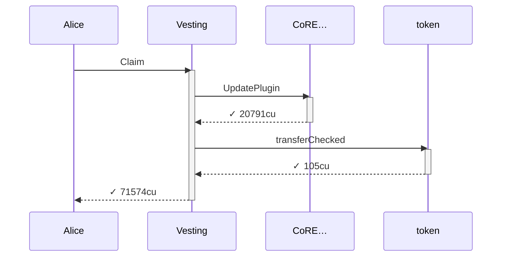

### Authority

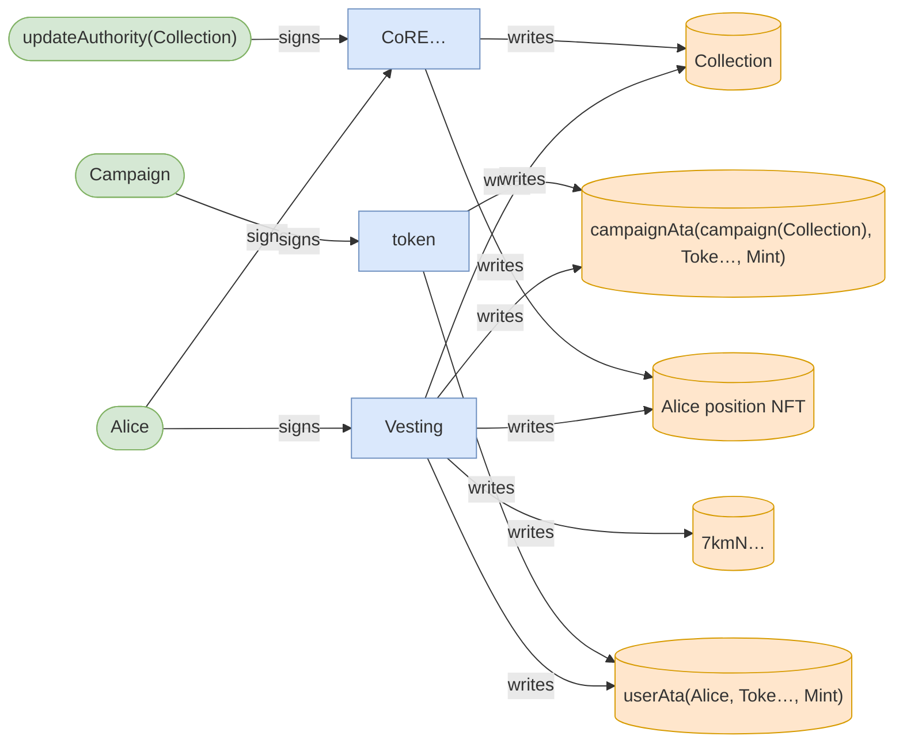

### Ownership

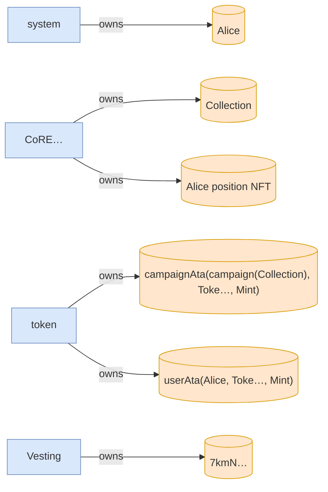

### Tree

```

Alice (71574cu)
└─ Vesting::Claim ✓ 71574cu
   ├─ CoRE…::UpdatePlugin ✓ 20791cu
   └─ token::transferChecked ✓ 105cu
```

</details>

### T3: FirstClaim (day 16)

| observation | before | after |
| --- | --- | --- |
| Vault balance | 9,450,000,000,000 | 8,350,000,000,000 |

## Phase: positions change hands

<details>
<summary>diagrams</summary>

### Sequence


### Authority

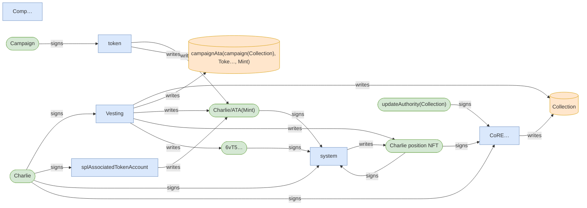

### Ownership

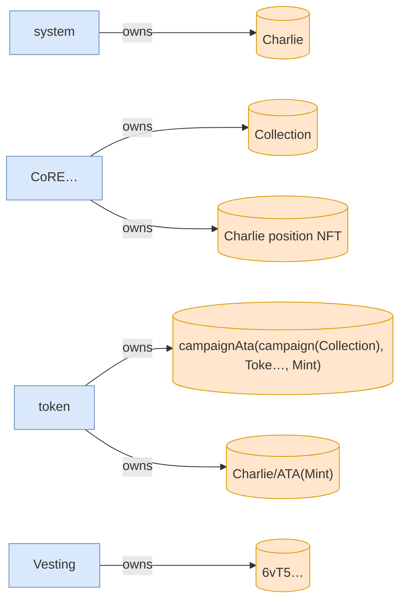

### Tree

```

Charlie (160754cu)
├─ Comp…::? ✓
└─ Vesting::Claim ✓ 160604cu
   ├─ splAssociatedTokenAccount::create ✓ 13416cu
   │  ├─ token::getAccountDataSize ✓ 183cu
   │  ├─ system::createAccount ✓
   │  ├─ token::initializeImmutableOwner ✓ 38cu
   │  └─ token::initializeAccount3 ✓ 235cu
   ├─ system::createAccount ✓
   ├─ CoRE…::CreateV2 ✓ 29342cu
   │  ├─ system::createAccount ✓
   │  ├─ system::transferSol ✓
   │  ├─ system::transferSol ✓
   │  ├─ system::transferSol ✓
   │  └─ system::transferSol ✓
   └─ token::transferChecked ✓ 105cu
```

</details>

### T4: TransferPosition (day 16)

| observation | before | after |
| --- | --- | --- |
| Charlie balance | — | 1,100,000,000,000 |

<details>
<summary>diagrams</summary>

### Sequence

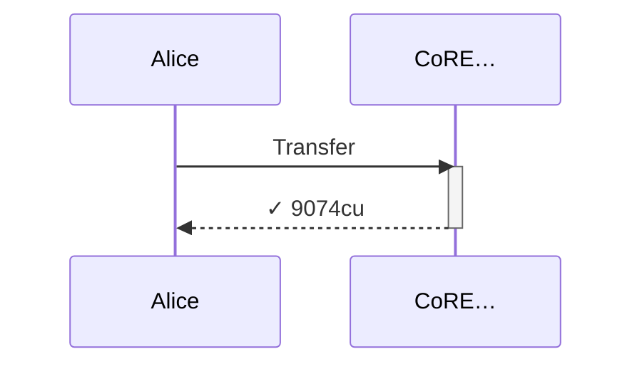

### Authority

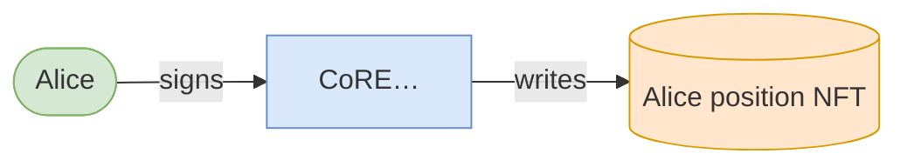

### Ownership

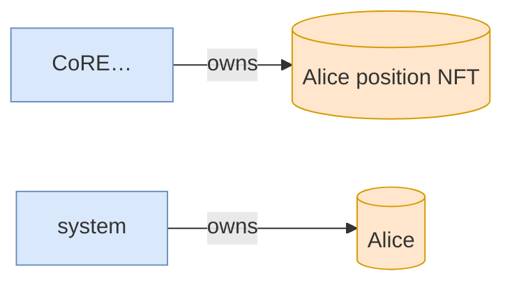

### Tree

```

Alice (9074cu)
└─ CoRE…::Transfer ✓ 9074cu
```

</details>

### T5: FirstClaim (day 16)

- [x] refused: AlreadyClaimed — InstructionError(0, Custom(6012))

<details>
<summary>diagrams</summary>

### Sequence


### Authority

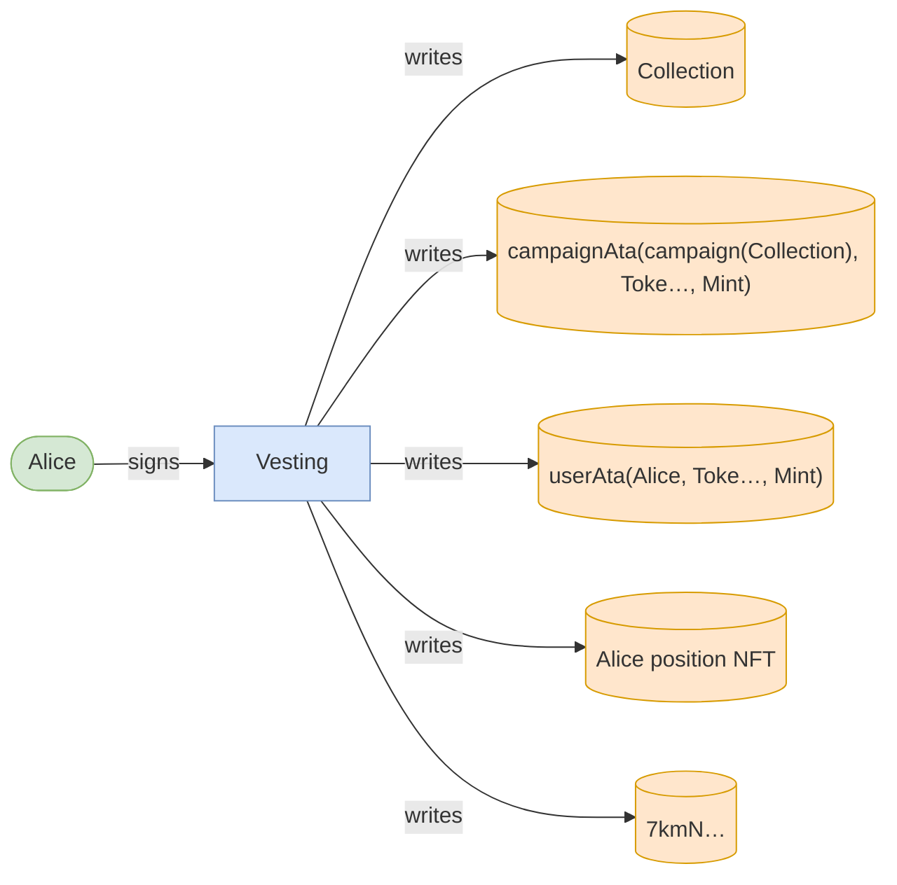

### Ownership


### Tree

```

Alice (19067cu)
└─ Vesting::Claim ✗ 19067cu
```

</details>

### T6: Claim (day 16)

- [x] refused: NotAssetOwner — InstructionError(0, Custom(6016))

## Phase: Bob claims Alice's position

<details>
<summary>diagrams</summary>

### Sequence

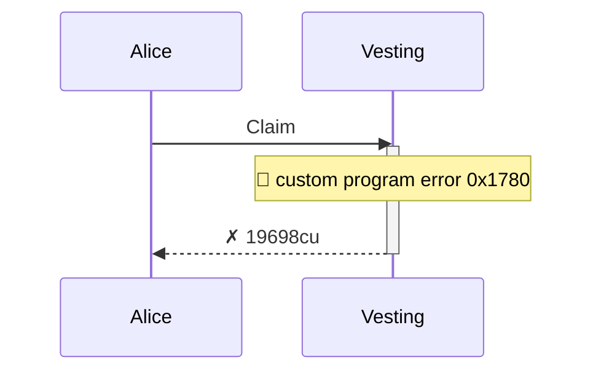

### Authority


### Ownership

```mermaid
flowchart LR
    system["system"]:::program
    Alice[("Alice")]:::state
    CoRE["CoRE…"]:::program
    Collection[("Collection")]:::state
    token["token"]:::program
    campaignAtacampaignCollectionTokeMint[("campaignAta(campaign(Collection), Toke…, Mint)")]:::state
    userAtaAliceTokeMint[("userAta(Alice, Toke…, Mint)")]:::state
    AlicepositionNFT[("Alice position NFT")]:::state
    Vesting["Vesting"]:::program
    7kmN[("7kmN…")]:::state
    system -->|owns| Alice
    CoRE -->|owns| Collection
    token -->|owns| campaignAtacampaignCollectionTokeMint
    token -->|owns| userAtaAliceTokeMint
    CoRE -->|owns| AlicepositionNFT
    Vesting -->|owns| 7kmN
    classDef program fill:#dae8fc,stroke:#6c8ebf;
    classDef signer fill:#d5e8d4,stroke:#82b366;
    classDef state fill:#ffe6cc,stroke:#d79b00;
```

### Tree

```

Alice (19698cu)
└─ Vesting::Claim ✗ 19698cu
```

</details>

*626400 seconds pass.*

### T7: Claim (day 23)

| observation | before | after |
| --- | --- | --- |
| Vault balance | 8,350,000,000,000 | 8,125,000,000,000 |

<details>
<summary>diagrams</summary>

### Sequence

```mermaid
sequenceDiagram
    participant p0 as Bob
    participant p1 as Vesting
    participant p2 as splAssociatedTokenAccount
    participant p3 as token
    participant p4 as system
    participant p5 as CoRE…
    Note over p0: 🧐 never whitelisted  claims through Alice's transferred position
    p0->>p1: Claim
    activate p1
    p1->>p2: create
    activate p2
    p2->>p3: getAccountDataSize
    activate p3
    p3-->>p2: ✓ 183cu
    deactivate p3
    p2->>p4: createAccount
    activate p4
    p4-->>p2: ✓
    deactivate p4
    p2->>p3: initializeImmutableOwner
    activate p3
    p3-->>p2: ✓ 38cu
    deactivate p3
    p2->>p3: initializeAccount3
    activate p3
    p3-->>p2: ✓ 235cu
    deactivate p3
    p2-->>p1: ✓ 13416cu
    deactivate p2
    p1->>p4: createAccount
    activate p4
    p4-->>p1: ✓
    deactivate p4
    p1->>p5: UpdatePlugin
    activate p5
    p5-->>p1: ✓ 20791cu
    deactivate p5
    p1->>p3: transferChecked
    activate p3
    p3-->>p1: ✓ 105cu
    deactivate p3
    p1-->>p0: ✓ 91743cu
    deactivate p1
```

### Authority

```mermaid
flowchart LR
    Vesting["Vesting"]:::program
    Bob(["Bob"]):::signer
    Collection[("Collection")]:::state
    campaignAtacampaignCollectionTokeMint[("campaignAta(campaign(Collection), Toke…, Mint)")]:::state
    userAtaBobTokeMint(["userAta(Bob, Toke…, Mint)"]):::signer
    AlicepositionNFT[("Alice position NFT")]:::state
    C6G6(["C6G6…"]):::signer
    splAssociatedTokenAccount["splAssociatedTokenAccount"]:::program
    token["token"]:::program
    system["system"]:::program
    CoRE["CoRE…"]:::program
    updateAuthorityCollection(["updateAuthority(Collection)"]):::signer
    Campaign(["Campaign"]):::signer
    Bob -->|signs| Vesting
    Vesting -->|writes| Collection
    Vesting -->|writes| campaignAtacampaignCollectionTokeMint
    Vesting -->|writes| userAtaBobTokeMint
    Vesting -->|writes| AlicepositionNFT
    Vesting -->|writes| C6G6
    Bob -->|signs| splAssociatedTokenAccount
    splAssociatedTokenAccount -->|writes| userAtaBobTokeMint
    Bob -->|signs| system
    userAtaBobTokeMint -->|signs| system
    token -->|writes| userAtaBobTokeMint
    C6G6 -->|signs| system
    CoRE -->|writes| AlicepositionNFT
    CoRE -->|writes| Collection
    Bob -->|signs| CoRE
    updateAuthorityCollection -->|signs| CoRE
    token -->|writes| campaignAtacampaignCollectionTokeMint
    Campaign -->|signs| token
    classDef program fill:#dae8fc,stroke:#6c8ebf;
    classDef signer fill:#d5e8d4,stroke:#82b366;
    classDef state fill:#ffe6cc,stroke:#d79b00;
```

### Ownership

```mermaid
flowchart LR
    system["system"]:::program
    Bob[("Bob")]:::state
    CoRE["CoRE…"]:::program
    Collection[("Collection")]:::state
    token["token"]:::program
    campaignAtacampaignCollectionTokeMint[("campaignAta(campaign(Collection), Toke…, Mint)")]:::state
    userAtaBobTokeMint[("userAta(Bob, Toke…, Mint)")]:::state
    AlicepositionNFT[("Alice position NFT")]:::state
    Vesting["Vesting"]:::program
    C6G6[("C6G6…")]:::state
    system -->|owns| Bob
    CoRE -->|owns| Collection
    token -->|owns| campaignAtacampaignCollectionTokeMint
    token -->|owns| userAtaBobTokeMint
    CoRE -->|owns| AlicepositionNFT
    Vesting -->|owns| C6G6
    classDef program fill:#dae8fc,stroke:#6c8ebf;
    classDef signer fill:#d5e8d4,stroke:#82b366;
    classDef state fill:#ffe6cc,stroke:#d79b00;
```

### Tree

```

Bob (91743cu)
└─ Vesting::Claim ✓ 91743cu
   ├─ splAssociatedTokenAccount::create ✓ 13416cu
   │  ├─ token::getAccountDataSize ✓ 183cu
   │  ├─ system::createAccount ✓
   │  ├─ token::initializeImmutableOwner ✓ 38cu
   │  └─ token::initializeAccount3 ✓ 235cu
   ├─ system::createAccount ✓
   ├─ CoRE…::UpdatePlugin ✓ 20791cu
   └─ token::transferChecked ✓ 105cu
```

</details>

### T8: Claim (day 23)

| observation | before | after |
| --- | --- | --- |
| Vault balance | 8,125,000,000,000 | 7,675,000,000,000 |
| Charlie balance | 1,100,000,000,000 | 1,550,000,000,000 |
| Bob balance | — | 225,000,000,000 |

<details>
<summary>diagrams</summary>

### Sequence

```mermaid
sequenceDiagram
    participant p0 as Charlie
    participant p1 as Vesting
    participant p2 as CoRE…
    participant p3 as token
    p0->>p1: Claim
    activate p1
    p1->>p2: UpdatePlugin
    activate p2
    p2-->>p1: ✓ 20727cu
    deactivate p2
    p1->>p3: transferChecked
    activate p3
    p3-->>p1: ✓ 105cu
    deactivate p3
    p1-->>p0: ✓ 71714cu
    deactivate p1
```

### Authority

```mermaid
flowchart LR
    Vesting["Vesting"]:::program
    Charlie(["Charlie"]):::signer
    Collection[("Collection")]:::state
    campaignAtacampaignCollectionTokeMint[("campaignAta(campaign(Collection), Toke…, Mint)")]:::state
    userAtaCharlieTokeMint[("userAta(Charlie, Toke…, Mint)")]:::state
    CharliepositionNFT[("Charlie position NFT")]:::state
    6vT5[("6vT5…")]:::state
    CoRE["CoRE…"]:::program
    updateAuthorityCollection(["updateAuthority(Collection)"]):::signer
    token["token"]:::program
    Campaign(["Campaign"]):::signer
    Charlie -->|signs| Vesting
    Vesting -->|writes| Collection
    Vesting -->|writes| campaignAtacampaignCollectionTokeMint
    Vesting -->|writes| userAtaCharlieTokeMint
    Vesting -->|writes| CharliepositionNFT
    Vesting -->|writes| 6vT5
    CoRE -->|writes| CharliepositionNFT
    CoRE -->|writes| Collection
    Charlie -->|signs| CoRE
    updateAuthorityCollection -->|signs| CoRE
    token -->|writes| campaignAtacampaignCollectionTokeMint
    token -->|writes| userAtaCharlieTokeMint
    Campaign -->|signs| token
    classDef program fill:#dae8fc,stroke:#6c8ebf;
    classDef signer fill:#d5e8d4,stroke:#82b366;
    classDef state fill:#ffe6cc,stroke:#d79b00;
```

### Ownership

```mermaid
flowchart LR
    system["system"]:::program
    Charlie[("Charlie")]:::state
    CoRE["CoRE…"]:::program
    Collection[("Collection")]:::state
    token["token"]:::program
    campaignAtacampaignCollectionTokeMint[("campaignAta(campaign(Collection), Toke…, Mint)")]:::state
    userAtaCharlieTokeMint[("userAta(Charlie, Toke…, Mint)")]:::state
    CharliepositionNFT[("Charlie position NFT")]:::state
    Vesting["Vesting"]:::program
    6vT5[("6vT5…")]:::state
    system -->|owns| Charlie
    CoRE -->|owns| Collection
    token -->|owns| campaignAtacampaignCollectionTokeMint
    token -->|owns| userAtaCharlieTokeMint
    CoRE -->|owns| CharliepositionNFT
    Vesting -->|owns| 6vT5
    classDef program fill:#dae8fc,stroke:#6c8ebf;
    classDef signer fill:#d5e8d4,stroke:#82b366;
    classDef state fill:#ffe6cc,stroke:#d79b00;
```

### Tree

```

Charlie (71714cu)
└─ Vesting::Claim ✓ 71714cu
   ├─ CoRE…::UpdatePlugin ✓ 20727cu
   └─ token::transferChecked ✓ 105cu
```

</details>

### T9: TransferPosition (day 23)

<details>
<summary>diagrams</summary>

### Sequence

```mermaid
sequenceDiagram
    participant p0 as Charlie
    participant p1 as CoRE…
    p0->>p1: Transfer
    activate p1
    p1-->>p0: ✓ 9074cu
    deactivate p1
```

### Authority

```mermaid
flowchart LR
    CoRE["CoRE…"]:::program
    CharliepositionNFT[("Charlie position NFT")]:::state
    Charlie(["Charlie"]):::signer
    CoRE -->|writes| CharliepositionNFT
    Charlie -->|signs| CoRE
    classDef program fill:#dae8fc,stroke:#6c8ebf;
    classDef signer fill:#d5e8d4,stroke:#82b366;
    classDef state fill:#ffe6cc,stroke:#d79b00;
```

### Ownership

```mermaid
flowchart LR
    CoRE["CoRE…"]:::program
    CharliepositionNFT[("Charlie position NFT")]:::state
    system["system"]:::program
    Charlie[("Charlie")]:::state
    CoRE -->|owns| CharliepositionNFT
    system -->|owns| Charlie
    classDef program fill:#dae8fc,stroke:#6c8ebf;
    classDef signer fill:#d5e8d4,stroke:#82b366;
    classDef state fill:#ffe6cc,stroke:#d79b00;
```

### Tree

```

Charlie (9074cu)
└─ CoRE…::Transfer ✓ 9074cu
```

</details>

### T10: Claim (day 23)

- [x] refused: NotAssetOwner — InstructionError(0, Custom(6016))

<details>
<summary>diagrams</summary>

### Sequence

```mermaid
sequenceDiagram
    participant p0 as Charlie
    participant p1 as Vesting
    p0->>p1: Claim
    activate p1
    note over p1: 🚩 custom program error  0x1780
    p1-->>p0: ✗ 19698cu
    deactivate p1
```

### Authority

```mermaid
flowchart LR
    Vesting["Vesting"]:::program
    Charlie(["Charlie"]):::signer
    Collection[("Collection")]:::state
    campaignAtacampaignCollectionTokeMint[("campaignAta(campaign(Collection), Toke…, Mint)")]:::state
    userAtaCharlieTokeMint[("userAta(Charlie, Toke…, Mint)")]:::state
    CharliepositionNFT[("Charlie position NFT")]:::state
    6vT5[("6vT5…")]:::state
    Charlie -->|signs| Vesting
    Vesting -->|writes| Collection
    Vesting -->|writes| campaignAtacampaignCollectionTokeMint
    Vesting -->|writes| userAtaCharlieTokeMint
    Vesting -->|writes| CharliepositionNFT
    Vesting -->|writes| 6vT5
    classDef program fill:#dae8fc,stroke:#6c8ebf;
    classDef signer fill:#d5e8d4,stroke:#82b366;
    classDef state fill:#ffe6cc,stroke:#d79b00;
```

### Ownership

```mermaid
flowchart LR
    system["system"]:::program
    Charlie[("Charlie")]:::state
    CoRE["CoRE…"]:::program
    Collection[("Collection")]:::state
    token["token"]:::program
    campaignAtacampaignCollectionTokeMint[("campaignAta(campaign(Collection), Toke…, Mint)")]:::state
    userAtaCharlieTokeMint[("userAta(Charlie, Toke…, Mint)")]:::state
    CharliepositionNFT[("Charlie position NFT")]:::state
    Vesting["Vesting"]:::program
    6vT5[("6vT5…")]:::state
    system -->|owns| Charlie
    CoRE -->|owns| Collection
    token -->|owns| campaignAtacampaignCollectionTokeMint
    token -->|owns| userAtaCharlieTokeMint
    CoRE -->|owns| CharliepositionNFT
    Vesting -->|owns| 6vT5
    classDef program fill:#dae8fc,stroke:#6c8ebf;
    classDef signer fill:#d5e8d4,stroke:#82b366;
    classDef state fill:#ffe6cc,stroke:#d79b00;
```

### Tree

```

Charlie (19698cu)
└─ Vesting::Claim ✗ 19698cu
```

</details>

*375840 seconds pass.*

### T11: Claim (day 28)

| observation | before | after |
| --- | --- | --- |
| Vault balance | 7,675,000,000,000 | 7,405,000,000,000 |
| Alice balance | 550,000,000,000 | 820,000,000,000 |

<details>
<summary>diagrams</summary>

### Sequence

```mermaid
sequenceDiagram
    participant p0 as Alice
    participant p1 as Vesting
    participant p2 as CoRE…
    participant p3 as token
    p0->>p1: Claim
    activate p1
    p1->>p2: UpdatePlugin
    activate p2
    p2-->>p1: ✓ 20727cu
    deactivate p2
    p1->>p3: transferChecked
    activate p3
    p3-->>p1: ✓ 105cu
    deactivate p3
    p1-->>p0: ✓ 71714cu
    deactivate p1
```

### Authority

```mermaid
flowchart LR
    Vesting["Vesting"]:::program
    Alice(["Alice"]):::signer
    Collection[("Collection")]:::state
    campaignAtacampaignCollectionTokeMint[("campaignAta(campaign(Collection), Toke…, Mint)")]:::state
    userAtaAliceTokeMint[("userAta(Alice, Toke…, Mint)")]:::state
    CharliepositionNFT[("Charlie position NFT")]:::state
    7kmN[("7kmN…")]:::state
    CoRE["CoRE…"]:::program
    updateAuthorityCollection(["updateAuthority(Collection)"]):::signer
    token["token"]:::program
    Campaign(["Campaign"]):::signer
    Alice -->|signs| Vesting
    Vesting -->|writes| Collection
    Vesting -->|writes| campaignAtacampaignCollectionTokeMint
    Vesting -->|writes| userAtaAliceTokeMint
    Vesting -->|writes| CharliepositionNFT
    Vesting -->|writes| 7kmN
    CoRE -->|writes| CharliepositionNFT
    CoRE -->|writes| Collection
    Alice -->|signs| CoRE
    updateAuthorityCollection -->|signs| CoRE
    token -->|writes| campaignAtacampaignCollectionTokeMint
    token -->|writes| userAtaAliceTokeMint
    Campaign -->|signs| token
    classDef program fill:#dae8fc,stroke:#6c8ebf;
    classDef signer fill:#d5e8d4,stroke:#82b366;
    classDef state fill:#ffe6cc,stroke:#d79b00;
```

### Ownership

```mermaid
flowchart LR
    system["system"]:::program
    Alice[("Alice")]:::state
    CoRE["CoRE…"]:::program
    Collection[("Collection")]:::state
    token["token"]:::program
    campaignAtacampaignCollectionTokeMint[("campaignAta(campaign(Collection), Toke…, Mint)")]:::state
    userAtaAliceTokeMint[("userAta(Alice, Toke…, Mint)")]:::state
    CharliepositionNFT[("Charlie position NFT")]:::state
    Vesting["Vesting"]:::program
    7kmN[("7kmN…")]:::state
    system -->|owns| Alice
    CoRE -->|owns| Collection
    token -->|owns| campaignAtacampaignCollectionTokeMint
    token -->|owns| userAtaAliceTokeMint
    CoRE -->|owns| CharliepositionNFT
    Vesting -->|owns| 7kmN
    classDef program fill:#dae8fc,stroke:#6c8ebf;
    classDef signer fill:#d5e8d4,stroke:#82b366;
    classDef state fill:#ffe6cc,stroke:#d79b00;
```

### Tree

```

Alice (71714cu)
└─ Vesting::Claim ✓ 71714cu
   ├─ CoRE…::UpdatePlugin ✓ 20727cu
   └─ token::transferChecked ✓ 105cu
```

</details>

## Conclusion

- claimed + vault conserves the total deposit ✓ across 12 moment(s)
- receipt claimer is constant ✓ across 12 moment(s)
- finally: six Claim-labeled transactions settled (subsequent claims, success or refusal) ✓
- finally: the campaign vault still holds an unclaimed remainder (no clawback ran) ✓
- finally: the receipt-claimer binding never broke ✓
