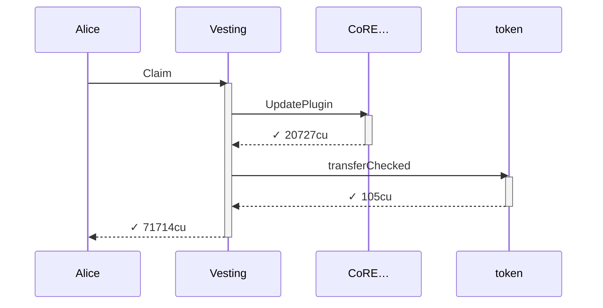
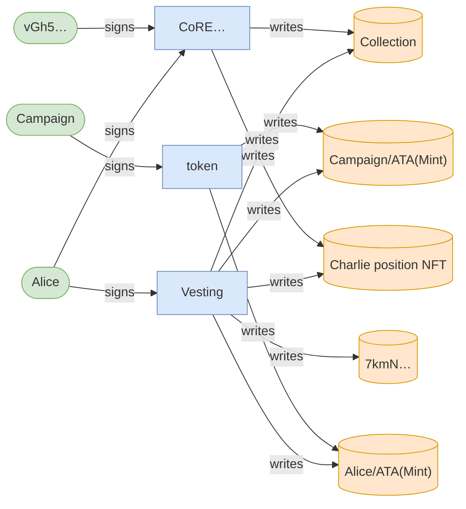
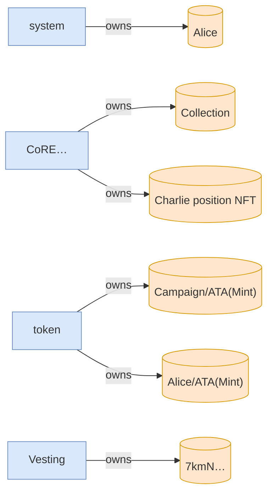

# full_lifecycle

**Source:** [`tests/full_lifecycle.rs` L23](https://github.com/cds-turbin3/vesting-position/blob/cbb8875460ccf5cc3d9023c540f31113adcd0573/babelfish-tests/tests/full_lifecycle.rs#L23)

### Action: Initialize

| account | before | after |
| --- | --- | --- |
| Creator | 10000000000000 | 0 |
| Vault | 0 | 10000000000000 |

<details>
<summary>tree</summary>

```

Creator (85369cu)
└─ VestingPositions::Initialize ✓ 85369cu
   ├─ system::createAccount ✓
   ├─ splAssociatedTokenAccount::create ✓ 13517cu
   │  ├─ token::getAccountDataSize ✓ 183cu
   │  ├─ system::createAccount ✓
   │  ├─ token::initializeImmutableOwner ✓ 38cu
   │  └─ token::initializeAccount3 ✓ 235cu
   ├─ CoRE…::CreateCollectionV2 ✓ 19976cu
   │  ├─ system::createAccount ✓
   │  ├─ system::transferSol ✓
   │  ├─ system::transferSol ✓
   │  └─ system::transferSol ✓
   └─ token::transferChecked ✓ 105cu
```

</details>

### Action: tx

| account | before | after |
| --- | --- | --- |
| Vault | 10000000000000 | 9900000000000 |
| whitelisted_1 | — | 100000000000 |

<details>
<summary>tree</summary>

```

Alice (163771cu)
├─ Comp…::? ✓
└─ Vesting::Claim ✓ 163621cu
   ├─ splAssociatedTokenAccount::create ✓ 13416cu
   │  ├─ token::getAccountDataSize ✓ 183cu
   │  ├─ system::createAccount ✓
   │  ├─ token::initializeImmutableOwner ✓ 38cu
   │  └─ token::initializeAccount3 ✓ 235cu
   ├─ system::createAccount ✓
   ├─ CoRE…::CreateV2 ✓ 29646cu
   │  ├─ system::createAccount ✓
   │  ├─ system::transferSol ✓
   │  ├─ system::transferSol ✓
   │  ├─ system::transferSol ✓
   │  └─ system::transferSol ✓
   └─ token::transferChecked ✓ 105cu
```

</details>

### Action: Claim

| account | before | after |
| --- | --- | --- |
| Vault | 9900000000000 | 9450000000000 |
| whitelisted_1 | 100000000000 | 550000000000 |

<details>
<summary>tree</summary>

```

Alice (71574cu)
└─ Vesting::Claim ✓ 71574cu
   ├─ CoRE…::UpdatePlugin ✓ 20791cu
   └─ token::transferChecked ✓ 105cu
```

</details>

### Action: tx

| account | before | after |
| --- | --- | --- |
| Vault | 9450000000000 | 8350000000000 |
| whitelisted_2 | — | 1100000000000 |

<details>
<summary>tree</summary>

```

Charlie (160754cu)
├─ Comp…::? ✓
└─ Vesting::Claim ✓ 160604cu
   ├─ splAssociatedTokenAccount::create ✓ 13416cu
   │  ├─ token::getAccountDataSize ✓ 183cu
   │  ├─ system::createAccount ✓
   │  ├─ token::initializeImmutableOwner ✓ 38cu
   │  └─ token::initializeAccount3 ✓ 235cu
   ├─ system::createAccount ✓
   ├─ CoRE…::CreateV2 ✓ 29342cu
   │  ├─ system::createAccount ✓
   │  ├─ system::transferSol ✓
   │  ├─ system::transferSol ✓
   │  ├─ system::transferSol ✓
   │  └─ system::transferSol ✓
   └─ token::transferChecked ✓ 105cu
```

</details>

<details>
<summary>tree</summary>

```

Alice (19067cu)
└─ Vesting::Claim ✗ 19067cu
```

</details>

<details>
<summary>tree</summary>

```

Alice (19698cu)
└─ Vesting::Claim ✗ 19698cu
```

</details>

### Action: Claim

| account | before | after |
| --- | --- | --- |
| Vault | 8350000000000 | 8125000000000 |
| not_whitelisted | — | 225000000000 |

<details>
<summary>tree</summary>

```

Bob (91743cu)
└─ Vesting::Claim ✓ 91743cu
   ├─ splAssociatedTokenAccount::create ✓ 13416cu
   │  ├─ token::getAccountDataSize ✓ 183cu
   │  ├─ system::createAccount ✓
   │  ├─ token::initializeImmutableOwner ✓ 38cu
   │  └─ token::initializeAccount3 ✓ 235cu
   ├─ system::createAccount ✓
   ├─ CoRE…::UpdatePlugin ✓ 20791cu
   └─ token::transferChecked ✓ 105cu
```

</details>

### Action: Claim

| account | before | after |
| --- | --- | --- |
| Vault | 8125000000000 | 7675000000000 |
| whitelisted_2 | 1100000000000 | 1550000000000 |

<details>
<summary>tree</summary>

```

Charlie (71714cu)
└─ Vesting::Claim ✓ 71714cu
   ├─ CoRE…::UpdatePlugin ✓ 20727cu
   └─ token::transferChecked ✓ 105cu
```

</details>

<details>
<summary>tree</summary>

```

Charlie (19698cu)
└─ Vesting::Claim ✗ 19698cu
```

</details>

### Action: Claim

| account | before | after |
| --- | --- | --- |
| Vault | 7675000000000 | 7405000000000 |
| whitelisted_1 | 550000000000 | 820000000000 |

<details>
<summary>tree</summary>

```

Alice (71714cu)
└─ Vesting::Claim ✓ 71714cu
   ├─ CoRE…::UpdatePlugin ✓ 20727cu
   └─ token::transferChecked ✓ 105cu
```

</details>







<details>
<summary>tree</summary>

```

Alice (71714cu)
└─ Vesting::Claim ✓ 71714cu
   ├─ CoRE…::UpdatePlugin ✓ 20727cu
   └─ token::transferChecked ✓ 105cu
```

</details>
