# full_lifecycle

**Source:** [`tests/full_lifecycle.rs` L23](https://github.com/cds-turbin3/vesting-position/blob/d7284035bc429fc5d6367f7936c0e522cc6549d8/babelfish-tests/tests/full_lifecycle.rs#L23)

### Action: Initialize

| account | before | after |
| --- | --- | --- |
| Creator | 10000000000000 | 0 |
| Vault | 0 | 10000000000000 |

<details>
<summary>tree</summary>

```

Creator (85369cu)
└─ VestingPositions::Initialize ✓ 85369cu
   ├─ system::createAccount ✓
   ├─ splAssociatedTokenAccount::create ✓ 13517cu
   │  ├─ token::getAccountDataSize ✓ 183cu
   │  ├─ system::createAccount ✓
   │  ├─ token::initializeImmutableOwner ✓ 38cu
   │  └─ token::initializeAccount3 ✓ 235cu
   ├─ CoRE…::CreateCollectionV2 ✓ 19976cu
   │  ├─ system::createAccount ✓
   │  ├─ system::transferSol ✓
   │  ├─ system::transferSol ✓
   │  └─ system::transferSol ✓
   └─ token::transferChecked ✓ 105cu
```

</details>

### Sequence

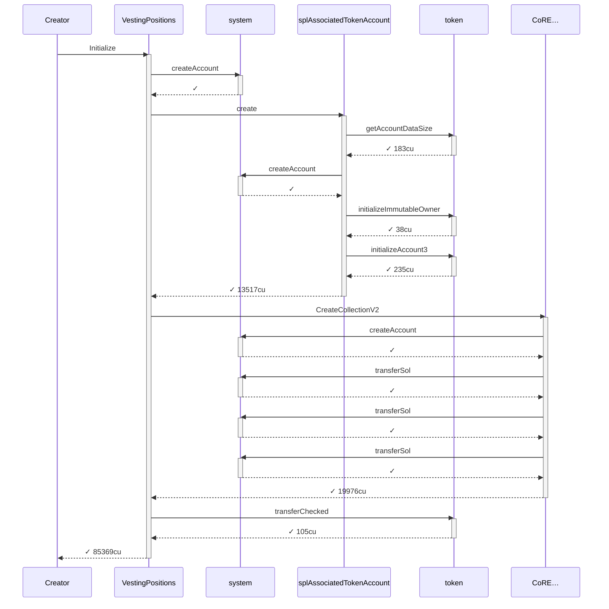

### Authority

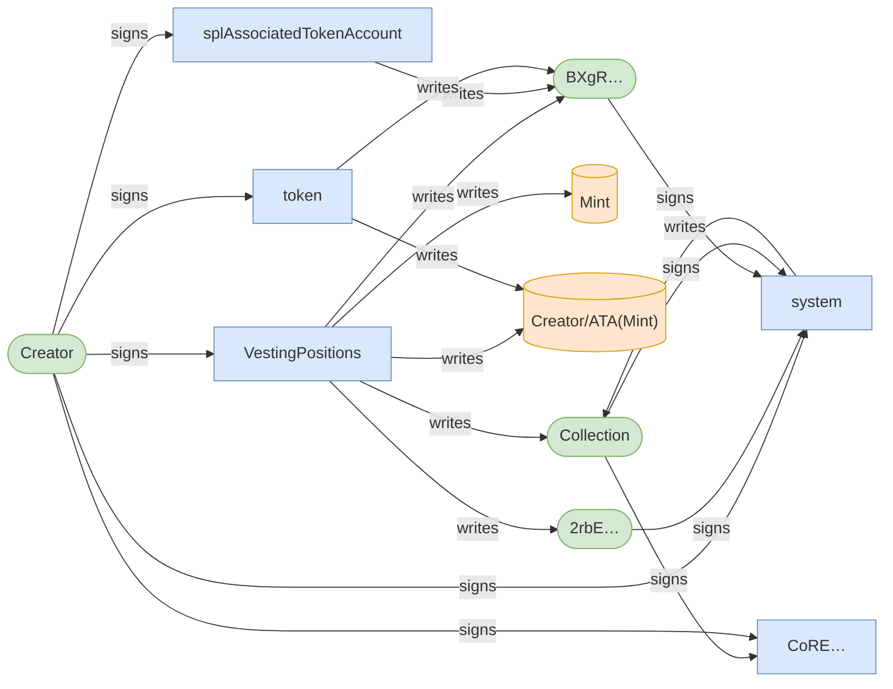

### Ownership

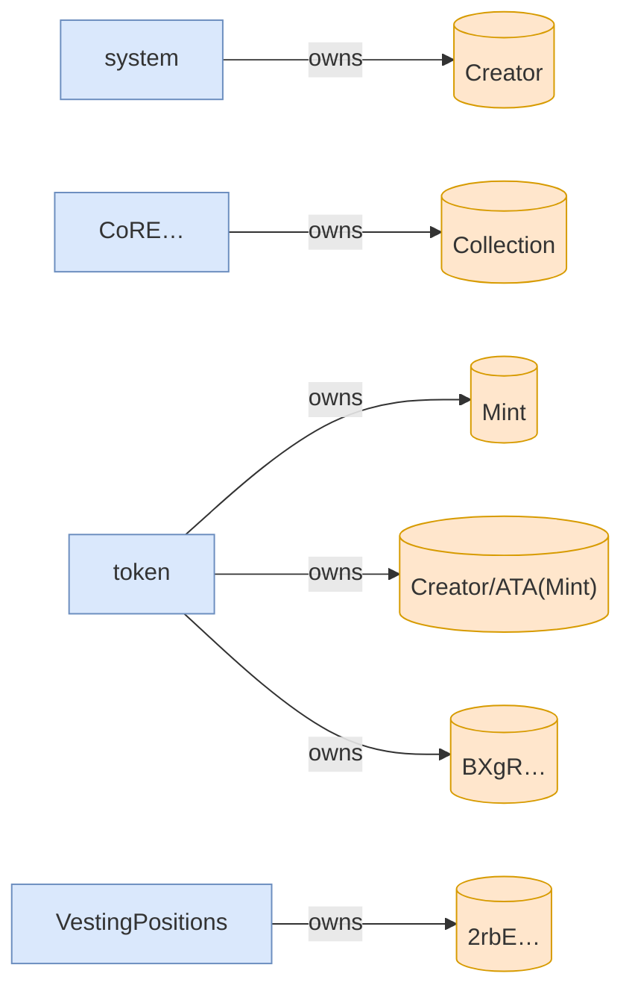

<details>
<summary>tree</summary>

```

Creator (85369cu)
└─ VestingPositions::Initialize ✓ 85369cu
   ├─ system::createAccount ✓
   ├─ splAssociatedTokenAccount::create ✓ 13517cu
   │  ├─ token::getAccountDataSize ✓ 183cu
   │  ├─ system::createAccount ✓
   │  ├─ token::initializeImmutableOwner ✓ 38cu
   │  └─ token::initializeAccount3 ✓ 235cu
   ├─ CoRE…::CreateCollectionV2 ✓ 19976cu
   │  ├─ system::createAccount ✓
   │  ├─ system::transferSol ✓
   │  ├─ system::transferSol ✓
   │  └─ system::transferSol ✓
   └─ token::transferChecked ✓ 105cu
```

</details>

## Phase: Alice claims and vests

### Action: Claim

| account | before | after |
| --- | --- | --- |
| Vault | 10000000000000 | 9900000000000 |
| Alice | — | 100000000000 |

<details>
<summary>tree</summary>

```

Alice (163771cu)
├─ Comp…::? ✓
└─ Vesting::Claim ✓ 163621cu
   ├─ splAssociatedTokenAccount::create ✓ 13416cu
   │  ├─ token::getAccountDataSize ✓ 183cu
   │  ├─ system::createAccount ✓
   │  ├─ token::initializeImmutableOwner ✓ 38cu
   │  └─ token::initializeAccount3 ✓ 235cu
   ├─ system::createAccount ✓
   ├─ CoRE…::CreateV2 ✓ 29646cu
   │  ├─ system::createAccount ✓
   │  ├─ system::transferSol ✓
   │  ├─ system::transferSol ✓
   │  ├─ system::transferSol ✓
   │  └─ system::transferSol ✓
   └─ token::transferChecked ✓ 105cu
```

</details>

### Sequence


### Authority

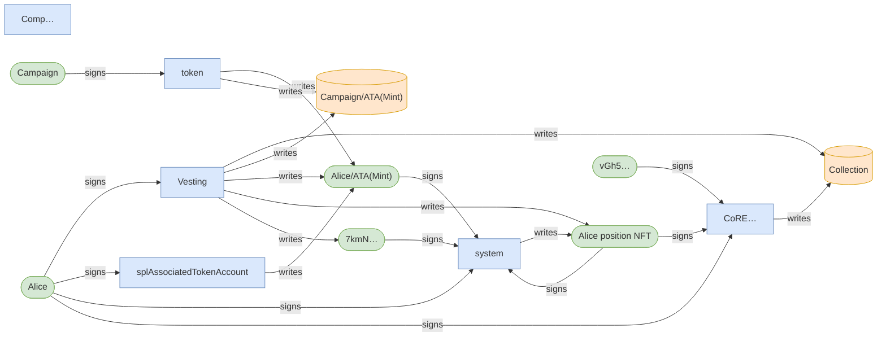

### Ownership

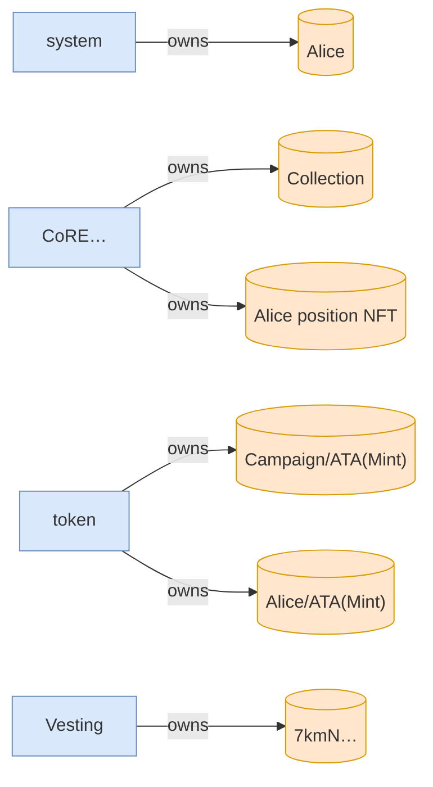

<details>
<summary>tree</summary>

```

Alice (163771cu)
├─ Comp…::? ✓
└─ Vesting::Claim ✓ 163621cu
   ├─ splAssociatedTokenAccount::create ✓ 13416cu
   │  ├─ token::getAccountDataSize ✓ 183cu
   │  ├─ system::createAccount ✓
   │  ├─ token::initializeImmutableOwner ✓ 38cu
   │  └─ token::initializeAccount3 ✓ 235cu
   ├─ system::createAccount ✓
   ├─ CoRE…::CreateV2 ✓ 29646cu
   │  ├─ system::createAccount ✓
   │  ├─ system::transferSol ✓
   │  ├─ system::transferSol ✓
   │  ├─ system::transferSol ✓
   │  └─ system::transferSol ✓
   └─ token::transferChecked ✓ 105cu
```

</details>

### Action: Claim

| account | before | after |
| --- | --- | --- |
| Vault | 9900000000000 | 9450000000000 |
| Alice | 100000000000 | 550000000000 |

<details>
<summary>tree</summary>

```

Alice (71574cu)
└─ Vesting::Claim ✓ 71574cu
   ├─ CoRE…::UpdatePlugin ✓ 20791cu
   └─ token::transferChecked ✓ 105cu
```

</details>

### Sequence

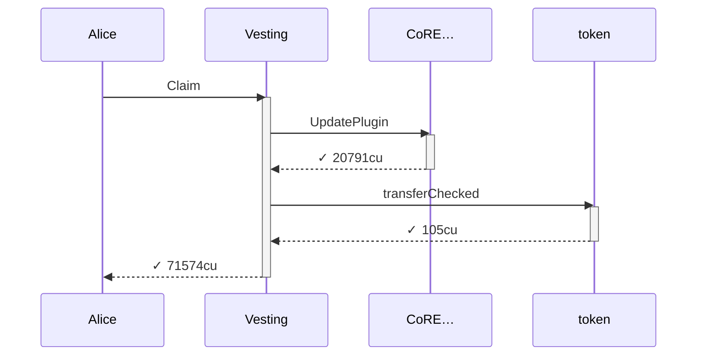

### Authority

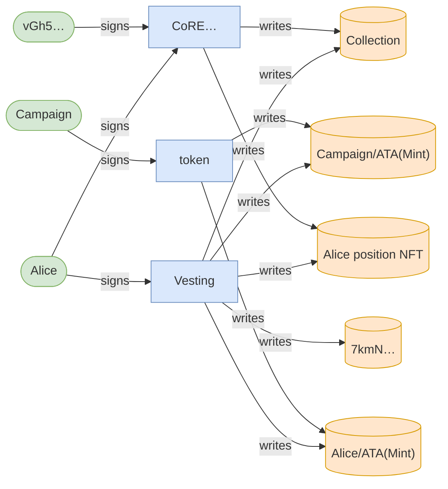

### Ownership


<details>
<summary>tree</summary>

```

Alice (71574cu)
└─ Vesting::Claim ✓ 71574cu
   ├─ CoRE…::UpdatePlugin ✓ 20791cu
   └─ token::transferChecked ✓ 105cu
```

</details>

### Action: Claim

| account | before | after |
| --- | --- | --- |
| Vault | 9450000000000 | 8350000000000 |
| Charlie | — | 1100000000000 |

<details>
<summary>tree</summary>

```

Charlie (160754cu)
├─ Comp…::? ✓
└─ Vesting::Claim ✓ 160604cu
   ├─ splAssociatedTokenAccount::create ✓ 13416cu
   │  ├─ token::getAccountDataSize ✓ 183cu
   │  ├─ system::createAccount ✓
   │  ├─ token::initializeImmutableOwner ✓ 38cu
   │  └─ token::initializeAccount3 ✓ 235cu
   ├─ system::createAccount ✓
   ├─ CoRE…::CreateV2 ✓ 29342cu
   │  ├─ system::createAccount ✓
   │  ├─ system::transferSol ✓
   │  ├─ system::transferSol ✓
   │  ├─ system::transferSol ✓
   │  └─ system::transferSol ✓
   └─ token::transferChecked ✓ 105cu
```

</details>

### Sequence


### Authority


### Ownership

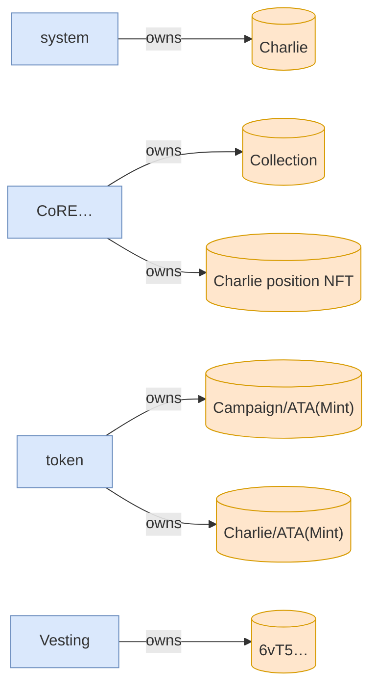

<details>
<summary>tree</summary>

```

Charlie (160754cu)
├─ Comp…::? ✓
└─ Vesting::Claim ✓ 160604cu
   ├─ splAssociatedTokenAccount::create ✓ 13416cu
   │  ├─ token::getAccountDataSize ✓ 183cu
   │  ├─ system::createAccount ✓
   │  ├─ token::initializeImmutableOwner ✓ 38cu
   │  └─ token::initializeAccount3 ✓ 235cu
   ├─ system::createAccount ✓
   ├─ CoRE…::CreateV2 ✓ 29342cu
   │  ├─ system::createAccount ✓
   │  ├─ system::transferSol ✓
   │  ├─ system::transferSol ✓
   │  ├─ system::transferSol ✓
   │  └─ system::transferSol ✓
   └─ token::transferChecked ✓ 105cu
```

</details>

## Phase: positions change hands

<details>
<summary>tree</summary>

```

Alice (19067cu)
└─ Vesting::Claim ✗ 19067cu
```

</details>

### Sequence


### Authority


### Ownership


<details>
<summary>tree</summary>

```

Alice (19067cu)
└─ Vesting::Claim ✗ 19067cu
```

</details>

<details>
<summary>tree</summary>

```

Alice (19698cu)
└─ Vesting::Claim ✗ 19698cu
```

</details>

### Sequence

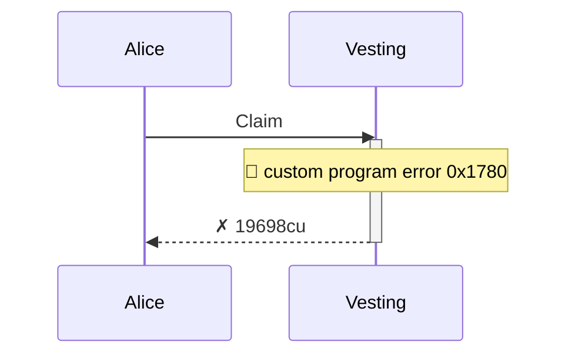

### Authority

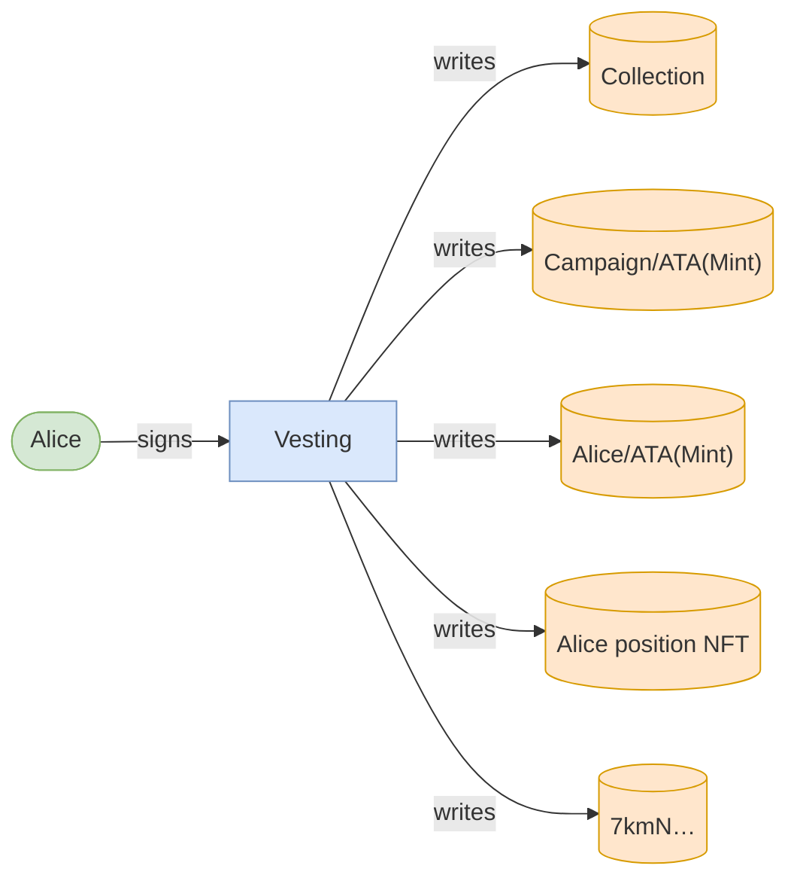

### Ownership


<details>
<summary>tree</summary>

```

Alice (19698cu)
└─ Vesting::Claim ✗ 19698cu
```

</details>

## Phase: Bob claims Alice's position

### Action: Claim

| account | before | after |
| --- | --- | --- |
| Vault | 8350000000000 | 8125000000000 |
| Bob | — | 225000000000 |

<details>
<summary>tree</summary>

```

Bob (91743cu)
└─ Vesting::Claim ✓ 91743cu
   ├─ splAssociatedTokenAccount::create ✓ 13416cu
   │  ├─ token::getAccountDataSize ✓ 183cu
   │  ├─ system::createAccount ✓
   │  ├─ token::initializeImmutableOwner ✓ 38cu
   │  └─ token::initializeAccount3 ✓ 235cu
   ├─ system::createAccount ✓
   ├─ CoRE…::UpdatePlugin ✓ 20791cu
   └─ token::transferChecked ✓ 105cu
```

</details>

### Sequence

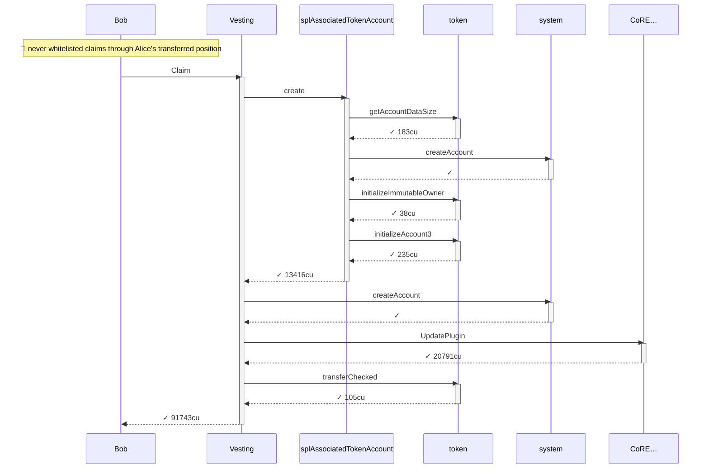

### Authority

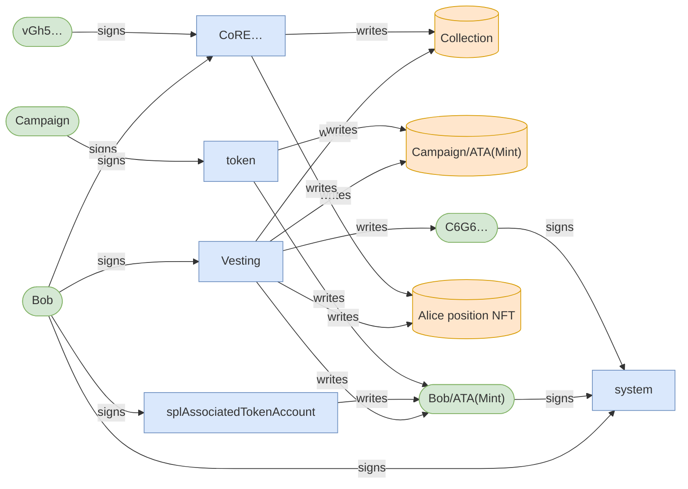

### Ownership

```mermaid
flowchart LR
    system["system"]:::program
    Bob[("Bob")]:::state
    CoRE["CoRE…"]:::program
    Collection[("Collection")]:::state
    token["token"]:::program
    CampaignATAMint[("Campaign/ATA(Mint)")]:::state
    BobATAMint[("Bob/ATA(Mint)")]:::state
    AlicepositionNFT[("Alice position NFT")]:::state
    Vesting["Vesting"]:::program
    C6G6[("C6G6…")]:::state
    system -->|owns| Bob
    CoRE -->|owns| Collection
    token -->|owns| CampaignATAMint
    token -->|owns| BobATAMint
    CoRE -->|owns| AlicepositionNFT
    Vesting -->|owns| C6G6
    classDef program fill:#dae8fc,stroke:#6c8ebf;
    classDef signer fill:#d5e8d4,stroke:#82b366;
    classDef state fill:#ffe6cc,stroke:#d79b00;
```

<details>
<summary>tree</summary>

```

Bob (91743cu)
└─ Vesting::Claim ✓ 91743cu
   ├─ splAssociatedTokenAccount::create ✓ 13416cu
   │  ├─ token::getAccountDataSize ✓ 183cu
   │  ├─ system::createAccount ✓
   │  ├─ token::initializeImmutableOwner ✓ 38cu
   │  └─ token::initializeAccount3 ✓ 235cu
   ├─ system::createAccount ✓
   ├─ CoRE…::UpdatePlugin ✓ 20791cu
   └─ token::transferChecked ✓ 105cu
```

</details>

### Action: Claim

| account | before | after |
| --- | --- | --- |
| Vault | 8125000000000 | 7675000000000 |
| Charlie | 1100000000000 | 1550000000000 |

<details>
<summary>tree</summary>

```

Charlie (71714cu)
└─ Vesting::Claim ✓ 71714cu
   ├─ CoRE…::UpdatePlugin ✓ 20727cu
   └─ token::transferChecked ✓ 105cu
```

</details>

### Sequence

```mermaid
sequenceDiagram
    participant p0 as Charlie
    participant p1 as Vesting
    participant p2 as CoRE…
    participant p3 as token
    p0->>p1: Claim
    activate p1
    p1->>p2: UpdatePlugin
    activate p2
    p2-->>p1: ✓ 20727cu
    deactivate p2
    p1->>p3: transferChecked
    activate p3
    p3-->>p1: ✓ 105cu
    deactivate p3
    p1-->>p0: ✓ 71714cu
    deactivate p1
```

### Authority

```mermaid
flowchart LR
    Vesting["Vesting"]:::program
    Charlie(["Charlie"]):::signer
    Collection[("Collection")]:::state
    CampaignATAMint[("Campaign/ATA(Mint)")]:::state
    CharlieATAMint[("Charlie/ATA(Mint)")]:::state
    CharliepositionNFT[("Charlie position NFT")]:::state
    6vT5[("6vT5…")]:::state
    CoRE["CoRE…"]:::program
    vGh5(["vGh5…"]):::signer
    token["token"]:::program
    Campaign(["Campaign"]):::signer
    Charlie -->|signs| Vesting
    Vesting -->|writes| Collection
    Vesting -->|writes| CampaignATAMint
    Vesting -->|writes| CharlieATAMint
    Vesting -->|writes| CharliepositionNFT
    Vesting -->|writes| 6vT5
    CoRE -->|writes| CharliepositionNFT
    CoRE -->|writes| Collection
    Charlie -->|signs| CoRE
    vGh5 -->|signs| CoRE
    token -->|writes| CampaignATAMint
    token -->|writes| CharlieATAMint
    Campaign -->|signs| token
    classDef program fill:#dae8fc,stroke:#6c8ebf;
    classDef signer fill:#d5e8d4,stroke:#82b366;
    classDef state fill:#ffe6cc,stroke:#d79b00;
```

### Ownership

```mermaid
flowchart LR
    system["system"]:::program
    Charlie[("Charlie")]:::state
    CoRE["CoRE…"]:::program
    Collection[("Collection")]:::state
    token["token"]:::program
    CampaignATAMint[("Campaign/ATA(Mint)")]:::state
    CharlieATAMint[("Charlie/ATA(Mint)")]:::state
    CharliepositionNFT[("Charlie position NFT")]:::state
    Vesting["Vesting"]:::program
    6vT5[("6vT5…")]:::state
    system -->|owns| Charlie
    CoRE -->|owns| Collection
    token -->|owns| CampaignATAMint
    token -->|owns| CharlieATAMint
    CoRE -->|owns| CharliepositionNFT
    Vesting -->|owns| 6vT5
    classDef program fill:#dae8fc,stroke:#6c8ebf;
    classDef signer fill:#d5e8d4,stroke:#82b366;
    classDef state fill:#ffe6cc,stroke:#d79b00;
```

<details>
<summary>tree</summary>

```

Charlie (71714cu)
└─ Vesting::Claim ✓ 71714cu
   ├─ CoRE…::UpdatePlugin ✓ 20727cu
   └─ token::transferChecked ✓ 105cu
```

</details>

<details>
<summary>tree</summary>

```

Charlie (19698cu)
└─ Vesting::Claim ✗ 19698cu
```

</details>

### Sequence

```mermaid
sequenceDiagram
    participant p0 as Charlie
    participant p1 as Vesting
    p0->>p1: Claim
    activate p1
    note over p1: 🚩 custom program error  0x1780
    p1-->>p0: ✗ 19698cu
    deactivate p1
```

### Authority

```mermaid
flowchart LR
    Vesting["Vesting"]:::program
    Charlie(["Charlie"]):::signer
    Collection[("Collection")]:::state
    CampaignATAMint[("Campaign/ATA(Mint)")]:::state
    CharlieATAMint[("Charlie/ATA(Mint)")]:::state
    CharliepositionNFT[("Charlie position NFT")]:::state
    6vT5[("6vT5…")]:::state
    Charlie -->|signs| Vesting
    Vesting -->|writes| Collection
    Vesting -->|writes| CampaignATAMint
    Vesting -->|writes| CharlieATAMint
    Vesting -->|writes| CharliepositionNFT
    Vesting -->|writes| 6vT5
    classDef program fill:#dae8fc,stroke:#6c8ebf;
    classDef signer fill:#d5e8d4,stroke:#82b366;
    classDef state fill:#ffe6cc,stroke:#d79b00;
```

### Ownership

```mermaid
flowchart LR
    system["system"]:::program
    Charlie[("Charlie")]:::state
    CoRE["CoRE…"]:::program
    Collection[("Collection")]:::state
    token["token"]:::program
    CampaignATAMint[("Campaign/ATA(Mint)")]:::state
    CharlieATAMint[("Charlie/ATA(Mint)")]:::state
    CharliepositionNFT[("Charlie position NFT")]:::state
    Vesting["Vesting"]:::program
    6vT5[("6vT5…")]:::state
    system -->|owns| Charlie
    CoRE -->|owns| Collection
    token -->|owns| CampaignATAMint
    token -->|owns| CharlieATAMint
    CoRE -->|owns| CharliepositionNFT
    Vesting -->|owns| 6vT5
    classDef program fill:#dae8fc,stroke:#6c8ebf;
    classDef signer fill:#d5e8d4,stroke:#82b366;
    classDef state fill:#ffe6cc,stroke:#d79b00;
```

<details>
<summary>tree</summary>

```

Charlie (19698cu)
└─ Vesting::Claim ✗ 19698cu
```

</details>

### Action: Claim

| account | before | after |
| --- | --- | --- |
| Vault | 7675000000000 | 7405000000000 |
| Alice | 550000000000 | 820000000000 |

<details>
<summary>tree</summary>

```

Alice (71714cu)
└─ Vesting::Claim ✓ 71714cu
   ├─ CoRE…::UpdatePlugin ✓ 20727cu
   └─ token::transferChecked ✓ 105cu
```

</details>

### Sequence

```mermaid
sequenceDiagram
    participant p0 as Alice
    participant p1 as Vesting
    participant p2 as CoRE…
    participant p3 as token
    p0->>p1: Claim
    activate p1
    p1->>p2: UpdatePlugin
    activate p2
    p2-->>p1: ✓ 20727cu
    deactivate p2
    p1->>p3: transferChecked
    activate p3
    p3-->>p1: ✓ 105cu
    deactivate p3
    p1-->>p0: ✓ 71714cu
    deactivate p1
```

### Authority

```mermaid
flowchart LR
    Vesting["Vesting"]:::program
    Alice(["Alice"]):::signer
    Collection[("Collection")]:::state
    CampaignATAMint[("Campaign/ATA(Mint)")]:::state
    AliceATAMint[("Alice/ATA(Mint)")]:::state
    CharliepositionNFT[("Charlie position NFT")]:::state
    7kmN[("7kmN…")]:::state
    CoRE["CoRE…"]:::program
    vGh5(["vGh5…"]):::signer
    token["token"]:::program
    Campaign(["Campaign"]):::signer
    Alice -->|signs| Vesting
    Vesting -->|writes| Collection
    Vesting -->|writes| CampaignATAMint
    Vesting -->|writes| AliceATAMint
    Vesting -->|writes| CharliepositionNFT
    Vesting -->|writes| 7kmN
    CoRE -->|writes| CharliepositionNFT
    CoRE -->|writes| Collection
    Alice -->|signs| CoRE
    vGh5 -->|signs| CoRE
    token -->|writes| CampaignATAMint
    token -->|writes| AliceATAMint
    Campaign -->|signs| token
    classDef program fill:#dae8fc,stroke:#6c8ebf;
    classDef signer fill:#d5e8d4,stroke:#82b366;
    classDef state fill:#ffe6cc,stroke:#d79b00;
```

### Ownership

```mermaid
flowchart LR
    system["system"]:::program
    Alice[("Alice")]:::state
    CoRE["CoRE…"]:::program
    Collection[("Collection")]:::state
    token["token"]:::program
    CampaignATAMint[("Campaign/ATA(Mint)")]:::state
    AliceATAMint[("Alice/ATA(Mint)")]:::state
    CharliepositionNFT[("Charlie position NFT")]:::state
    Vesting["Vesting"]:::program
    7kmN[("7kmN…")]:::state
    system -->|owns| Alice
    CoRE -->|owns| Collection
    token -->|owns| CampaignATAMint
    token -->|owns| AliceATAMint
    CoRE -->|owns| CharliepositionNFT
    Vesting -->|owns| 7kmN
    classDef program fill:#dae8fc,stroke:#6c8ebf;
    classDef signer fill:#d5e8d4,stroke:#82b366;
    classDef state fill:#ffe6cc,stroke:#d79b00;
```

<details>
<summary>tree</summary>

```

Alice (71714cu)
└─ Vesting::Claim ✓ 71714cu
   ├─ CoRE…::UpdatePlugin ✓ 20727cu
   └─ token::transferChecked ✓ 105cu
```

</details>
