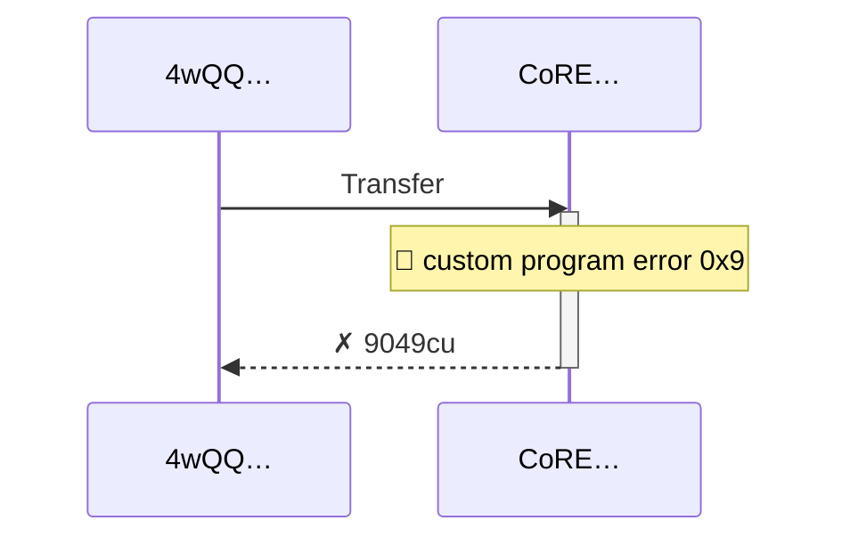
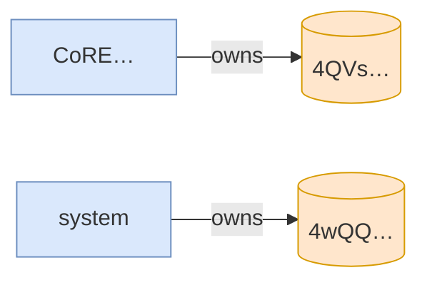

# fully_claimed_loyalty_badge_is_permanently_frozen

**Source:** [`tests/freeze.rs` L123](https://github.com/cds-turbin3/vesting-position/blob/c4f43acad0bb9f007622fb43bc19ddc3610c7688/babelfish-tests/tests/freeze.rs#L123)






<details>
<summary>tree</summary>

```

4wQQ… (9049cu)
└─ CoRE…::Transfer ✗ 9049cu
```

</details>
