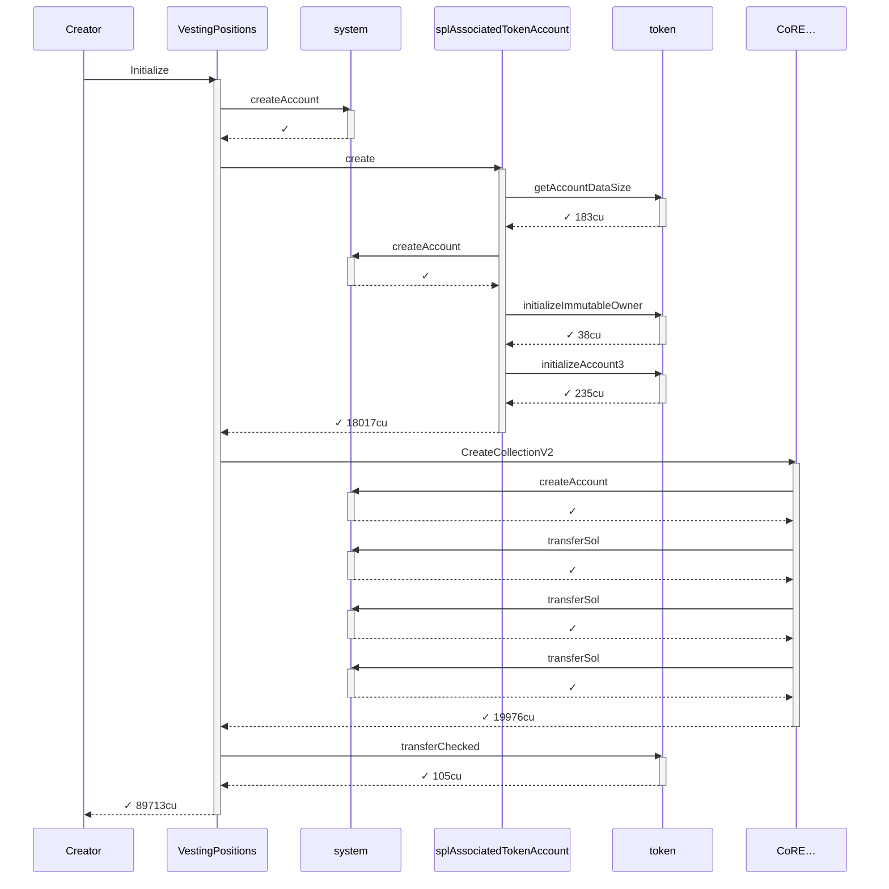
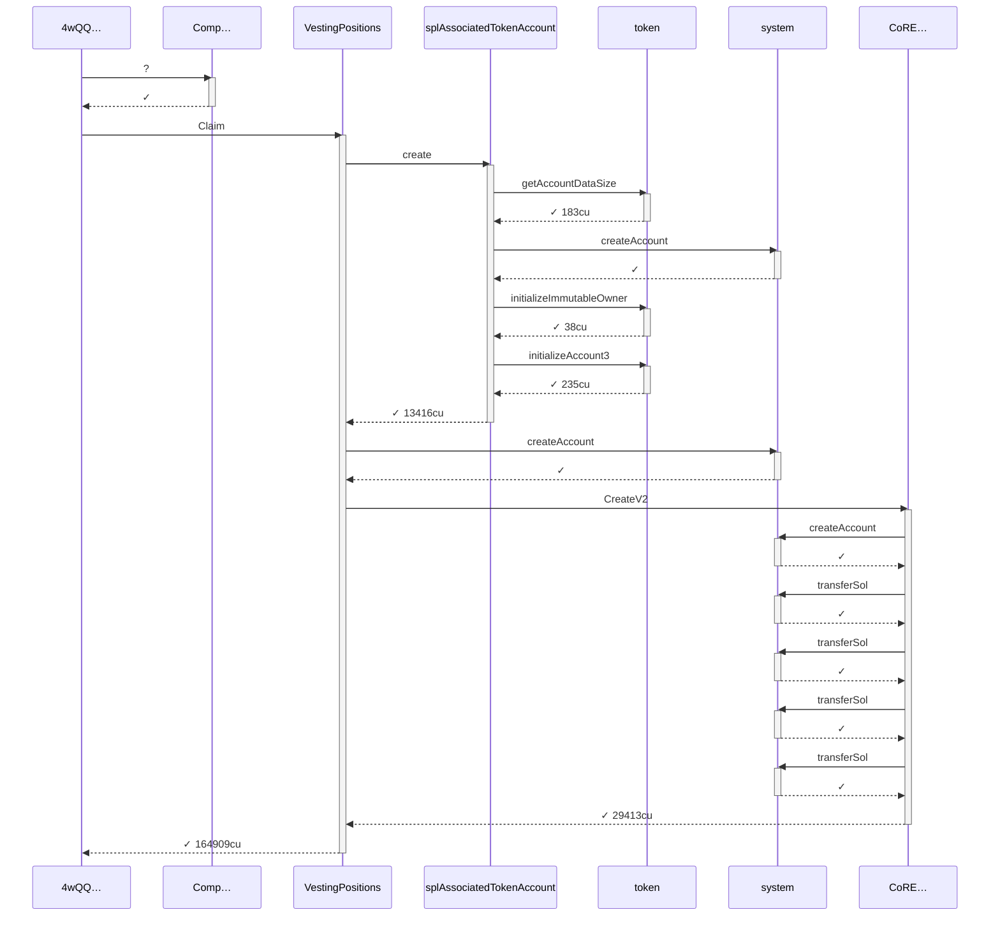
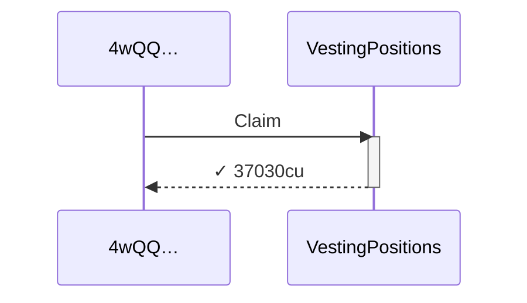

# scenario_1_alice_first_and_subsequent_claim

**Source:** [`tests/claim.rs` L38](https://github.com/cds-turbin3/vesting-position/blob/b53ae11528330be9e19c3e4b327a7dc3572aac7e/babelfish-tests/tests/claim.rs#L38)

Over 1 day: 3 moments.

<details>
<summary>Cast</summary>

| name | address |
| --- | --- |
| Collection | 9HbgSnRdBeYKzrjr9DYtcT6oKYrcTVB8NWUoU7JVKuWW |
| Creator | 2ZBYuwtWiRzk7CwiCYTv5MQhQHDEaN4B8xhw4L7L3RY5 |
| Mint | 4Kr8ypueV83MddH54fZXLkKFKRd7eWFcejQ8HtynfJRk |
| VestingPositions | 7DkU9TQhcN87f2djZDd2MjjPZoXLfnZZj8HhybeZswX1 |
| campaign(Collection) | G4GWLHr4aHZoxWra82eRc111wRJ9aDiXsSuk3bWoys2G |
| campaignAta(campaign(Collection), Toke…, Mint) | 3kKwPKo9z6XQWrZxuo75c36vm9ChMgGDAMBV7cFEhjSn |
| creatorAta(Creator, Toke…, Mint) | AvzkuSUEzjhXyboXRyfQcsjzKLBqeP9FeoExRBWkXjdJ |
| updateAuthority(Collection) | CYBwE6G2RjrsFYbwy5pUVVDVL5UR5g5VaRcWBPbzby1p |
| userAta(4wQQ…, Toke…, Mint) | C7PguAKs34J4WkXRRp762bPFhzhmFBYKdLuHQYBrVmAW |
| 4wQQ… | 4wQQJM9LNuhinieNAqmHuPCm8LXDTVfhx84P32nAVE9P |
| 5yfA… | 5yfASCcX25V4fzBgdfixtXgS2JrvpWdwX27JQXpVyuHB |
| 6hhA… | 6hhAjXPGt41Y6oPH6mATnAqMECdaHrKaAGbE4SFuARXK |
| CoRE… | CoREENxT6tW1HoK8ypY1SxRMZTcVPm7R94rH4PZNhX7d |
| Comp… | ComputeBudget111111111111111111111111111111 |

</details>

### Timeline

| time | Vault balance | Δ | Creator balance | Δ | Alice balance | Δ | comment |
| --- | --- | --- | --- | --- | --- | --- | --- |
| T0 | 10,000,000,000,000 | +10,000,000,000,000 | 0 |  | — |  | Initialize (day 0) |
| T1 | 10,000,000,000,000 |  | 0 |  | — |  | FirstClaim (day 1) |
| T2 | 10,000,000,000,000 |  | 0 |  | 0 |  | Claim (day 1) |

### T0: Initialize (day 0)

| observation | before | after |
| --- | --- | --- |
| Vault balance | — | 10,000,000,000,000 |
| Creator balance | — | 0 |

<details>
<summary>diagrams</summary>

### Sequence



### Authority

```mermaid
flowchart LR
    VestingPositions["VestingPositions"]:::program
    Creator(["Creator"]):::signer
    Collection(["Collection"]):::signer
    Mint[("Mint")]:::state
    creatorAtaCreatorTokeMint[("creatorAta(Creator, Toke…, Mint)")]:::state
    campaignCollection(["campaign(Collection)"]):::signer
    campaignAtacampaignCollectionTokeMint(["campaignAta(campaign(Collection), Toke…, Mint)"]):::signer
    system["system"]:::program
    splAssociatedTokenAccount["splAssociatedTokenAccount"]:::program
    token["token"]:::program
    CoRE["CoRE…"]:::program
    Creator -->|signs| VestingPositions
    VestingPositions -->|writes| Collection
    VestingPositions --> Mint
    VestingPositions --> creatorAtaCreatorTokeMint
    VestingPositions --> campaignCollection
    VestingPositions --> campaignAtacampaignCollectionTokeMint
    Creator --> system
    campaignCollection --> system
    Creator --> splAssociatedTokenAccount
    splAssociatedTokenAccount --> campaignAtacampaignCollectionTokeMint
    campaignAtacampaignCollectionTokeMint --> system
    token --> campaignAtacampaignCollectionTokeMint
    Collection --> CoRE
    Creator --> CoRE
    Collection --> system
    system --> Collection
    token --> creatorAtaCreatorTokeMint
    Creator --> token
    classDef program fill:#dae8fc,stroke:#6c8ebf;
    classDef signer fill:#d5e8d4,stroke:#82b366;
    classDef state fill:#ffe6cc,stroke:#d79b00;
    linkStyle 0,6,7,8,10,12,13,14,17 stroke:#82b366;
    linkStyle 1,2,3,4,5,9,11,15,16 stroke:#d79b00;
```

### Ownership

```mermaid
flowchart LR
    system["system"]:::program
    Creator[("Creator")]:::state
    CoRE["CoRE…"]:::program
    Collection[("Collection")]:::state
    token["token"]:::program
    Mint[("Mint")]:::state
    creatorAtaCreatorTokeMint[("creatorAta(Creator, Toke…, Mint)")]:::state
    VestingPositions["VestingPositions"]:::program
    campaignCollection[("campaign(Collection)")]:::state
    campaignAtacampaignCollectionTokeMint[("campaignAta(campaign(Collection), Toke…, Mint)")]:::state
    system -->|owns| Creator
    CoRE --> Collection
    token --> Mint
    token --> creatorAtaCreatorTokeMint
    VestingPositions --> campaignCollection
    token --> campaignAtacampaignCollectionTokeMint
    classDef program fill:#dae8fc,stroke:#6c8ebf;
    classDef signer fill:#d5e8d4,stroke:#82b366;
    classDef state fill:#ffe6cc,stroke:#d79b00;
    linkStyle 0,1,2,3,4,5 stroke:#6c8ebf;
```

### Tree

```

Creator (89713cu)
└─ VestingPositions::Initialize ✓ 89713cu
   ├─ system::createAccount ✓
   ├─ splAssociatedTokenAccount::create ✓ 18017cu
   │  ├─ token::getAccountDataSize ✓ 183cu
   │  ├─ system::createAccount ✓
   │  ├─ token::initializeImmutableOwner ✓ 38cu
   │  └─ token::initializeAccount3 ✓ 235cu
   ├─ CoRE…::CreateCollectionV2 ✓ 19976cu
   │  ├─ system::createAccount ✓
   │  ├─ system::transferSol ✓
   │  ├─ system::transferSol ✓
   │  └─ system::transferSol ✓
   └─ token::transferChecked ✓ 105cu
```

</details>

*1 day pass.*

### T1: FirstClaim (day 1)

<details>
<summary>diagrams</summary>

### Sequence



### Authority

```mermaid
flowchart LR
    Comp["Comp…"]:::program
    VestingPositions["VestingPositions"]:::program
    4wQQ(["4wQQ…"]):::signer
    Collection[("Collection")]:::state
    campaignAtacampaignCollectionTokeMint[("campaignAta(campaign(Collection), Toke…, Mint)")]:::state
    C7Pg(["C7Pg…"]):::signer
    6hhA(["6hhA…"]):::signer
    5yfA(["5yfA…"]):::signer
    splAssociatedTokenAccount["splAssociatedTokenAccount"]:::program
    token["token"]:::program
    system["system"]:::program
    CoRE["CoRE…"]:::program
    updateAuthorityCollection(["updateAuthority(Collection)"]):::signer
    4wQQ -->|signs| VestingPositions
    VestingPositions -->|writes| Collection
    VestingPositions --> campaignAtacampaignCollectionTokeMint
    VestingPositions --> C7Pg
    VestingPositions --> 6hhA
    VestingPositions --> 5yfA
    4wQQ --> splAssociatedTokenAccount
    splAssociatedTokenAccount --> C7Pg
    4wQQ --> system
    C7Pg --> system
    token --> C7Pg
    5yfA --> system
    6hhA --> CoRE
    CoRE --> Collection
    updateAuthorityCollection --> CoRE
    4wQQ --> CoRE
    6hhA --> system
    system --> 6hhA
    classDef program fill:#dae8fc,stroke:#6c8ebf;
    classDef signer fill:#d5e8d4,stroke:#82b366;
    classDef state fill:#ffe6cc,stroke:#d79b00;
    linkStyle 0,6,8,9,11,12,14,15,16 stroke:#82b366;
    linkStyle 1,2,3,4,5,7,10,13,17 stroke:#d79b00;
```

### Ownership

```mermaid
flowchart LR
    system["system"]:::program
    4wQQ[("4wQQ…")]:::state
    CoRE["CoRE…"]:::program
    Collection[("Collection")]:::state
    token["token"]:::program
    campaignAtacampaignCollectionTokeMint[("campaignAta(campaign(Collection), Toke…, Mint)")]:::state
    C7Pg[("C7Pg…")]:::state
    6hhA[("6hhA…")]:::state
    VestingPositions["VestingPositions"]:::program
    5yfA[("5yfA…")]:::state
    system -->|owns| 4wQQ
    CoRE --> Collection
    token --> campaignAtacampaignCollectionTokeMint
    token --> C7Pg
    CoRE --> 6hhA
    VestingPositions --> 5yfA
    classDef program fill:#dae8fc,stroke:#6c8ebf;
    classDef signer fill:#d5e8d4,stroke:#82b366;
    classDef state fill:#ffe6cc,stroke:#d79b00;
    linkStyle 0,1,2,3,4,5 stroke:#6c8ebf;
```

### Tree

```

4wQQ… (165059cu)
├─ Comp…::? ✓
└─ VestingPositions::Claim ✓ 164909cu
   ├─ splAssociatedTokenAccount::create ✓ 13416cu
   │  ├─ token::getAccountDataSize ✓ 183cu
   │  ├─ system::createAccount ✓
   │  ├─ token::initializeImmutableOwner ✓ 38cu
   │  └─ token::initializeAccount3 ✓ 235cu
   ├─ system::createAccount ✓
   └─ CoRE…::CreateV2 ✓ 29413cu
      ├─ system::createAccount ✓
      ├─ system::transferSol ✓
      ├─ system::transferSol ✓
      ├─ system::transferSol ✓
      └─ system::transferSol ✓
```

</details>

### T2: Claim (day 1)

| observation | before | after |
| --- | --- | --- |
| Alice balance | — | 0 |

<details>
<summary>diagrams</summary>

### Sequence



### Authority

```mermaid
flowchart LR
    VestingPositions["VestingPositions"]:::program
    4wQQ(["4wQQ…"]):::signer
    Collection[("Collection")]:::state
    campaignAtacampaignCollectionTokeMint[("campaignAta(campaign(Collection), Toke…, Mint)")]:::state
    userAta4wQQTokeMint[("userAta(4wQQ…, Toke…, Mint)")]:::state
    6hhA[("6hhA…")]:::state
    5yfA[("5yfA…")]:::state
    4wQQ -->|signs| VestingPositions
    VestingPositions -->|writes| Collection
    VestingPositions --> campaignAtacampaignCollectionTokeMint
    VestingPositions --> userAta4wQQTokeMint
    VestingPositions --> 6hhA
    VestingPositions --> 5yfA
    classDef program fill:#dae8fc,stroke:#6c8ebf;
    classDef signer fill:#d5e8d4,stroke:#82b366;
    classDef state fill:#ffe6cc,stroke:#d79b00;
    linkStyle 0 stroke:#82b366;
    linkStyle 1,2,3,4,5 stroke:#d79b00;
```

### Ownership

```mermaid
flowchart LR
    system["system"]:::program
    4wQQ[("4wQQ…")]:::state
    CoRE["CoRE…"]:::program
    Collection[("Collection")]:::state
    token["token"]:::program
    campaignAtacampaignCollectionTokeMint[("campaignAta(campaign(Collection), Toke…, Mint)")]:::state
    userAta4wQQTokeMint[("userAta(4wQQ…, Toke…, Mint)")]:::state
    6hhA[("6hhA…")]:::state
    VestingPositions["VestingPositions"]:::program
    5yfA[("5yfA…")]:::state
    system -->|owns| 4wQQ
    CoRE --> Collection
    token --> campaignAtacampaignCollectionTokeMint
    token --> userAta4wQQTokeMint
    CoRE --> 6hhA
    VestingPositions --> 5yfA
    classDef program fill:#dae8fc,stroke:#6c8ebf;
    classDef signer fill:#d5e8d4,stroke:#82b366;
    classDef state fill:#ffe6cc,stroke:#d79b00;
    linkStyle 0,1,2,3,4,5 stroke:#6c8ebf;
```

### Tree

```

4wQQ… (37030cu)
└─ VestingPositions::Claim ✓ 37030cu
```

</details>
