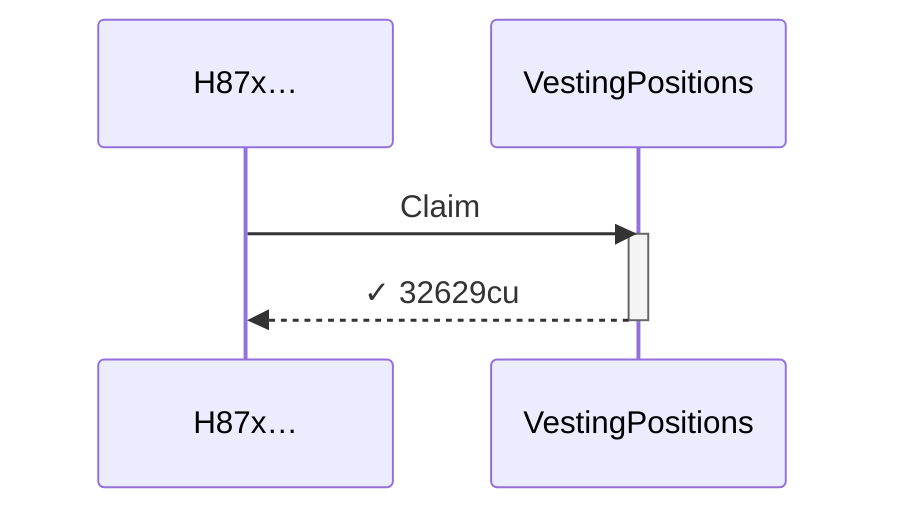
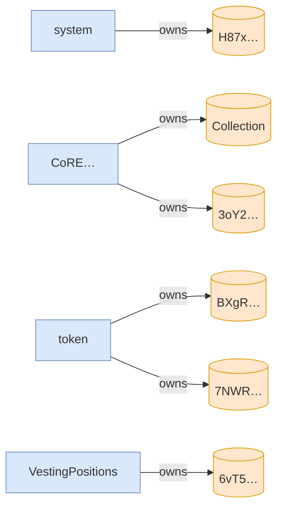

# scenario_2_two_users_transfer_and_bob_claims_both

**Source:** [`tests/claim.rs` L61](https://github.com/cds-turbin3/vesting-position/blob/3f946c506628d348826d858340b4ac335a62e967/babelfish-tests/tests/claim.rs#L61)






<details>
<summary>tree</summary>

```

H87x… (32629cu)
└─ VestingPositions::Claim ✓ 32629cu
```

</details>
