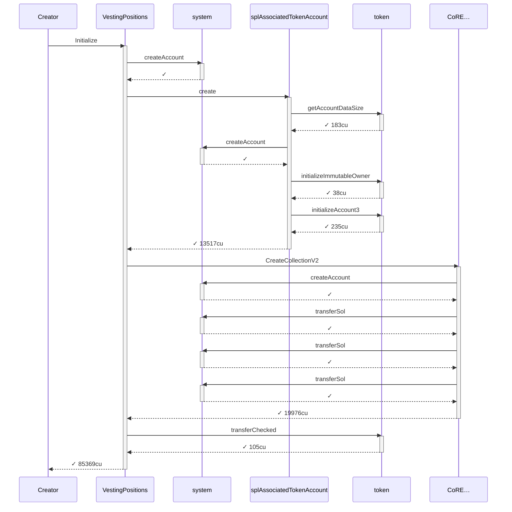
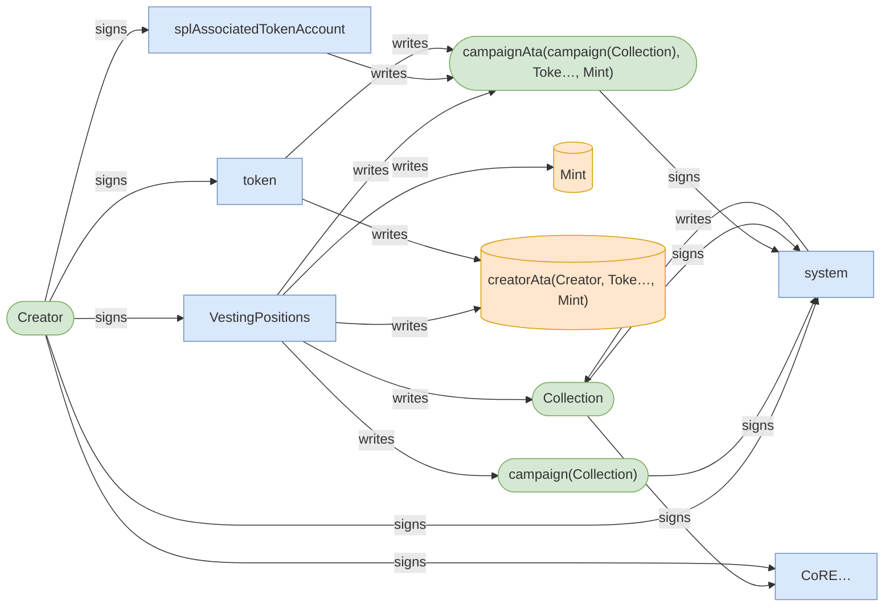
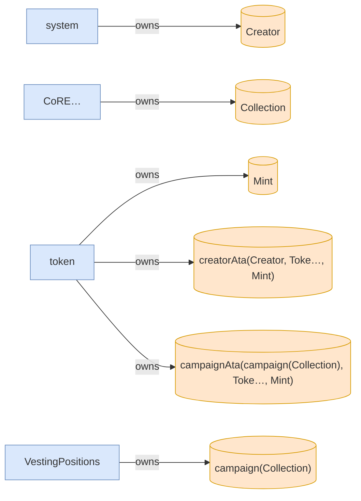
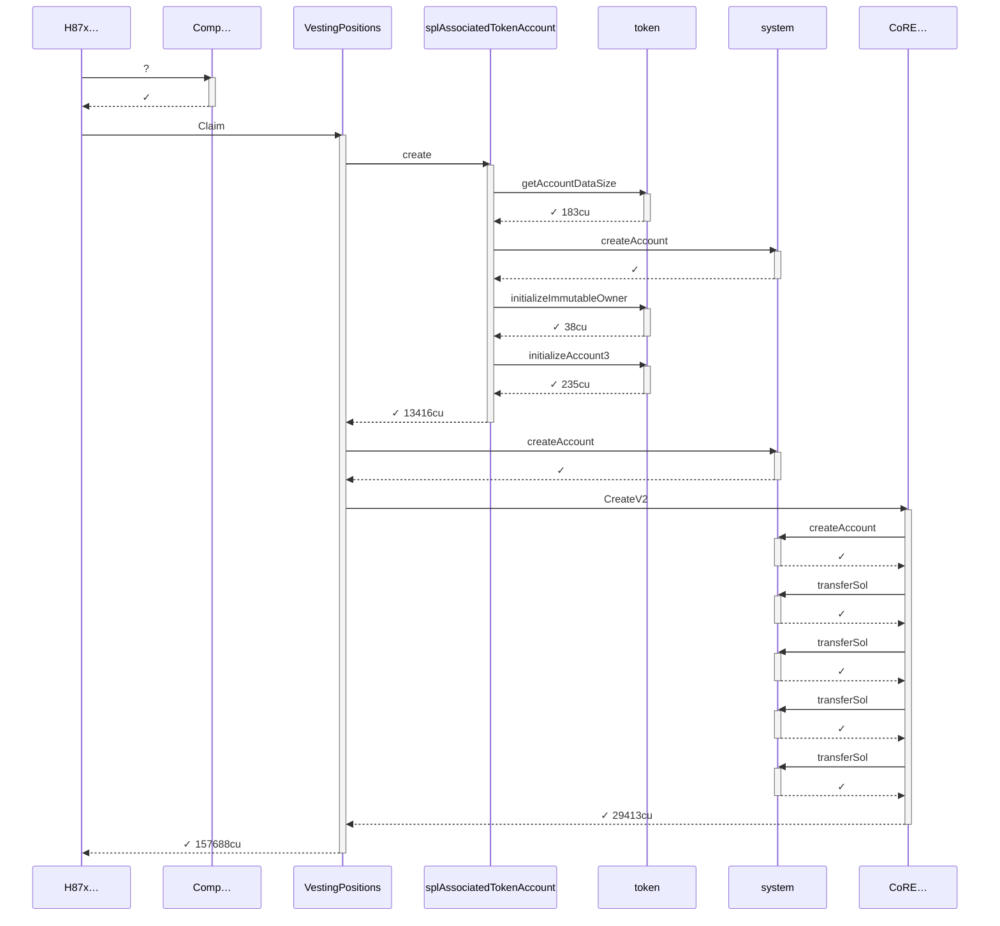
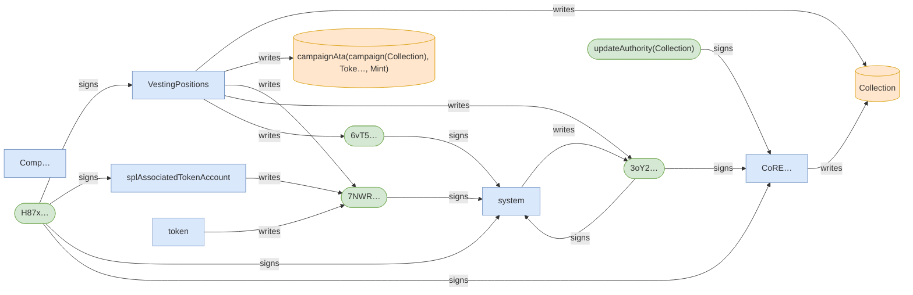
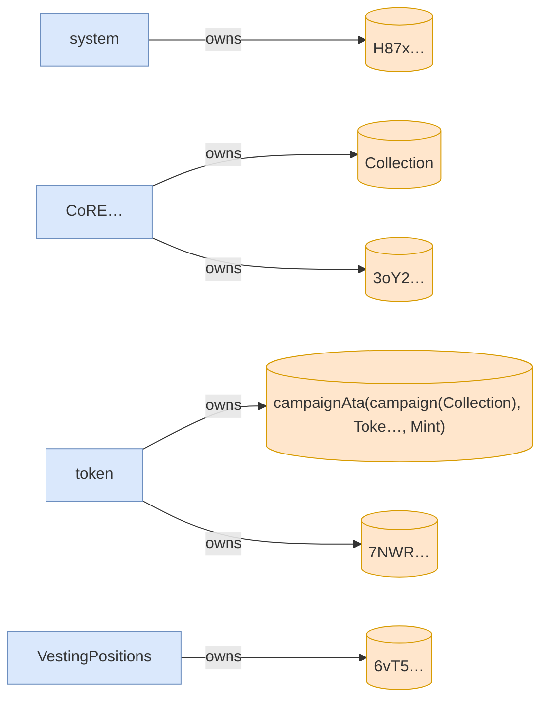
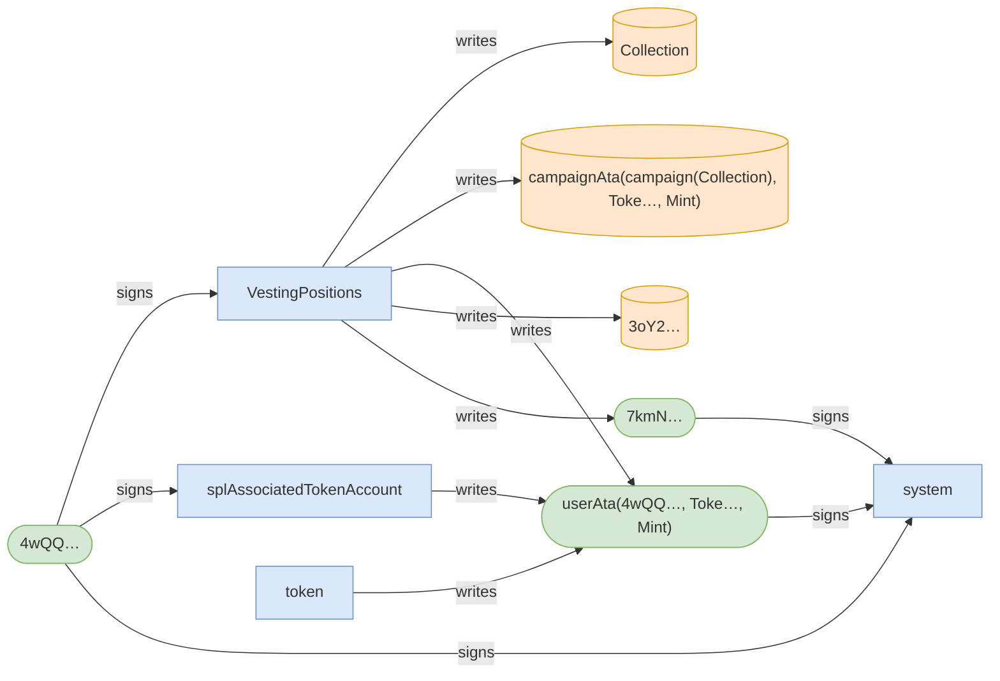
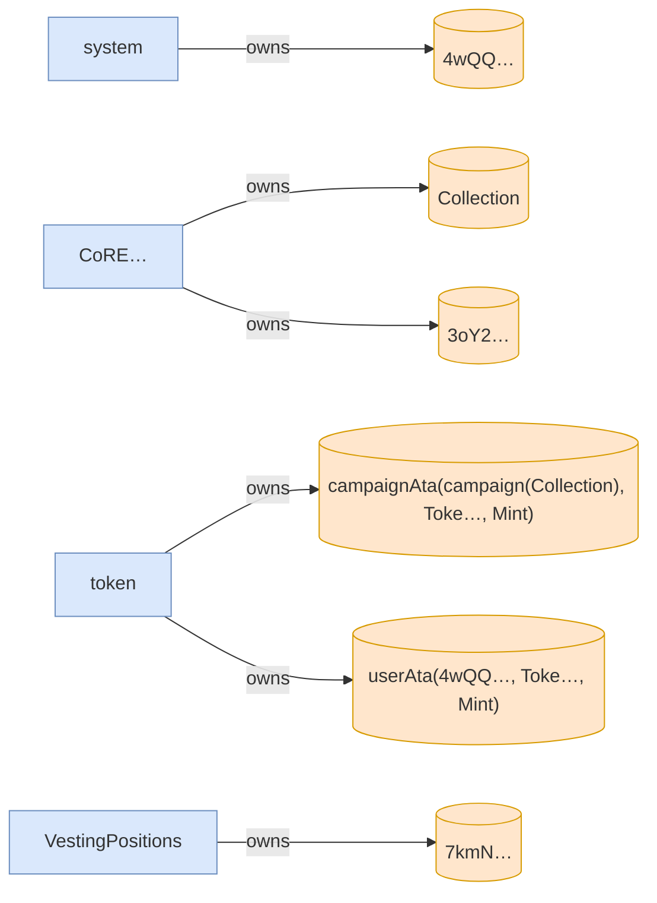

# scenario_6_not_owner_subsequent_claim_fails

**Source:** [`tests/claim.rs` L157](https://github.com/cds-turbin3/vesting-position/blob/e74e9dd5f39b0343e73e0fc7f68b7aba8525b951/babelfish-tests/tests/claim.rs#L157)

Over 1 day: 3 moments.

### T0: Initialize (day 0)

| observation | before | after |
| --- | --- | --- |
| Vault balance | — | 10000000000000 |
| Creator balance | — | 0 |

### Sequence



### Authority



### Ownership



<details>
<summary>tree</summary>

```

Creator (85369cu)
└─ VestingPositions::Initialize ✓ 85369cu
   ├─ system::createAccount ✓
   ├─ splAssociatedTokenAccount::create ✓ 13517cu
   │  ├─ token::getAccountDataSize ✓ 183cu
   │  ├─ system::createAccount ✓
   │  ├─ token::initializeImmutableOwner ✓ 38cu
   │  └─ token::initializeAccount3 ✓ 235cu
   ├─ CoRE…::CreateCollectionV2 ✓ 19976cu
   │  ├─ system::createAccount ✓
   │  ├─ system::transferSol ✓
   │  ├─ system::transferSol ✓
   │  └─ system::transferSol ✓
   └─ token::transferChecked ✓ 105cu
```

</details>

*1 day pass.*

### T1: (instruction) (day 1)

### Sequence



### Authority



### Ownership



<details>
<summary>tree</summary>

```

H87x… (157838cu)
├─ Comp…::? ✓
└─ VestingPositions::Claim ✓ 157688cu
   ├─ splAssociatedTokenAccount::create ✓ 13416cu
   │  ├─ token::getAccountDataSize ✓ 183cu
   │  ├─ system::createAccount ✓
   │  ├─ token::initializeImmutableOwner ✓ 38cu
   │  └─ token::initializeAccount3 ✓ 235cu
   ├─ system::createAccount ✓
   └─ CoRE…::CreateV2 ✓ 29413cu
      ├─ system::createAccount ✓
      ├─ system::transferSol ✓
      ├─ system::transferSol ✓
      ├─ system::transferSol ✓
      └─ system::transferSol ✓
```

</details>

### T2: Claim (day 1)

| observation | before | after |
| --- | --- | --- |
| Bob balance | — | 0 |

🚩 T2 failed: InstructionError(0, Custom(6016))

- [x] refused: NotAssetOwner — InstructionError(0, Custom(6016))

### Sequence


### Authority



### Ownership



<details>
<summary>tree</summary>

```

4wQQ… (40010cu)
└─ VestingPositions::Claim ✗ 40010cu
   ├─ splAssociatedTokenAccount::create ✓ 13416cu
   │  ├─ token::getAccountDataSize ✓ 183cu
   │  ├─ system::createAccount ✓
   │  ├─ token::initializeImmutableOwner ✓ 38cu
   │  └─ token::initializeAccount3 ✓ 235cu
   └─ system::createAccount ✓
```

</details>
