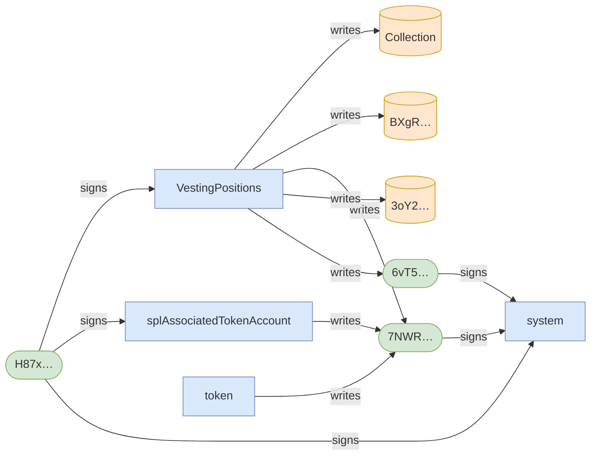
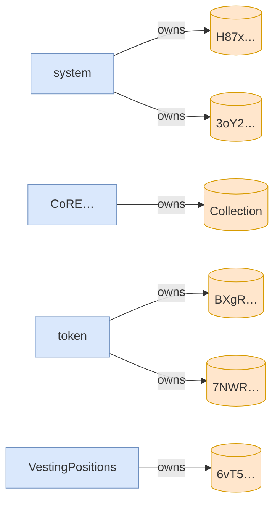

# scenario_8_wrong_asset_subsequent_claim_fails

**Source:** [`tests/claim.rs` L203](https://github.com/cds-turbin3/vesting-position/blob/3f946c506628d348826d858340b4ac335a62e967/babelfish-tests/tests/claim.rs#L203)






<details>
<summary>tree</summary>

```

H87x… (39244cu)
└─ VestingPositions::Claim ✗ 39244cu
   ├─ splAssociatedTokenAccount::create ✓ 13416cu
   │  ├─ token::getAccountDataSize ✓ 183cu
   │  ├─ system::createAccount ✓
   │  ├─ token::initializeImmutableOwner ✓ 38cu
   │  └─ token::initializeAccount3 ✓ 235cu
   └─ system::createAccount ✓
```

</details>
