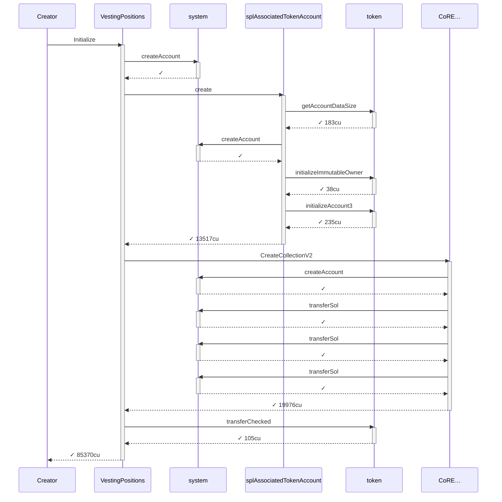
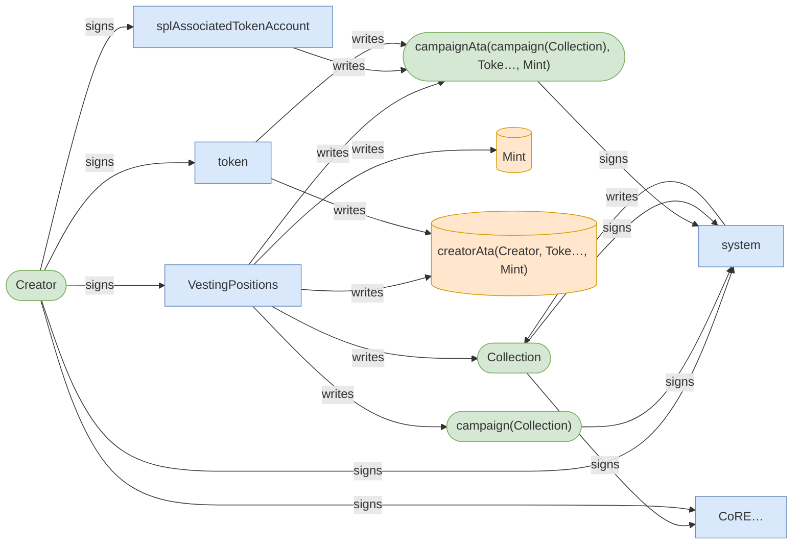
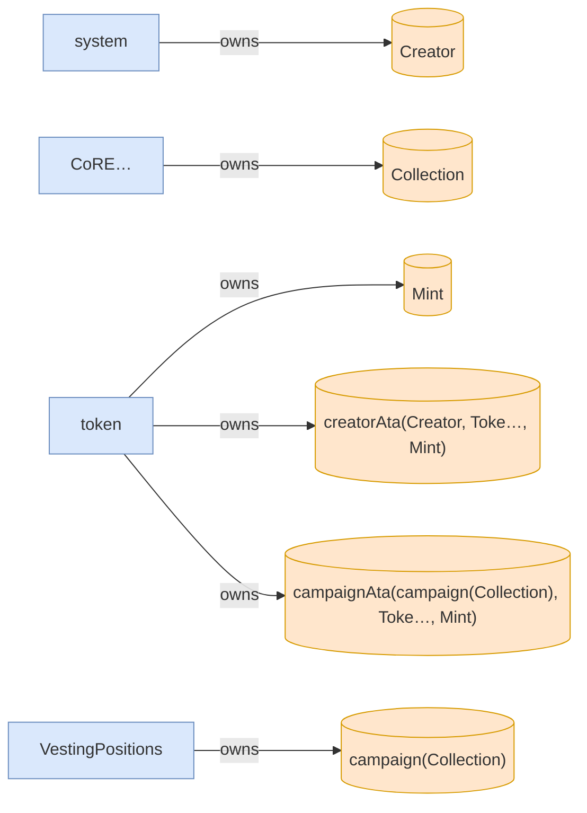
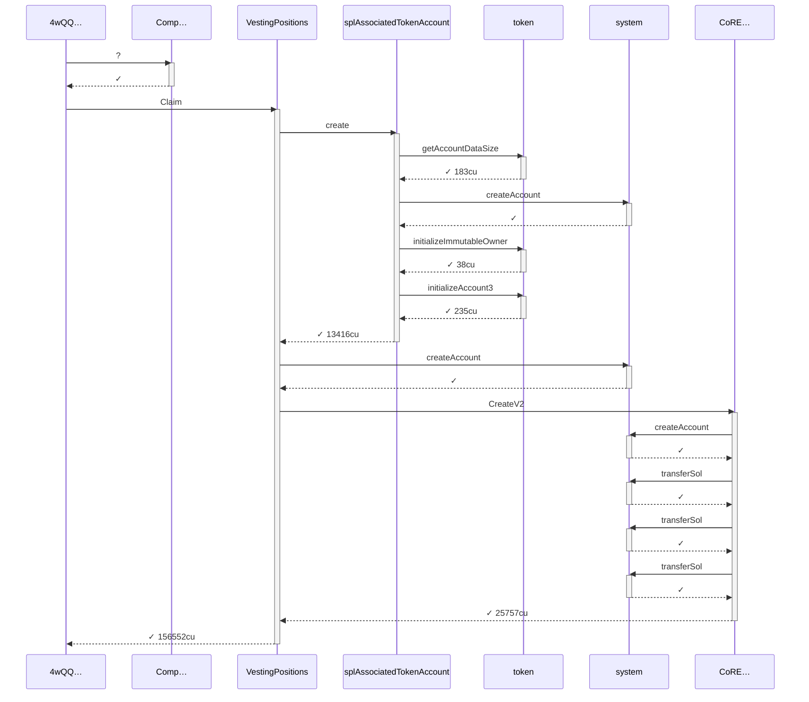
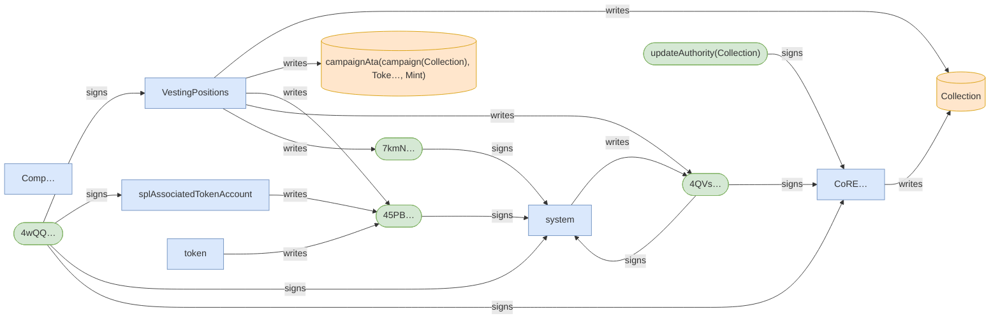
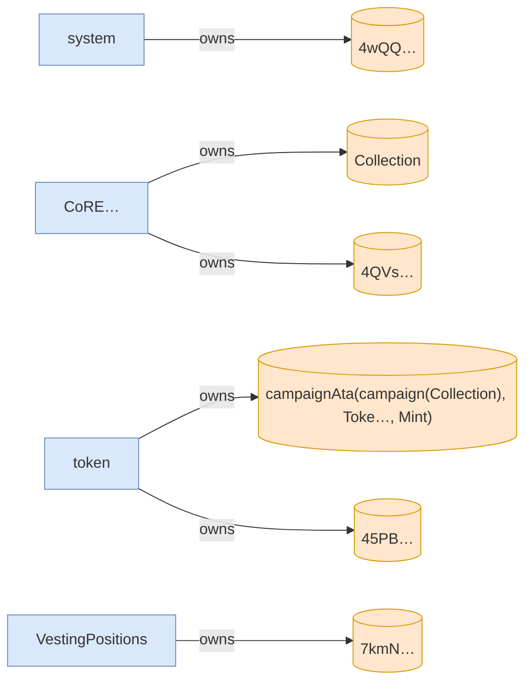
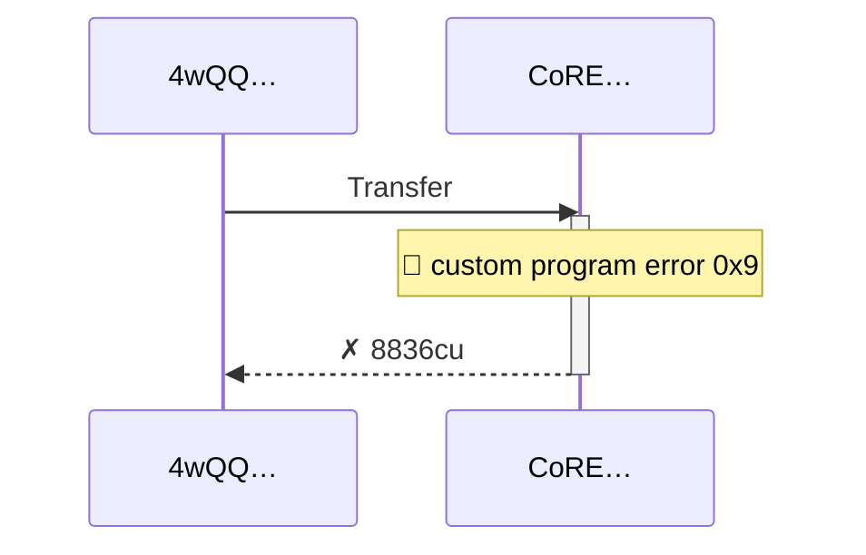
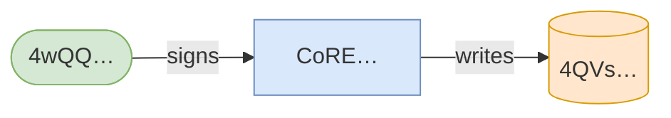
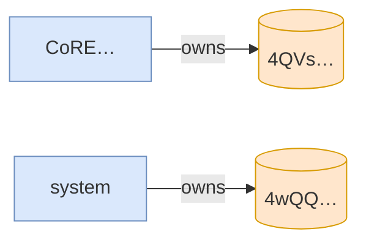

# transfer_blocked_when_collection_frozen

**Source:** [`tests/freeze.rs` L52](https://github.com/cds-turbin3/vesting-position/blob/09424ff7c84ab4c6bb084d93904af269818bd0bd/babelfish-tests/tests/freeze.rs#L52)

Over 1 day: 3 moments.

<details>
<summary>Cast</summary>

| name | address |
| --- | --- |
| Collection | DZ9SxyoirUd6SJtqTyLzGjyRuQjmxcs1ySPeuZqzmAA9 |
| Creator | 2ZBYuwtWiRzk7CwiCYTv5MQhQHDEaN4B8xhw4L7L3RY5 |
| Mint | J6WtRQHtRxemkWECcNq1wQAfgyJtsx7ZUT7Xpb53vo2N |
| VestingPositions | 7DkU9TQhcN87f2djZDd2MjjPZoXLfnZZj8HhybeZswX1 |
| campaign(Collection) | 2rbEagbB2s6tm4BWjcCmYnPxEi8cmF6CqCYPK6WhKZrC |
| campaignAta(campaign(Collection), Toke…, Mint) | BXgRMbNU5GHfjUAEUL4gc4dkK47Kbd26uZfbunemQyjQ |
| creatorAta(Creator, Toke…, Mint) | 7RKXPrw2SRFrpVR7h81dMPhHdaVV7y57tEYmDraizX43 |
| updateAuthority(Collection) | vGh5gMbD7AsVatTVNDo3pC7hveLFKdXbZ3eNt17chDs |

</details>

### T0: Initialize (day 0)

| observation | before | after |
| --- | --- | --- |
| Vault balance | — | 10,000,000,000,000 |
| Creator balance | — | 0 |

<details>
<summary>sequence</summary>



</details>

<details>
<summary>authority</summary>



</details>

<details>
<summary>ownership</summary>



</details>

<details>
<summary>tree</summary>

```

Creator (85370cu)
└─ VestingPositions::Initialize ✓ 85370cu
   ├─ system::createAccount ✓
   ├─ splAssociatedTokenAccount::create ✓ 13517cu
   │  ├─ token::getAccountDataSize ✓ 183cu
   │  ├─ system::createAccount ✓
   │  ├─ token::initializeImmutableOwner ✓ 38cu
   │  └─ token::initializeAccount3 ✓ 235cu
   ├─ CoRE…::CreateCollectionV2 ✓ 19976cu
   │  ├─ system::createAccount ✓
   │  ├─ system::transferSol ✓
   │  ├─ system::transferSol ✓
   │  └─ system::transferSol ✓
   └─ token::transferChecked ✓ 105cu
```

</details>

*1 day pass.*

### T1: FirstClaim (day 1)

<details>
<summary>sequence</summary>



</details>

<details>
<summary>authority</summary>



</details>

<details>
<summary>ownership</summary>



</details>

<details>
<summary>tree</summary>

```

4wQQ… (156702cu)
├─ Comp…::? ✓
└─ VestingPositions::Claim ✓ 156552cu
   ├─ splAssociatedTokenAccount::create ✓ 13416cu
   │  ├─ token::getAccountDataSize ✓ 183cu
   │  ├─ system::createAccount ✓
   │  ├─ token::initializeImmutableOwner ✓ 38cu
   │  └─ token::initializeAccount3 ✓ 235cu
   ├─ system::createAccount ✓
   └─ CoRE…::CreateV2 ✓ 25757cu
      ├─ system::createAccount ✓
      ├─ system::transferSol ✓
      ├─ system::transferSol ✓
      └─ system::transferSol ✓
```

</details>

### T2: TransferPosition (day 1)

| observation | before | after |
| --- | --- | --- |
| Alice balance | — | 0 |

🚩 T2 failed: InstructionError(0, Custom(9))

<details>
<summary>sequence</summary>



</details>

<details>
<summary>authority</summary>



</details>

<details>
<summary>ownership</summary>



</details>

<details>
<summary>tree</summary>

```

4wQQ… (8836cu)
└─ CoRE…::Transfer ✗ 8836cu
```

</details>
