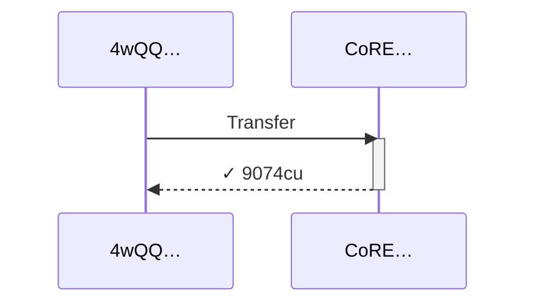
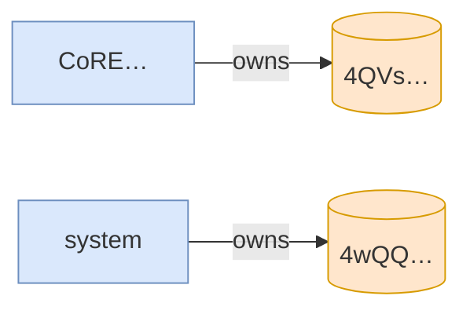

# transfer_when_collection_unfrozen_on_transferable_campaign

**Source:** [`tests/freeze.rs` L29](https://github.com/cds-turbin3/vesting-position/blob/3f946c506628d348826d858340b4ac335a62e967/babelfish-tests/tests/freeze.rs#L29)






<details>
<summary>tree</summary>

```

4wQQ… (9074cu)
└─ CoRE…::Transfer ✓ 9074cu
```

</details>
