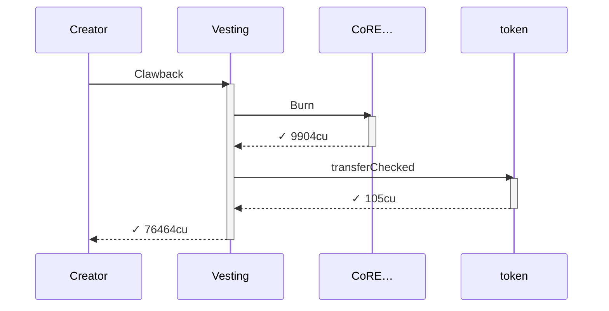
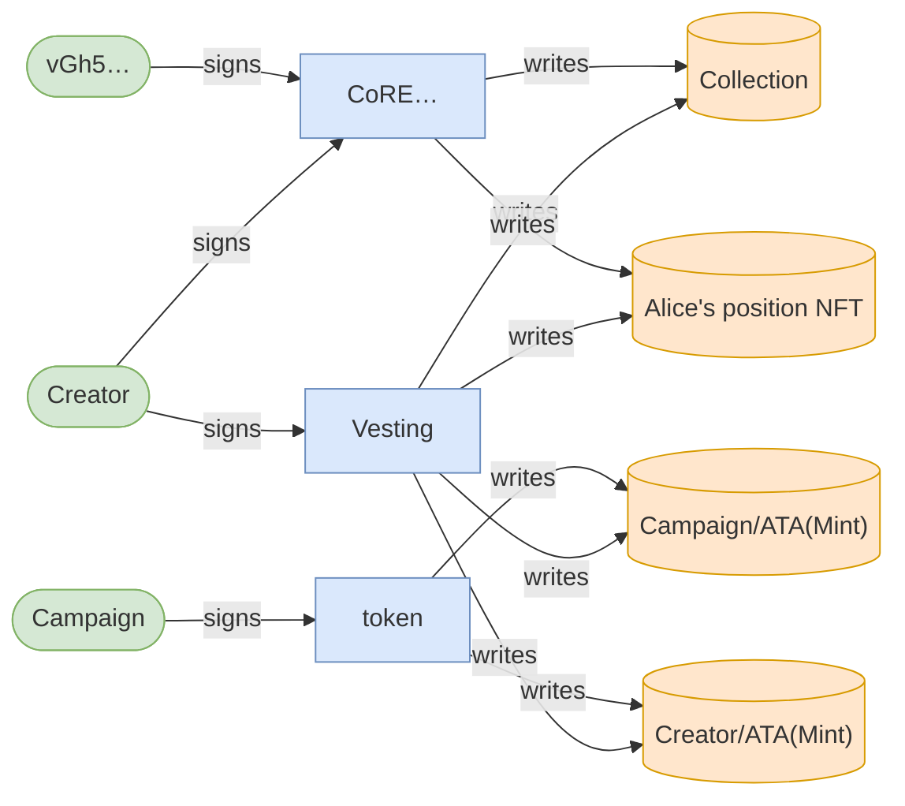
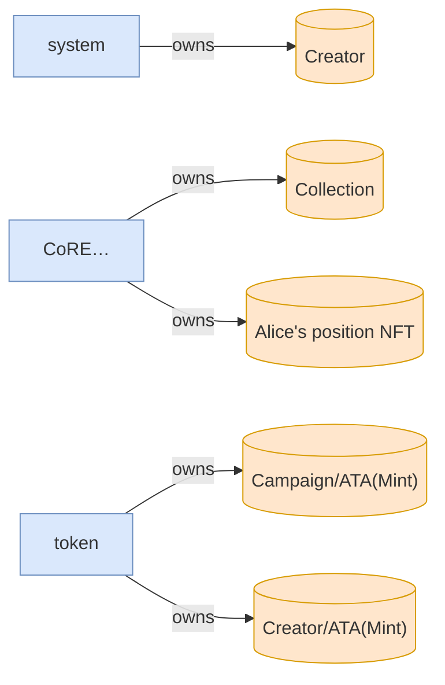

# Vested tokens forfeited past the grace window

**Source:** [`tests/forfeiture.rs` L123](https://github.com/cds-turbin3/vesting-position/blob/6858b355e82f63b7269a885b34df983c66140aa4/babelfish-tests/tests/forfeiture.rs#L123)

- Given: Alice is whitelisted in a live campaign with a grace window past end
- Then: the cliff unlock reached Alice ✓
- Then: at end, Alice's vested-but-unclaimed remainder is the whole rest of her allocation ✓
- Then: the grace window let the creator reclaim Alice's fully-vested remainder ✓
- Then: Alice's balance never moved across the clawback: her remainder was forfeited, not delivered ✓

Result: ✓ success — 76464 CU · claims 4/4 ✓



## Authority



## Ownership



## Accounts

| Account | Signer | Writable | Owner |
| --- | --- | --- | --- |
| Creator | ✓ | ✓ | system |
| Campaign | · | · | Vesting |
| Collection | · | ✓ | CoRE… |
| vGh5… | · | · | system |
| Alice's position NFT | · | ✓ | CoRE… |
| Mint | · | · | token |
| Campaign/ATA(Mint) | · | ✓ | token |
| Creator/ATA(Mint) | · | ✓ | token |
| system | · | · | Nati… |
| token | · | · | BPFL… |
| splAssociatedTokenAccount | · | · | BPFL… |
| CoRE… | · | · | BPFL… |

<details>
<summary>Call tree and logs</summary>

```
Vested tokens forfeited past the grace window
Creator (76464cu)
└─ Vesting::Clawback ✓ 76464cu
   ├─ CoRE…::Burn ✓ 9904cu
   └─ token::transferChecked ✓ 105cu
```

```text
Program 7DkU9TQhcN87f2djZDd2MjjPZoXLfnZZj8HhybeZswX1 invoke [1]
Program log: Instruction: Clawback
Program CoREENxT6tW1HoK8ypY1SxRMZTcVPm7R94rH4PZNhX7d invoke [2]
Program log: Instruction: Burn
Program log: programs/mpl-core/src/plugins/internal/permanent/permanent_burn_delegate.rs:47:ForceApprove
Program log: programs/mpl-core/src/plugins/lifecycle.rs:733:ForceApprove
Program CoREENxT6tW1HoK8ypY1SxRMZTcVPm7R94rH4PZNhX7d consumed 9904 of 137236 compute units
Program CoREENxT6tW1HoK8ypY1SxRMZTcVPm7R94rH4PZNhX7d success
Program TokenkegQfeZyiNwAJbNbGKPFXCWuBvf9Ss623VQ5DA invoke [2]
Program TokenkegQfeZyiNwAJbNbGKPFXCWuBvf9Ss623VQ5DA consumed 105 of 124967 compute units
Program TokenkegQfeZyiNwAJbNbGKPFXCWuBvf9Ss623VQ5DA success
Program data: Lxc8VPVysqkbj9rxkNx6BsE7KZFxFkI1/cY0dGcqUEcemDlVNIqYVTKYElYssupGpCP43Yuvemqw+VhRCiwfNG1WXbNCQrveOoLihoc4dWQbnXmR6BD2b2ycAp5izUwQ8iaXjFeUnwo6guKGhzh1ZBudeZHoEPZvbJwCnmLNTBDyJpeMV5SfCgAoLozRAAAAAQqGZQAAAAA=
Program 7DkU9TQhcN87f2djZDd2MjjPZoXLfnZZj8HhybeZswX1 consumed 76464 of 200000 compute units
Program 7DkU9TQhcN87f2djZDd2MjjPZoXLfnZZj8HhybeZswX1 success
```

</details>
