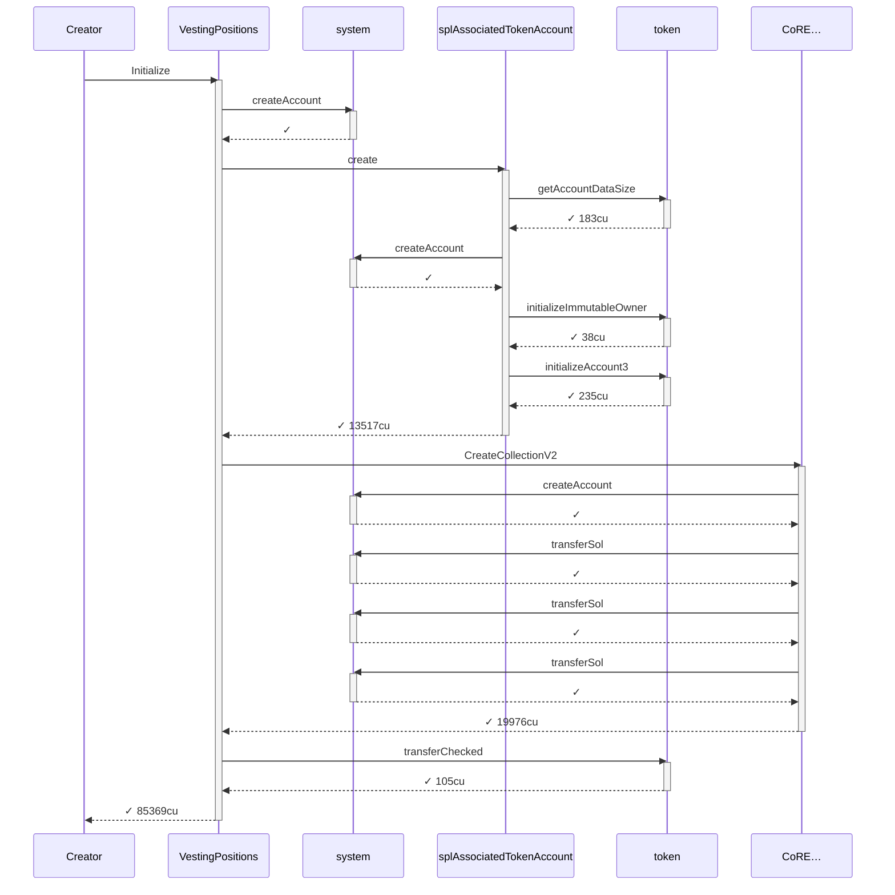
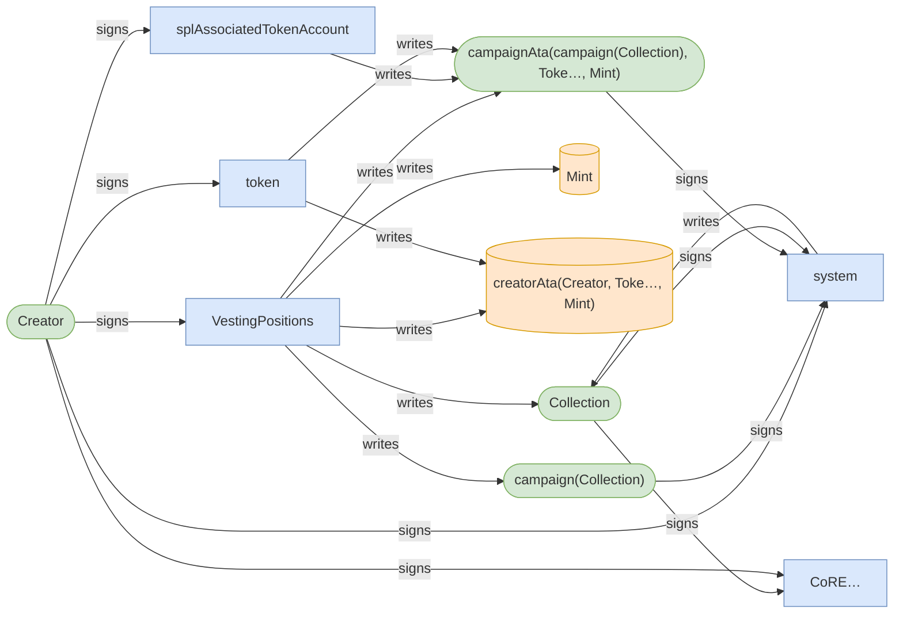
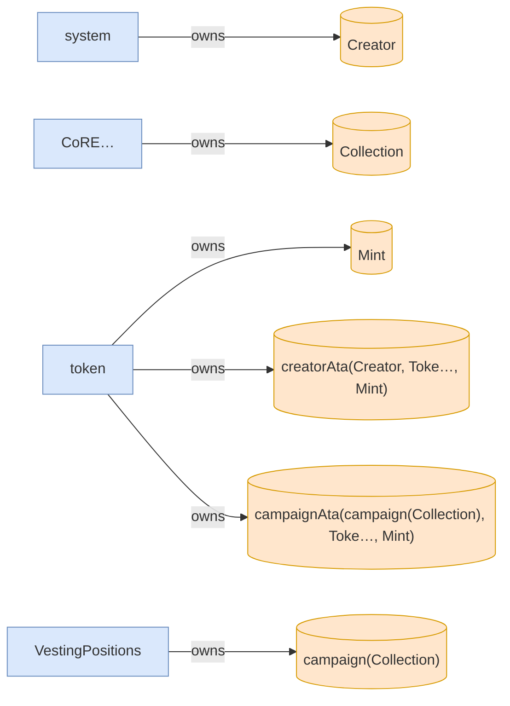
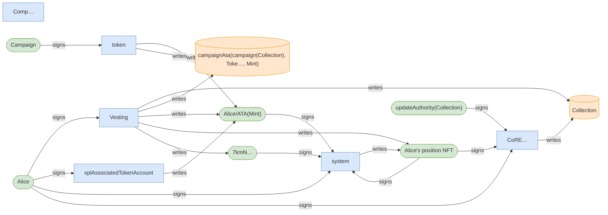
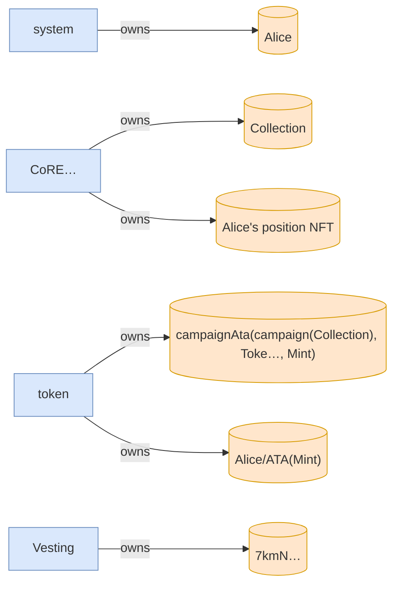
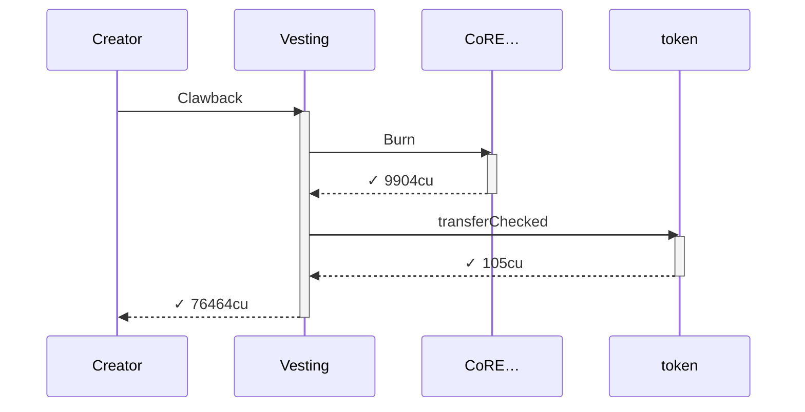
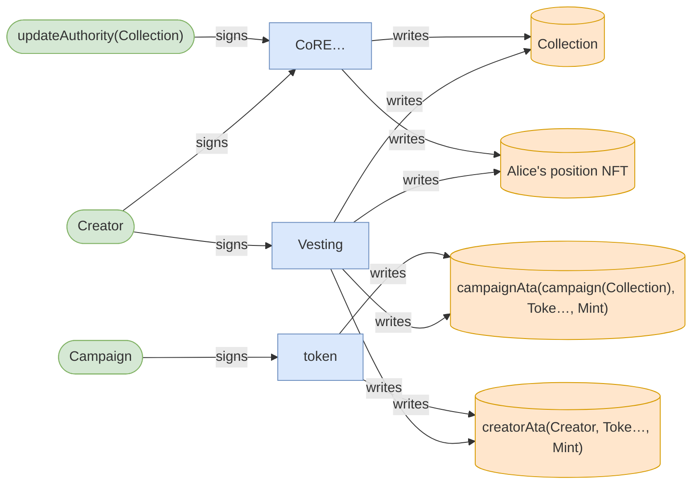
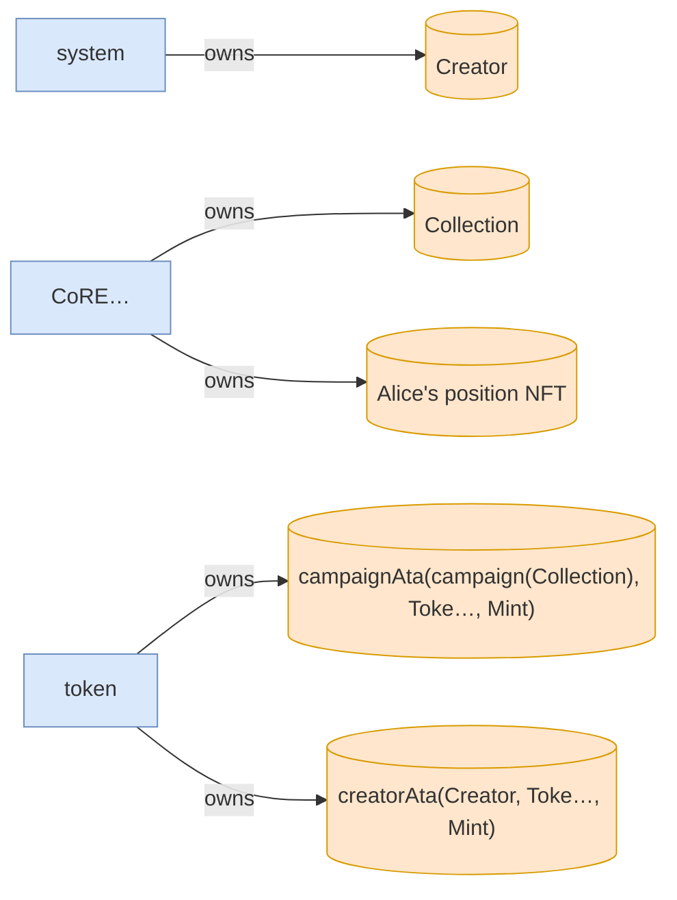
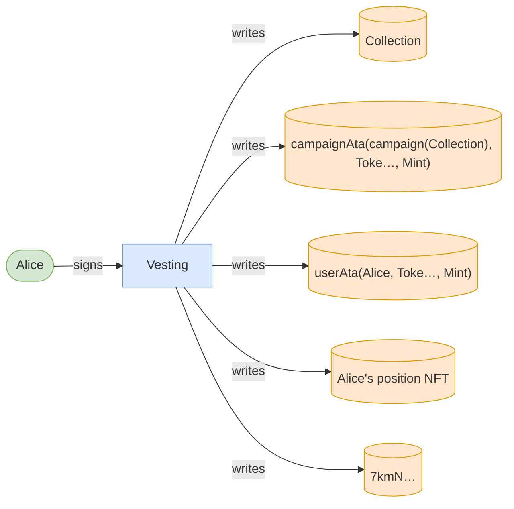
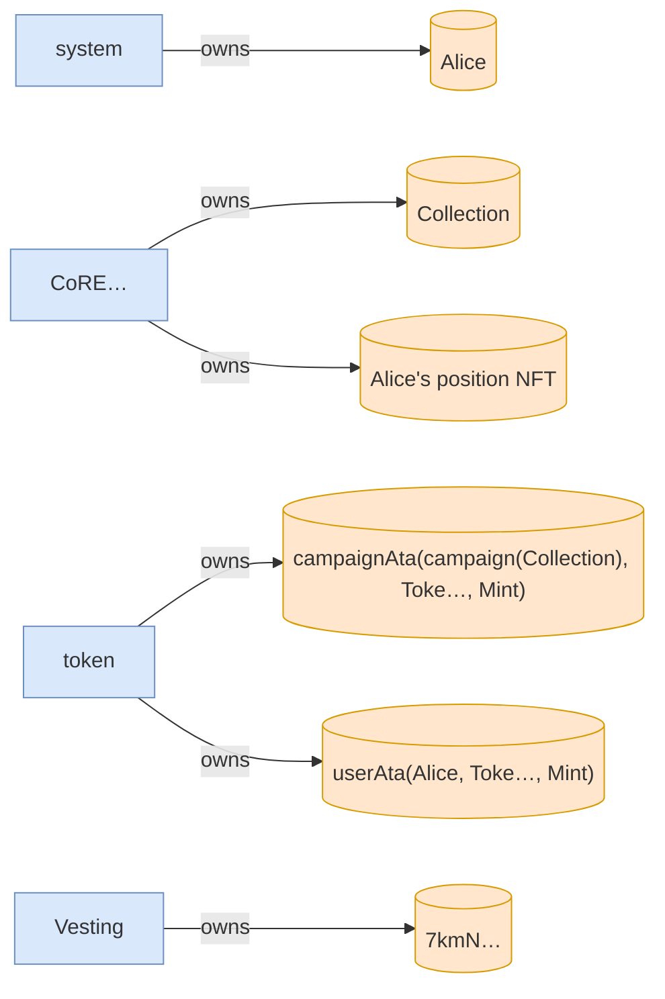

# vested_tokens_are_forfeited_past_the_grace_window

**Source:** [`tests/forfeiture.rs` L17](https://github.com/cds-turbin3/vesting-position/blob/3e6571dde7b989ae353cd0a141b35da0171e1a57/babelfish-tests/tests/forfeiture.rs#L17)

> Given: Alice is whitelisted in a live campaign with a grace window past end

Over 38 days: 4 moments.

<details>
<summary>Cast</summary>

| name | address |
| --- | --- |
| Alice | 4wQQJM9LNuhinieNAqmHuPCm8LXDTVfhx84P32nAVE9P |
| Alice's position NFT | 4QVsuwY3ob34zXWn921ANiD2Z88Hq8hizufySVtpKfsK |
| Campaign | 2rbEagbB2s6tm4BWjcCmYnPxEi8cmF6CqCYPK6WhKZrC |
| Collection | DZ9SxyoirUd6SJtqTyLzGjyRuQjmxcs1ySPeuZqzmAA9 |
| Creator | 2ZBYuwtWiRzk7CwiCYTv5MQhQHDEaN4B8xhw4L7L3RY5 |
| Mint | J6WtRQHtRxemkWECcNq1wQAfgyJtsx7ZUT7Xpb53vo2N |
| Vesting | 7DkU9TQhcN87f2djZDd2MjjPZoXLfnZZj8HhybeZswX1 |
| campaignAta(campaign(Collection), Toke…, Mint) | BXgRMbNU5GHfjUAEUL4gc4dkK47Kbd26uZfbunemQyjQ |
| creatorAta(Creator, Toke…, Mint) | 7RKXPrw2SRFrpVR7h81dMPhHdaVV7y57tEYmDraizX43 |
| updateAuthority(Collection) | vGh5gMbD7AsVatTVNDo3pC7hveLFKdXbZ3eNt17chDs |
| userAta(Alice, Toke…, Mint) | 45PBE5WDayGKEeGHvaLP5VfqXSS5JoGVewXyVbSE8JSq |

</details>

### Timeline

| time | Vault balance | Δ | Creator balance | Δ | Alice balance | Δ | comment |
| --- | --- | --- | --- | --- | --- | --- | --- |
| T0 | 10,000,000,000,000 | +10,000,000,000,000 | 0 |  | — |  | Initialize (day 0) |
| T1 | 9,900,000,000,000 | -100,000,000,000 | 0 |  | — |  | FirstClaim (day 2) |
| T2 | 9,000,000,000,000 | -900,000,000,000 | 900,000,000,000 | +900,000,000,000 | 100,000,000,000 | +100,000,000,000 | Clawback (day 38) |
| T3 | 9,000,000,000,000 |  | 900,000,000,000 |  | 100,000,000,000 |  | Claim (day 38) |

### T0: Initialize (day 0)

| observation | before | after |
| --- | --- | --- |
| Vault balance | — | 10,000,000,000,000 |
| Creator balance | — | 0 |

> A recipient's vested-but-unclaimed tokens are swept to the creator once the grace window past `end` lapses: this is the design, not a defect.

<details>
<summary>diagrams</summary>

### Sequence



### Authority



### Ownership



### Tree

```

Creator (85369cu)
└─ VestingPositions::Initialize ✓ 85369cu
   ├─ system::createAccount ✓
   ├─ splAssociatedTokenAccount::create ✓ 13517cu
   │  ├─ token::getAccountDataSize ✓ 183cu
   │  ├─ system::createAccount ✓
   │  ├─ token::initializeImmutableOwner ✓ 38cu
   │  └─ token::initializeAccount3 ✓ 235cu
   ├─ CoRE…::CreateCollectionV2 ✓ 19976cu
   │  ├─ system::createAccount ✓
   │  ├─ system::transferSol ✓
   │  ├─ system::transferSol ✓
   │  └─ system::transferSol ✓
   └─ token::transferChecked ✓ 105cu
```

</details>

*2 days pass.*

### T1: FirstClaim (day 2)

| observation | before | after |
| --- | --- | --- |
| Vault balance | 10,000,000,000,000 | 9,900,000,000,000 |

- [x] the cliff unlock reached Alice

- [x] at end, Alice's vested-but-unclaimed remainder is the whole rest of her allocation

<details>
<summary>diagrams</summary>

### Sequence


### Authority



### Ownership



### Tree

```

Alice (163771cu)
├─ Comp…::? ✓
└─ Vesting::Claim ✓ 163621cu
   ├─ splAssociatedTokenAccount::create ✓ 13416cu
   │  ├─ token::getAccountDataSize ✓ 183cu
   │  ├─ system::createAccount ✓
   │  ├─ token::initializeImmutableOwner ✓ 38cu
   │  └─ token::initializeAccount3 ✓ 235cu
   ├─ system::createAccount ✓
   ├─ CoRE…::CreateV2 ✓ 29646cu
   │  ├─ system::createAccount ✓
   │  ├─ system::transferSol ✓
   │  ├─ system::transferSol ✓
   │  ├─ system::transferSol ✓
   │  └─ system::transferSol ✓
   └─ token::transferChecked ✓ 105cu
```

</details>

*3110401 seconds pass.*

### T2: Clawback (day 38)

| observation | before | after |
| --- | --- | --- |
| Vault balance | 9,900,000,000,000 | 9,000,000,000,000 |
| Creator balance | 0 | 900,000,000,000 |
| Alice balance | — | 100,000,000,000 |

- [x] the grace window let the creator reclaim Alice's fully-vested remainder

**Alice's remainder:** `900,000,000,000` → `0` — forfeited, never delivered

- [x] Alice's remainder

<details>
<summary>diagrams</summary>

### Sequence



### Authority



### Ownership



### Tree

```

Creator (76464cu)
└─ Vesting::Clawback ✓ 76464cu
   ├─ CoRE…::Burn ✓ 9904cu
   └─ token::transferChecked ✓ 105cu
```

</details>

### T3: Claim (day 38)

- [x] refused: ClaimWindowClosed — InstructionError(0, Custom(6025))

- [x] Alice's balance never moved across the clawback: her remainder was forfeited, not delivered

<details>
<summary>diagrams</summary>

### Sequence


### Authority



### Ownership



### Tree

```

Alice (18897cu)
└─ Vesting::Claim ✗ 18897cu
```

</details>
