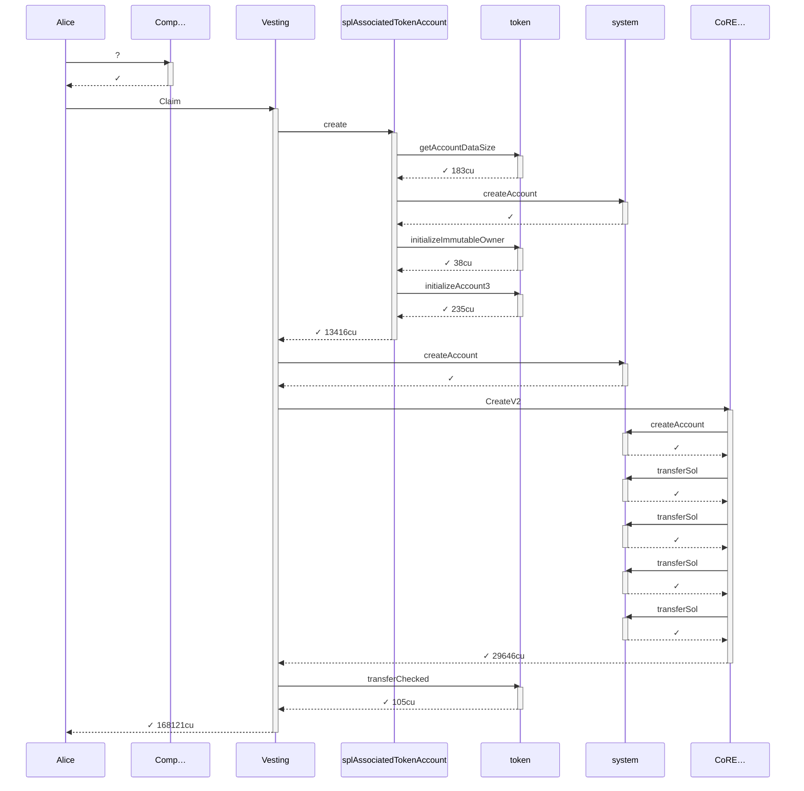
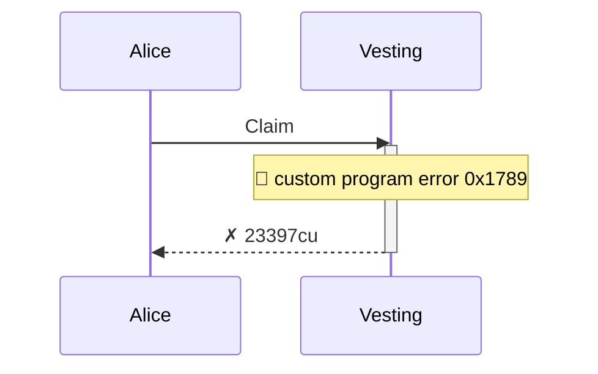

# vested_tokens_are_forfeited_past_the_grace_window

**Source:** [`tests/forfeiture.rs` L17](https://github.com/cds-turbin3/vesting-position/blob/b53ae11528330be9e19c3e4b327a7dc3572aac7e/babelfish-tests/tests/forfeiture.rs#L17)

> Given: Alice is whitelisted in a live campaign with a grace window past end

Over 38 days: 4 moments.

<details>
<summary>Cast</summary>

| name | address |
| --- | --- |
| Alice | 4wQQJM9LNuhinieNAqmHuPCm8LXDTVfhx84P32nAVE9P |
| Alice's position NFT | 6hhAjXPGt41Y6oPH6mATnAqMECdaHrKaAGbE4SFuARXK |
| Campaign | G4GWLHr4aHZoxWra82eRc111wRJ9aDiXsSuk3bWoys2G |
| Collection | 9HbgSnRdBeYKzrjr9DYtcT6oKYrcTVB8NWUoU7JVKuWW |
| Creator | 2ZBYuwtWiRzk7CwiCYTv5MQhQHDEaN4B8xhw4L7L3RY5 |
| Mint | 4Kr8ypueV83MddH54fZXLkKFKRd7eWFcejQ8HtynfJRk |
| Vesting | 7DkU9TQhcN87f2djZDd2MjjPZoXLfnZZj8HhybeZswX1 |
| campaignAta(campaign(Collection), Toke…, Mint) | 3kKwPKo9z6XQWrZxuo75c36vm9ChMgGDAMBV7cFEhjSn |
| creatorAta(Creator, Toke…, Mint) | AvzkuSUEzjhXyboXRyfQcsjzKLBqeP9FeoExRBWkXjdJ |
| updateAuthority(Collection) | CYBwE6G2RjrsFYbwy5pUVVDVL5UR5g5VaRcWBPbzby1p |
| userAta(Alice, Toke…, Mint) | C7PguAKs34J4WkXRRp762bPFhzhmFBYKdLuHQYBrVmAW |
| 5yfA… | 5yfASCcX25V4fzBgdfixtXgS2JrvpWdwX27JQXpVyuHB |
| CoRE… | CoREENxT6tW1HoK8ypY1SxRMZTcVPm7R94rH4PZNhX7d |
| Comp… | ComputeBudget111111111111111111111111111111 |

</details>

### Timeline

| time | Vault balance | Δ | Creator balance | Δ | Alice balance | Δ | comment |
| --- | --- | --- | --- | --- | --- | --- | --- |
| T0 | 10,000,000,000,000 | +10,000,000,000,000 | 0 |  | — |  | Initialize (day 0) |
| T1 | 9,900,000,000,000 | -100,000,000,000 | 0 |  | — |  | FirstClaim (day 2) |
| T2 | 9,000,000,000,000 | -900,000,000,000 | 900,000,000,000 | +900,000,000,000 | 100,000,000,000 | +100,000,000,000 | Clawback (day 38) |
| T3 | 9,000,000,000,000 |  | 900,000,000,000 |  | 100,000,000,000 |  | Claim (day 38) |

### T0: Initialize (day 0)

| observation | before | after |
| --- | --- | --- |
| Vault balance | — | 10,000,000,000,000 |
| Creator balance | — | 0 |

> A recipient's vested-but-unclaimed tokens are swept to the creator once the grace window past `end` lapses: this is the design, not a defect.

<details>
<summary>diagrams</summary>

### Sequence


### Authority

```mermaid
flowchart LR
    VestingPositions["VestingPositions"]:::program
    Creator(["Creator"]):::signer
    Collection(["Collection"]):::signer
    Mint[("Mint")]:::state
    creatorAtaCreatorTokeMint[("creatorAta(Creator, Toke…, Mint)")]:::state
    campaignCollection(["campaign(Collection)"]):::signer
    campaignAtacampaignCollectionTokeMint(["campaignAta(campaign(Collection), Toke…, Mint)"]):::signer
    system["system"]:::program
    splAssociatedTokenAccount["splAssociatedTokenAccount"]:::program
    token["token"]:::program
    CoRE["CoRE…"]:::program
    Creator -->|signs| VestingPositions
    VestingPositions -->|writes| Collection
    VestingPositions --> Mint
    VestingPositions --> creatorAtaCreatorTokeMint
    VestingPositions --> campaignCollection
    VestingPositions --> campaignAtacampaignCollectionTokeMint
    Creator --> system
    campaignCollection --> system
    Creator --> splAssociatedTokenAccount
    splAssociatedTokenAccount --> campaignAtacampaignCollectionTokeMint
    campaignAtacampaignCollectionTokeMint --> system
    token --> campaignAtacampaignCollectionTokeMint
    Collection --> CoRE
    Creator --> CoRE
    Collection --> system
    system --> Collection
    token --> creatorAtaCreatorTokeMint
    Creator --> token
    classDef program fill:#dae8fc,stroke:#6c8ebf;
    classDef signer fill:#d5e8d4,stroke:#82b366;
    classDef state fill:#ffe6cc,stroke:#d79b00;
    linkStyle 0,6,7,8,10,12,13,14,17 stroke:#82b366;
    linkStyle 1,2,3,4,5,9,11,15,16 stroke:#d79b00;
```

### Ownership

```mermaid
flowchart LR
    system["system"]:::program
    Creator[("Creator")]:::state
    CoRE["CoRE…"]:::program
    Collection[("Collection")]:::state
    token["token"]:::program
    Mint[("Mint")]:::state
    creatorAtaCreatorTokeMint[("creatorAta(Creator, Toke…, Mint)")]:::state
    VestingPositions["VestingPositions"]:::program
    campaignCollection[("campaign(Collection)")]:::state
    campaignAtacampaignCollectionTokeMint[("campaignAta(campaign(Collection), Toke…, Mint)")]:::state
    system -->|owns| Creator
    CoRE --> Collection
    token --> Mint
    token --> creatorAtaCreatorTokeMint
    VestingPositions --> campaignCollection
    token --> campaignAtacampaignCollectionTokeMint
    classDef program fill:#dae8fc,stroke:#6c8ebf;
    classDef signer fill:#d5e8d4,stroke:#82b366;
    classDef state fill:#ffe6cc,stroke:#d79b00;
    linkStyle 0,1,2,3,4,5 stroke:#6c8ebf;
```

### Tree

```

Creator (89713cu)
└─ VestingPositions::Initialize ✓ 89713cu
   ├─ system::createAccount ✓
   ├─ splAssociatedTokenAccount::create ✓ 18017cu
   │  ├─ token::getAccountDataSize ✓ 183cu
   │  ├─ system::createAccount ✓
   │  ├─ token::initializeImmutableOwner ✓ 38cu
   │  └─ token::initializeAccount3 ✓ 235cu
   ├─ CoRE…::CreateCollectionV2 ✓ 19976cu
   │  ├─ system::createAccount ✓
   │  ├─ system::transferSol ✓
   │  ├─ system::transferSol ✓
   │  └─ system::transferSol ✓
   └─ token::transferChecked ✓ 105cu
```

</details>

*2 days pass.*

### T1: FirstClaim (day 2)

| observation | before | after |
| --- | --- | --- |
| Vault balance | 10,000,000,000,000 | 9,900,000,000,000 |

- [x] the cliff unlock reached Alice

- [x] at end, Alice's vested-but-unclaimed remainder is the whole rest of her allocation

<details>
<summary>diagrams</summary>

### Sequence



### Authority

```mermaid
flowchart LR
    Comp["Comp…"]:::program
    Vesting["Vesting"]:::program
    Alice(["Alice"]):::signer
    Collection[("Collection")]:::state
    campaignAtacampaignCollectionTokeMint[("campaignAta(campaign(Collection), Toke…, Mint)")]:::state
    AliceATAMint(["Alice/ATA(Mint)"]):::signer
    AlicespositionNFT(["Alice's position NFT"]):::signer
    5yfA(["5yfA…"]):::signer
    splAssociatedTokenAccount["splAssociatedTokenAccount"]:::program
    token["token"]:::program
    system["system"]:::program
    CoRE["CoRE…"]:::program
    updateAuthorityCollection(["updateAuthority(Collection)"]):::signer
    Campaign(["Campaign"]):::signer
    Alice -->|signs| Vesting
    Vesting -->|writes| Collection
    Vesting --> campaignAtacampaignCollectionTokeMint
    Vesting --> AliceATAMint
    Vesting --> AlicespositionNFT
    Vesting --> 5yfA
    Alice --> splAssociatedTokenAccount
    splAssociatedTokenAccount --> AliceATAMint
    Alice --> system
    AliceATAMint --> system
    token --> AliceATAMint
    5yfA --> system
    AlicespositionNFT --> CoRE
    CoRE --> Collection
    updateAuthorityCollection --> CoRE
    Alice --> CoRE
    AlicespositionNFT --> system
    system --> AlicespositionNFT
    token --> campaignAtacampaignCollectionTokeMint
    Campaign --> token
    classDef program fill:#dae8fc,stroke:#6c8ebf;
    classDef signer fill:#d5e8d4,stroke:#82b366;
    classDef state fill:#ffe6cc,stroke:#d79b00;
    linkStyle 0,6,8,9,11,12,14,15,16,19 stroke:#82b366;
    linkStyle 1,2,3,4,5,7,10,13,17,18 stroke:#d79b00;
```

### Ownership

```mermaid
flowchart LR
    system["system"]:::program
    Alice[("Alice")]:::state
    CoRE["CoRE…"]:::program
    Collection[("Collection")]:::state
    token["token"]:::program
    campaignAtacampaignCollectionTokeMint[("campaignAta(campaign(Collection), Toke…, Mint)")]:::state
    AliceATAMint[("Alice/ATA(Mint)")]:::state
    AlicespositionNFT[("Alice's position NFT")]:::state
    Vesting["Vesting"]:::program
    5yfA[("5yfA…")]:::state
    system -->|owns| Alice
    CoRE --> Collection
    token --> campaignAtacampaignCollectionTokeMint
    token --> AliceATAMint
    CoRE --> AlicespositionNFT
    Vesting --> 5yfA
    classDef program fill:#dae8fc,stroke:#6c8ebf;
    classDef signer fill:#d5e8d4,stroke:#82b366;
    classDef state fill:#ffe6cc,stroke:#d79b00;
    linkStyle 0,1,2,3,4,5 stroke:#6c8ebf;
```

### Tree

```

Alice (168271cu)
├─ Comp…::? ✓
└─ Vesting::Claim ✓ 168121cu
   ├─ splAssociatedTokenAccount::create ✓ 13416cu
   │  ├─ token::getAccountDataSize ✓ 183cu
   │  ├─ system::createAccount ✓
   │  ├─ token::initializeImmutableOwner ✓ 38cu
   │  └─ token::initializeAccount3 ✓ 235cu
   ├─ system::createAccount ✓
   ├─ CoRE…::CreateV2 ✓ 29646cu
   │  ├─ system::createAccount ✓
   │  ├─ system::transferSol ✓
   │  ├─ system::transferSol ✓
   │  ├─ system::transferSol ✓
   │  └─ system::transferSol ✓
   └─ token::transferChecked ✓ 105cu
```

</details>

*3110401 seconds pass.*

### T2: Clawback (day 38)

| observation | before | after |
| --- | --- | --- |
| Vault balance | 9,900,000,000,000 | 9,000,000,000,000 |
| Creator balance | 0 | 900,000,000,000 |
| Alice balance | — | 100,000,000,000 |

- [x] the grace window let the creator reclaim Alice's fully-vested remainder

**Alice's remainder:** `900,000,000,000` → `0` — forfeited, never delivered

- [x] Alice's remainder

<details>
<summary>diagrams</summary>

### Sequence


### Authority

```mermaid
flowchart LR
    Vesting["Vesting"]:::program
    Creator(["Creator"]):::signer
    Collection[("Collection")]:::state
    AlicespositionNFT[("Alice's position NFT")]:::state
    campaignAtacampaignCollectionTokeMint[("campaignAta(campaign(Collection), Toke…, Mint)")]:::state
    creatorAtaCreatorTokeMint[("creatorAta(Creator, Toke…, Mint)")]:::state
    CoRE["CoRE…"]:::program
    updateAuthorityCollection(["updateAuthority(Collection)"]):::signer
    token["token"]:::program
    Campaign(["Campaign"]):::signer
    Creator -->|signs| Vesting
    Vesting -->|writes| Collection
    Vesting --> AlicespositionNFT
    Vesting --> campaignAtacampaignCollectionTokeMint
    Vesting --> creatorAtaCreatorTokeMint
    CoRE --> AlicespositionNFT
    CoRE --> Collection
    Creator --> CoRE
    updateAuthorityCollection --> CoRE
    token --> campaignAtacampaignCollectionTokeMint
    token --> creatorAtaCreatorTokeMint
    Campaign --> token
    classDef program fill:#dae8fc,stroke:#6c8ebf;
    classDef signer fill:#d5e8d4,stroke:#82b366;
    classDef state fill:#ffe6cc,stroke:#d79b00;
    linkStyle 0,7,8,11 stroke:#82b366;
    linkStyle 1,2,3,4,5,6,9,10 stroke:#d79b00;
```

### Ownership

```mermaid
flowchart LR
    system["system"]:::program
    Creator[("Creator")]:::state
    CoRE["CoRE…"]:::program
    Collection[("Collection")]:::state
    AlicespositionNFT[("Alice's position NFT")]:::state
    token["token"]:::program
    campaignAtacampaignCollectionTokeMint[("campaignAta(campaign(Collection), Toke…, Mint)")]:::state
    creatorAtaCreatorTokeMint[("creatorAta(Creator, Toke…, Mint)")]:::state
    system -->|owns| Creator
    CoRE --> Collection
    CoRE --> AlicespositionNFT
    token --> campaignAtacampaignCollectionTokeMint
    token --> creatorAtaCreatorTokeMint
    classDef program fill:#dae8fc,stroke:#6c8ebf;
    classDef signer fill:#d5e8d4,stroke:#82b366;
    classDef state fill:#ffe6cc,stroke:#d79b00;
    linkStyle 0,1,2,3,4 stroke:#6c8ebf;
```

### Tree

```

Creator (79347cu)
└─ Vesting::Clawback ✓ 79347cu
   ├─ CoRE…::Burn ✓ 9904cu
   └─ token::transferChecked ✓ 105cu
```

</details>

### T3: Claim (day 38)

- [x] refused: ClaimWindowClosed — InstructionError(0, Custom(6025))

- [x] Alice's balance never moved across the clawback: her remainder was forfeited, not delivered

<details>
<summary>diagrams</summary>

### Sequence



### Authority

```mermaid
flowchart LR
    Vesting["Vesting"]:::program
    Alice(["Alice"]):::signer
    Collection[("Collection")]:::state
    campaignAtacampaignCollectionTokeMint[("campaignAta(campaign(Collection), Toke…, Mint)")]:::state
    userAtaAliceTokeMint[("userAta(Alice, Toke…, Mint)")]:::state
    AlicespositionNFT[("Alice's position NFT")]:::state
    5yfA[("5yfA…")]:::state
    Alice -->|signs| Vesting
    Vesting -->|writes| Collection
    Vesting --> campaignAtacampaignCollectionTokeMint
    Vesting --> userAtaAliceTokeMint
    Vesting --> AlicespositionNFT
    Vesting --> 5yfA
    classDef program fill:#dae8fc,stroke:#6c8ebf;
    classDef signer fill:#d5e8d4,stroke:#82b366;
    classDef state fill:#ffe6cc,stroke:#d79b00;
    linkStyle 0 stroke:#82b366;
    linkStyle 1,2,3,4,5 stroke:#d79b00;
```

### Ownership

```mermaid
flowchart LR
    system["system"]:::program
    Alice[("Alice")]:::state
    CoRE["CoRE…"]:::program
    Collection[("Collection")]:::state
    token["token"]:::program
    campaignAtacampaignCollectionTokeMint[("campaignAta(campaign(Collection), Toke…, Mint)")]:::state
    userAtaAliceTokeMint[("userAta(Alice, Toke…, Mint)")]:::state
    AlicespositionNFT[("Alice's position NFT")]:::state
    Vesting["Vesting"]:::program
    5yfA[("5yfA…")]:::state
    system -->|owns| Alice
    CoRE --> Collection
    token --> campaignAtacampaignCollectionTokeMint
    token --> userAtaAliceTokeMint
    CoRE --> AlicespositionNFT
    Vesting --> 5yfA
    classDef program fill:#dae8fc,stroke:#6c8ebf;
    classDef signer fill:#d5e8d4,stroke:#82b366;
    classDef state fill:#ffe6cc,stroke:#d79b00;
    linkStyle 0,1,2,3,4,5 stroke:#6c8ebf;
```

### Tree

```

Alice (23397cu)
└─ Vesting::Claim ✗ 23397cu
```

</details>
