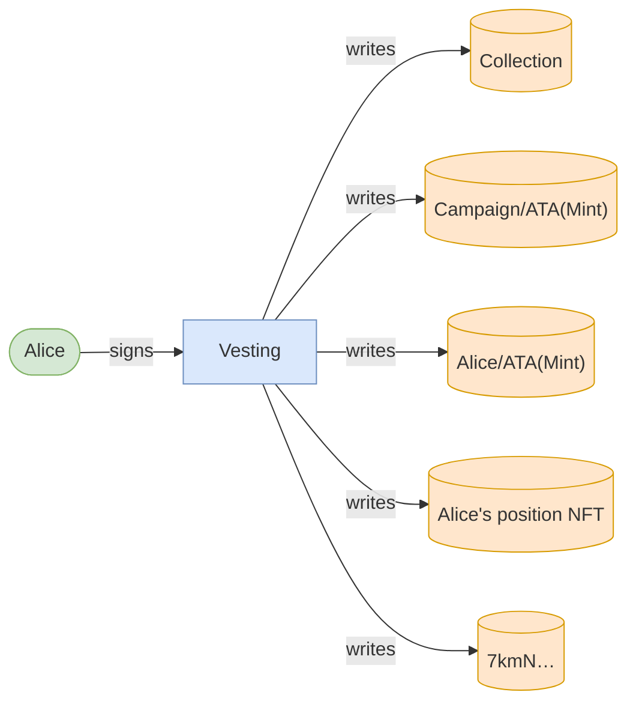
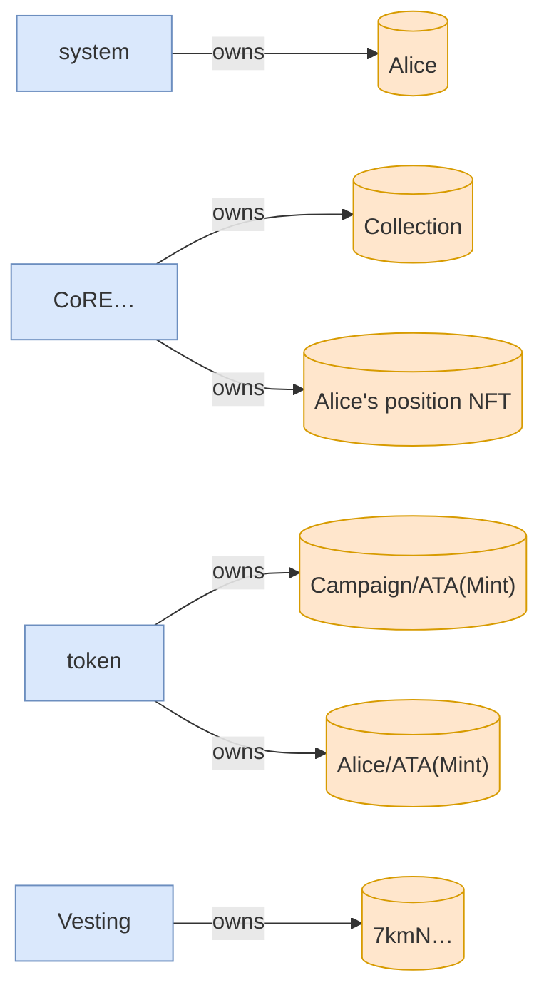

# vested_tokens_are_forfeited_past_the_grace_window

**Source:** [`tests/forfeiture.rs` L16](https://github.com/cds-turbin3/vesting-position/blob/c4f43acad0bb9f007622fb43bc19ddc3610c7688/babelfish-tests/tests/forfeiture.rs#L16)






<details>
<summary>tree</summary>

```

Alice (18897cu)
└─ Vesting::Claim ✗ 18897cu
```

</details>
