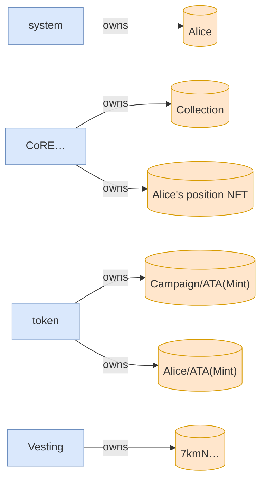

# vested_tokens_are_forfeited_past_the_grace_window

**Source:** [`tests/forfeiture.rs` L16](https://github.com/cds-turbin3/vesting-position/blob/cbb8875460ccf5cc3d9023c540f31113adcd0573/babelfish-tests/tests/forfeiture.rs#L16)

### Action: Initialize

| account | before | after |
| --- | --- | --- |
| Creator | 10000000000000 | 0 |
| Vault | 0 | 10000000000000 |

<details>
<summary>tree</summary>

```

Creator (85369cu)
└─ VestingPositions::Initialize ✓ 85369cu
   ├─ system::createAccount ✓
   ├─ splAssociatedTokenAccount::create ✓ 13517cu
   │  ├─ token::getAccountDataSize ✓ 183cu
   │  ├─ system::createAccount ✓
   │  ├─ token::initializeImmutableOwner ✓ 38cu
   │  └─ token::initializeAccount3 ✓ 235cu
   ├─ CoRE…::CreateCollectionV2 ✓ 19976cu
   │  ├─ system::createAccount ✓
   │  ├─ system::transferSol ✓
   │  ├─ system::transferSol ✓
   │  └─ system::transferSol ✓
   └─ token::transferChecked ✓ 105cu
```

</details>

> A recipient's vested-but-unclaimed tokens are swept to the creator once the grace window past `end` lapses: this is the design, not a defect.

### Action: tx

| account | before | after |
| --- | --- | --- |
| Vault | 10000000000000 | 9900000000000 |
| whitelisted_1 | — | 100000000000 |

<details>
<summary>tree</summary>

```

Alice (163771cu)
├─ Comp…::? ✓
└─ Vesting::Claim ✓ 163621cu
   ├─ splAssociatedTokenAccount::create ✓ 13416cu
   │  ├─ token::getAccountDataSize ✓ 183cu
   │  ├─ system::createAccount ✓
   │  ├─ token::initializeImmutableOwner ✓ 38cu
   │  └─ token::initializeAccount3 ✓ 235cu
   ├─ system::createAccount ✓
   ├─ CoRE…::CreateV2 ✓ 29646cu
   │  ├─ system::createAccount ✓
   │  ├─ system::transferSol ✓
   │  ├─ system::transferSol ✓
   │  ├─ system::transferSol ✓
   │  └─ system::transferSol ✓
   └─ token::transferChecked ✓ 105cu
```

</details>

### Action: Clawback

| account | before | after |
| --- | --- | --- |
| Creator | 0 | 900000000000 |
| Vault | 9900000000000 | 9000000000000 |

<details>
<summary>tree</summary>

```

Creator (76464cu)
└─ Vesting::Clawback ✓ 76464cu
   ├─ CoRE…::Burn ✓ 9904cu
   └─ token::transferChecked ✓ 105cu
```

</details>

**Alice's remainder:** `900000000000` → `0` — forfeited, never delivered

<details>
<summary>tree</summary>

```

Alice (18897cu)
└─ Vesting::Claim ✗ 18897cu
```

</details>




<details>
<summary>tree</summary>

```

Alice (18897cu)
└─ Vesting::Claim ✗ 18897cu
```

</details>
